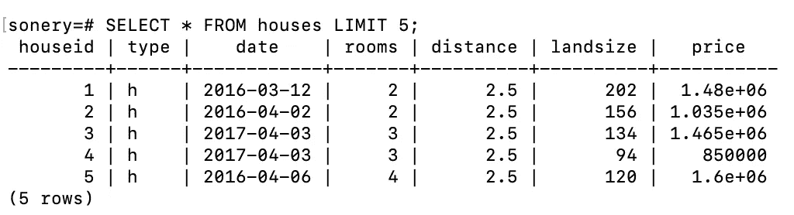
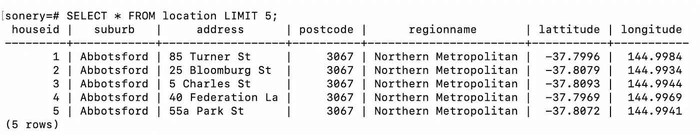
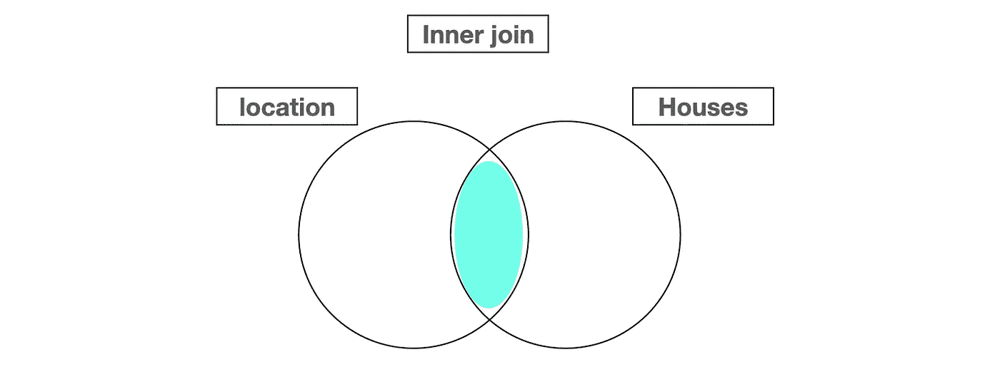
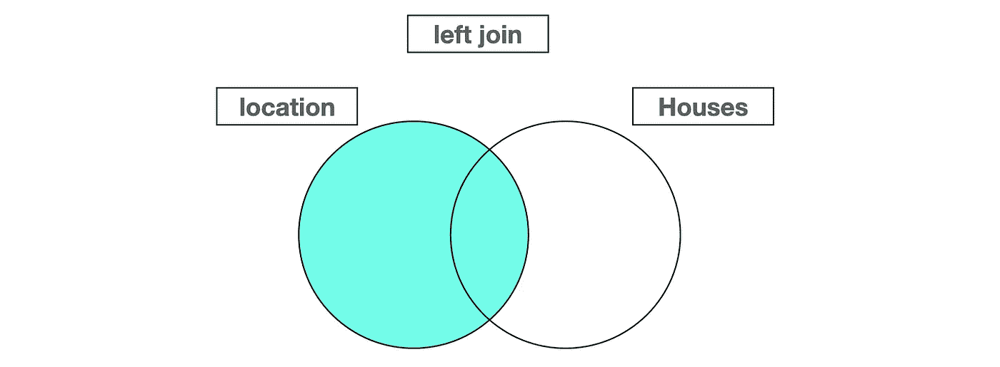
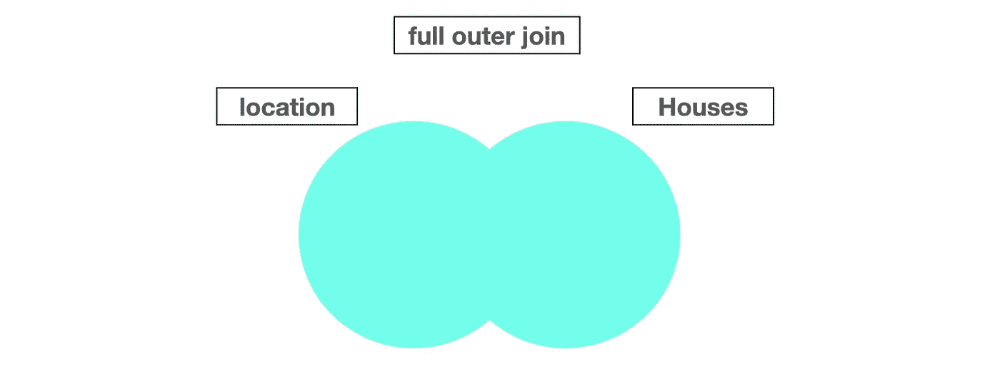

# 使用 PostgreSQL 掌握 SQL 连接的 6 个示例

> 原文：<https://towardsdatascience.com/6-examples-to-master-sql-joins-with-postgresql-db56de76d27e?source=collection_archive---------23----------------------->

## PostgreSQL:世界上最先进的开源关系数据库


在 [Unsplash](https://unsplash.com/s/photos/share?utm_source=unsplash&utm_medium=referral&utm_content=creditCopyText) 上拍摄的 [Mineragua 苏打水](https://unsplash.com/@mineragua?utm_source=unsplash&utm_medium=referral&utm_content=creditCopyText)

SQL 提供了许多函数和方法来管理以表格形式存储的数据。关系数据库管理系统(RDBMS)是一个使用 SQL 来管理存储在关系数据库中的数据的程序。

关系数据库包含许多通过共享列相互关联的表。有许多不同的 RDBMSs，如 MySQL、PostgreSQL、SQL Server 等等。

在本文中，我们将通过 6 个例子来演示 SQL 连接是如何执行的。如果您想从 SQL 和 PostgreSQL 的基本介绍开始，这里有我以前写的两篇介绍性文章:

*   [PostgreSQL 实用介绍](/practical-introduction-to-postgresql-5f73d3d394e)
*   [动手操作 PostgreSQL:基本查询](/hands-on-postgresql-basic-queries-a5f1249bba78)

SQL 连接允许从多个表中检索数据。我们基本上是根据相关表的公共列中的值来组合多个表。然后我们可以从这些表格中提取任何信息。

我使用 Kaggle 上的墨尔本住房数据集[中的数据创建了两个表格。这些表的名称是 houses 和 location，它们基于“houseid”列相关联。](https://www.kaggle.com/anthonypino/melbourne-housing-market)



房屋表的前 5 行(图片由作者提供)



位置表的前 5 行(作者图片)

## 示例 1

查找 2017 年 4 月 3 日发布的房屋地址。

```
select location.address, houses.date                                                                    from location                                                                                                    join houses                                                                                                      on location.houseid = houses.houseid                                                                             where houses.date = '2017-04-03'                                                                                 limit 5;address          |    date
-----------------+------------
5 Charles St     | 2017-04-03
40 Federation La | 2017-04-03
50 Bedford St    | 2017-04-03
23 Hart St       | 2017-04-03
1/80 Hawker St   | 2017-04-03
```

我们首先指定要选择的列及其表名。第二行和第三行包含表名。然后，我们指定用于匹配表间行的条件。最后，where 语句用于筛选行。Limit 关键字，顾名思义，限制要显示的行数。

## 示例 2

找出北部大都市地区 h 型房屋的数量。

```
SELECT COUNT(1)                                                                                         FROM location                                                                                                    JOIN houses                                                                                                      ON location.houseid = houses.houseid                                                                             WHERE type = 'h' AND regionname = 'Northern Metropolitan';count
-------
2754(1 row)
```

有 2754 套房子符合我们的条件。您可能会注意到，我们不必为 where 语句中使用的列编写表名。这是允许的，除非表中没有同名的列。

## 示例 3

找出北部大都市地区每种类型的房屋数量。

```
SELECT type, COUNT(1) AS number_of_houses
FROM houses
JOIN location
ON houses.houseid = location.houseid
WHERE regionname = 'Northern Metropolitan'
GROUP BY type;type | number_of_houses
-----+------------------
t    |              307
h    |             2754
u    |              829(3 rows)
```

这个例子和上一个很相似。我们使用类型列对观测值(即行)进行分组，然后对每组中的房屋进行计数，而不是只对 h 类型的房屋进行计数。

## 实例 4

找出每个郊区的平均房价，并根据平均价格显示前 5 个郊区。

```
SELECT suburb, AVG(Price) AS avg_house_price                                                            FROM location                                                                                                    JOIN houses                                                                                                      ON location.houseid = houses.houseid                                                                             GROUP BY suburb                                                                                                  ORDER BY avg_house_price DESC                                                                                    LIMIT 5;suburb      |  avg_house_price
------------+--------------------
Kooyong     |            2185000
Canterbury  | 2180240.7407407407
Middle Park | 2082529.4117647058
Albert Park |  1941355.072463768
Brighton    |            1930158(5 rows)
```

它类似于前面示例中的 group by 操作。在本例中，我们还基于聚合列(avg_house_price)对结果进行排序。默认情况下，结果按升序排序，但可以使用 desc 关键字进行更改。

## 实例 5

到目前为止，我们已经在 join 子句中交替使用了表名。桌子的顺序并不重要。“从房屋连接位置”与“从位置连接房屋”相同。

顺序无关紧要的原因是我们使用了所谓的“内部连接”。仅选择在两个表中具有匹配值的行。



(图片由作者提供)

当我们执行左连接时，我们从左侧获取整个表(即 join 子句中的第一个表)，然后只从右侧表中获取匹配的行。



(图片由作者提供)

让我们找出每个地区房屋的平均土地面积。

```
SELECT regionname, ROUND(AVG(landsize)) AS avg_landsize                                                 FROM location                                                                                                    INNER JOIN houses                                                                                                ON location.houseid = houses.houseid                                                                             GROUP BY regionname;regionname                 | avg_landsize
---------------------------+--------------
Eastern Metropolitan       |          634
Western Metropolitan       |          494
South-Eastern Metropolitan |          614
Southern Metropolitan      |          509
Western Victoria           |          656
Eastern Victoria           |         2950
Northern Metropolitan      |          569
Northern Victoria          |         3355
```

语法是一样的，只是我们写的是“左连接”而不是“连接”。请记住，当我们使用 left 或 right join 时，join 子句中表名的顺序很重要。

没有必要明确提到右连接，因为只需切换表名就可以将它转换为左连接。

## 实例 6

我们还有“完全外部连接”，它包括两个表中匹配的行，也包括不匹配的行。



(图片由作者提供)

让我们查找地址中包含“公园”一词并且有 4 个以上房间的房子的价格。

```
sonery=# SELECT (price/1000000) AS price_million, address                                                        FROM houses                                                                                                      FULL OUTER JOIN location                                                                                         ON houses.houseid = location.houseid                                                                             WHERE address LIKE '%Park%' AND rooms >4;price_million  |   address
---------------+-------------
           2.1 | 21 Park Rd
           2.3 | 119 Park St
             2 | 52 Park Rd
```

在我们的例子中，连接的类型实际上并不重要，因为两个表都包含每个房屋 id。然而，有些情况下我们需要使用左连接或外连接。因此，了解它们是如何工作的很重要。

## 结论

我们已经做了 6 个例子来演示连接是如何工作的。我们需要从关系数据库中检索的数据通常分布在多个表中。因此，全面理解 SQL 连接非常重要。

感谢您的阅读。如果您有任何反馈，请告诉我。