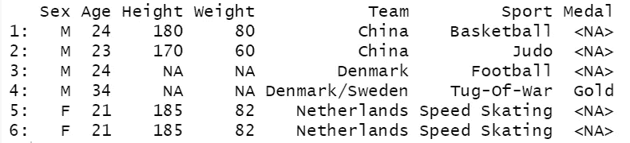
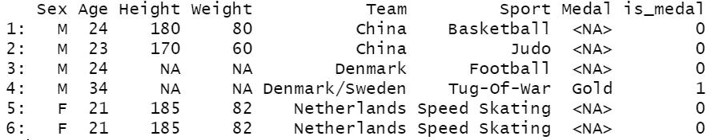
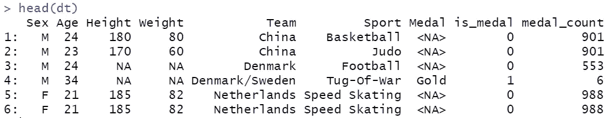
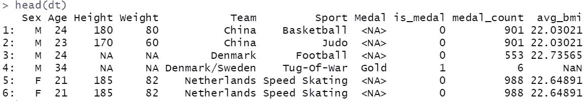
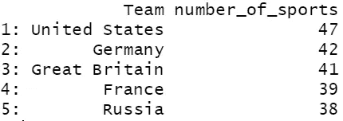
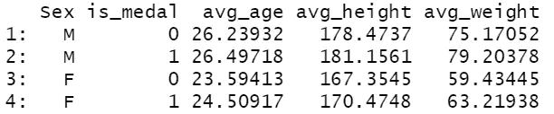

# 6 个使用 R 执行高效数据分析和操作的示例

> 原文：<https://towardsdatascience.com/6-examples-to-perform-efficient-data-analysis-and-manipulation-with-r-73db4ef6efc9?source=collection_archive---------23----------------------->

## r 使它变得简单、高效和快速。


由[安德斯·吉尔登](https://unsplash.com/@andersjilden?utm_source=unsplash&utm_medium=referral&utm_content=creditCopyText)在 [Unsplash](https://unsplash.com/s/photos/fast?utm_source=unsplash&utm_medium=referral&utm_content=creditCopyText) 上拍摄

Python 和 R 是数据科学生态系统中的主流编程语言。我开始用 Python 学习数据科学，我建议你也这样做。

自从我开始作为一名数据科学家工作以来，我一直在广泛地使用 Python 和 R。然而，当涉及到数据分析和操作时，我倾向于选择 R 而不是 Python。

在本文中，我们将探索 r 的数据表包的一些优秀特性。即使对于大型数据集，它也是简单而高效的。

我们将使用 Kaggle 上提供的关于奥运会历史的数据集。它是在知识共享许可下共享的，所以我们可以公开使用和共享它。

就像 Python 一样，R 有几个简化和加速数据科学任务的包。我们将使用数据表包，它有点像 Python 熊猫的 R 等价物。

```
install.packages("data.table") #installlibrary(data.table)  #import
```

我们可以用`fread`函数读取数据集。

```
dt <- fread("athlete_events.csv")dim(dt)
271116   15
```

该数据集包含超过 27 万行和 15 列。每条线代表一名运动员和他/她在给定运动中的表现。对于本文中的例子，我们不需要所有的列。让我们先过滤一些列。

```
dt <- dt[, c("Sex","Age","Height","Weight",
             "Team","Sport","Medal")]head(dt)
```



(图片由作者提供)

## 示例 1

找出获得奖牌总数最多的 5 个国家。

```
dt[!is.na(Medal), .N, Team][order(-N)][1:5] Team       N
1: United States    5219
2:  Soviet Union    2451
3:       Germany    1984
4: Great Britain    1673
5:        France    1550
```

第一个逗号之前的表达式过滤掉了 medal 列中的空值，N 是 r 的 count 函数。第二个逗号之后的列是用于分组的列。由于我们对每个国家获得的奖牌感兴趣，所以我们在这里写团队栏。最后，结果按计数降序排列。如果 N 前面没有负号，结果将按升序排序。

在一小段代码中，我们实现了过滤、分组、聚集和排序。

## 示例 2

创建一个列，表明运动员是否获得了奖牌，而不考虑奖牌的类型。

```
dt[, is_medal := ifelse(is.na(Medal),0,1)]head(dt)
```



(图片由作者提供)

“:=”表达式就地创建一个新列，以便修改当前数据表。`ifelse`函数评估给定的条件并相应地赋值。

## 示例 3

“:=”表达式的一个好处是它也适用于分组。例如，我们可能需要创建一个列来显示每个国家获得的奖牌总数。

一种方法是单独计算这个值，然后按团队名称与原始表合并。

```
medals <- dt[, .(medal_count = sum(is_medal)), Team]dt <- merge(dt, medals, by="Team", all.x = TRUE)
```

数据表还提供了一个更简单的解决方案:

```
dt[, medal_count := sum(is_medal), Team]
```

它计算每支队伍获得的奖牌数，并将数值适当地放入奖牌数列。



(图片由作者提供)

## 实例 4

创建一个包含每个国家运动员的平均体重指数(身体质量指数)的列。

一种方法是计算每个运动员的身体质量指数，然后取平均值。然而，如果我们不想添加额外的身体质量指数列，我们可以直接计算每个国家的平均身体质量指数。

```
dt[, avg_bmi := mean(Weight / (Height/100)**2, na.rm=TRUE), Team]
```



(图片由作者提供)

将`na.rm`参数设置为真很重要。否则，即使组中只有一个 null 值，结果也是 null。“丹麦/瑞典”队的平均 bmi 值为空，因为该队的所有身高和体重值都为空。

## 实例 5

我们之前已经计算了每个国家获得的奖牌数。我们也来算算这些奖牌来自多少个运动项目。

```
dt[is_medal==1, .(number_of_sports = uniqueN(Sport)), Team][order(-number_of_sports)][1:5]
```



前 5 名(图片由作者提供)

美国在 47 个不同的项目中赢得了奖牌。

## 实例 6

我们可以在一次操作中计算多个聚合。让我们分别计算那些赢得和没有赢得奖牌的男性和女性的平均年龄、身高和体重。

```
dt[, .(avg_age = mean(Age, na.rm=T),
       avg_height = mean(Height, na.rm=T),
       avg_weight = mean(Weight, na.rm=T)),
   .(Sex, is_medal)]
```



(图片由作者提供)

我们可以根据需要在括号中列出任意多的聚合。因为我们对基于性别和奖牌的分组都感兴趣，所以我们使用这两个列进行分组。

## 结论

我们做了 6 个例子来演示数据表包如何高效地执行数据分析和操作。我们在这篇文章中所涉及的只是它的一小部分功能。然而，典型的任务大多涉及像这些例子中的基本操作。

感谢您的阅读。如果您有任何反馈，请告诉我。