# Python 中 6 种奇特的内置文本换行技术

> 原文：<https://towardsdatascience.com/6-fancy-built-in-text-wrapping-techniques-in-python-a78cc57c2566?source=collection_archive---------19----------------------->


照片由 [Bob_Dmyt](https://pixabay.com/users/bob_dmyt-8820017/) 在 [Pixabay](https://pixabay.com/photos/gift-new-year-s-eve-congratulation-4669449/) 上拍摄

## 单行代码使您的文本在应用程序中“打印就绪”

大家都知道 Python 以全面的标准库而闻名。在大多数其他编程语言中，我们将不得不使用代码块来实现许多特性。然而，在 Python 中，我们可以发现许多奇特的特性已经被实现，我们可以开箱即用。

在本文中，我将介绍另一个 Python 内置库“文本包装器”，它可以帮助我们非常容易地在应用程序中生成“打印就绪”的包装文本。不需要安装它，只需导入并使用它，因为它是 Python3 自带的标准库。

# 1.基本文本换行


照片由 [SpencerWing](https://pixabay.com/users/spencerwing-4260422/) 在 [Pixabay](https://pixabay.com/photos/gifts-ribbons-wrapping-holiday-2872124/) 上拍摄

正如我在介绍中所说的，您不需要安装任何东西。只需按如下方式导入库。

```
import textwrap as tr
```

出于演示的目的，让我们定义一个字符串，这是我从 Python [的维基百科页面复制的一个句子 https://en . Wikipedia . org/wiki/Python _(programming _ language)](https://en.wikipedia.org/wiki/Python_(programming_language))

```
my_str = "Python is an interpreted, high-level and general-purpose programming language."
```

好的。这个`my_str`不是短句。假设你的软件 UI 或者网页需要以一定的宽度显示文本。当文本长度超过宽度时，需要将文本分成多行。当然，我们不希望将它拆分成正好等于宽度的长度，因为这可能会导致一些单词部分位于行尾，而另一部分从下一行开始。从用户的角度来看，这不是一个好的阅读体验。

文本换行库来帮忙了。与其实现一些复杂的逻辑来检测单词边界，我们可以很容易地使用下面的代码来分解句子。

```
lines = tr.wrap(my_str, width=30)
```

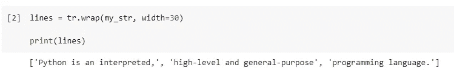

如图所示，这个句子被分成三部分。这是因为我们设置了`width=30`，所以文本将在到达 30 之前换行，以确保它不会在 UI 中“溢出”。如果算上 3 块的长度，分别是 25，30，21。

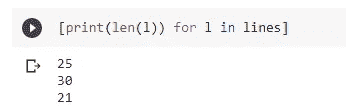

因此，Python TextWrapper 足够智能，可以识别出下一个单词足够长，足以使当前行溢出，因此它会自动将其放入下一行。这就是为什么我们第一行有 25 个字符。

# 2.可打印的文字环绕


照片由 [blickpixel](https://pixabay.com/users/blickpixel-52945/) 在 [Pixabay](https://pixabay.com/photos/gift-made-package-loop-packet-loop-553149/) 上拍摄

好吧，你可能会认为这仍然不够方便，因为我们仍然需要循环列表来逐行打印包装的字符串，如下所示。


是的，这就是为什么 Python 提供了另一个函数`fill()`来使它更加方便。

同样的字符串，不使用`tr.wrap()`，我们可以使用`tr.fill()`得到一个内部有`\n`的单个包装字符串，这就是“打印就绪”。

```
tr.fill(my_str, width=30)
```

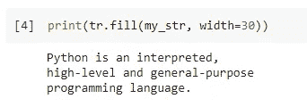

多方便啊！

# 3.用文本包装截断


由[像素](https://pixabay.com/users/pexels-2286921/)在[像素上拍摄的照片](https://pixabay.com/photos/arts-and-crafts-bow-celebration-1867323/)

我们必须在应用程序 UI 上显示所有内容吗？不总是。

我敢打赌，你一定在某些软件或网站上见过一些被删节的文字。例如，下面的截图来自 Quora.com。

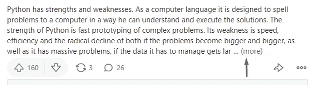

看到“……(更多)”指示器了吗？它让我们知道里面有更多的内容，但现在不会显示所有内容。这是一种超出本文范围的 UI 设计概念。然而，如果您想使用 Python 模仿这种行为，一行代码就足够了。

让我们在上面的例子中继续使用同一个字符串。这一次，我们将使用`tr.shorten()`功能。

```
tr.shorten(my_str, width=30)
```

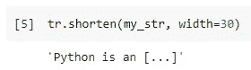

该字符串将被自动截断，总长度将小于 30。当然，如果宽度足够长，或者我们也可以说文本足够短，就不会被截断。

```
tr.shorten(my_str, width=80)
```

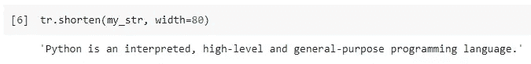

所以，我们设置了`width=80`，字符串小于那个。那就不会被截断了。

另外，如果我对占位符`[...]`不满意怎么办？它实际上只是一个默认的占位符，我们可以自定义它。

```
tr.shorten(my_str, width=30, placeholder=' ...(more)')
```

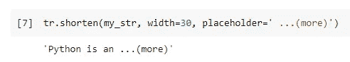

然后，我们得到了与 Quora 中完全相同的样式:)

# 4.自动清洗管柱


照片由 [blickpixel](https://pixabay.com/users/blickpixel-52945/) 在 [Pixabay](https://pixabay.com/photos/gift-made-surprise-loop-christmas-548290/) 上拍摄

文本包装器库不仅可以包装和截断文本，如果格式有问题，它还可以修复文本。如果您的应用程序正在处理来自其他来源的大量文本，并且您希望在存储或显示它之前对其进行格式化，这将非常方便。

假设我们有另一个字符串，它的格式相当混乱。

```
my_str2 = '''
    Python is an interpreted,
    high-level and general-purpose
    programming language.
'''
```

这正是我们从上面的例子中得到的文本，但是每行有 2 个空格作为“公共缩进”。通过使用`dedent()`函数，我们可以很容易地摆脱它们。

```
tr.dedent(my_str2)
```

这里显示了使用和不使用`dedent()`功能的区别。

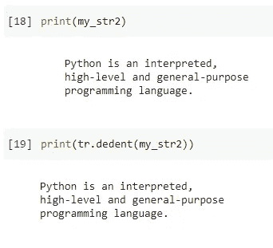

当然，它适用于任何数量的前导空白，而不仅仅是两个。

# 5.自定义自动缩进


由 [Couleur](https://pixabay.com/users/couleur-1195798/) 在 [Pixabay](https://pixabay.com/photos/gift-package-loop-red-made-packed-1808813/) 上拍摄的照片

与其去掉多行文本的缩进，不如添加一些缩进？是的，我们可以使用文本包装器。

有一个功能充当了`dedent()`的对立面，就是`indent()`。假设我们有如下一段代码

```
some_code = '''
import textwrap as trprint("hello world!")for i in range(10):
    print(i)'''
```

看下面的例子，它在每一行前面增加了两个空格。

```
tr.indent(some_code, '  ')
```

截图显示了与原始字符串的差异。

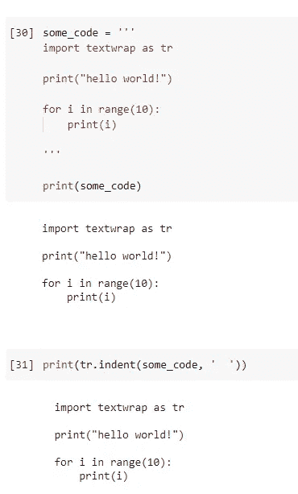

好吧，我同意目前这没有太多意义。为什么我们要在文本中添加前导空格？下面的例子可能会更有趣。

```
tr.indent(some_code, '>>> ')
```

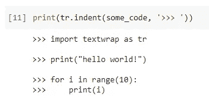

是的，别忘了我们可以定制缩进所用的字符串。它看起来像 Python 控制台吗？不是 100%。没有文本的新行没有添加`>>>`提示。不要担心，`indent()`函数接受另一个参数，这个参数将是一个谓词，告诉程序“这一行是否应该添加前缀”。

```
tr.indent(some_code, '>>> ', lambda line: True)
```

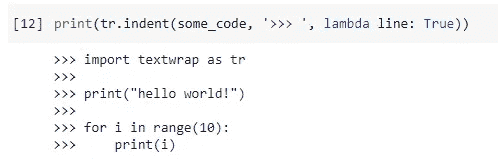

所以现在所有的线都有提示了。它看起来完全像 Python 控制台。

# 6.重用 TextWrapper 实例


由[在](https://pixabay.com/users/quincecreative-1031690/)[画框](https://pixabay.com/photos/present-gift-box-holiday-christmas-2891870/)上创作的照片

到目前为止，我们已经在文本包装器库中引入了 5 个不同的函数。事实上，上面这些函数会自动从类中创建一个`TextWrapper`实例，然后应用文本的转换。然后，该实例将被释放。

当我们有许多需要包装的字符串，或者我们需要一些在`TextWrapper`中只定义为类方法而不是公共函数的特性时，我们必须实例化 TextWrapper 类。

好的一面是，我们还可以在任何需要的时候重用实例。

```
wrapper = tr.TextWrapper(
    width=50, 
    initial_indent="- "
)
```

在上面的代码中，我们从类中声明了一个文本包装实例，并将宽度初始化为 50。此外，我们定义了一个属性`initial_indent`，它将作为前缀添加到所有“包装”的文本中。

现在，我们需要多个句子。这些也是从同一个 Wiki 页面中提取的。

```
my_strings = [
    "Python is an interpreted, high-level and general-purpose programming language.",
    "Python's design philosophy emphasizes code readability with its notable use of significant indentation.",
    "Its language constructs and object-oriented approach aim to help programmers write clear, logical code for small and large-scale projects.",
    "Python is dynamically-typed and garbage-collected.",
    "It supports multiple programming paradigms, including structured (particularly, procedural), object-oriented and functional programming.",
    "Python is often described as a \"batteries included\" language due to its comprehensive standard library."
]
```

那么，我们来包装吧！

```
for s in my_strings:
    print(wrapper.fill(s))
```

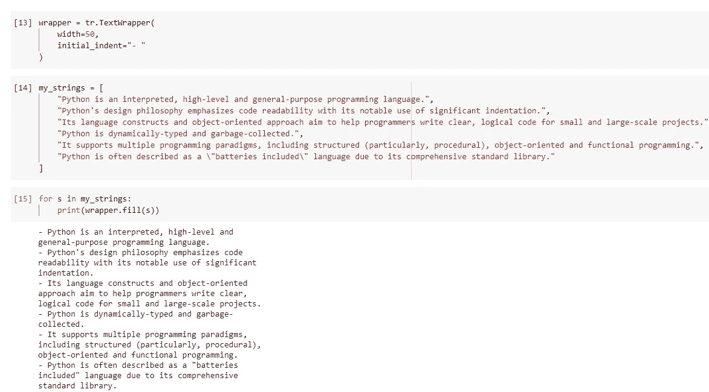

# 摘要


由[克利姆金](https://pixabay.com/users/klimkin-1298145/)在[皮克斯拜](https://pixabay.com/photos/hand-gift-bouquet-congratulation-1549399/)拍摄的照片

在本文中，我介绍了一个 Python 内置库“文本包装器”。它可以很容易地为我们换行，以确保所有的行都在一定的宽度内。这在有 UI 的应用程序中非常重要，这样文本就不会溢出。

不仅仅是文本换行，这个库还提供了很多非常方便的特性，比如缩进和体面。当我们想使用这个库用相同的参数包装文本时，最好实例化文本包装类，这样我们就可以重用这个实例。

[](https://medium.com/@qiuyujx/membership) [## 通过我的推荐链接加入 Medium 克里斯托弗·陶

### 作为一个媒体会员，你的会员费的一部分会给你阅读的作家，你可以完全接触到每一个故事…

medium.com](https://medium.com/@qiuyujx/membership) 

如果你觉得我的文章有帮助，请考虑加入 Medium 会员来支持我和其他成千上万的作者！(点击上面的链接)