# np.ndarray 和 np.matrix 对象之间的 6 个主要区别

> 原文：<https://towardsdatascience.com/6-key-differences-between-np-ndarray-and-np-matrix-objects-e3f5234ae327?source=collection_archive---------12----------------------->

## 这两者在技术上是不同的，即使它们在外观上看起来是一样的


[𝓴𝓘𝓡𝓚 𝕝𝔸𝕀](https://unsplash.com/@laimannung?utm_source=unsplash&utm_medium=referral&utm_content=creditCopyText) 在 [Unsplash](https://unsplash.com/?utm_source=unsplash&utm_medium=referral&utm_content=creditCopyText) 上拍照

**Numpy** 是基础 Python 库，广泛用于数值计算和线性代数。 ***ndarray*** 和 ***matrix*** 对象是常用的 numpy 对象。 ***ndarray*** 对象是从 numpy *ndarray* 类创建的。 ***矩阵*** 对象是从 numpy *矩阵*类中创建的。如果你是 numpy 的新手，你可能会对 numpy*n array*和 numpy *matrix* 对象感到困惑。如果外表看起来一样，那就是两回事。今天，我们将讨论他们之间的 6 个不同点。

## 先决条件

推荐你看下面我写的内容。

*   [面向数据科学的 NumPy:第 1 部分— NumPy 基础知识和数组创建](/numpy-for-data-science-part-1-21e2c5ddbbd3)

## 创建 ndarray 对象

我们可以使用 **np.array()** 函数创建一个 ndarray 对象。

```
import numpy as npA = np.array([[1, 2], 
             [3, 4]])
print(A)
print()
print(type(A))
```

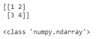

(图片由作者提供)

## 创建矩阵对象

我们可以使用 **np.matrix()** 函数创建一个矩阵对象。

```
import numpy as npB = np.matrix([[1, 2], 
              [3, 4]])
print(B)
print()
print(type(B))
```

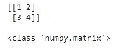

(图片由作者提供)

即使 *ndarray* 和 *matrix* 对象外观相同，但它们属于两个不同的类，具有不同的功能。现在我们来讨论一下。

## 区别 1:矩阵对象是严格二维的，而 n 数组对象可以是多维的

我们可以创建 1d，2d，3d，甚至 4d，5d(但他们很难想象)ndarray 对象，但我们只能创建 2d 矩阵对象。

**一维数组**

```
import numpy as npA = np.array([1, 2, 3])
print(A)
print('\nDimensions:', A.shape)
print('No. of Dimensions:', A.ndim)
```

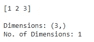

(图片由作者提供)

**二维数组**

```
import numpy as npB = np.array([[1, 2], 
             [3, 4]])
print(B)
print('\nDimensions:', B.shape)
print('No. of Dimensions:', B.ndim)
```

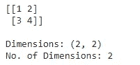

(图片由作者提供)

**三维数组**

```
import numpy as npC = np.array([[[1, 2], [3, 4]],
             [[5, 6], [7, 8]],
             [[9, 10], [11, 12]]])
print(C)
print('\nDimensions:', C.shape)
print('No. of Dimensions:', C.ndim)
```

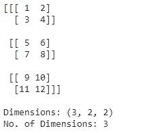

(图片由作者提供)

矩阵对象是严格二维的。如果我们试图创建一个一维矩阵，它会自动创建一个二维矩阵。

```
import numpy as npA = np.matrix([1, 2, 3])
print(A)
print()
print(type(A))
print('Dimensions:', A.shape)
print('No. of Dimensions:', A.ndim)
```

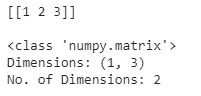

(图片由作者提供)

如果我们试图创建一个 3d 矩阵，它会给出一个错误。

```
np.matrix([[[1, 2], [3, 4]], 
          [[5, 6], [7, 8]], 
          [[9, 10], [11, 12]]])
```


(图片由作者提供)

## 区别 2:n array 和 matrix 对象在使用*(单星号)运算符时表现不同

当我们使用 ***** 操作符将两个 ndarray 对象相乘时，结果是*元素到元素的乘法*。

```
a = np.array([[1, 2], 
             [3, 4]])
b = np.array([[5, 6], 
             [8, 9]])
print("a", type(a))
print(a)
print("\nb", type(b))
print(b)
print("\n* operation on two ndarray objects (Elementwise)")
print(a * b)
```

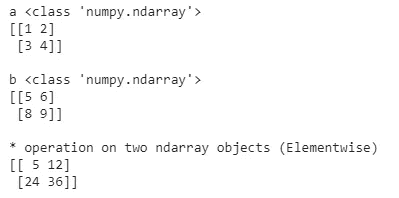

(图片由作者提供)

当我们使用 ***** 运算符将两个矩阵对象相乘时，结果是*点(矩阵)积*。

```
c = np.matrix([[1, 2], 
              [3, 4]])
d = np.matrix([[5, 6], 
              [8, 9]])
print("c", type(c))
print(c)
print("\nd", type(d))
print(d)
print("\n* operation on two matrix objects")
print(c * d)
```

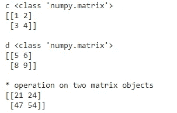

(图片由作者提供)

## 区别 3:n array 和 matrix 对象在使用**(双星)操作符时表现不同

当我们在两个 ndarray 对象上使用**操作符时，结果是每个元素的元素值的平方。

```
a = np.array([[1, 2], 
             [3, 4]])
print("a", type(a))
print(a)
print("\n** operation on two ndarray objects (Elementwise)")
print(a ** 2)
```

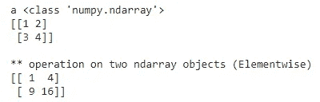

(图片由作者提供)

当我们在两个矩阵对象上使用**运算符时，结果是一个矩阵乘法！

```
b = np.matrix([[1, 2], 
              [3, 4]])
print(b)
print("\n** operation on two matrix objects")
print(b ** 2)
```

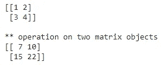

(图片由作者提供)

## 区别 4: matrix 类是 ndarray 类的子类

Matrix 对象继承了 ndarray 对象的所有属性和方法。

## 区别 5:矩阵对象有。I 代表逆，但 ndarray 对象不代表逆

```
a = np.matrix([[1, 2], 
              [3, 4]])
print(a)
print('\nInverse')
print(a.I)
```

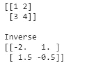

(图片由作者提供)

```
b = np.array([[1, 2], 
             [3, 4]])
print(b)
print('\nInverse')
print(b.I)
```

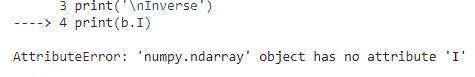

(图片由作者提供)

要得到 ndarray 对象的逆，使用 **np.linalg.inv()** 函数。

```
np.linalg.inv(b)
```

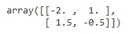

(图片由作者提供)

## 区别 6:用法—通常使用 ndarray 类而不是 matrix 类

下面是 numpy 文档对这两个类的用法的描述。

> 不再推荐使用 matrix 类，即使是线性代数。相反，使用常规的 numpy 数组。matrix 类将来可能会被删除。

# 摘要

***ndarray*** 和 ***matrix*** 类表现不同。使用 *matrix* 类可能要容易得多，因为这就像在线性代数中使用矩阵一样。如果你需要处理多维数组，你应该使用 *ndarray* 对象，因为它们是多维的。Numpy 文档推荐你使用*n 数组*对象，而不是*矩阵*对象。通过使用适当的函数，您总是可以将一种类类型转换成另一种。因此，使用 **np.asmatrix()** 函数将一个 *ndarray* 对象转换成一个 *matrix* 对象。

```
a = np.array([[1, 2], 
             [3, 4]])
print(a)
print(type(a))
print()b = np.asmatrix(a)
print(b)
print(type(b))
```

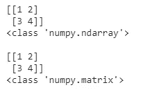

(图片由作者提供)

此外，您可以使用 **np.asarray()** 函数将*矩阵*对象转换为*n array*对象。

```
a = np.matrix([[1, 2], [3, 4]])
print(a)
print(type(a))
print()b = np.asarray(a)
print(b)
print(type(b))
```

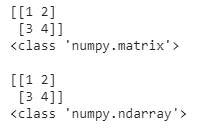

(图片由作者提供)

感谢阅读！

本教程由[*Rukshan Pramoditha*](https://www.linkedin.com/in/rukshan-manorathna-700a3916b/)*，*数据科学 365 博客作者设计创作。

在 https://rukshanpramoditha.medium.com[阅读我的其他文章](https://rukshanpramoditha.medium.com/)

2021–05–08