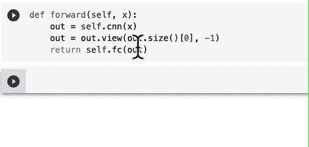
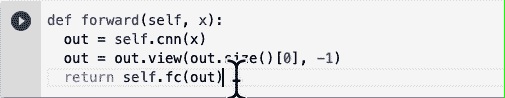
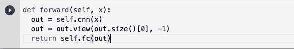
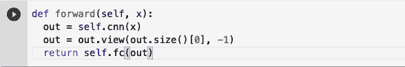
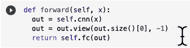
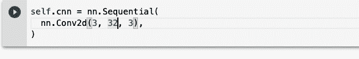
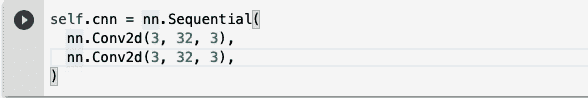
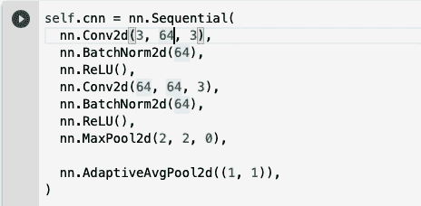
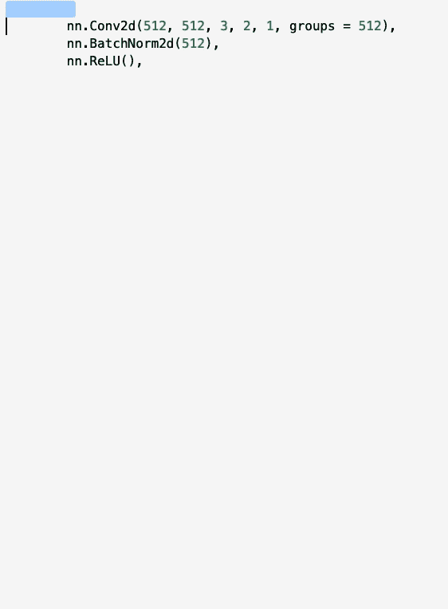
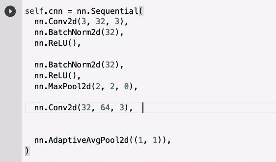

# 我在机器学习项目中使用的 6 个键盘快捷键

> 原文：<https://towardsdatascience.com/6-keyboard-shortcuts-i-use-with-machine-learning-projects-2d77a386c1df?source=collection_archive---------31----------------------->

## 每天(如果我在编码)

图片由来自 [Pixabay](https://pixabay.com/?utm_source=link-attribution&utm_medium=referral&utm_campaign=image&utm_content=1703349) 的[Steve buiss NNE](https://pixabay.com/users/stevepb-282134/?utm_source=link-attribution&utm_medium=referral&utm_campaign=image&utm_content=1703349)拍摄

# 为什么要把 1 秒钟砍掉呢？

捷径不仅仅是节省时间。这种做法保护我免受手腕疼痛，因为我每天工作数小时。

为什么要节省时间？这些建议不仅为我节省了一天的时间。他们就像存钱和锻炼的习惯。它们不会让你在短期内变得更富有、更健康。然而，当着眼于终身价值(LTV)时，我说如果你希望活几年，这是值得的。

# 学习需要多长时间？

对我来说，没花多少时间。我每天都使用快捷键(如果是编码的话)，所以记忆很容易。

这些快捷键将我带到了一个新的工作水平，并消除了人为错误。

使用快捷方式工作也是一大乐事。感觉像是专业的事情。

GIF via GIPHY，【https://giphy.com/gifs/UFGj6EYw5JhMQ 

这些快捷键适用于 VS 代码和 Google Colab。我会用 macOS 举例。如果你使用的是 PC，我发现它们之间的主要区别如下:

*   Command，简称 cmd。Mac 上有两个这样的。两个都在空格键旁边。此密钥不在 Windows 上。控件，或简称为 ctrl，取而代之。
*   选项。就在 cmd 旁边。请改用 PC 上的 Alt 键。

# 0.流行快捷方式列表

为了让我们在同一页上，这里有一个键的列表，虽然超级有用，但我周围的人太熟悉了。

*   复制粘贴

突出显示➡ Cmd + C ➡选择目的地➡ Cmd+V

*   加注释

突出显示➡ Cmd + / ➡重复撤销

*   转到开始/结束

Cmd +向上➡ Cmd +向下

*   选择一两行

突出显示➡ Cmd + up

*   选择一个段落

放置光标➡ Shift + cmd +向上➡ Shift +向下撤消

*   缩进和不缩进

突出显示要撤消的➡Tab ➡Shift + Tab

现在我们来看看我很乐意分享的。

# 1.复制粘贴再探

每个人都知道 cmd+c 和 cmd+v，但是你知道你可以不用高亮显示就能做到吗？

让光标停留在您想要复制的代码行上，执行命令 c，命令 v。

cmd+c ➡

仔细看看。光标不在代码行的末尾，但是编辑器仍然足够聪明，知道在哪里粘贴新行。

这一举措不太受欢迎，但却更受欢迎。大多数代码行都没有那么长，所以突出显示来复制可能没有什么效果。

想只选择线中的一部分吗？这种情况下，出现的捷径会让你会心一笑。

# 2.更好的内嵌突出显示

不要一次选择一个单词，而是逐个单词而不是逐个字符地跳转。

option+shift+向右(或向左)

如果你只想移动光标，放弃 shift。那就没有选择了。

这使得选择整行的一部分时速度更快，这是避免触摸鼠标的另一种方式。

# 3.本地搜索和替换

你是否曾经想做一个搜索并全部替换，但是担心你会删除一些非故意的东西？

做 Cmd+D

将光标置于➡ cmd+d ➡edit

Cmd+D 是同时编辑同一个参数的直接方法。这样更容易，错误更少。

我确实注意到有些 Jupiter 笔记本没有这个功能。在这种情况下，多光标编辑适合您。按住 option 键并单击以获得多个光标。

# 4.一步复制粘贴

在短时间内将你的模型放大几倍。

option + shift +向下(或向上)

哎呀！太大了！

当与清单上的下一项结合时，它甚至更强大…

# 5.上下移动，携带代码

稍微调整一下就完美了。

选项+向上➡选项+向下

# 6.重新审视缩进

来回移动光标缩进很痛苦。我喜欢 shift+tab，也渴望同样的快捷方式。

所以我改用 cmd + [ or ]来左右移动代码

cmd + [，和 cmd + ]

# 下一步是什么？

这些技巧是我在和我的社区一起工作时发展出来的。

要了解更多关于我们如何优化，请看下面比快捷键更有价值的东西。

 [## 我在大多数人都能使用的计算资源上的不公平优势

### 如何以非常有优势的风格使用 Google Colab

towardsdatascience.com](/my-unfair-advantage-in-computing-resources-that-are-accessible-to-most-people-5bb95932f247) 

中级会员资格使我有可能学到足够的知识来为数据科学写作。 [***用我的个人链接***](https://twanchen.medium.com/membership) ***报名，然后在下面评论，我会给你发一个分享我全程的 pdf。***