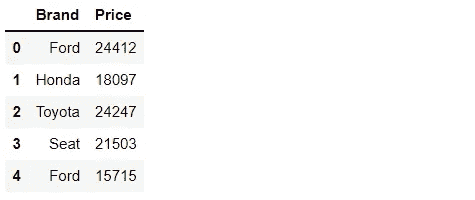
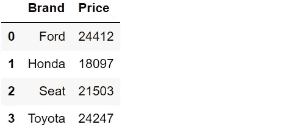
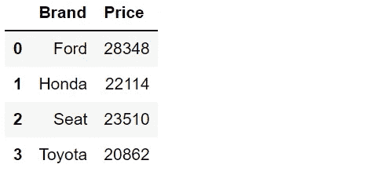
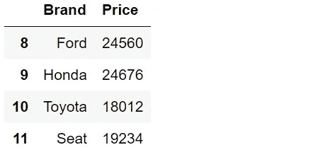
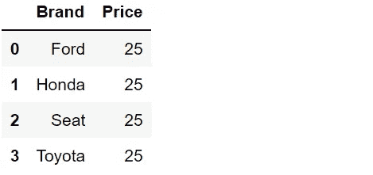
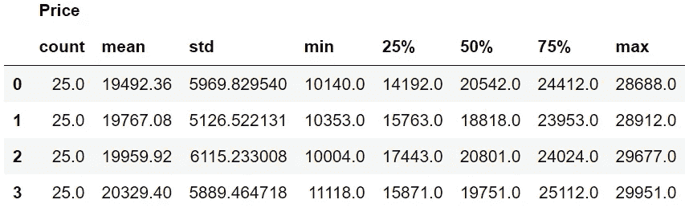
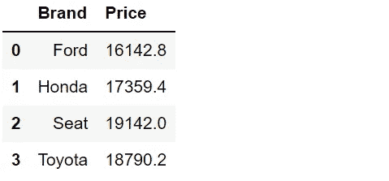

# 6 只鲜为人知的熊猫集合功能

> 原文：<https://towardsdatascience.com/6-lesser-known-pandas-aggregate-functions-c9831b366f21?source=collection_archive---------13----------------------->

## …这使得 groupby 函数更加有用。


巴赫尔·凯里在 [Unsplash](https://unsplash.com/s/photos/six?utm_source=unsplash&utm_medium=referral&utm_content=creditCopyText) 上拍摄的照片

groupby 是用于数据分析的最常用的 Pandas 函数之一。它首先根据一列中的不同值将数据点(即数据框中的行)分组。然后，它计算每个组的聚合值。

假设我们有一个包含汽车品牌和价格的数据集。为了计算每个分支的平均价格，我们根据 brand 列对行进行分组，然后对 price 列应用 mean 函数。

Pandas 提供了几个可以和 groupby 函数一起使用的集合函数，比如 mean、min、max、sum 等等。在本文中，我们将看到一些鲜为人知的聚合函数，它们使得 groupby 函数更加有用。

我们将涉及的功能有:

*   第一
*   最后的
*   没什么
*   努尼克岛
*   形容
*   分位点

让我们从创建一个样本数据框开始。

```
import numpy as np
import pandas as pddf = pd.DataFrame({
    "Brand": ["Ford","Honda","Toyota","Seat"] * 25,
    "Price": np.random.randint(10000, 30000, size=100)
})df.head()
```



(图片由作者提供)

我们有一个包含 100 辆汽车的价格和品牌信息的数据框。

## 1.第一

第一个函数，顾名思义，返回每个组的第一个值。

```
df.groupby("Brand", as_index=False).first()
```



(图片由作者提供)

## 2.最后的

last 函数返回每个组的最后一个值。

```
df.groupby("Brand", as_index=False).last()
```



(图片由作者提供)

第一个和最后一个函数对于这个数据集来说可能不是很有用。但是，有时您需要一个简单的解决方案来查找每个组的第一个或最后一个条目。当您处理基于日期或时间的数据时，顺序更加重要。

## 3.北

第 n 个函数扩展了第一个和最后一个函数的功能。它允许获取每个组的第 n 行。

```
df.groupby("Brand", as_index=False).nth(2)
```



(图片由作者提供)

*   第 n 个(0)与第一个()相同
*   第 n 个(-1)与最后一个()相同

## 4.努尼克岛

nunique 函数返回每个组的不同值的数量。在我们的数据集中，每个品牌可能是 25，因为我们在一个大范围内生成了 25 个随机整数。

当处理现实生活中的数据集时，每个类别或组的唯一值可能是一种有价值的见解。

```
df.groupby("Brand", as_index=False).nunique()
```



(图片由作者提供)

## 5.形容

describe 函数为每个组返回几个统计数据。它通常用于获取整个数据框的概览。我们还可以将它与 groupby 函数一起使用，从几个不同的角度比较各组。

```
df.groupby("Brand", as_index=False).describe()
```



(图片由作者提供)

25%、50%和 75%的值分别是第一、第二和第三四分位数。与其他统计数据一起，它们提供了值分布的结构化概览。

第一个分位数(25%)意味着 25%的值低于该值。同样，50%的值低于第二个分位数，因此第二个分位数是中值。

## 6.分位点

我们用 describe 函数得到 25%、50%和 75%的分位数。分位数函数提供了更多的灵活性，因为它接受一个参数。

为了找到 40%的分位数，我们将 0.4 作为参数传递给分位数函数。

```
df.groupby("Brand", as_index=False).quantile(0.4)
```



(图片由作者提供)

## 结论

groupby 函数是探索性数据分析中的救命稻草。mean、sum、min 和 max 是 groupby 常用的聚合函数。

我们在本文中讨论的函数并不常用，但在某些情况下它们会派上用场。

最后但同样重要的是，如果你还不是[中级会员](https://sonery.medium.com/membership)并打算成为其中一员，我恳请你使用以下链接。我将从你的会员费中收取一部分，不增加你的额外费用。

<https://sonery.medium.com/membership>  

感谢您的阅读。如果您有任何反馈，请告诉我。