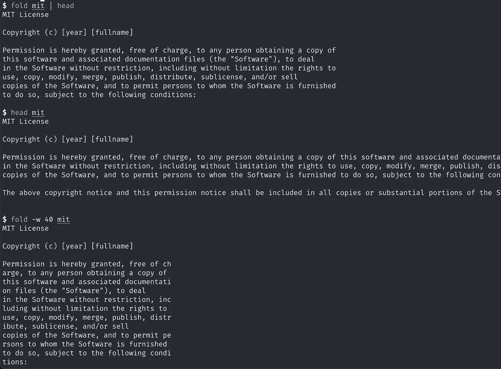
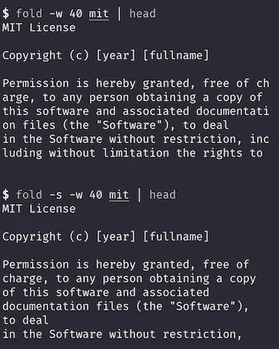
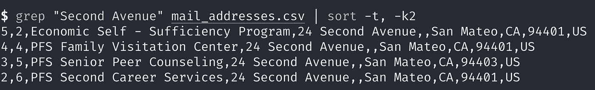
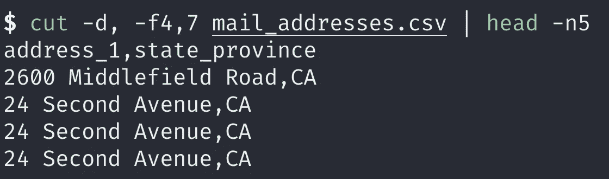
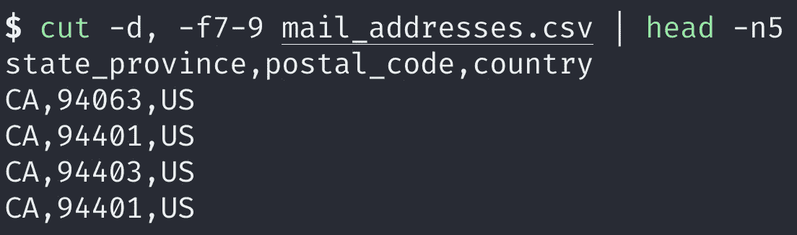

# 面向数据科学家的 6 个 Linux 命令

> 原文：<https://towardsdatascience.com/6-linux-commands-for-data-scientists-284f972e7ab5?source=collection_archive---------34----------------------->

## 终端命令让您的数据一览无余


[Martin Brechtl](https://unsplash.com/@majc0?utm_source=medium&utm_medium=referral) 在 [Unsplash](https://unsplash.com?utm_source=medium&utm_medium=referral) 上拍摄的照片。图片由作者提供。

# 介绍

GNU 核心实用程序(coreutils)是一个用于文件、文本和 shell 的命令实用程序包。它有一百多个命令。

在本文中，您将发现六个 GNU Coreutils 命令，它们对于处理文本、CSV 和数据文件非常有用。

```
**Table of Contents**
· [Introduction](#43b2)
· [Sample data](#049e)
· [head](#2215)
· [tail](#c690)
· [fold](#d54d)
· [sort](#850e)
· [paste](#8641)
· [cut](#5cf6)
· [Conclusion](#b944)
· [References](#7f28)
```

# 抽样资料

我们使用来自 Github repo 的样本数据。如果你想编码，请复制或下载它。它包含样本文本和 CSV 文件。

# 头

[head](https://www.gnu.org/software/coreutils/manual/html_node/head-invocation.html) 命令将每个文件的前 10 行打印到标准输出。您可以使用`-n`选项更改要显示的行数。这里我们从两个文件中打印 5 行。

```
$ head -n 5 apache-2.0 gnu-agpl-3.0
==> apache-2.0 <==
                                 Apache License
                           Version 2.0, January 2004
                        [http://www.apache.org/licenses/](http://www.apache.org/licenses/)TERMS AND CONDITIONS FOR USE, REPRODUCTION, AND DISTRIBUTION==> gnu-agpl-3.0 <==
                    GNU AFFERO GENERAL PUBLIC LICENSE
                       Version 3, 19 November 2007Copyright (C) 2007 Free Software Foundation, Inc. <[https://fsf.org/](https://fsf.org/)>
 Everyone is permitted to copy and distribute verbatim copies
```

使用`-q`选项打印多个不带标题的文件:

```
$ $ head -n 5 -q apache-2.0 mit
                                 Apache License
                           Version 2.0, January 2004
                        [http://www.apache.org/licenses/](http://www.apache.org/licenses/)TERMS AND CONDITIONS FOR USE, REPRODUCTION, AND DISTRIBUTION
MIT LicenseCopyright (c) [year] [fullname]Permission is hereby granted, free of charge, to any person obtaining a copy of this software and associated documentation files (the "Software"), to deal
```

让我们使用 curl 和管道来发送输出，作为`head`命令的标准输入。

```
$ curl -s [https://raw.githubusercontent.com/shinokada/sample-csv/main/LICENSE](https://raw.githubusercontent.com/shinokada/sample-data/main/licenses/mit) | head -n 5
MIT LicenseCopyright (c) [year] [fullname]Permission is hereby granted, free of charge, to any person obtaining a copy
```

# 尾巴

`tail`命令与之前的`head`命令非常相似。它将每个文件的最后 10 行打印到标准输出。使用`-n`选项改变行数。

```
$ tail -n 3 mit isc
==> mit <==
LIABILITY, WHETHER IN AN ACTION OF CONTRACT, TORT OR OTHERWISE, ARISING FROM,
OUT OF OR IN CONNECTION WITH THE SOFTWARE OR THE USE OR OTHER DEALINGS IN THE
SOFTWARE.
==> isc <==
LOSS OF USE, DATA OR PROFITS, WHETHER IN AN ACTION OF CONTRACT, NEGLIGENCE OR
OTHER TORTIOUS ACTION, ARISING OUT OF OR IN CONNECTION WITH THE USE OR
PERFORMANCE OF THIS SOFTWARE.%
```

在上面的例子中，我们输出两个文件。

使用`-q`选项隐藏标题。

```
$ tail -q -n 3 mit isc
LIABILITY, WHETHER IN AN ACTION OF CONTRACT, TORT OR OTHERWISE, ARISING FROM,
OUT OF OR IN CONNECTION WITH THE SOFTWARE OR THE USE OR OTHER DEALINGS IN THE
SOFTWARE.LOSS OF USE, DATA OR PROFITS, WHETHER IN AN ACTION OF CONTRACT, NEGLIGENCE OR
OTHER TORTIOUS ACTION, ARISING OUT OF OR IN CONNECTION WITH THE USE OR
PERFORMANCE OF THIS SOFTWARE.%
```

# 折叠

`[fold](https://www.gnu.org/software/coreutils/fold)`命令包装每个文件中的输入行，并写入标准输出。默认宽度为 80，您可以使用`-w`选项进行更改。



如上图所示，`fold mit | head`将文本换行到 80 个字符。`fold -w 40 mit`将文本换行为每行 40 个字符。

当您想在空格处换行时，使用`-s`选项。



上图中的第二个示例用空格换行。

# 分类

`sort`命令对文件或标准输入进行排序。结合使用`-t`(字段分隔符)和`-k`(键)选项，您可以按字段对文件进行排序。例如，如果您想对 CSV 文件进行排序，使用`-t,`选项将字段分隔符指定为逗号。使用`-k2`告知您想要按第二个字段排序。



在上面的例子中，grep 命令从 mail_addresses.csv 中选择“Second Avenue”。`sort`命令使用管道中的标准输入，并按照第二个字段对行进行排序。

# 粘贴

你可以使用`paste`命令连接多个文件。

```
$ cat sample5.txt
Python
Bash
Go
Rust
C#$ cat sample6.txt
John
Sarah
James
Elizabeth
Tom$ cat sample7.txt
4 years
3 years
1 year
2 years
4 years
```

这里我们连接三个文件。

```
$ paste sample{5..7}.txt
Python John 4 years
Bash Sarah 3 years
Go James 1 year
Rust Elizabeth 2 years
C# Tom 4 years
```

上面的例子使用 Bash 范围`{5..7}`扩展到 5，6，7。

使用`-d`选项指定分隔符。下面的例子需要两个分隔符，因为我们要连接三个文件。

```
$ paste -d "||" sample{5..7}.txt
Python|John|4 years
Bash|Sarah|3 years
Go|James|1 year
Rust|Elizabeth|2 years
C#|Tom|4 years
```

使用`-s`选项垂直连接，而不是平行连接。

```
$ paste -s sample{5,6,7}.txt
Python Bash Go Rust C#
John Sarah James Elizabeth Tom
4 years 3 years 1 year 2 years 4 years
```

`paste`命令也可以[创建列](https://betterprogramming.pub/9-terminal-commands-you-can-start-using-today-7b9b0e273894#9f02)。

# 切口

`cut`命令剪切输入数据的列或字段。使用`-d`选项指定字段分隔符，使用`-f`选项指定要选择的列/字段。



上面的例子使用了一个 CSV 文件，所以分隔符是逗号。我们只打印出第 4 和第 7 个字段。



您可以为`-f`选项使用一个范围参数，如上例`7–9`。

[你可以使用](https://betterprogramming.pub/9-terminal-commands-you-can-start-using-today-7b9b0e273894) `[cut](https://betterprogramming.pub/9-terminal-commands-you-can-start-using-today-7b9b0e273894)` [命令来删除文件中每行的一些字符。](https://betterprogramming.pub/9-terminal-commands-you-can-start-using-today-7b9b0e273894)

# 结论

这些命令允许您从终端快速浏览数据。通过使用重定向，您可以创建新的数据文件，并且可以为您的项目创建所需的数据文件。

**通过** [**成为**](https://blog.codewithshin.com/membership) **会员，可以完全访问媒体上的每一个故事。**


[https://blog.codewithshin.com/subscribe](https://blog.codewithshin.com/subscribe)

# 参考

*   [GNU 核心程序](https://www.gnu.org/software/coreutils/manual/coreutils.html#Introduction)