# 开始学习机器学习的 6 个数学基础

> 原文：<https://towardsdatascience.com/6-math-foundation-to-start-learning-machine-learning-1afef04f42bd?source=collection_archive---------1----------------------->

## 理解机器学习所需的数学科目

安托万·道特里在 [Unsplash](https://unsplash.com?utm_source=medium&utm_medium=referral) 上拍摄的照片

> **如果你喜欢我的内容，并想获得更多关于数据或数据科学家日常生活的深入知识，请考虑在此订阅我的** [**简讯。**](https://cornellius.substack.com/welcome)

作为一名数据科学家，机器学习是我们完成工作的武器库。我非常肯定，在当今时代，每个受雇为数据科学家的人都会使用机器学习来分析他们的数据，以产生有价值的模式。虽然，为什么我们需要为机器学习学习数学？我可以给出一些论据，包括:

*   数学帮助你选择正确的机器学习算法。理解数学让你深入了解模型如何工作，包括选择正确的模型参数**和验证策略**。
*   通过产生**右置信区间和不确定性测量值**来估计我们对模型结果的信心需要对数学有所了解。
*   正确的模型会考虑许多方面，如**指标、训练时间、模型复杂性、参数数量以及需要数学来理解所有这些方面的特征数量**。
*   通过了解机器学习模型的数学，你可以**开发一个适合你自己问题的定制模型**。

主要问题是你需要什么数学科目才能理解机器学习？毕竟，数学是一个广阔的领域。这就是为什么在这篇文章中，我想概述机器学习需要的数学科目，以及开始学习这些科目的几个要点。

# 机器学习数学

我们可以从数学科目中学习许多主题，但如果我们想专注于机器学习中使用的数学，我们需要指定它。在这种情况下，我喜欢使用 M. P. Deisenroth、A. A. Faisal 和 c . s . Ong 2021 年出版的《机器学习数学》一书中解释的必要数学参考资料。

在他们的书中，有对机器学习很重要的数学基础。数学科目是:

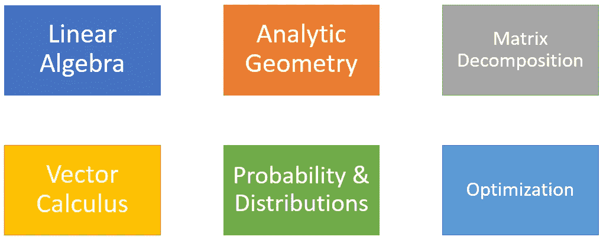

作者创建的图像

六门数学科目成为机器学习的基础。每个主题都交织在一起，以开发我们的机器学习模型，并达到概括数据集的“最佳”模型。

让我们更深入地了解每个主题，以了解它们是什么。

# 线性代数

什么是线性代数？这是数学的一个分支，研究向量和操纵向量的某些规则。当我们形式化直观概念时，通常的方法是构建一组对象(符号)和一组规则来操作这些对象。这就是我们所知的*代数*。

如果说机器学习中的线性代数，它被定义为数学中使用向量空间和矩阵来表示**线性方程组的部分。**

当谈到向量时，人们可能会回想起他们在高中学习的关于有方向的向量，就像下图一样。

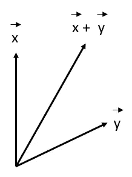

几何向量(图片由作者提供)

这是一个向量，但不是机器学习线性代数中讨论的那种向量。相反，我们要讨论的是下面这张图片。

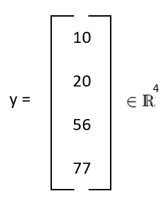

矢量 4x1 矩阵(图片由作者提供)

上面提到的也是一个向量，但是是另一种向量。您可能熟悉矩阵形式(下图)。向量是只有 1 列的矩阵，称为列向量。换句话说，我们可以把矩阵想象成一组列向量或行向量。总之，向量是特殊的对象，可以加在一起，乘以标量，产生另一个同类的对象。我们可以有各种各样的物体叫做矢量。

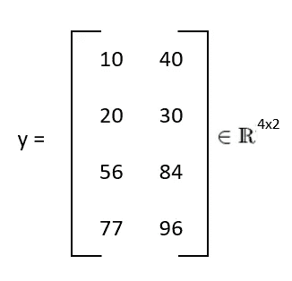

矩阵(图片由作者提供)

线性代数本身是计算机可以理解的数据的系统表示，线性代数中的所有运算都是系统规则。这就是为什么在现代时间机器学习中，线性代数是一项重要的研究。

线性代数如何使用的一个例子是在线性方程中。线性代数是线性方程中使用的工具，因为许多问题可以用线性方式系统地提出。典型的线性方程如下表所示。

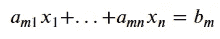

线性方程(图片作者提供)

为了解决上面的线性方程问题，我们使用线性代数来系统地表示线性方程。这样，我们可以使用矩阵特征来寻找最优解。

矩阵表示中的线性方程(图片由作者提供)

总结一下线性代数这门课，作为这门课的起点，你可能想多学三个术语:

*   矢量
*   [数]矩阵
*   线性方程

# **解析几何(坐标几何)**

**解析** **几何**是一项研究，我们利用一对有序的坐标来学习数据(点)的位置。这项研究是关于用数字定义和表示几何形状，并从形状的数字定义和表示中提取数字信息。我们用一个更简单的术语把数据投射到平面上，我们从那里接收数字信息。

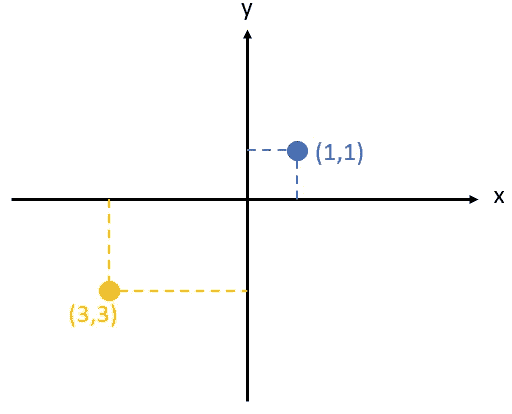

笛卡尔坐标(图片由作者提供)

上面的例子说明了我们如何通过将数据集投影到平面上来从数据点获取信息。我们如何从这种表示中获取信息是解析几何的核心。为了帮助你开始学习这个主题，这里有一些你可能需要的重要术语。

*   **距离功能**

**距离函数**是提供集合元素之间距离的数字信息的函数。如果距离为零，那么元素是等价的。除此之外，它们彼此不同。

距离函数的一个例子是欧几里德距离，它计算两个数据点之间的直线距离。

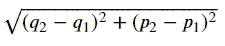

欧几里德距离方程(图片由作者提供)

*   **内积**

内积是一个引入直观几何概念的概念，例如向量的**长度和两个向量**之间的**角度或距离。它通常被称为⟨x,y⟩(或偶尔(x，y)或⟨x|y⟩).**

# **矩阵分解**

矩阵分解是关于如何将矩阵分解成其组成部分的研究。矩阵分解旨在简化对分解矩阵而不是对其原始矩阵的更复杂的矩阵运算。

矩阵分解的一个常见类比是因式分解数字，例如将 8 因式分解为 2×4。这就是矩阵分解与矩阵分解同义的原因。分解矩阵有许多方法，因此有一系列不同的矩阵分解技术。下图中的 LU 分解就是一个例子。

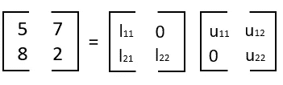

鲁分解(图片由作者提供)

# **向量微积分**

**微积分**是一门研究连续变化的数学，主要由函数和极限组成。**矢量** **微积分**本身关注的是**矢量** **字段**的微分和积分。向量微积分通常被称为**多元微积分，**虽然它有一个稍微不同的研究案例。多元微积分处理多个独立变量的微积分应用函数。

在开始学习向量微积分的时候，我觉得有几个重要的术语是人们需要知道的，它们是:

*   **导数**和**微分**

**导数**是一个实数函数，它测量函数值(输出值)的变化，该函数值与自变量(输入值)的变化有关。**微分**是计算导数的动作。

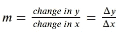

导数方程(图片由作者提供)

*   **偏导数**

**偏导数**是一种导数函数，其中在导数函数内计算几个变量，其中一个变量可以变化，另一个变量保持不变(与**全导数**相反，其中所有变量都可以变化)。

*   **渐变**

**梯度**是与函数的导数或变化率有关的词；你可能会认为梯度是导数的一个奇特的词。术语梯度通常用于具有多个输入和单个输出(标量)的函数。**渐变具有从当前位置移动**的方向，例如上、下、右、左。

# **概率和分布**

**概率**是一种对不确定性的研究(不严格的术语)。这里的概率可以认为是事件发生的时间，或者是对事件发生的相信程度。**概率分布**是一个测量与随机变量相关的特定结果(或结果的概率集)发生概率的函数。常见的概率分布函数如下图所示。

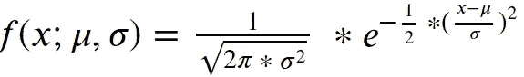

正态分布概率函数(图片由作者提供)

**概率论**和**统计学**经常与类似的事情联系在一起，但是它们关注不确定性的不同方面:

在数学中，我们将概率定义为某种过程的模型，其中随机变量捕捉潜在的不确定性，我们使用概率规则来总结发生的事情。

在统计学中，我们试图找出潜在的过程，观察已经发生的事情，并试图解释这些观察结果。

当我们谈论机器学习时，它接近于统计学，因为它的目标是构建一个模型，充分代表生成数据的过程。

# 最佳化

在学习目标中，训练机器学习模型就是寻找一组好的参数。我们认为的“好”是由目标函数或概率模型决定的。这就是**优化算法**的用途；给定一个目标函数，我们试图找到最佳值。

通常，机器学习中的目标函数试图**最小化函数。**表示最佳值是最小值。直观地说，如果我们试图找到最佳值，这就像找到目标函数的谷值，梯度将我们指向上坡。这就是为什么我们要向下坡(与梯度相反)移动，希望找到最低(最深)的点。这就是[梯度下降](https://en.wikipedia.org/wiki/Gradient_descent)的概念。

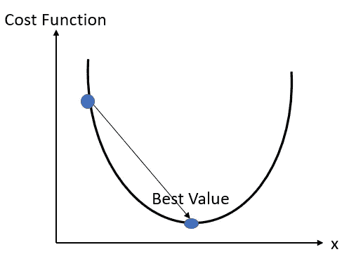

梯度下降(图片由作者提供)

学习优化时，很少有术语作为起点。它们是:

*   **局部最小值**和**全局最小值**

函数最佳值取最小值的点称为**全局最小值。**然而，当目标是最小化函数并使用优化算法(如**梯度下降**)求解时，函数可能在不同点具有最小值。那些看起来是最小值但不是函数实际取最小值的点称为**局部最小值**。

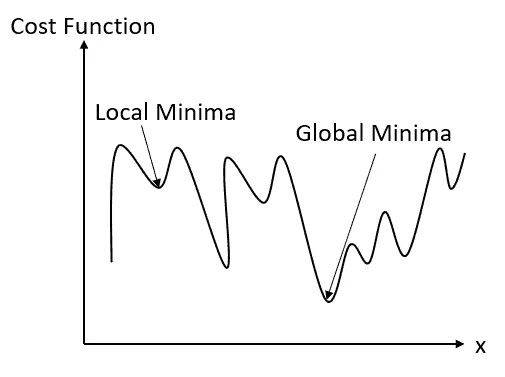

局部和全局最小值(图片由作者提供)

*   **无约束优化**和**约束优化**

**无约束优化**是一种优化函数，我们在假设参数可以取任何可能值(没有参数限制)的情况下找到函数的最小值。**约束优化**简单来说通过引入一组约束来限制可能的值。

如果没有参数限制，梯度下降就是无约束优化。如果我们设定一些限制，例如 x > 1，这就是一个无约束优化。

# **结论**

机器学习是数据科学家用来获取我们需要的有价值模式的日常工具。学习机器学习背后的数学可以让你在工作中获得优势。有许多数学科目，但当我们开始学习机器学习数学时，有 6 个科目最重要，那就是:

*   线性代数
*   解析几何
*   矩阵分解
*   向量演算
*   概率和分布
*   最佳化

如果你开始学习机器学习的数学，你可以阅读我的另一篇文章来避免学习陷阱。我还提供了您可能想在那篇文章中查阅的数学材料。

 [## 为机器学习学习数学时要避免的 5 个错误

### 在你的学习方法中要避免哪些陷阱

towardsdatascience.com](/5-mistakes-to-avoid-when-studying-math-for-machine-learning-6c8bcb2e2d06) 

希望有帮助！

访问我的 [**LinkedIn**](https://www.linkedin.com/in/cornellius-yudha-wijaya/) 或 [**Twitter**](https://twitter.com/CornelliusYW)

> 如果您没有订阅为中等会员，请考虑通过[我的推荐](https://cornelliusyudhawijaya.medium.com/membership)订阅。