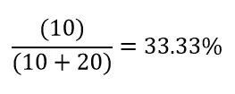
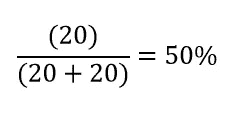

# 评估您的分类算法的 6 个指标

> 原文：<https://towardsdatascience.com/6-metrics-to-evaluate-your-classification-algorithms-caddd65ecff5?source=collection_archive---------7----------------------->

## 了解可用于评估分类模型的最常用指标——在本帖中，我们将探讨 6 个指标及其含义

*【免责声明:此帖子包含一些我的 Udemy 课程的附属链接】*

照片由[麦克维利](https://unsplash.com/@mcverry) @Unsplash.com 拍摄

当你进入数据科学和机器学习领域时，构建分类算法总是一个有趣的项目。除了回归问题，分类问题是企业在开始试验预测模型时最常遇到的问题。

但是，评估一个分类算法可能会变得混乱，真的很快。一旦你开发了一个逻辑回归或者分类决策树，并且输出了你的第一个从模型中分离出来的概率，你会立刻想到:**我应该如何使用这个结果？**

首先，在评估你的分类算法时，你必须做一个重大的选择:你想使用一个已经与你的“概率”结果的阈值相关联的指标吗？或者使用一个不知道阈值度量？

大多数著名的度量标准都与阈值相关，并且都有优点和缺点。还有一个度量标准是不可知的，它可以更好地评估结果中包含不同概率分布的模型(例如，回归与基于树的模型)。我们将在这篇文章中探讨这两种类型。

此外，对于这篇博文的例子，我们将使用二元分类(0 或 1 种情况)——一些来自“现实生活”的常见例子:

*   预测交易是否欺诈的模型；
*   预测客户是否会流失(不再购买)的模型；
*   预测网站访问者是否会转化为付费用户的模型；

我们已经准备好了学习分类指标的大部分基础—让我们开始吧！

# 混淆矩阵

我从混乱矩阵开始有点作弊，但是坚持住！混淆矩阵本身不是一种度量，而是多种度量评估分类算法的基础。混淆矩阵是简单的映射矩阵，用于比较算法的结果和特定目标的真实标签。

你可能会问自己的一件事是，你如何给你的算法的结果分配一个标签——换句话说，如果你把例子分配给 0 或 1(二进制分类)，你如何把那个概率转换成一个真正的分类？常见的技巧是定义一个阈值(比如 50%)，将高于该值的所有内容视为 1，否则视为 0。

**这是从混淆矩阵得出的指标的主要问题之一——它们依赖于您必须事先定义的阈值。**

混淆矩阵非常简单，您只需将真实结果与来自模型的预测相对照，并使用一个简单的玩具示例:

混淆矩阵示例

左侧是来自模型的预测值，它等于 *p(y)，*，您可能会在其他资源上看到。在上面，你有来自目标的真实值——等于 *y.*

在上面的例子中，您可以看到有 10 个例子，其中算法预测 1，而实际目标也是 1。这些被称为**真阳性(TP)。**在本例中，除了 TP，您还可以从混淆矩阵中获得其他 3 个基本值:

*   **真实否定(TN)** :其中真实目标为 0，而你的算法也预测为 0；
*   **假阴性(FN)** :真实目标为 1，而你的算法预测为 0。发生这种情况时，您的算法无法正确分类数据点；
*   **误报(FP)** :真实目标为 0，而你的算法预测为 1。当这种情况发生时，您的算法也无法正确分类数据点；

许多指标都是从上面的指标衍生出来的。当您已经将模型的结果通过一个阈值时，上面的数字对于理解模型的结果和实际值之间的关系是必不可少的。

**让我们了解一下从上述值中得出的一些指标。**

# 准确(性)

评估分类算法的首要指标是准确性。

准确性是容易理解的，并且基于混淆矩阵数据。要计算精度，只需应用以下公式:

精确度公式

**在分子上，我们用我们的算法得到了所有正确的例子。**在分母上，我们有整个样本。就是这样，就这么简单！

请注意，如果我们从上面的混淆矩阵中选取值，我们会得到以下结果:

该值越高，在对示例进行分类时，您的算法就越好。100%的准确率意味着你的算法在分类时是完美的。

但是，对于准确性有一个很大的警告:当你有巨大的类不平衡时，意味着你的一个类在例子的数量上极度超重。

一个真实的例子是欺诈检测—在每天完成的数百万笔交易中，只有少数是真正的欺诈。有时候这个百分比还不到 1%。

**如果你建立一个模型的目标是具有良好的准确性，那么……如果你只是将每一笔交易都指定为“非欺诈性”，那么你的准确性可以达到 99%**。这是否意味着你的模式是好的？不要！

你的准确性会很高，但你的模型会毫无价值，因为它无法捕捉到那些对金融系统极具破坏性的 1%的欺诈交易。

当目标稍微平衡时，准确度是有价值的，但幸运的是，我们可以使用更适合其他类型样品的其他指标。

# 精确度/灵敏度

精确度是一个广泛使用的衡量标准，用来了解你的 1 的分类表现如何。基本上，它帮助你理解从算法中产生的所有“正面”例子有多精确(没有双关语的意思)。

精度由以下公式组成:

简单重述一下，上面的公式读作:真阳性除以真阳性加上假阳性。从我们的混淆矩阵示例中提取值:

你可以认为 precision 主要回答了以下问题:

> 在所有我归类为正面的例子中，有多少是真正正面的呢？

这将有助于您理解在对新示例进行分类时，您的算法有多“广泛”。真正帮助我记住精确度的一个比喻是渔夫的比喻。

如果一个渔民用一张大网捕鱼，捕到 100 条鱼和 1 只靴子，他们的精确度是多少？高！在我们的比喻中，精确是以下形式的表示:“在渔夫网里的所有物体中，鱼占百分之多少？”

类似于 Precision 的指标是 Recall —让我们检查一下。

# 回忆

回忆有助于我们了解目标等于 1 的示例中，我们正确标记的示例的百分比是多少。

与 Precision 类似，当目标是罕见事件(也称为不平衡)时，这是一个非常好的度量标准。公式是:

并用我们示例中的值检查公式:

您可能会问自己:*“当目标很少时，为什么这是一个好的度量？”*

还记得我们说过，当目标很少时，精确度不是一个很好的衡量标准吗？假设您有 1000 个示例，其中只有 5 个示例的 target 等于 1。如果你把所有的东西都归类为 0，那么你的准确率将是 995/1000，或者 99.5%—同样，这似乎是一个很好的模型！但是如果你计算这个例子的回忆:

因为真阳性是 0，所以召回也是 0。**较高的召回率意味着你能够正确分类所有存在的真实标签，因此你的算法应该更有价值。**

请注意，如果您对太多具有“1”的示例进行分类，您的精度将会降低。幸运的是，有一个度量标准使我们能够将精确度和召回率结合起来，即 *f 值*(我们将在下面更详细地检查它)。

回到渔夫的比喻，高召回率意味着你能够在该地区捕捞大量的鱼，而不用捕捞太多的靴子！

# 特征

召回率和精确度在分子上都有真阳性。还有另一个衡量真阴性率的指标，叫做特异性。在大多数使用案例中，特异性并不单独使用，但它与计算 AUC 分数相关，我们将在下面看到。

特异性的公式如下:

对于我们的混淆矩阵示例:

特异性是一个类似的概念，但是依赖于目标实际目标为 0 的例子。具体来说，我们试图理解我们的算法正在正确计算的否定的比例。

# f 分数

我们已经看到了精度和召回是如何避开“稀有目标”的，给出了比精度更重要的关于模型的反馈。但是，它们仍然传达不同的信息。如果我们有一个能平衡精确度和召回率的度量标准，那不是很好吗？

幸运的是，我们有 F 值(有时也称为 F 值或 F1 值)！

F-score 是精确度和召回率之间的调和平均值，公式如下:

在我们的例子中，由于精度和召回率是相同的，我们将得到如下结果:

这个指标帮助我们理解精确度和召回率之间的平衡。如果接近 1，那么精度和召回率都接近 1。

高 f 值意味着我们的模型能够完美地区分问题中的 1 和 0——这是任何分类算法的最终目标。

到目前为止，我们只看到了来自混淆矩阵的度量，正如我们所看到的，为了构建 CM，我们需要定义一个阈值来对我们的示例进行分类。接下来，我们将看到一个独立于*先验*条件的度量，而不是模型的结果。

# 罗马纪元

AUC 来自 ROC 曲线。你可以查看本文中的 [ROC 曲线详情。](/understanding-auc-roc-curve-68b2303cc9c5)

ROC 曲线是一个简单的概念，它检查在分类中任何可用阈值的回忆与特异性的值。典型的 ROC 曲线示例如下:

作者图片

在 x 轴上我们有召回。在 y 轴上，我们有 1-特异性(也称为假阳性率-FPR ),并且该曲线的每个值对应于召回和 FPR 的特定值。让我们放大橙色点的细节:

*   orange point 的召回率约为 40%。
*   FPR 的价值在 10%左右。
*   为此点选择的阈值是 78%。**这意味着，如果您的算法得出的概率高于 0.78 或 78%，您将认为示例目标等于 1。**

如果你考虑一个更高的阈值，我们说的是一个类似于下面浅橙色的点:

作者图片

请注意，如果将考虑来自算法的示例所需的阈值提高到等于 1，自然会“捕捉”到更少的示例。理想情况下，当你这样做时，你会希望你的回忆保持不变，并降低你的 FPR——这意味着通过提高阈值，你将捕捉到更少的假阳性。

请注意，当你到达曲线右侧的终点时，你认为所有的例子都是积极的——你钓到了所有的鱼，但也钓到了所有的靴子！

因此..到底什么是 AUC？曲线下面积就是 ROC 曲线下的总面积。该值越大，面积就越大，模型在任何阈值下都能更好地区分 1 和 0 这两类。

作者图片

在这种情况下，AUC(曲线下用箭头标记的整个区域)将接近 0.7，接近完美的模型将具有类似于以下的曲线:

作者图片

在这种情况下，即使使用高达 95%的阈值，您也可以捕捉到实际目标等于 1 的大多数示例，同时最大限度地减少误报。这种 ROC 曲线非常罕见，因为这意味着您试图拆分的类几乎是线性可分的，这在现实生活中并不常见。

AUC 的范围从 0 到 1。0.值为 0 意味着你的模型比随机模型差(坏兆头！)并且值为 1 意味着完美的模型(乌托邦)。为什么这一指标与阈值无关？当您计算可用于构建曲线的任何阈值的结果及其下的面积时，您将使您的评估独立于它们。

我们完事了。这些指标是评估数据科学和机器学习分类模型的一些最常见的指标。还有许多其他的方法可以使用，但是这些可能是在 ML 项目中最常见的。

**您还有其他常用指标来评估您的分类模型吗？写在下面的评论里，我很想听听你的看法！**

***我在*** [***Udemy 课程***](https://www.udemy.com/course/r-for-data-science-first-step-data-scientist/?referralCode=6D1757B5E619B89FA064) ***中开设了一门关于学习数据科学的课程，我在课程中对这些指标进行了深入探讨——这门课程适合初学者，我希望您能参加。***