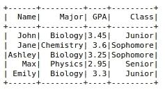
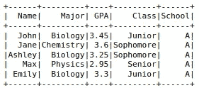
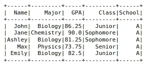
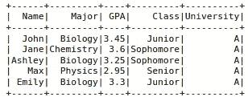
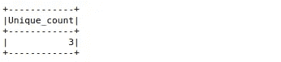
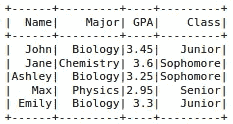

# PySpark 的 6 个必备色谱柱操作

> 原文：<https://towardsdatascience.com/6-must-know-column-operations-with-pyspark-d64f5315873e?source=collection_archive---------14----------------------->

## 简单如 Python，强大如 Spark


Marc-Olivier Jodoin 在 [Unsplash](https://unsplash.com/s/photos/fast?utm_source=unsplash&utm_medium=referral&utm_content=creditCopyText) 上拍摄的照片

Spark 是一个用于大规模数据处理的分析引擎。它让您可以将数据和计算分散到集群上，从而实现显著的性能提升。

PySpark 是 Spark 的 Python 库。它结合了 Python 的简单性和 Spark 的高效性，这种合作得到了数据科学家和工程师的高度赞赏。

在本文中，我们将介绍 6 种不同的列操作，它们是数据分析和操作中经常用到的。我们将使用 PySpark 的 SQL 模块，它提供了几个处理结构化数据的函数。

让我们从导入库开始。

```
from pyspark.sql import SparkSession
from pyspark.sql import functions as F
```

我们需要创建一个 SparkSession 作为 Spark SQL 的入口点。

```
spark = SparkSession.builder.getOrCreate()
```

我们将在整篇文章中使用这个 spark 会话。下一步是创建一个样本数据框来进行示例。

```
data = [
    ("John", "Biology", 3.45, "Junior"),
    ("Jane", "Chemistry", 3.60, "Sophomore"),
    ("Ashley", "Biology", 3.25, "Sophomore"),
    ("Max", "Physics", 2.95, "Senior"),
    ("Emily", "Biology", 3.30, "Junior")
]columns = ["Name", "Major", "GPA", "Class"]df = spark.createDataFrame(data = data, schema = columns)df.show()
```



(图片由作者提供)

我们根据一个模式编写样本数据。然后数据和模式都被传递给`createDataFrame`函数。

我们现在可以开始列操作了。

## 1.创建新列

`withColumn`函数用于创建一个新列。我们传递新列的名称以及填充它的数据。

```
df = df.withColumn("School", F.lit("A"))df.show()
```



(图片由作者提供)

`lit`函数允许用常量值填充一列。不像熊猫，我们不能只写“A”。

需要注意的是`withColumn`功能不能正常工作。因此，我们需要将更新后的数据框赋给一个新变量(自身或任何其他变量)来保存更改。

## 2.更新列

`withColumn`函数也可以用来更新或修改一列中的值。例如，我们可以将 GPA 值转换为 100 分制。

```
df.withColumn("GPA", F.col("GPA") * 100 / 4).show()
```



(图片由作者提供)

请记住，我们需要使用`col`函数来应用列操作。如果我们只把列名写成字符串，我们会得到一个错误。

## 3.重命名列

`withColumnRenamed`函数改变列的名称。我们将当前名称和新名称作为参数传递给这个函数。

```
df = df.withColumnRenamed("School", "University")df.show()
```



(图片由作者提供)

## 4.选择一列或多列

在某些情况下，我们可能只需要从数据框中获取特定的一列或几列。select 函数允许我们通过传递所需列的名称来完成这项任务。

```
df.select("Name", "Major").show()
```


(图片由作者提供)

## 5.列中的唯一值

如果我们想检查一列中不同值的数量，可以使用`countDistinct`函数。

```
df.select(F.countDistinct("Major").alias("Unique_count")).show()
```



(图片由作者提供)

它非常类似于 SQL 语法。选择列时应用该函数。我们还可以在一列中显示唯一的值。

```
df.select("Major").distinct().show()
```


(图片由作者提供)

## 6.删除一列

删除列的语法非常直观。正如您可能猜到的，使用了`drop`函数。

```
df = df.drop("University")df.show()
```



(图片由作者提供)

## 结论

我们已经用 PySpark 介绍了 6 种常用的列操作。PySpark 的 SQL 模块提供了更多的函数和方法来执行高效的数据分析。

需要注意的是，Spark 针对大规模数据进行了优化。因此，在处理小规模数据时，您可能看不到任何性能提升。事实上，在处理小数据集时，Pandas 可能会比 PySpark 表现得更好。

感谢您的阅读。如果您有任何反馈，请告诉我。