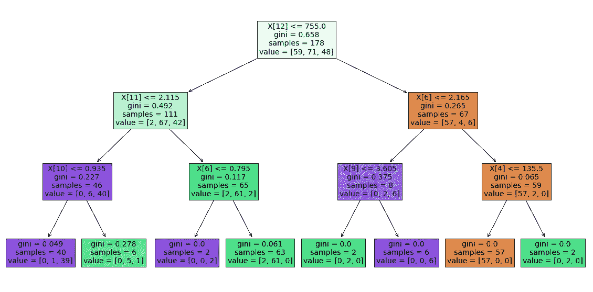
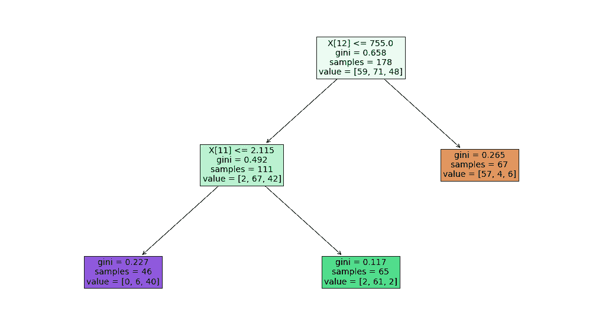

# 机器学习算法的 6 个必须知道的参数

> 原文：<https://towardsdatascience.com/6-must-know-parameters-for-machine-learning-algorithms-ed52964bd7a9?source=collection_archive---------13----------------------->

## 提升模型的性能

[托马斯·汤普森](https://unsplash.com/@tomthompsonphotography?utm_source=unsplash&utm_medium=referral&utm_content=creditCopyText)在 [Unsplash](https://unsplash.com/s/photos/tune?utm_source=unsplash&utm_medium=referral&utm_content=creditCopyText) 上拍照

有几种机器学习算法可用于监督和非监督任务。由于开源库的丰富选择，我们可以用几行代码实现这些模型。

虽然这些算法是现成的，但我们通常需要通过模型参数来调整它们。我们可以定制或调整的模型参数称为超参数。优化超参数所实现的是，它定制一个算法来更好地适应我们的数据或任务。

为了充分利用算法，超参数的使用至关重要。因此，我们需要对模型超参数及其影响有一个全面的了解。

在本文中，我们将涵盖常用的监督机器学习算法的 6 个关键超参数。本文基于 Scikit-learn，因此如果您使用不同的库，参数的名称可能会略有不同。但是，他们的意思和做法是一样的。

## 1.支持向量机的 c 参数

支持向量机(SVM)是一种广泛使用的监督机器学习算法。它主要用于分类任务，但也适用于回归。SVM 创造了一个区分不同阶层的决策界限。

当确定决策边界时，SVM 模型试图解决具有以下目标的优化问题:

*   增加决策边界到类别(或支持向量)的距离
*   最大化训练集中正确分类的点数

这两个目标之间显然有所取舍。决策边界可能必须非常接近特定的类，以最大化正确标记的数据点的数量。这种方法的缺点是模型对自变量的微小变化和噪声很敏感。这种情况也称为过度拟合。

另一方面，决策边界可能被放置在离每个类尽可能远的地方，代价是一些错误分类的异常。

这两种方法之间的权衡由 **c 参数控制。**它为每个错误分类的数据点增加一个惩罚。如果 c 很小，则对误分类点的惩罚也很低，因此以更大数量的误分类为代价选择了具有大余量的决策边界。

如果 c 很大，SVM 试图最小化由于高惩罚导致的错误分类的例子的数量，这导致了具有较小裕度的决策边界。对于所有错误分类的例子，惩罚是不同的。它与到决策边界的距离成正比。

## 2.支持向量机的伽玛参数

在介绍 **gamma** 参数之前，我们需要先说一下内核的窍门。在某些情况下，不可线性分离的数据点会使用核函数进行变换，以便它们变得可线性分离。

核函数是一种相似性度量。输入是原始特征，输出是新特征空间中的相似性度量。这里的相似性是指接近的程度。

常用的核函数之一是径向基函数(RBF)。RBF 的 Gamma 参数控制数据点的影响距离。

低 gamma 值表示较大的相似性半径，这将导致更多的点被组合在一起。对于高 gamma 值，这些点需要彼此非常接近，才能被视为在同一组(或类)中。因此，gamma 值非常大的模型往往会过度拟合。随着灰度系数的降低，分隔不同类别的区域变得更加一般化。

## 3.决策树的最大深度

决策树是一种广泛使用的监督学习算法，适用于分类和回归任务。决策树是一些著名的集成学习算法的构建模块，如随机森林、GBDT 和 XGBOOST。

决策树建立在反复询问问题以分割数据点的基础上。max_depth 参数用于控制树的深度。当达到 max_depth 时，模型停止分割。

max_depth 参数没有标准值或最佳值。它高度依赖于数据。一般来说，随着树木越来越深，过度拟合的机会增加。

如果我们使用非常小的树深度值，模型可能无法捕获关于数据集的足够的细节或信息。因此，它在训练集和测试集上都表现不佳。这种情况也称为欠适配。

最大深度为 3 的决策树(图片由作者提供)

## 4.决策树的最小杂质减少

当算法执行拆分时，主要目标是尽可能减少杂质。如果你想了解更多关于杂质、信息增益以及决策树如何使用这些概念，这里有一篇我不久前写的详细的[文章](/decision-tree-and-random-forest-explained-8d20ddabc9dd)。

杂质减少得越多，分裂获得的信息量就越大。随着树变得更深，杂质减少的量变得更低。我们可以利用这一点来防止树做进一步的分裂。该任务的超参数是**最小杂质减少**。

Scikit-learn 提供了两个函数来衡量分割的质量，这两个函数是基尼系数和熵。考虑下面一个 min _ infinity _ decrease 值为 0.2 的决策树的可视化。每一次分离使杂质减少 0.2。

(图片由作者提供)

## 5.随机森林和 GBDT 的树木数量

随机森林和梯度增强决策树(GBDT)是集成学习方法，这意味着它们将许多学习者结合起来，以建立更鲁棒和准确的模型。它们用于解决监督学习任务。随机森林和 GBDTs 的共同点是它们使用的基本算法是决策树。

它们之间的主要区别是它们组合决策树的方式。随机森林是使用一种称为 bagging 的方法构建的，其中每个决策树都被用作并行估计器。

GBDTs 使用 boosting 方法来组合各个决策树。Boosting 是指将一个学习算法串联起来，从许多顺序连接的弱学习器中实现一个强学习器。

n_estimators 参数用于确定集合模型中使用的树的数量。n_estimators 参数对随机森林和 GBDT 的影响是不同的。

增加随机森林中的树木数量不会导致过度拟合。在某个点之后，模型的准确性不会因为添加更多的树而增加，但是也不会因为添加过多的树而受到负面影响。由于计算原因，您仍然不希望添加不必要数量的树，但是没有与随机森林中的树的数量相关联的过度拟合的风险。

然而，梯度提升决策树中的树的数量在过度拟合方面非常关键。添加太多的树会导致过度拟合，所以在某个时候停止添加树是很重要的。

## 6.K 个最近邻的 N_neighbors

k-最近邻(kNN)是一种受监督的机器学习算法，可用于解决分类和回归任务。

kNN 分类器通过多数表决原则确定数据点的类别。如果 k 设置为 5，则检查 5 个最近点的类。根据多数类进行预测。类似地，kNN 回归取 5 个最近点的平均值。

n_neighbors 参数确定 k 值。就像决策树的 max_depth 一样，不存在适用于所有问题的标准或最优 k 值。

如果 k 太小，模型就变得太具体了。它还倾向于对噪声和特征的微小变化敏感。该模型在训练集上实现了高精度，但是在新的、以前看不到的数据点上将是差的预测器。因此，我们很可能以一个过度拟合的模型结束。

如果我们为 k 选择了一个太大的值，那么这个模型就变得太一般化了，因此在训练集和测试集上都不是一个好的预测器。它无法捕捉数据中的结构。该模型很可能不合适。

## 结论

我们已经讨论了对相关算法至关重要的 6 个超参数。在机器学习算法的范围内，还有许多超参数，但是要涵盖所有这些参数，这篇文章会很长。

在大多数情况下，需要多次试验才能找到这些超参数的最佳值。有一些工具可以简化这个过程，比如 Scikit-learn 库的 GridSearchCV 函数。

感谢您的阅读。如果您有任何反馈，请告诉我。