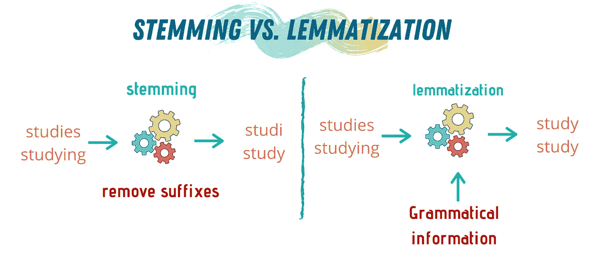

# 每个数据科学家都应该知道的 6 种 NLP 技术

> 原文：<https://towardsdatascience.com/6-nlp-techniques-every-data-scientist-should-know-7cdea012e5c3?source=collection_archive---------3----------------------->

## 迈向更高效的自然语言处理

在 [Unsplash](https://unsplash.com?utm_source=medium&utm_medium=referral) 上 [Sai Kiran Anagani](https://unsplash.com/@_imkiran?utm_source=medium&utm_medium=referral) 拍摄的照片

自然语言处理可能是数据科学中谈论最多的子领域。这很有趣，很有前途，它可以改变我们今天看待技术的方式。不仅仅是技术，它还可以改变我们感知人类语言的方式。

自然语言处理已经从研究和工业中获得了太多的关注和牵引，因为它是人类语言和技术的结合。自从计算机第一次被创造出来，人们就一直梦想着创造能够理解人类语言的计算机程序。

机器学习和人工智能领域的进步推动了自然语言处理的出现和持续关注。这种兴趣只会越来越大，特别是现在我们可以看到自然语言处理如何使我们的生活变得更容易。Alexa、Siri 和自动翻译机等技术突出了这一点。

事实是，自然语言处理是我进入数据科学的原因。我总是对语言以及它们如何基于人类经验和时间而进化着迷。我想知道我们如何能教计算机理解我们的语言，不仅仅是语言，而是我们如何能让它们能够用语言来交流和理解我们。

在这篇文章中，我将介绍自然语言处理的 6 种基本技术，如果你真的想进入这个领域，你应该知道这 6 种技术。

</nlp-101-what-is-natural-language-processing-b4a968a3b7bf>  

# 词汇化和词干化

词干化和词汇化可能是构建 NLP 项目的前两个步骤——您经常使用其中的一个。它们代表了这个领域的核心概念，通常是你在成为 NLP 大师的旅途中首先要运用的技巧。

通常，初学者容易混淆这两种技术。虽然他们有相似之处，但他们有很大的不同。

*   **词干化:**词干化是一组算法，通过截取单词开头的结尾来达到其不定式形式。这些算法通过考虑被分析的语言的公共前缀和后缀来实现。删掉这些单词可以得到正确的不定式形式，但情况并非总是如此。有许多算法来执行词干提取；英语中最常用的是波特词干。该算法包含 5 个阶段，依次工作以获得单词的根。
*   **词条化:**为了克服词干化的缺陷，设计了词条化算法。在这些类型的算法中，在提取单词的不定式形式时，需要将一些语言学和语法知识输入到算法中，以便做出更好的决策。为了使词汇化算法准确执行，它们需要提取每个单词的正确词汇。因此，他们通常需要一部语言词典来对每个单词进行正确的分类。

图片由作者制作，使用 [Canva](https://www.canva.com/)

基于这些定义，您可以想象构建一个 lemmatizer 比构建一个词干分析器更复杂、更耗时。但是，它更准确，并且在最终的分析结果中会产生更少的噪声。

# 关键词提取

关键词提取——有时称为*关键词检测*或*关键词分析——*是一种用于文本分析的自然语言处理技术。这项技术的主要目的是从文本正文中自动提取最常用的单词和短语。它通常被用作概括文章的主要思想和传达文章中的关键思想的第一步。

在关键词提取算法的后端，奠定了机器学习和人工智能的力量。它们用于提取和简化给定的文本，使其能够被计算机理解。该算法可以适用于任何类型的上下文，从学术文本到社交媒体帖子中使用的口语文本。

关键词提取在当今世界有许多应用，包括社交媒体监控、客户服务/反馈、产品分析和搜索引擎优化。

# 命名实体识别(NER)

像词干化和词汇化、命名实体识别或 NER 一样，NLP 的基本和核心技术是。NER 是一种用于从文本主体中提取实体的技术，用于识别文本中的基本概念，例如人名、地点、日期等。

NER 算法主要有两步。首先，它需要检测文本中的实体，然后将其归类到一个集合类别中。NER 的表现在很大程度上取决于用于开发模型的训练数据。训练数据与实际数据越相关，结果就越准确。

影响 NER 模型准确性的另一个因素是建立模型时使用的语言知识。也就是说，有一些开放的 NER 平台是预先训练好的，随时可以使用。

NER 可用于各种领域，如构建推荐系统、在医疗保健中为患者提供更好的服务，以及在学术界帮助学生获取与其学习范围相关的材料。

# 主题建模

你可以使用关键词提取技术将大量的文本缩小到几个主要的关键词和想法。从中，你大概可以提炼出课文的主题。

另一种更先进的识别文本主题的技术是主题建模——基于无监督机器学习的顶层建模，不需要标记数据进行训练。

可以使用多种算法来对文本的主题进行建模，例如相关主题模型、潜在狄利克雷分配和潜在情感分析。最常用的方法是潜在的狄利克雷。这种方法分析文本，将其分解为单词和语句，然后从这些单词和语句中提取不同的主题。你所要做的就是给算法输入一段文字，它就会从那里开始。

图片由作者使用 [Canva](https://www.canva.com/) 制作

# 摘要

自然语言处理的一个有用和有前途的应用是文本摘要。也就是说，把大量的文本压缩成一个包含文本主要信息的小块。这种技术常用于长篇新闻文章和总结研究论文。

文本摘要是一种高级技术，它使用我们刚刚提到的其他技术来建立它的目标，例如主题建模和关键词提取。建立的方法是通过两个步骤，提取然后抽象。

在提取阶段，算法通过基于频率提取文本的重要部分来创建摘要。之后，该算法生成另一个摘要，这一次是通过创建一个全新的文本来传达与原始文本相同的信息。文本摘要算法有很多，比如 [LexRank 和](https://pypi.org/project/lexrank/)text rank。

在 LexRank 中，算法使用排序模型对文本中的句子进行分类。等级是基于句子之间的相似性；一个句子与文本的其余部分越相似，它的排名就越高。

# 情感分析

毫无疑问，最著名、最广为人知和最常用的 NLP 技术是情感分析。这种技术的核心功能是通过分析包含的单词来提取文本主体背后的情感。

这项技术最简单的结果是在一个有 3 个区域的范围内，阴性、阳性和中性。算法可以更加复杂和先进；但是，在这种情况下，结果将是数字。如果结果是负数，那么文本背后的情绪就带有消极的语气，如果是正数，那么文本中就带有一些积极的成分。

情感分析是机器学习技术的广泛应用之一。它可以使用监督或非监督技术来实现。也许执行情感分析的最常见的监督技术是使用朴素贝叶斯算法。可以使用的其他监督 ML 算法是梯度提升和随机森林。

</nlp-101-towards-natural-language-processing-92df5728f6bb>  

# 外卖食品

人类希望计算机能够理解他们，并使用口语与他们交流，这种想法和计算机本身一样古老。由于技术和机器学习算法的快速进步，这个想法不再只是一个想法。这是我们在日常生活中可以看到和体验到的现实。这种思想是自然语言处理的核心驱动力。

自然语言处理是当今热门话题和人才吸引领域之一。各公司和研究机构正在竞相开发完全理解和使用人类语言的计算机程序。自从 20 世纪 60 年代首次出现以来，虚拟代理人和翻译确实发展迅速。

尽管自然语言处理可以执行不同的任务，但要进入该领域并开始构建自己的项目，您需要完全熟悉核心 6 基本自然语言处理技术。

这些技术是大多数(如果不是全部)自然语言处理算法的基本构件。所以，如果你理解了这些技巧以及何时使用它们，没有什么能阻止你。

</a-learning-path-to-becoming-a-data-scientist-56c5c2e8ae3f> 