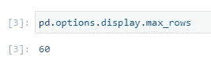

# 6 熊猫展示你应该记住的选项

> 原文：<https://towardsdatascience.com/6-pandas-display-options-you-should-memories-84adf8887bc3?source=collection_archive---------3----------------------->


[图片栏](https://pixabay.com/photos/stones-chain-heart-cord-love-art-2533882/#)上[设计师](https://pixabay.com/users/congerdesign-509903/)拍摄的照片

## 不要每次都把时间浪费在谷歌上！

作为一个数据科学家、数据分析师或者数据工程师，Pandas 一定是 Python 中最常用的库之一。它可以为我们打印一个漂亮的 HTML 格式的数据框，如果你像我一样使用 Jupyter Notebook/Lab 或 Google Colab，这是它的主要功能之一。

因为熊猫用的是预定义的 HTML + CSS，所以我们自己不需要担心格式的问题。然而，有时我们可能希望它以不同于默认格式的格式显示。你可能知道我们可以设置`pd.options.display`来实现这一点。

我有很多学习者知道这一点，但不记得每次他们想使用的选项。嗯，仅在`pd.options.display`子类别中就有 30 多个不同的选项。所以，完全没有必要全部记住。

在这篇文章中，我将推荐其中的 6 个，我建议你应该记住它们以提高编码效率。不要每次想用的时候都浪费时间在谷歌/栈溢出上！

请注意，我将使用`pd`作为熊猫的别名，因为我相信大多数人都像我一样使用`import pandas as pd`。

# 1.设置最大行数

```
pd.options.display.max_rows
```

当我们有一个包含更多行的数据框时，Pandas 会在中间截断这些行，以确保我们不会被极长的表所困扰。默认数字是 60。



如图所示，如果数据框超过 60 行，中间的 50 行将被截断。

```
pd.DataFrame(np.random.randn(61, 5))
```


如果我们将选项设置为大于数据框的行数，则将显示所有行。例如，我们将其设置为 100 行。

```
pd.options.display.max_rows = 100
```


# 2.设置最大列数

```
pd.options.display.max_columns
```

当然，截断逻辑也适用于水平方向。最大列数的默认值是 20。


如果我们不对其进行更改，并且数据框的列数超过 20 列，我们将无法再次查看中间的列。

```
pd.DataFrame(np.random.randn(5, 21))
```


如果我们想查看所有的列，只需增加最大列数即可。

```
pd.options.display.max_columns = 50
```


# 3.设置单元格的最大宽度

```
pd.options.display.max_colwidth
```

不仅行数和列数，而且每个单元格的宽度也对其宽度有约束。默认情况下，熊猫只显示最大宽度为 50 的单元格中的内容。也就是说，超过 50 个字符的单元格将被截断。

```
pd.DataFrame({
    'col': [''.join(list("Towards Data Science.") * 3)]
})
```


在上面的代码中，我只是重复了字符串“走向数据科学”共 63 个字符。所以，尾巴被截断了。

如果我们将最大列宽设置为 80，那么所有的文本都会显示出来。


# 4.设置`info()`中显示的最大列数

```
pd.options.display.max_info_columns
```

相信我们大多数人都会用`df.info()`来快速检查数据框的轮廓。但是，有时它不会显示结果中的所有列。这是因为`info()`方法对要分析的最大列数有一个默认约束，即 100 列。

让我们创建一个超过 100 列的随机数据框，并使用`info()`方法得到它的轮廓。

```
df = pd.DataFrame(np.random.randn(5, 101))
df.info()
```


这是不期望的。我希望看到所有列的“Dtype”和“非空计数”。在这种情况下，最大信息列选项会有所帮助。

```
pd.options.display.max_info_columns = 150
df.info()
```


# 5.设置显示精度

```
pd.options.display.precision
```

您可能注意到了，也可能没有注意到，Pandas 实际上对数据框中显示的小数位数有一个内置的限制。让我们以之前演示中生成的数据帧`df`为例。


注意第一个单元格，它的浮点数是-0.939665。这是因为熊猫只会显示小数点后 6 位数字。如果我们从数据框中得到如下数字，我们可以看到它有更多的小数-0.9396645167554308。

```
df.iloc[0, 0]
```


别担心。这不会影响后面算法中要用到的实际数字，因为这只是为了显示。但是，如果我想看到更精确的数字呢？让我们将选项设置为 15。

```
pd.options.display.precision = 15
```


现在，它可以显示整个数字。

# 6.设置十进制格式

```
pd.options.display.float_format
```

有时，我们可能希望向其他人展示我们的工作，或者我们可能希望自己更好地查看数据框。这很重要，因为我相信洞察力来自简洁的演示。混乱的演示会浪费我们大脑中的资源。

例如，让我们考虑我们在上述示例中使用的数据框中的数字应该是百分比，我们只关注小数点后的 2 位数字。然后，我们可以使用此选项来设置显示格式，如下所示。

```
pd.options.display.float_format = '{:.2f}%'.format
```


如图所示，这种格式足够灵活，您可以根据自己的需要进行定制，比如用`{$(:,.2f)}`来显示货币。

# 摘要


由 [Shutterbug75](https://pixabay.com/users/shutterbug75-2077322/) 在 [Pixabay](https://pixabay.com/photos/artistic-arts-blue-business-1238606/) 上拍摄的照片

在这篇文章中，我介绍了 6 种我们最好记住的熊猫展示方式。有 30 多个，但这几个是我发现最常用的。为了避免每次都在谷歌上浪费时间，强烈建议记住它们。

<https://medium.com/@qiuyujx/membership>  

如果你觉得我的文章有帮助，请考虑加入 Medium 会员来支持我和成千上万的其他作者！(点击上面的链接)