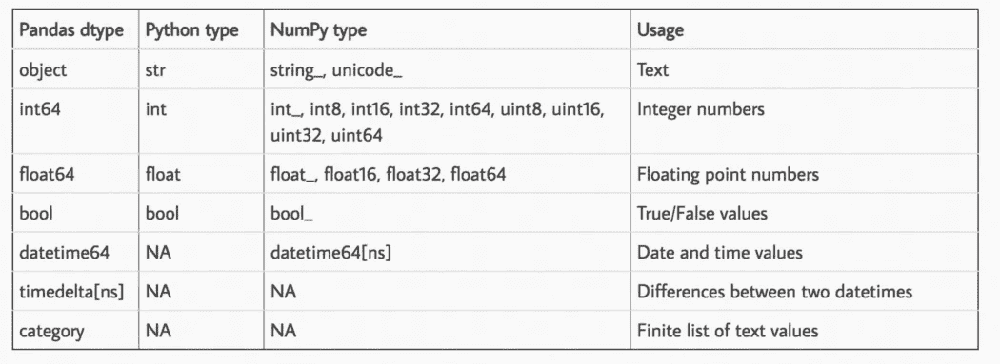
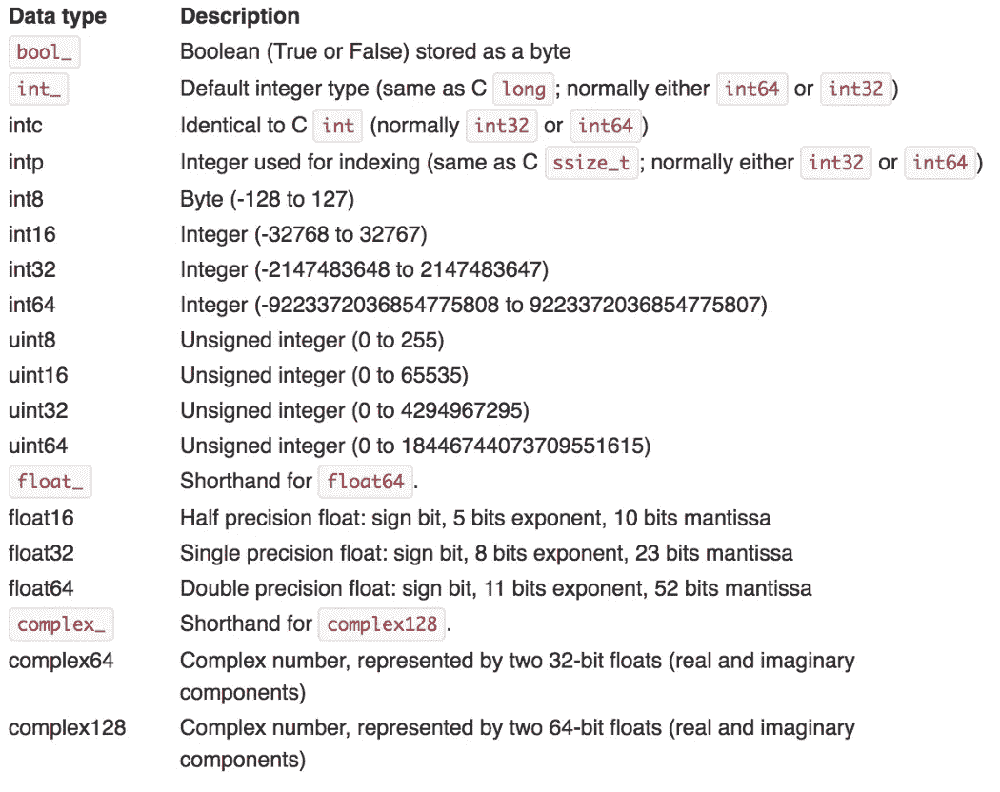
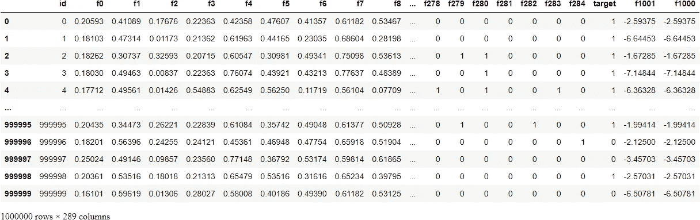
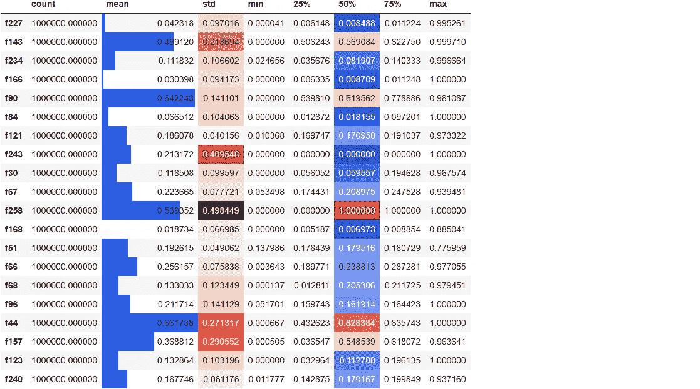

# 6 个熊猫的错误，无声地告诉你是一个菜鸟

> 原文：<https://towardsdatascience.com/6-pandas-mistakes-that-silently-tell-you-are-a-rookie-b566a252e60d?source=collection_archive---------1----------------------->

## 没有错误消息——这就是它们的微妙之处

**照片由** [**迈克尔·马特隆**](https://unsplash.com/@michalmatlon?utm_source=unsplash&utm_medium=referral&utm_content=creditCopyText) **上的** [**Unsplash。**](https://unsplash.com/s/photos/problem?utm_source=unsplash&utm_medium=referral&utm_content=creditCopyText) **除特别注明外，所有图片均为作者所有。**

# 介绍

我们都习惯了编码时频繁弹出的又大又胖的红色错误消息。幸运的是，人们通常不会看到它们，因为我们总是修复它们。但是没有错误的错误呢？这些是最危险的，如果被更有经验的人发现，会让我们非常尴尬。

这些错误与你正在使用的工具的 API 或语法无关，但与理论和你的经验水平直接相关。今天，我们在这里谈论熊猫初学者经常出现的 6 个错误，我们将学习如何解决它们。

<https://ibexorigin.medium.com/membership>  

获得由强大的 AI-Alpha 信号选择和总结的最佳和最新的 ML 和 AI 论文:

<https://alphasignal.ai/?referrer=Bex>  

# 1.使用熊猫本身

有点讽刺的是，第一个错误与实际使用熊猫完成某些任务有关。具体来说，今天的现实世界的表格数据集是巨大的。把它们解读到你和熊猫在一起的环境中将是一个巨大的错误。

为什么？因为它太慢了！下面，我们加载了 100 万行、300 个特征的 TPS 月数据集，占用了 2.2GB 的磁盘空间。

大约花了 22 秒。现在，你可能会说 22 秒并不算多，但是想象一下。在一个项目中，你将在不同的阶段进行许多实验。您可能会为清理、功能工程、选择模型以及其他任务创建单独的脚本或笔记本。

多次等待数据加载 20 秒真的让你很紧张。此外，您的数据集可能会大得多。那么，什么是更快的解决方案呢？

解决方案是在这个阶段抛弃 Pandas，使用其他专门为快速 IO 设计的替代方案。我最喜欢的是`datatable`，但是你也可以选择`Dask`、`Vaex`、`cuDF`等等。以下是使用`datatable`加载相同数据集所需的时间:

只要 2 秒钟！

# 2.没有矢量吗？

函数式编程[中最疯狂的规则之一是永远不要使用循环(以及“无变量”规则)。看起来，在使用 Pandas 时坚持这种“无循环”规则是加速计算的最好方法。](https://en.wikipedia.org/wiki/Functional_programming)

函数式编程用递归代替了循环。幸运的是，我们不必对自己如此苛刻，因为我们可以使用矢量化！

矢量化是 Pandas 和 NumPy 的核心，它对整个数组而不是单个标量执行数学运算。最好的部分是 Pandas 已经有了一套广泛的矢量化功能，消除了重新发明轮子的需要。

Python 中的所有算术运算符(+、-、*、/、**)在用于 Pandas 系列或数据帧时都以矢量化的方式工作。此外，你在 Pandas 或 NumPy 中看到的任何其他数学函数都已经矢量化了。

为了查看速度的提高，我们将使用下面的`big_function`，它将三列作为输入，并执行一些无意义的运算:

首先，我们将在 Pandas 最快的迭代器`apply`上使用这个函数:

手术花了 20 秒。让我们以矢量化的方式使用核心 NumPy 数组来做同样的事情:

只用了 82 毫秒，大约快了 250 倍。

的确，你不能完全抛弃循环。毕竟，并不是所有的数据操作都是数学的。但是，每当你发现自己渴望使用一些循环函数，如`apply`、`applymap`或`itertuples`，花一点时间看看你想做的事情是否可以矢量化。

# 3.数据类型，数据类型，类型！

不，这不是你在中学学到“改变熊猫列的默认数据类型”的课程。在这里，我们将深入探讨。具体来说，我们从内存使用的角度来讨论数据类型。

最差最耗内存的数据类型是`object`，这也恰好限制了熊猫的一些特性。接下来，我们有浮点数和整数。实际上，我不想列出所有的熊猫数据类型，所以你为什么不看看这个表:

【http://pbpython.com/pandas_dtypes.html】来源:<http://pbpython.com/pandas_dtypes.html>

**在数据类型名称之后，数字表示该数据类型中的每个数字将占用多少位内存。因此，我们的想法是将数据集中的每一列都转换为尽可能小的子类型。怎么知道选哪个？嗯，这是给你的另一张桌子:**

****

**来源:[https://docs . scipy . org/doc/numpy-1 . 13 . 0/user/basics . types . html](https://docs.scipy.org/doc/numpy-1.13.0/user/basics.types.html)**

**通常，您希望根据上表将浮点数转换为`float16/32`，将包含正整数和负整数的列转换为`int8/16/32`。您还可以对布尔值和正整数使用`uint8`,以进一步减少内存消耗。**

**下面是一个方便但很长的函数，它根据上表将浮点数和整数转换成它们的最小子类型:**

**让我们将它用于 TPS 月份的数据，看看我们可以减少多少:**

****

**我们将数据集从原来的 2.2GB 压缩到 510 MBs。不幸的是，当我们将数据帧保存到文件时，这种内存消耗的减少会丢失。**

**为什么这又是一个错误？当使用大型机器学习模型处理这样的数据集时，RAM 消耗起着很大的作用。一旦你出现一些内存错误，你就开始追赶并学习像这样的技巧来让你的计算机保持快乐。**

# **4.没有造型？**

**熊猫最奇妙的特征之一是它显示风格化数据帧的能力。原始数据帧呈现为 HTML 表格，在 Jupyter 中使用了一点 CSS。**

**对于那些有风格的人和那些想让他们的笔记本更加多彩和吸引人的人来说，Pandas 允许通过`style`属性来设计它的数据框。**

****

**上面，我们随机选择了 20 列，为它们创建了一个 5 个数字的摘要，转置结果，并根据它们的大小对均值、标准差和中值列进行着色。**

**诸如此类的变化使得在不求助于可视化库的情况下发现原始数字中的模式变得更加容易。你可以从这个[链接](https://pandas.pydata.org/docs/user_guide/style.html)中了解如何设计数据框架样式的全部细节。**

**实际上，*不对*数据帧进行样式化并没有什么错。然而，这似乎是一个非常好的特性，如果不使用它，就会错失良机。**

# **5.保存到 CSV**

**就像读取 CSV 文件极其缓慢一样，将数据保存回 CSV 文件也是如此。以下是将 TPS 十月份数据保存到 CSV 所需的时间:**

**差不多用了 3 分钟。为了对其他人和你自己都公平，把你的数据帧保存成其他更轻更便宜的格式，比如羽毛或拼花。**

**如您所见，将数据帧保存为羽化格式所需的运行时间减少了 160 倍。此外，羽毛和拼花地板的储物空间也更少。我最喜欢的作家，[达里奥·拉德契奇](https://medium.com/u/689ba04bb8be?source=post_page-----b566a252e60d--------------------------------)有一整个系列致力于 CSV 替代方案。你可以在这里查看[。](https://medium.com/towards-data-science/stop-using-csvs-for-storage-here-are-the-top-5-alternatives-e3a7c9018de0)**

# **6.你应该读一下用户指南！**

**事实上，这个列表中最严重的错误是没有阅读用户指南或者熊猫的文档。**

**我明白。说到文档，我们都有这种奇怪的事情。我们宁愿花几个小时在网上搜索，也不愿阅读文件。**

**然而，对于熊猫来说，这完全不是真的。它有一个很好的用户指南，涵盖了从基础到贡献和让熊猫更棒的话题。**

**事实上，你可以从用户指南中了解到我今天提到的所有错误。甚至还真有关于读取大数据集的[部分](https://pandas.pydata.org/docs/user_guide/io.html)特意告诉你用其他包比如`Dask`读取海量文件，远离熊猫。如果我有时间从头到尾阅读用户指南，我可能会想出 50 多个初学者错误，但现在你知道该怎么做了，剩下的就交给你了。**

# **摘要**

**今天，我们学习了初学者在使用熊猫时最常犯的六个错误。**

**我想让你注意到，在处理千兆字节大小的数据集时，这些错误中的大多数实际上都被算错了。如果你还在玩玩具数据集，你可能会忘记它们，因为解决方案不会有太大的不同。**

**然而，随着您提高技能并开始处理真实世界的数据集，这些概念最终将是有益的。**

********

# **在你离开之前，我的读者喜欢这些——你为什么不给他们一张支票呢？**

**</kagglers-guide-to-lightgbm-hyperparameter-tuning-with-optuna-in-2021-ed048d9838b5>  </25-numpy-functions-you-never-knew-existed-p-guarantee-0-85-64616ba92fa8>  </7-cool-python-packages-kagglers-are-using-without-telling-you-e83298781cf4>  </why-is-everyone-at-kaggle-obsessed-with-optuna-for-hyperparameter-tuning-7608fdca337c>  </how-to-work-with-million-row-datasets-like-a-pro-76fb5c381cdd>  </love-3blue1brown-animations-learn-how-to-create-your-own-in-python-in-10-minutes-8e0430cf3a6d> **