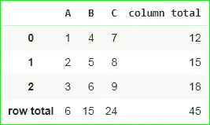
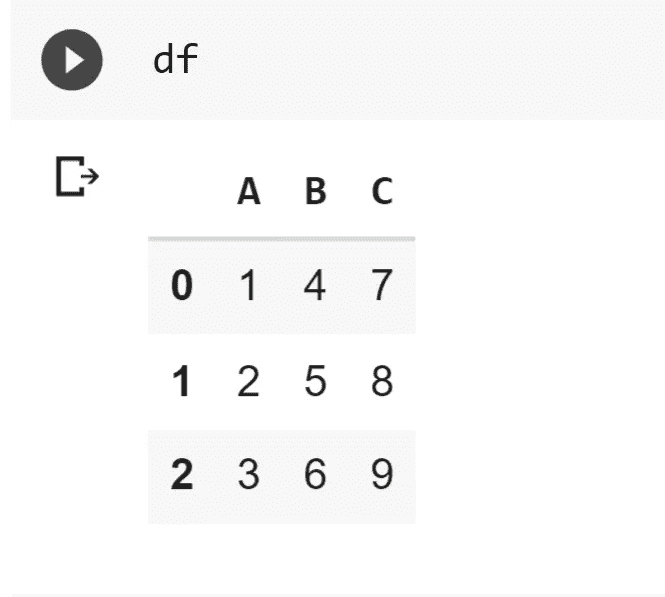
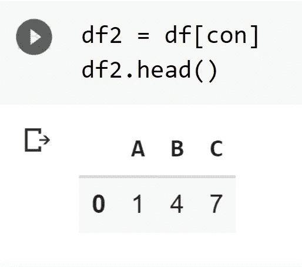
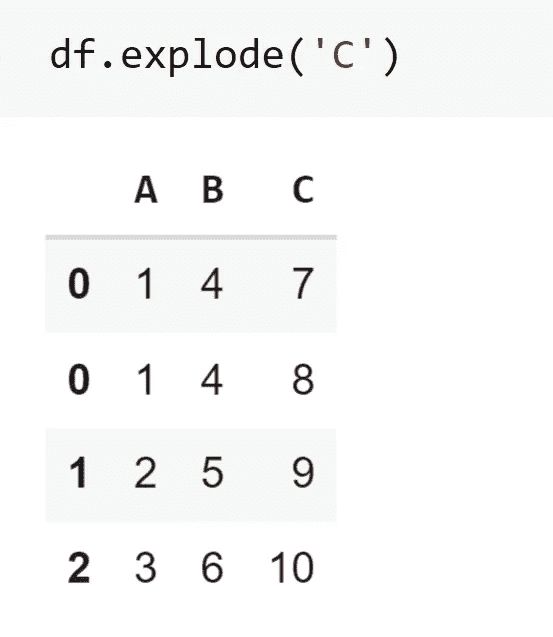
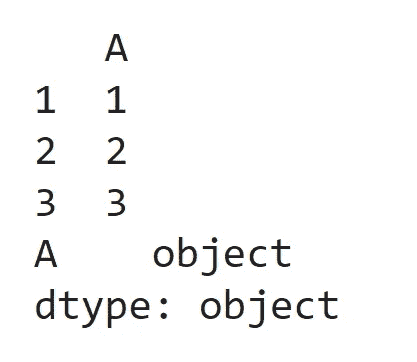
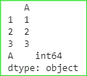

# 6 个你可能不知道但应该知道的熊猫把戏

> 原文：<https://towardsdatascience.com/6-pandas-tricks-that-you-might-not-know-but-should-6f766dfdb2c2?source=collection_archive---------21----------------------->

## 对您的日常任务有帮助


照片由 [**弗拉达·卡尔波维奇**](https://www.pexels.com/@vlada-karpovich?utm_content=attributionCopyText&utm_medium=referral&utm_source=pexels) 拍摄自 [**佩克斯**](https://www.pexels.com/photo/positive-woman-using-earphones-and-laptop-at-home-during-free-time-4050333/?utm_content=attributionCopyText&utm_medium=referral&utm_source=pexels)

如果你愿意学习数据科学，Pandas 是你需要学习的最重要的库之一。

Pandas 是数据组织清理和操作的行业标准库，全球几乎所有的数据科学家都在使用它。虽然使用起来非常强大，但还是有一些技巧可以让你的工作流程更有效率。

在本文中，我们将讨论 6 个这样的技巧，无论你是初学者还是有经验的程序员，它们都会对你有益。

# 1.**调整数据帧的行和列**

很多时候，当我们检查一些未处理的数据集时，我们会遇到一些问题，如行数或列数过多，单元大小不规则，以及具有大量数字的浮点数等。

我们可以很容易地解决这些问题，通过指定我们可以看到的最大行数/列数的某个值，浮点数的精度等…

导入 Pandas 库后，您可以编写下面几行代码来进行设置。

```
**pd.options.display.max_columns = 50**  
# to see max 50 columns**pd.options.display.max_rows = 200**    
# max 200 rows at a time**pd.options.display.max_colwidth = 100** #max column width is set to 100**pd.options.display.precision = 3**     
#floating point precision upto 3 decimal
```

# 2.**选择特定的列/行**

假设您想要从包含许多行和列的大型数据集中获得一些特定的行和列。在熊猫身上使用`df.iloc`和`df.loc`可以很容易做到这一点。`df.iloc`根据您的需要帮助您选择特定范围的行和列，`df.loc`可以根据特定条件执行布尔选择。

看看下面几行代码。

```
**>> df.iloc[4:7,2:5]**                                
# select the 4th to 6th row & 2nd to the 4th column**>> df.loc[:,'column_x':] **                          
# select all columns starting from 'column_x'**>> df.loc[df[‘value’] < 100, [‘name’, ‘location’]]** 
#selects the columns 'name' & 'location' having value < 100
```

# 3.**数据集中所有行和列的总和**

假设您想要获得特定数据集中所有列的所有行的总和。在 lambda 函数的帮助下，你可以很容易地在 Pandas 中使用`df.apply()`方法。

```
**df = pd.DataFrame(dict(A=[1,2,3], B=[4,5,6], C=[7,8,9]))****df['column total'] = df.apply(lambda x: x.sum(), axis=1)****df.loc['row total'] = df.apply(lambda x: x.sum())****df.head()**
```

输出将是这样的:



# 4.**用条件**屏蔽数据帧

假设您想要屏蔽不满足特定要求的数据集的行和列。你可以在熊猫身上很容易地做到这一点，只要设定一个条件:

```
con = df['A'] < 2 #elements of A having value less than 2
```

然后使用以下方法将该条件应用于数据集:

```
df = pd.DataFrame(dict(A=[1,2,3], B=[4,5,6], C=[7,8,9]))con = df['A'] < 2 #elements of A having value less than 2df2 = df[con]df2.head()
```

> **输出**



屏蔽前与屏蔽后

# 5.**“分解”一个数据帧**

如果您的 Pandas 数据帧包含某个列，该列包含一个列表或字典作为值，如下所示:

```
df = pd.DataFrame(dict(A=[1,2,3], B=[4,5,6], C=[[7,8],9,10]))df.head()
```


为了展平列表，我们可以使用`df.explode()`方法，该方法将列名作为参数，并将数据集更改为:

```
df.explode('C')
```



# 6.**将一列的所有值设置为特定的数据类型**

在处理未处理的数据时，您可能会遇到这样的情况:一个列中包含多种数据类型。

使用`df.infer_objects()`,我们可以很容易地将所有元素的数据类型更改为单一类型。`infer_objects`函数将一个特定列的所有数据类型设置为一个特定的数据类型，并进行合理的猜测:

```
**df = pd.DataFrame({"A": ["a", 1, 2, 3]})****df = df.iloc[1:]****print(df.head())****df.dtypes**
```



在这里，通常列的大多数元素的数据类型是 int，但是由于字符“a”的存在，输出将它显示为 object 数据类型。

应用 df.infer_objects()后，我们得到:



当前数据帧的数据类型为 ***int*** 。

# **结论**

这些是熊猫的一些小技巧，可以在处理大型和未处理的数据集时节省您大量的时间。

还有更多这样的功能和方法，可以节省你很多时间，当工作与熊猫。如果您使用该库并查看文档，您将会了解它们。

在我即将发表的文章中，请继续关注更多基于 Python 的技巧和诀窍。