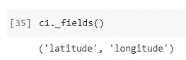

# 你应该知道的 6 种 Python 容器数据类型

> 原文：<https://towardsdatascience.com/6-python-container-data-types-you-should-know-81dad6c4f61d?source=collection_archive---------2----------------------->


照片由 [Julius_Silver](https://pixabay.com/users/julius_silver-4371822/) 在 [Pixabay](https://pixabay.com/photos/hamburg-port-of-hamburg-3021820/) 上拍摄

## 在 Python 中钉钉高级数据结构工具

我相信你一定知道 Python 中基本的集合数据类型，比如列表、元组、字典。网上已经有太多关于这些数据结构的资源了。但是，大家有没有注意到，Python 内置的`collection`模块中有 6 个“高级”数据结构工具？

*   命名元组
*   有序字典
*   链式地图
*   计数器
*   双端队列

不要被他们的名字吓到。我保证这些是你已经熟悉的东西，但是为你提供一些开箱即用的极其方便的特性。

让我们浏览一下这些容器数据类型，看看它们是什么以及它们能做什么。为了方便起见，所有的演示代码都假设所有的集合类型都是导入的。

```
from collections import *
```

# 1.命名元组


照片由 [Pixabay](https://pixabay.com/photos/events-wedding-venue-table-spread-2609303/) 上的 [StockSnap](https://pixabay.com/users/stocksnap-894430/) 拍摄

元组是 Python 中一种重要的序列数据类型。只要你用过 Python，你应该已经知道了。然而，什么是“命名元组”？

假设我们正在开发一个需要使用坐标(纬度和经度)的应用程序，这是两个十进制数字，用来表示我们通常在谷歌地图上看到的地球上的一个地方。它自然可以用一个元组来表示，如下所示。

```
c1 = (-37.814288, 144.963122)
```

然而，如果我们处理全世界的坐标，有时可能不容易识别哪个数字是纬度或经度。这可能导致代码可读性的额外困难。

不仅仅是值，命名元组为元组中的每个位置分配有意义的名称，并允许**更具可读性的**、**自文档化代码**。它们可以在任何使用正则元组的地方使用，并且它们增加了通过名称而不是位置索引来访问字段的能力。

在使用命名元组之前，我们可以将其定义如下。

```
Coordinate = namedtuple('Coordinate', ['latitude', 'longitude'])
```

然后，我们现在可以使用已定义的命名元组来定义坐标。

```
c1 = Coordinate(-37.814288, 144.963122)
```


这不仅是为了可读性，也是为了使用方便，比如通过名称访问值。

```
print(f'The latitude is {c1.latitude} and the longitude is {c1.longitude}')
```


如果我们想得到字段名，我们可以简单地调用它的`_fields()`函数。

```
c1._fields()
```



你可能会开始认为这与类和字典有些重叠。然而，如果不需要任何类方法，这比定义一个类要简单和整洁得多。此外，如果需要，您可以随时轻松地将命名元组转换为字典。

```
c1._asdict()
```


打住，什么是`OrderedDict`？这的确是一本字典，但有一点不同。请参考下一节。

# 2.有序字典


照片由 [Katzenfee50](https://pixabay.com/users/katzenfee50-7273650/) 在 [Pixabay](https://pixabay.com/photos/cocktails-drinks-beverages-juices-3252160/) 上拍摄

有序字典是字典的子类，它继承了字典的所有内容。唯一的区别是有序字典中的条目是“顺序敏感的”。

我们已经从上一节中得到了一本有序词典。我们继续以此为例。

```
od = c1._asdict()
```


因为它继承了普通字典的一切，我们可以期望它拥有普通字典应该拥有的所有特性，比如通过键访问值。

```
print(f"The latitude is {od['latitude']} and the longitude is {od['longitude']}")
```


然而，因为它是顺序敏感的，所以它有一些普通字典所没有的特性。例如，我们可以通过调用`move_to_end()`函数来改变项目的顺序。

```
od.move_to_end('latitude')
```


所以，纬度被移到了有序字典的末尾。

此外，我们可以从有序字典中弹出最后一项。

```
lat = od.popitem()
```


有序的字典在某些情况下非常有用。例如，我们可以用它来记忆最后插入的钥匙的顺序。

# 3.链式地图


照片由 [MoreLight](https://pixabay.com/users/morelight-2098341/) 在 [Pixabay](https://pixabay.com/photos/munich-oktoberfest-ride-carousel-1220908/) 上拍摄

接下来，我们来看看连锁图。当我们想要将多个字典组合在一起作为一个整体时，链式映射是非常有用的，但是不需要物理地组合它们，这可能会消耗更多的资源，并且当存在重复的键时必须解决键冲突。

假设我们正在开发一个依赖于某些配置的应用程序。我们在应用程序中定义系统默认配置，同时允许用户通过一些特定的设置来覆盖默认设置。就把例子编出来如下。

```
usr_config = {'name': 'Chris', 'language': 'Python'}
sys_config = {'name': 'admin', 'language': 'Shell Script', 'editor': 'vm'}
```

你会怎么做？写一个 for 循环，根据`usr_config`更新`sys_config`？如果有数百个项目，或者有多个层而不是只有两个层，该怎么办？我们通常有多层配置，比如用户级>应用级>系统级等等。

使用链图可以即时解决这个问题。

```
cm = ChainMap(usr_config, sys_config)
```


从输出来看，链图只是简单地将字典放在一起。事实上，这背后有某种魔力。如果我们尝试将它转换成一个列表，我们可以看到只有 3 个键。事实上，5 个键中有 3 个是唯一的。

如果我们尝试访问“name”键的值会怎么样？


让我们也试试“编辑”键。


好的。神奇的是，`usr_config`总是覆盖`sys_config`中的设置。但是，如果我们正在访问的密钥没有在`usr_config`中定义，将使用`sys_config`中的密钥。这正是我们想要的。

如果我们想更新链图中的键“编辑器”怎么办？


可以看出，`usr_config`实际上是更新的。这是有意义的，因为它将覆盖`sys_config`中的相同项目。当然，如果我们删除“editor”键，它将从`usr_config`中删除，并将再次使用`sys_config`中的默认键。

```
del cm['editor']
cm['editor']
```


看，在 Python 中正确使用容器类型可以节省我们大量的时间！

# 4.计数器


照片由 [Pixabay](https://pixabay.com/photos/abacus-classroom-count-counter-1866497/) 上的[像素](https://pixabay.com/users/pexels-2286921/)拍摄

下一个是“计数器”。这听起来不像是容器类型，但就其表现形式而言，有点类似于字典。但是，它更像是一个“算题”的工具。

假设我们有一个包含许多条目的列表。有些项目是相同的，我们想计算每个项目重复的次数。列表如下。

```
my_list = ['a', 'b', 'c', 'a', 'c', 'a', 'a', 'a', 'c', 'b', 'c', 'c', 'b', 'b', 'c']
```

然后，我们可以使用计数器非常容易地执行这个任务。

```
counter = Counter()for letter in my_list:
    counter[letter] += 1
```


它告诉我们列表中有 5 个 a，4 个 b 和 6 个 c。

计数器还提供了许多相关的便利功能。比如我们可以得到“n”个最常见的。

```
counter.most_common(2)
```


我们仍然可以将所有的元素放回到一个列表中。

```
list(counter.elements())
```


此外，我们可以动态定义计数器。

```
another_counter = Counter(a=1, b=4, c=3)
```


当我们有两个计数器时，我们甚至可以在它们之间执行操作。

```
counter - another_counter
```


最后，如果我们想知道总数，我们总是可以将它们相加。

```
sum(counter.values())
```


不要小看 Python 里这么一个小工具。在某些情况下，它可以在很大程度上简化问题。如果你对这个工具的配方感兴趣，请关注我的更新。

# 5.双端队列


由 [DaKub](https://pixabay.com/users/dakub-8222964/) 在 [Pixabay](https://pixabay.com/photos/duck-goose-march-series-queue-3217049/) 上拍摄的照片

如果你有计算机科学背景，你一定知道队列、栈等很多常见的数据结构。他们的区别是 FIFO(先进先出)和 LIFO(后进先出)。

还有一种数据结构操作叫做 deque，是双端队列的缩写。它是用 Python 实现的，可以开箱即用。

让我们先定义一个 deque。

```
dq = deque('bcd')
```


因为它是一个“双端”队列，我们可以从左侧或右侧追加。

```
dq.append('e')
dq.appendleft('a')
```


我们还可以使用`extend()`或`extendleft()`函数一次追加多个元素。请注意，当我们把顺序追加到左边时，你就会明白为什么“210”变成了“012”。只是认为我们是在左侧一个接一个地添加它们。

```
dq.extend('fgh')
dq.extendleft('210')
```


还有一些非常有用的操作，特别是在 deque 结构中，比如旋转。它将元素从右端旋转到左端，或者相反。请注意，`rotate()`函数的参数可以是任何整数。

```
dq.rotate()
dq.rotate(-1)
```


当然，我们可以让元素从队列的任意一端“出来”。

```
dq.pop()
dq.popleft()
```


# 6.默认字典


照片由[像素](https://pixabay.com/users/pexels-2286921/)在[像素仓](https://pixabay.com/photos/books-bookshop-bookstore-collection-1842261/)拍摄

最后，默认字典从名字上看有点难懂。然而，这并不妨碍它成为一种有用的工具。当然是在你真正了解之后:)

默认字典是字典的子类。默认不是指默认值，而是“默认出厂”。默认工厂指示将构造字典的默认数据类型。最重要的一个，默认字典用于基于一些公共键收集对象(默认数据类型)。

不要迷惑。让我给你看一个例子。假设我们有一个如下的名字列表。

```
my_list = ['Alice', 'Bob', 'Chris', 'Bill', 'Ashley', 'Anna']
```

我们要做的是将具有相同开头字母的名字收集在一个列表中。比如`['Alice', 'Ashley', 'Anna']`应该是列表中的一个，因为它们都是以“A”开头的。

在这种情况下，我们希望值为“list”。所以，默认工厂将是“列表”。

```
dd = defaultdict(list)for name in my_list:
    dd[name[0]].append(name)dd.items()
```


我们已经使用默认的字典很容易地分开了名字！然后，当然，我们可以使用它作为一个普通的字典来获取值。

```
print(f'''
Names start with "A":
{dd["A"]}Names start with "B":
{dd["B"]}Names start with "C":
{dd["C"]}
''')
```


默认字典非常灵活，因为默认工厂可以是任何数据类型。例如，我们可以将默认工厂定义为 integer，并使用它来计算每个起始字母的名称数量。

```
dd = defaultdict(int)for name in my_list:
    dd[name[0]] += 1dd.items()
```


我们重新发明了计数器的轮子。放轻松，这只是个例子:)

# 摘要


由[免费拍摄的照片](https://pixabay.com/users/free-photos-242387/)在 [Pixabay](https://pixabay.com/photos/pencil-sharpener-notebook-918449/) 上

在本文中，我介绍了 Python 的`collection`模块中的 6 种容器类型。命名元组帮助我们编写更可读的代码，有序字典帮助我们定义对项目顺序敏感的字典，链图帮助我们定义多层字典，计数器帮助我们轻松计算所有内容，deque 定义双端队列，最后，默认字典帮助我们基于一些公共键收集对象。

<https://medium.com/@qiuyujx/membership>  

如果你觉得我的文章有帮助，请考虑加入 Medium 会员来支持我和其他成千上万的作者！(点击上面的链接)