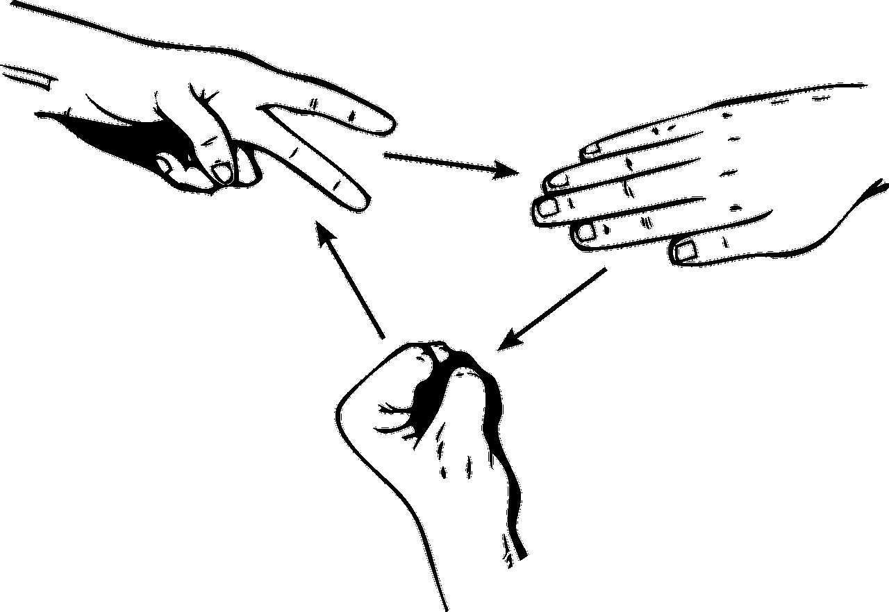
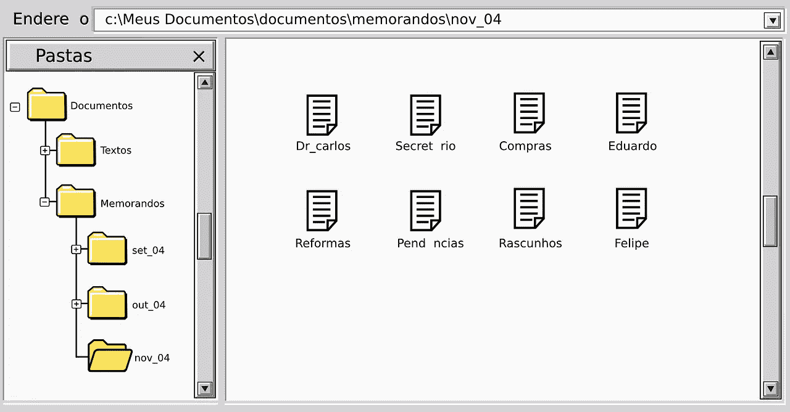
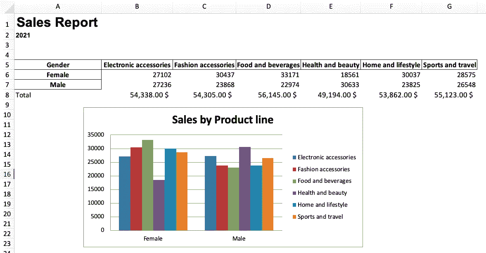
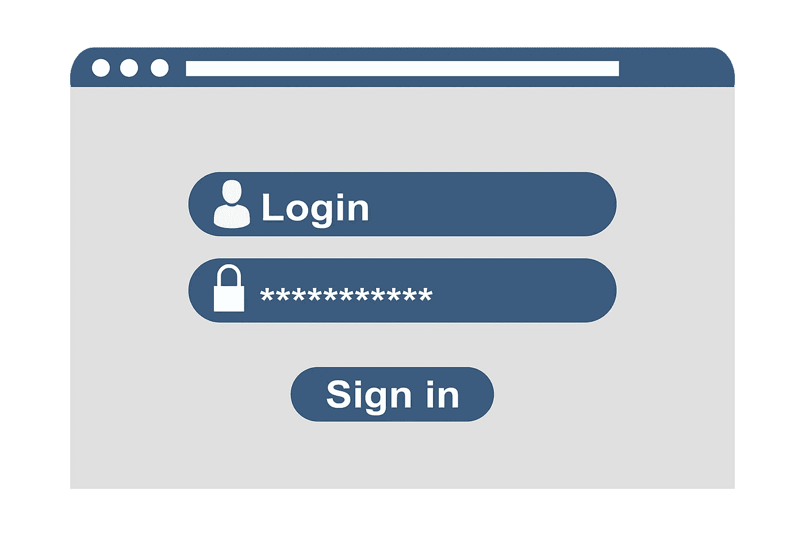

# 你可以在一个周末完成 6 个 Python 项目

> 原文：<https://towardsdatascience.com/6-python-projects-you-can-finish-in-a-weekend-f53552279cc?source=collection_archive---------1----------------------->

## 初级和高级项目将帮助你提高你的 Python 代码

丹尼尔·伊德里在 [Unsplash](https://unsplash.com?utm_source=medium&utm_medium=referral) 上的照片

学习 Python 可能很难。你可能会花很多时间看视频和看书；但是，如果你不能把学到的概念全部付诸实践，那时间就浪费了。

这就是为什么您应该尝试 Python 项目的原因。一个项目将帮助你把你所学到的一切集中起来，保持动力，建立一个文件夹，并想出用代码处理和解决问题的方法。

在本文中，我列出了一些帮助我提高 Python 代码水平的项目，希望对您也有帮助。项目按难度排列，所以初学者项目在开头，高级项目在文章末尾。

# 石头，布，剪刀

石头剪子布是一个经典游戏，我相信你一定很熟悉。这是一种简单的手游，通常在两个人之间进行，每个玩家同时用手形成三种形状中的一种。通过这个初学者项目，我们将学习如何实现基本的 Python 东西，如列表、if 语句和输入。

目标是创建一个系统，使得一个决定玩石头的玩家将击败另一个选择剪刀的玩家，但将输给一个玩纸的玩家，并且纸的游戏将输给剪刀的游戏。如果你对这个项目感兴趣，请查看这个[指南](https://betterprogramming.pub/3-fun-beginner-python-projects-with-random-numbers-df12c84a621)，它包含了这个项目的全部 Python 代码。

照片由 [OpenClipart-Vectors](https://pixabay.com/users/openclipart-vectors-30363/) 在 [Pixabay](https://pixabay.com/vectors/fingers-fist-hands-paper-rock-149295/) 上拍摄

这是你能用 Python 编写的最简单的游戏。完成这个项目后，你可以用 Pygame 库**开发更复杂的带有计算机图形和声音库的游戏。下面列出了一些你可以用 Pygame 创建的游戏。**

*   井字游戏
*   绞刑吏
*   猜测数字
*   答问比赛
*   蛇

# 文件重命名工具

照片由[Clker-Free-Vector-Images](https://pixabay.com/users/clker-free-vector-images-3736/)在 [Pixabay](https://pixabay.com/vectors/user-interface-interface-window-23350/) 上拍摄

大多数作业要求您按日期对文件夹进行排序，或者使用预定义的语法管理文件名。您可以手动执行此操作；然而，使用一些 Python 代码可以节省大量时间。

这个项目的目标是重命名存储在计算机上的数百个文件，这样就很容易识别每个文件。例如，您可以将文件的创建日期以“MM-DD-YY”的格式添加到文件名中，这样任何人都可以轻松找到文件。

为了在 Python 中实现这一点，我们必须使用 Python 自带的操作系统模块。这提供了与操作系统交互的功能，因此允许您使用 Python 代码控制许多功能。本[教程](/7-common-file-system-operations-you-can-do-with-python-e4670c0d92f2)将帮助你开始操作系统模块。另一个对这个项目有用的库是一个名为 **re** 的内置包。这个包允许你使用[正则表达式](/a-simple-and-intuitive-guide-to-regular-expressions-404b057b1081)，如果你想在你的文件名中提取和重用一些文本模式，你可能会用到它。

您可以使用操作系统库执行的其他操作系统任务包括:

*   创建多个文件夹并重命名它们
*   删除目录
*   识别当前工作目录

您可以在下面的指南中了解如何完成这项任务和其他任务。

 [## 使用 Python 可以完成的 7 种常见文件系统操作

### 使用 OS 和 Pathlib 模块来自动化 Python 的任务。

towardsdatascience.com](/7-common-file-system-operations-you-can-do-with-python-e4670c0d92f2) 

# 电子表格自动化

像更新 Excel 报表这样的重复性任务花费了我们大量的时间。幸运的是，Python 的库 openpyxl 将帮助我们自动化我们必须在 Excel 中完成的大多数任务。

这个项目的想法是使用 Python 代码来执行 Excel 任务，如制作数据透视表，绘制图表，应用 Excel 公式，以及格式化报告表。一旦我们完成了代码的编写，我们只需要运行脚本来创建如下所示的报告。

作者图片

您甚至可以创建一个 Python 函数，[将您的 Python 脚本转换成一个可执行文件(。exe)](/how-to-easily-convert-a-python-script-to-an-executable-file-exe-4966e253c7e9) 和[安排 Python 脚本](/how-to-easily-automate-your-python-scripts-on-mac-and-windows-459388c9cc94)每月、每周或每天创建报告。

关于如何自动化您的 Excel 报告的指南可以在下面的链接中找到。

 [## 使用 Python 自动生成 Excel 报表的简单指南

### 使用 openpyxl 通过 Python 自动生成 Excel 报表。

towardsdatascience.com](/a-simple-guide-to-automate-your-excel-reporting-with-python-9d35f143ef7) 

Python 可以帮助你自动化更多的任务！如果您想了解更多关于自动化的项目想法，请查看下面的文章。

 [## 4 个网页抓取项目将帮助你的生活自动化

### 初级和高级项目，从头开始学习 Python 中的 web 抓取。

medium.com](https://medium.com/geekculture/4-web-scraping-projects-that-will-help-automate-your-life-6c6d43aefeb5) 

# 创建图形用户界面(GUI)

由 [geralt](https://pixabay.com/users/geralt-9301/) 在 [Pixabay](https://pixabay.com/illustrations/login-register-window-button-3938429/) 上拍摄的照片

写 Python 代码很酷，但你知道什么更酷吗？能够通过图形用户界面与您的代码进行交互，因此任何人都可以测试您所开发的内容。

Python 的库 Tkinter、PyQt 和基维将帮助你创建一个带有按钮、窗口和许多其他小部件的 GUI，使用户更容易与你的应用程序交互。如果你以前从未创建过 GUI，你可以查看这个免费的 [Tkinter 课程](https://youtu.be/YXPyB4XeYLA)。

这个项目的想法很简单——为你已经完成的任何项目创建一个 GUI。您还可以为本文中列出的项目创建一个 GUI，或者从下面的列表中获得一些灵感。

*   年龄计算器应用程序:这个应用程序允许用户输入他们的出生日期，应用程序会自动显示他们的年龄。
*   计算器:如果您曾经在学习 Python 时开发过计算器，现在是时候用 GUI 增强输出了。从操作系统自带的计算器中获得一些灵感。
*   货币转换器:构建一个货币转换器应用程序，允许用户以一种货币输入所需的值，并以目标货币返回转换后的值。

# 建立一个简单的投资组合网站

由 [Unsplash](https://unsplash.com?utm_source=medium&utm_medium=referral) 上的 [Le Buzz](https://unsplash.com/@le_buzz?utm_source=medium&utm_medium=referral) 拍摄

如果你曾经梦想创建一个网站，我有一个好消息，你可以用 Python 来做！Python 中两个最流行的 web 开发框架是 Django 和 Flask。

Django 是一个鼓励快速开发和干净设计的高级 Python web 框架。它速度快、可扩展，并且非常重视安全性，这就是为什么 Instagram、Pinterest 和华盛顿邮报等网站都是用 Django 构建的。另一方面，Flask 是一个轻量级框架，提供了 web 应用程序的基本功能。它需要更少的编码，所以它是学习 web 开发基础的一个极好的框架。

Django 为初学者设计的一个很酷的项目是建立一个基本的作品集简历网站来展示你的作品。你的第一个网站不会像那些设计好看的现代网站一样；但是，在这个项目中，您将学习一些基础知识，如渲染模板、添加 CSS、JavaScript 和图像的静态文件。查看这个 [YouTube 教程](https://youtu.be/pLN-OnXjOJg)来更好地了解这个项目。

如果你想更深入地研究 Flask 或 Django，请查看[这个频道](https://www.youtube.com/c/DennisIvy/videos)或[另一个频道](https://www.youtube.com/user/schafer5)，那里有这两个框架的完整教程系列。

# 电影推荐系统

照片由 [Unsplash](https://unsplash.com?utm_source=medium&utm_medium=referral) 上的 [Thibault Penin](https://unsplash.com/@thibaultpenin?utm_source=medium&utm_medium=referral) 拍摄

你有没有想过网飞、Hulu 或亚马逊等流媒体服务是如何推荐新电影的？这只是一个由工程师建立的推荐系统，根据用户的不同信息找到最佳电影。

推荐系统是一种旨在预测用户对特定项目的偏好的程序。在这种情况下，推荐系统在给定一些数据的情况下预测用户想要观看的电影。在 Python 中，我们可以使用 Pandas、Numpy 和 Scikit-learn 等库来开发一个从基本模型到基于内容和协同过滤推荐系统的推荐引擎。

要执行这个项目，您需要一个包含电影标题和至少一个情节描述的数据集。您可以将这个 [IMDb](https://www.imdb.com/interfaces/) 数据集或这个 [MovieLens](https://grouplens.org/datasets/movielens/) 数据集用于这个项目。此外，在这个[链接](https://www.datacamp.com/community/tutorials/recommender-systems-python)中，有一个关于如何用 Python 制作电影推荐系统的完整指南。

*就是这样！你可以在下面的链接中找到我完成的其他 Python 项目的完整代码。*

 [## 网络抓取基础——10 分钟内抓取一个赌博网站

### 在这 10 分钟的教程中，我将向你展示如何用 Python 刮网站，即使你根本不编码！

medium.com](https://medium.com/swlh/web-scraping-basics-scraping-a-betting-site-in-10-minutes-8e0529509848)  [## Scikit-Learn 简单指南—用 Python 构建机器学习模型

### Python 中的第一个 ML 模型。

towardsdatascience.com](/a-beginners-guide-to-text-classification-with-scikit-learn-632357e16f3a)  [## 我们能打败庄家吗？用简单模型预测足球比赛

### 预测英超、西甲、意甲和德甲的足球比赛结果。

medium.datadriveninvestor.com](https://medium.datadriveninvestor.com/can-we-beat-the-bookies-predicting-football-games-with-a-simple-model-43fe020fb384) 

