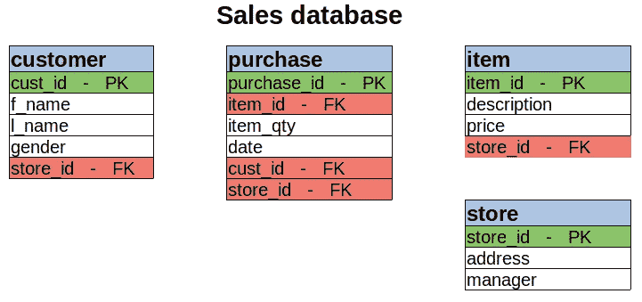

# 6 个查询示例提升您的 SQL 技能

> 原文：<https://towardsdatascience.com/6-query-examples-to-boost-your-sql-skills-25ae2c89ce40?source=collection_archive---------19----------------------->

## 聚合、连接、过滤等


SpaceX 在 [Unsplash](https://unsplash.com/s/photos/rocket?utm_source=unsplash&utm_medium=referral&utm_content=creditCopyText) 上拍摄的

SQL 是一种用于管理关系数据库中数据的编程语言。数据以表格形式显示，带有标记的行和列。关系数据库通常由许多通过共享列相关联的表组成。

在本文中，我们将通过 6 个例子来查询关系数据库。这些示例旨在解决数据分析和操作任务，包括过滤、聚合、排序和连接表。

我之前[创建了](/practical-sql-designing-and-creating-a-relational-database-de31c40b853f)一个有 4 个表的销售数据库。下图说明了数据库和表的结构。



(图片由作者提供)

标有绿色的列是主键，粉色的列代表外键。

*   主键是唯一标识每行的列。这就像熊猫数据框的索引。
*   外键是将一个表与另一个表联系起来的东西。外键包含另一个表的主键。例如，采购表中的“item_id”是一个外键。它将主键中的行存储在项目表中。

简单介绍完之后，我们开始举例。

**注**:关系数据库管理系统有很多(如 MySQL、PostgreSQL、SQL Server)。尽管所有的 SQL 语法基本相同，但可能会有一些细微的差别。在本文中，我们将使用 MySQL。

## 示例 1

项目表包含每个项目的价格、描述和商店信息。我们可能希望找到每个商店的平均商品价格。

```
mysql> select * from item limit 3;
+---------+-------------+-------+----------+
| item_id | description | price | store_id |
+---------+-------------+-------+----------+
|       1 | apple       |  2.45 |        1 |
|       2 | banana      |  3.45 |        1 |
|       3 | cereal      |  4.20 |        2 |
+---------+-------------+-------+----------+
```

我们可能希望找到每个商店的平均商品价格。

```
mysql> select store_id, avg(price)
    -> from item
    -> group by store_id;+----------+------------+
| store_id | avg(price) |
+----------+------------+
|        1 |   1.833333 |
|        2 |   3.820000 |
|        3 |   3.650000 |
+----------+------------+
```

选择 store_id 和 price 列，然后按 store_id 进行分组。在这种情况下，聚合函数“avg”是在选择列时应用的。

## 示例 2

让我们找出购买次数最多的客户的姓名。此任务需要从两个表中检索数据。

该名称是从 customer 表中选择的，购买次数是使用 purchase 表计算的。因此，我们需要连接这两个表。

```
mysql> select concat(customer.f_name," ", customer.l_name) as name,
    -> count(purchase.cust_id) as number_of_purchases
    -> from customer
    -> join purchase
    -> on customer.cust_id = purchase.cust_id
    -> group by name;+--------------+---------------------+
| name         | number_of_purchases |
+--------------+---------------------+
| Adam Gelvin  |                   2 |
| Alisha T.    |                   1 |
| Elaine Smith |                   2 |
| Jane Doe     |                   2 |
| John Doe     |                   2 |
| Robert Sam   |                   1 |
+--------------+---------------------+
```

共享列是 cust_id，所以我们用它作为连接表的条件。

## 示例 3

我们希望根据总花费金额对日期进行排序。该任务还需要从两个表中检索数据。

我们从采购表中选择日期、item_id 和 item_qty。为了计算金额，我们需要通过项目表访问的项目的价格。

```
mysql> select p.date, sum(p.item_qty * i.price) as total_amount
    -> from purchase p
    -> join item i
    -> on p.item_id = i.item_id
    -> group by p.date;+------------+--------------+
| date       | total_amount |
+------------+--------------+
| 2020-05-10 |        52.95 |
| 2020-05-11 |         8.70 |
+------------+--------------+
```

“总金额”列是通过将价格和数量相乘来计算的。SQL 的一个优点是它允许在选择列时进行这样的计算和聚合。

您可能会注意到，我们还可以为表名使用别名来缩短代码并简化输入。

采购表只包含两天的采购。我们可以通过对日期列应用 distinct 函数来确认。

```
mysql> select distinct(date) from purchase;+------------+
| date       |
+------------+
| 2020-05-10 |
| 2020-05-11 |
+------------+
```

## 实例 4

让我们做一个稍微复杂一点的例子。考虑这样一种情况，我们需要计算女性和男性的总购买量。

这项任务包括连接三个表。

*   客户表中的性别
*   采购表中的项目数量
*   项目表中的项目价格

```
mysql> select c.gender, sum(p.item_qty * i.price) as total_amount
    -> from customer c
    -> join purchase p on c.cust_id = p.cust_id
    -> join item i on p.item_id = i.item_id
    -> group by c.gender;+--------+--------------+
| gender | total_amount |
+--------+--------------+
| F      |        29.15 |
| M      |        32.50 |
+--------+--------------+
```

可以在一个查询中以类似链的方式组合多个连接操作。

## 实例 5

假设我们想找到购买冰淇淋的顾客的 id。在连接了 purchase 和 item 表之后，我们需要使用 where 子句应用一个过滤器。

```
mysql> select p.cust_id, i.description
    -> from purchase p
    -> join item i
    -> on p.item_id = i.item_id
    -> where i.description = "icecream";+---------+-------------+
| cust_id | description |
+---------+-------------+
|       4 | icecream    |
|       3 | icecream    |
|       5 | icecream    |
+---------+-------------+
```

## 实例 6

在物品表中，每个物品都有一个关联的商店。我们想找到与“谷类食品”相关的商店的经理。

解决这个任务的一种方法是连接表。另一种选择是实现嵌套的 select 语句，具体如下。

```
mysql> select manager from store
    -> where store_id = (
    -> select store_id from item
    -> where description = "cereal"
    -> );+---------+
| manager |
+---------+
| Max     |
+---------+
```

我们根据另一个 select 语句指定的条件从 store 表中选择经理。通过过滤项目表中的描述列，可以找到所需的 store_id。

## 结论

我们已经做了 6 个查询关系数据库的例子。关系数据库的关键特征之一是有许多表来存储数据。

这些表通过共享列来关联。我们需要的数据通常分布在多个表中。因此，我们经常需要连接表或使用嵌套的 select 语句。

为了高效地检索所需的数据，我们需要能够编写复杂的查询。熟悉编写这样的查询的最好方法是练习。

感谢您的阅读。如果您有任何反馈，请告诉我。