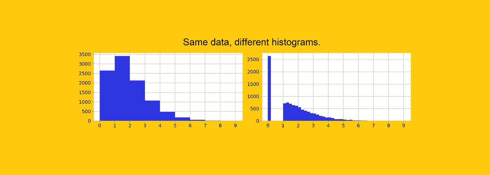
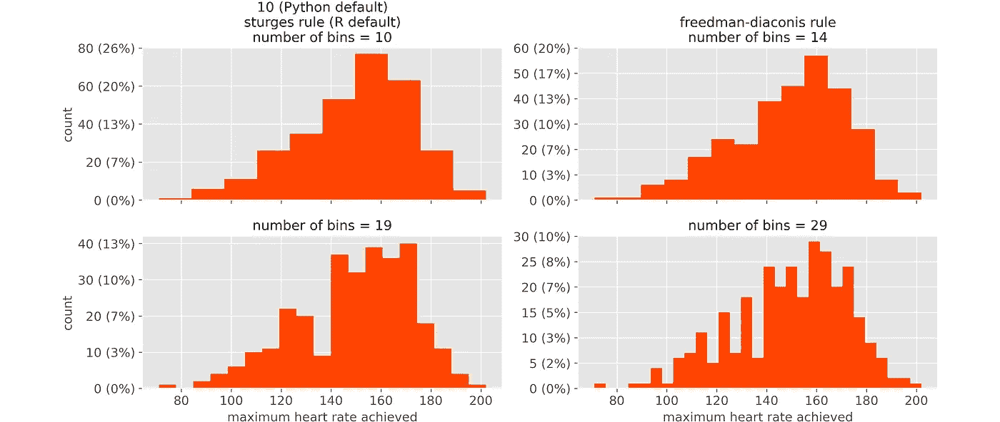
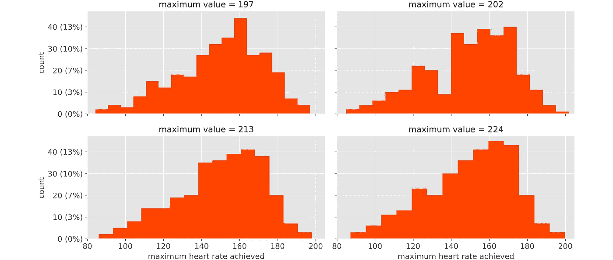
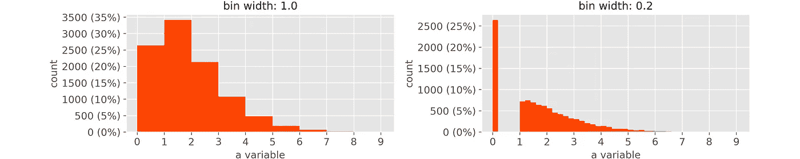
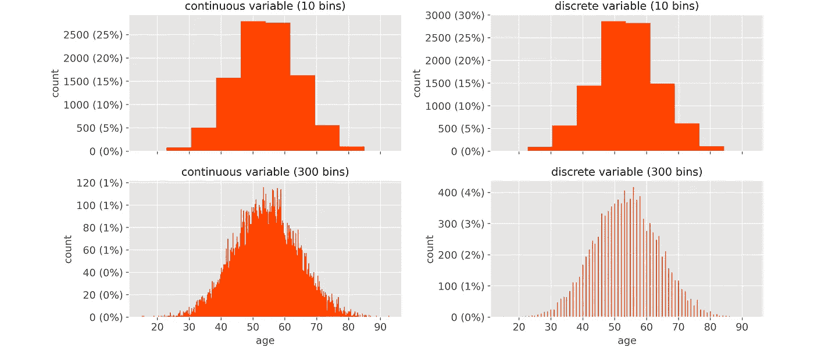
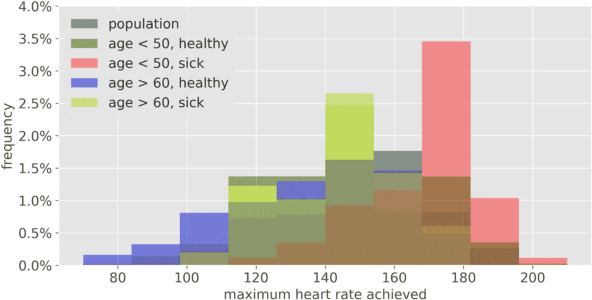
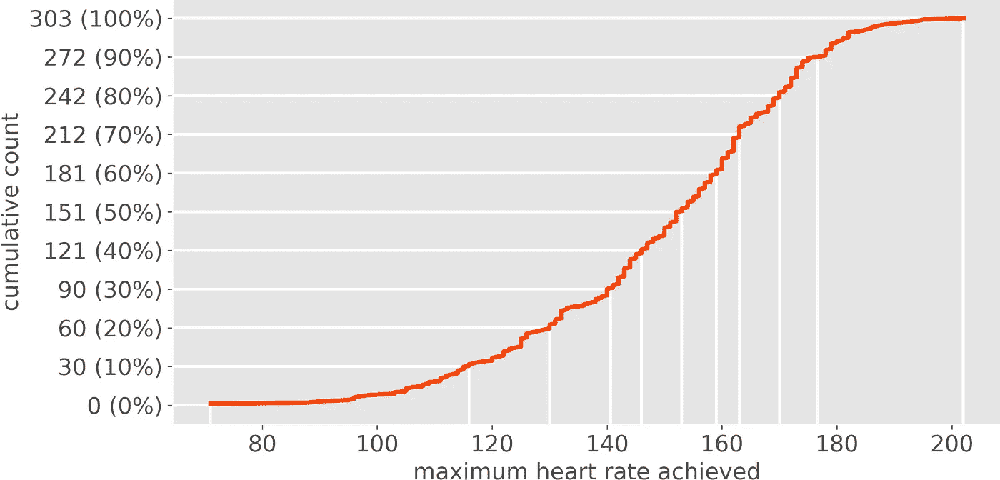
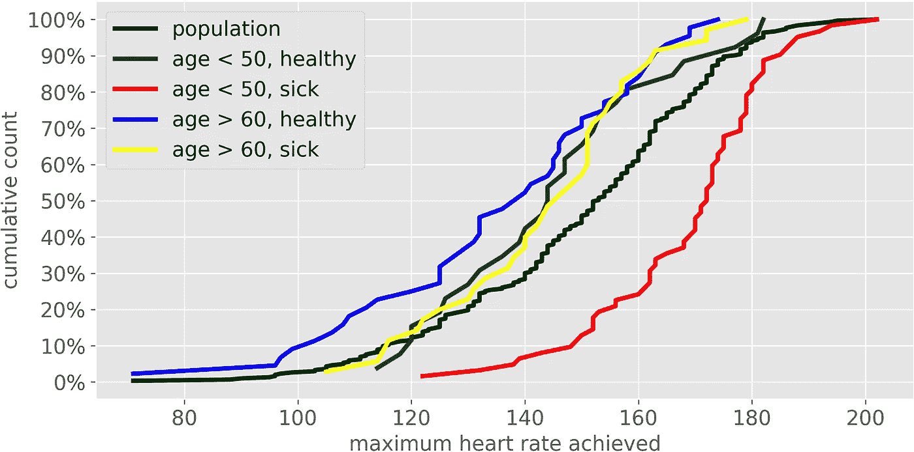

# 你应该停止使用直方图的 6 个原因(以及你应该使用哪个图)

> 原文：<https://towardsdatascience.com/6-reasons-why-you-should-stop-using-histograms-and-which-plot-you-should-use-instead-31f937a0a81c?source=collection_archive---------0----------------------->

## 直方图并非没有偏差。实际上，它们是任意的，可能会导致关于数据的错误结论。如果你想可视化一个变量，最好选择不同的绘图。



[作者图]

无论你是在与高管开会，还是在与数据狂人开会，你都可以确定一件事:**在某个时刻，会有一个直方图。**

不难看出为什么。直方图非常直观:任何人一看就明白。此外，它们是现实的无偏见的表现，对吗？没那么快。

> 直方图可能会误导人，得出错误的结论——即使是简单的数据！

在这篇文章中，借助于一些例子，我们将讨论为什么在可视化数据时，直方图不是最佳选择的 6 个原因:

1.  **这(太)取决于箱子的数量。**
2.  **这(太)取决于变量的最大值和最小值。**
3.  **不允许检测相关值。**
4.  **它不允许区分连续变量和离散变量。**
5.  **这使得比较分布变得很困难。**
6.  **如果没有内存中的所有数据，很难做出。**

> “好吧，我明白了:直方图并不完美。但是我有选择吗？”是的，你有！

在文章的最后，我将推荐一个不同的情节——称为 CDP——它克服了这些缺陷。

# 那么，直方图有什么问题呢？

## 1.这(太)取决于箱的数量。

要绘制直方图，您必须首先决定间隔的数量，也称为区间。有许多不同的经验法则可以做到这一点(见[本页](https://numpy.org/devdocs/reference/generated/numpy.histogram_bin_edges.html)的概述)。但是这个选择有多关键呢？让我们来看一些真实的数据，看看直方图是如何根据仓的数量而变化的。

变量是 303 个人在一些身体活动中达到的最大心率(每分钟心跳数)(数据取自 UCI 心脏病数据集:[来源](https://archive.ics.uci.edu/ml/datasets/heart+disease))。



当柱的数量改变时，直方图如何改变。[作者图]

观察左上角的图(在 Python 和 R 中默认情况下会得到这个图)，我们会有一个很好的单峰分布(模式)的印象。然而，如果我们看其他直方图，我们会得到一个完全不同的画面。直方图会导致矛盾的结论。

## **2。这(太)取决于变量的最大值和最小值。**

即使设置了容器的数量，间隔也取决于变量的最小值和最大值的位置。两者之一稍有变化就够了，所有音程都变。换句话说，直方图并不健壮。

例如，让我们尝试改变变量的最大值，而箱的数量保持不变。



当最大值改变时直方图如何变化。[作者图]

单个值不一样，整个剧情就不一样了。这是一个不受欢迎的属性，因为我们感兴趣的是整体分布:单个值应该没有什么区别！

## 3.它不允许检测相关值。

一般来说，当一个变量包含一些频繁值时，我们需要注意它。然而，直方图不允许这样做，因为它们是基于区间的，而区间“隐藏”了单个值。

一个经典的例子是缺失值被大量归入 0。例如，让我们看一个由 1 万个数据点组成的变量，其中 26%是 0。



相同的数据，不同的仓位宽度。在左边的图中，不可能检测到高浓度的零。[作者图]

左边的图是 Python 中默认的结果。通过观察它，你会相信这个变量有一个“平滑”的行为，你甚至感觉不到零的集中。

右边的图是通过缩小面元获得的，并且给出了现实的更清晰的表示。但关键是，无论你如何缩小区间，你永远无法确定第一个区间是否只包含 0 或其他值。

## 4.它不允许区分连续变量和离散变量。

一般来说，我们想知道一个数值变量是连续的还是离散的。给定一个直方图，实际上是不可能分辨出来的。

让我们拿可变的*年龄*。您可能会发现*年龄=* 49 岁(当年龄被截断时)，或者*年龄* = 49.828884325804246 岁(当年龄被计算为自出生以来的天数除以 365.25 时)。第一个是离散变量，而第二个是连续变量。



左边是一个连续变量。右边是一个离散变量。然而，在上面的图中，它们看起来是一样的。[作者图]

左边的是连续的，右边的是离散的。然而，在上面的图中(Python 的默认设置),你看不出两者有什么不同:它们看起来完全一样。

## 5.这使得比较分布变得很困难。

通常有必要在不同的集群上比较相同的变量。例如，关于上面的 UCI 心脏病数据，我们可能想要比较:

*   全体人口(作为参考)
*   50 岁以下的人&患有心脏病
*   50 岁以下的人&没有心脏病
*   60 岁以上的人&患有心脏病
*   60 岁以上的人&没有心脏病

这是我们将得到的结果:



比较直方图。[作者图]

直方图是基于面积的，当我们试图进行比较时，面积最终会重叠，使我们的工作无法进行。

## 6.如果你没有把所有的数据都存在内存里，就很难做出。

如果你有 Excel、R 或 Python 中的所有数据，很容易制作一个直方图:在 Excel 中你只需要点击直方图的图标，在 R 中执行命令`hist(x)`，在 Python 中`plt.hist(x)`。

但是假设您的数据存储在数据库中。你不想下载所有的数据只是为了做一个直方图，对不对？基本上，你所需要的只是一个表格，其中包含了每个区间的极值和观测值的计数。大概是这样的:

```
**| INTERVAL_LEFT | INTERVAL_RIGHT | COUNT         |
|---------------|----------------|---------------|
| 75.0          | 87.0           | 31            |
| 87.0          | 99.0           | 52            |
| 99.0          | 111.0          | 76            |
| ...           | ...            | ...           |**
```

但是通过 SQL 查询获得它并不像看起来那么简单。例如，在谷歌的大查询中，代码将是:

```
WITH**STATS** AS (
  SELECT 
    COUNT(*) AS **N**,
    APPROX_QUANTILES(**VARIABLE_NAME**, 4) AS **QUARTILES**
  FROM
    **TABLE_NAME**
),**BIN_WIDTH** AS (
  SELECT
    *-- freedman-diaconis formula for calculating the bin width*
    (**QUARTILES**[OFFSET(4)] — **QUARTILES**[OFFSET(0)]) / ROUND((**QUARTILES**[OFFSET(4)] — **QUARTILES**[OFFSET(0)]) / (2 * (**QUARTILES**[OFFSET(3)] — **QUARTILES**[OFFSET(1)]) / POW(**N**, 1/3)) + .5) AS **FD**
  FROM 
    **STATS**
),**HIST** AS (
  SELECT 
    FLOOR((**TABLE_NAME**.**VARIABLE_NAME** — **STATS**.**QUARTILES**[OFFSET(0)]) / **BIN_WIDTH**.**FD**) AS **INTERVAL_ID**,
    COUNT(*) AS **COUNT**
  FROM 
    **TABLE_NAME**,
    **STATS**,
    **BIN_WIDTH**
  GROUP BY 
    1
)SELECT 
  **STATS**.**QUARTILES**[OFFSET(0)] + **BIN_WIDTH**.**FD** * **HIST**.**INTERVAL_ID** AS **INTERVAL_LEFT**,
  **STATS**.**QUARTILES**[OFFSET(0)] + **BIN_WIDTH**.**FD** * (**HIST**.**INTERVAL_ID** + 1) AS **INTERVAL_RIGHT**,
  **HIST**.**COUNT**
FROM 
  **HIST**, 
  **STATS**, 
  **BIN_WIDTH**
```

有点繁琐，不是吗？

# 另一种方法是:累积分布图

在看到直方图不是理想选择的 6 个原因后，一个自然的问题是:**“我有其他选择吗？”**好消息:确实存在一个更好的选择，叫做“**累积分布图**”(**CDP**)。我知道这个名字不太好记，但我保证它是值得的。

**累积分布图是一个变量的分位数图**。换句话说，CDP 上的每个点都显示:

*   在 *x* 轴上:变量的原始值(如直方图所示)；
*   在 *y* 轴上:有多少观察值相同或更少。

让我们看一个常见变量的例子:最大心率。



最大心率的累积分布图。[作者图]

我们取坐标为 *x* = 140， *y* = 90 (30%)的点。在横轴上你可以看到变量的值:每分钟 140 次心跳。在纵轴上，您可以看到心率等于或低于 140 的观察计数(在本例中为 90 人，这意味着样本的 30%)。因此，我们样本中 30%的人每分钟心跳不超过 140 次。

**一个图告诉你有多少观察值“等于或低于”一个给定的水平有什么意义？为什么不干脆“平等”？**因为，否则，结果将取决于变量的单个值。这是行不通的，因为每个值只有很少的观察值(如果变量是连续的，通常只有一个)。相反，**CDP 依赖分位数，更稳定，更有意义，更容易阅读。**

此外，CDP 更有用。想想看，经常需要回答“140 到 160 之间的有多少？”，或者“180 以上的有几个？”。鼻子底下有个 CDP，可以马上回答。对于直方图，这是不可能的。

CDP 解决了我们在上面看到的所有问题。事实上，与直方图相比:

1.**不需要任何用户选择。**给定一些数据，只有**一个可能的 CDP** 。

2.**它不受离群值的影响。**极值对 CDP 没有影响，因为分位数不会改变。

3.**允许检测相关值。**如果在某个特定值上存在数据点的集中，这是显而易见的，因为在该值的对应部分会有一个垂直段。

4.**它允许一眼就认出一个离散变量。**如果只存在一堆可能的值(即变量是离散的),这是显而易见的，因为曲线是阶梯状的。

5.**比较分布很容易。**在同一个图上比较两个或多个分布很容易，因为它们只是曲线，而不是面积。此外， *y* 轴的范围始终在 0 到 100%之间，这使得比较更加简单。例如，这是我们在上面看到的例子:



用 CDP 比较分布。[作者图]

6.**如果你的内存中没有所有数据，也很容易制作。**您所需要的只是分位数，可以在 SQL 中轻松获得:

```
SELECT 
  COUNT(*) AS **N**,
  APPROX_QUANTILES(**VARIABLE_NAME**, 100) AS **PERCENTILES**
FROM
  **TABLE_NAME**
```

# 如何在 Excel、R、Python 中制作累积分布图

在 Excel 中，您需要构建两列。第一个有 101 个数字从 0 到 1 均匀分布。第二列应该包含可以通过公式得到的百分位数:`=PERCENTILE(*DATA*, *FRAC)*`，其中*数据*是包含数据的向量， *FRAC* 是第一列:0.00，0.01，0.02，0.03，…，0.98，0.99，1。然后，你只需要绘制两列，注意把变量值放在*x*-轴上。

在 R 中，它就像:

```
**plot(ecdf(data))**
```

在 Python 中:

```
**from statsmodels.distributions.empirical_distribution import ECDF
import matplotlib.pyplot as plt****ecdf = ECDF(data)
plt.plot(ecdf.x, ecdf.y)**
```

感谢您的阅读！我希望这篇文章对你有用。

我感谢反馈和建设性的批评。如果你想谈论这篇文章或其他相关话题，你可以发短信给我[我的 Linkedin 联系人](https://www.linkedin.com/in/samuelemazzanti/)。