# 优化 Spark 作业的 6 条建议

> 原文：<https://towardsdatascience.com/6-recommendations-for-optimizing-a-spark-job-5899ec269b4b?source=collection_archive---------0----------------------->

## 六项建议的指导方针，可快速优化您的 Spark 工作

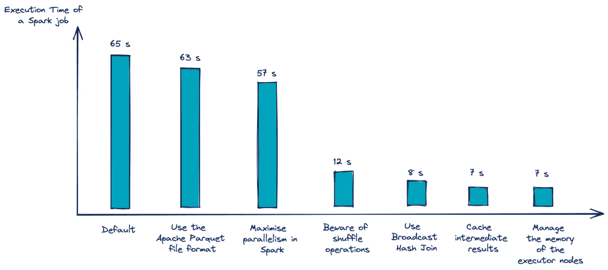

*用例的省时优化示例。作者图片*

[*Spark*](https://spark.apache.org/) 是目前**处理大数据集**的必备工具。这项技术已经成为数据工程中许多商业应用的首选。这一势头得到了**托管服务**的支持，如 [*数据块*](https://databricks.com/spark/about) ，它们降低了与购买和维护分布式计算集群相关的部分成本。最著名的云提供商也提供 *Spark* 集成服务( [AWS EMR](https://aws.amazon.com/emr/features/spark/?nc1=h_ls) 、 [Azure HDInsight](https://azure.microsoft.com/en-gb/services/hdinsight/) 、 [GCP Dataproc](https://cloud.google.com/dataproc) )。

Spark 通常用于对数据进行转换，在大多数情况下是结构化的。它在两种情况下特别有用。**当要处理的数据对于可用的计算和内存资源来说太大时**。这就是我们所说的*大数据*现象。最后，当一个人想通过使用同一网络中的**几台机器**来加速计算**时，这也是一种选择。在这两种情况下，主要关心的是优化**火花作业**的计算时间。**

为了应对这个问题，我们经常增加分配给一个*计算集群*的资源。从云提供商那里租赁计算能力很容易，这鼓励了这种趋势。

**本文**的目的是提出一个在资源有限的情况下优化 Spark 作业的**策略。事实上，在使用团簇弹性之前，我们可以影响许多**火花配置**。因此，这种策略可以先进行测试。**

为了**避免对最佳配置设置的彻底搜索**，这自然是非常昂贵的，这篇文章将展示可行的解决方案，以最大化我们减少计算时间的机会。每一步都将通过一个尽可能合理的**建议来实现**。

提出的策略被认为是贪婪的，也就是说，我们在过程的每个阶段都做出最佳选择，而不会走回头路。这种方法由六条建议的**指南来说明。**

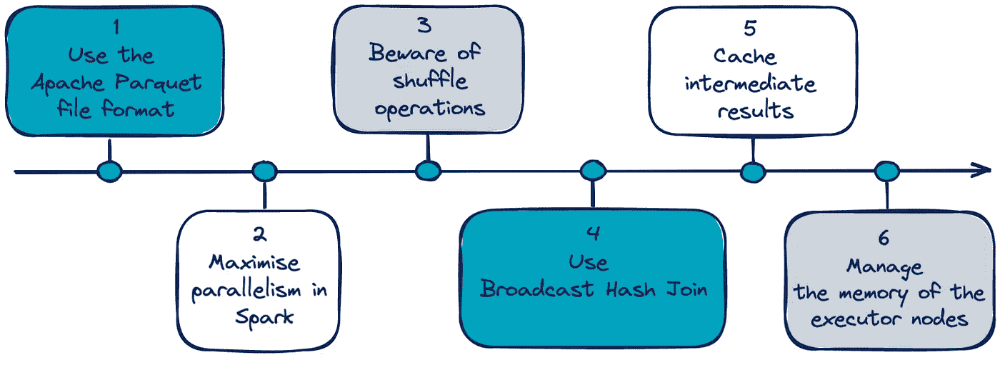

*指导方针的六条建议。作者图片*

目的是提供一个**清晰的方法，易于在各种用例上测试**。然后，有必要在一个可共享的示例上测试这些建议，并给出一个 ***模板代码*** ，允许在另一个 *Spark 作业*上重复这个实验。

**在玩具用例上的应用**

为了评估本文中提出的优化策略，我们使用了一个玩具用例来设计一个 Spark 作业。这个过程根据天气和人口变量对法国城市进行分组。这个任务在机器学习中叫做[无监督分类或者聚类](https://en.wikipedia.org/wiki/Cluster_analysis)。该示例说明了 Spark 流水线的共同特征，即数据预处理阶段(加载、清理、不同源的合并、特征工程)、对*机器学习*模型参数的估计，以及最终将结果存储到磁盘。关于这个实验的更多细节可以在[代码库](https://github.com/sgrah-oss/6-recommendations-for-optimizing-a-spark-job)上找到。

通过一步一步地遵循本文中详细介绍的建议，我们可以观察优化提示和技巧对下图的影响。

*作者图片*

找到的配置设置很可能是一个**次优解决方案**。然而，它提供了一个比穷举搜索更快的选择，尤其是在大数据处理环境中。

# 关于 Spark 和一些有用概念的快速提醒

**三言两语擦出火花**

Apache Spark 是用于大规模数据处理的**分析引擎**。它提供了一个接口，用于通过隐式**数据并行**和**容错**对整个集群进行编程，并将**中间结果存储在存储器** (RAM 和磁盘)中。

Spark 的核心处理广泛使用了**函数编程**来解决*大数据*中的放大问题。因此，**源代码**主要在 **Scala** 中编码是很自然的。

然而，Spark 也在更高的层次上提供了 Python、Java、R 和 SQL 中的**API，在大多数情况下提供了几乎等同的可能性而没有任何性能损失(例如除了 [UDF](https://docs.databricks.com/spark/latest/spark-sql/udf-python.html) 函数)。该项目是根据 Apache 2.0** 许可的**开源**和**。**

下图描述了分布式计算集群中 *Spark* 处理的经典操作。

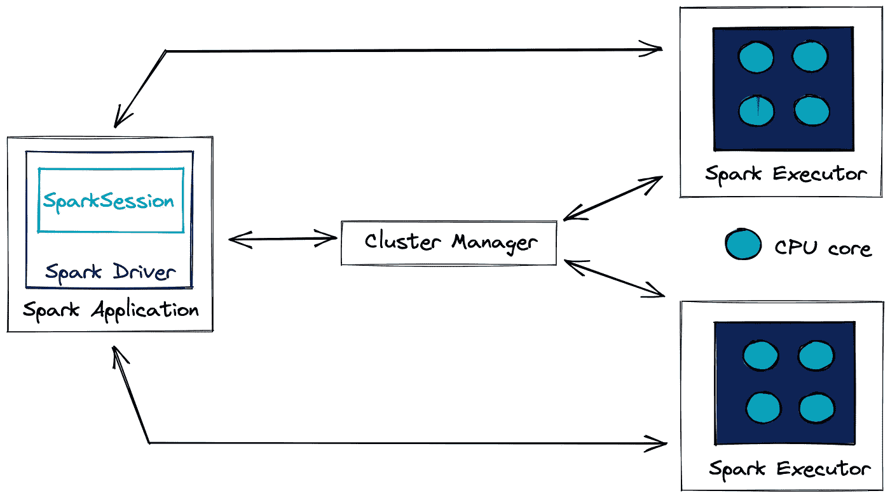

*作者图片*

*火花驱动器*，也称为主节点，**协调处理的执行及其在*火花执行器*(也称为*从节点*)之间的分配**。驱动程序不一定由计算集群托管，它可以是一个外部客户端。*集群管理器*实时管理集群的可用资源。它比 Spark 应用程序有更好的概述，如果可用，它将请求的资源分配给 Spark 驱动程序。在本文中，将不讨论集群管理器的使用。

**分解火花作业**

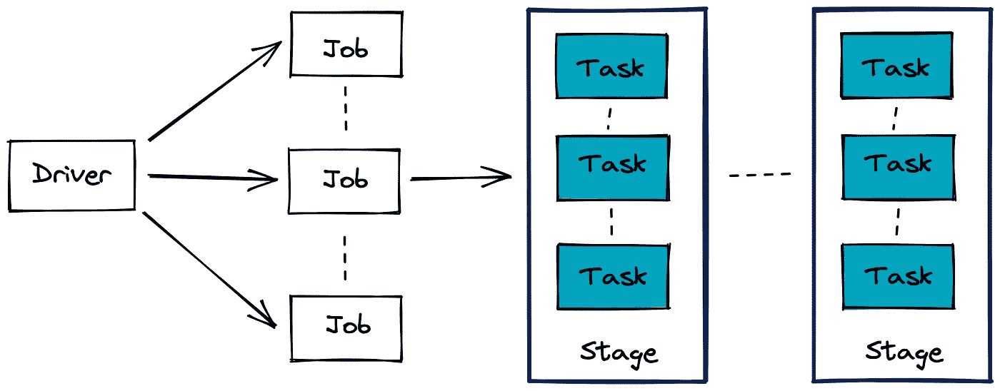

*作者图片*

Spark 作业是由**任务**组成的一系列**阶段**。更准确地说，它可以用一个**有向无环图(DAG)** 来表示。 *Spark 作业*的一个例子是 [*提取转换日志(ETL)*](https://en.wikipedia.org/wiki/Extract,_transform,_load) 数据处理流水线。*阶段*通常由执行节点之间的网络中的数据传输来界定，例如两个表之间的连接操作。最后，**任务是 Spark 中分配给数据分区的执行单元**。

**懒评**

*懒评*是大数据处理常用的一招。事实上，当数据超过内存资源时，需要一种策略来优化计算。*惰性评估*表示仅当*火花动作*运行时触发处理，而不是*火花转换*。

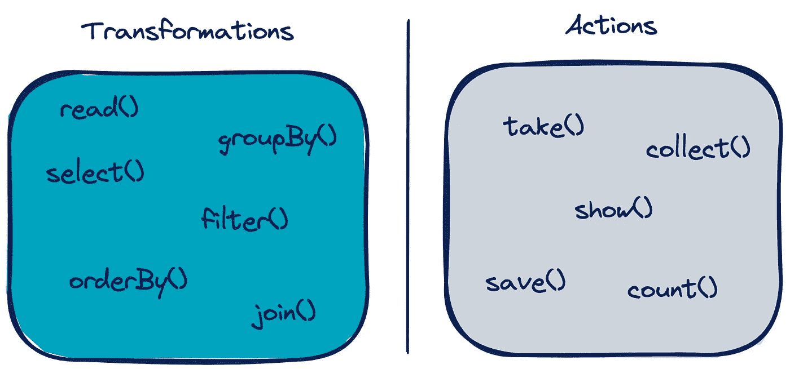

*火花动作和转换的例子。作者图片*

**在调用**动作之前，不会执行转换。这允许 Spark 准备一个[逻辑和物理](https://databricks.com/blog/2015/04/13/deep-dive-into-spark-sqls-catalyst-optimizer.html)执行计划来有效地执行动作。

让我们举一个例子来理解为什么这很有用。在几次转换后，调用一个动作将一个*数据帧*的第一行返回给*驱动器*。然后，Spark 可以通过管理内存和计算来重新组织之前转换的执行计划，从而更快地获得第一个转换后的行。事实上，只有包含该*数据帧*第一行的数据的*分区*需要被处理。这大大减少了不必要的内存和计算处理。

**宽窄变换**

*火花变换*分为两类:**宽**和**窄**变换。这两种类型的区别在于需要在执行节点之间重新分配网络中的数据分区。这一重大事件在 Spark 术语中被称为**洗牌**。

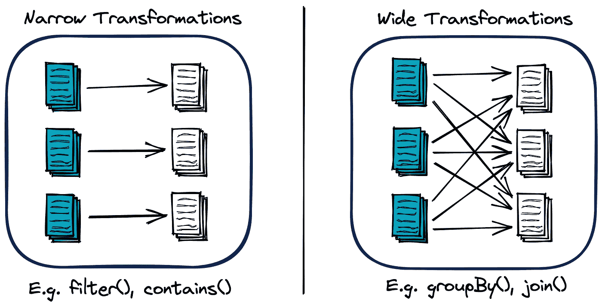

*作者图片*

**需要*洗牌*的宽变换**自然是**最贵的**。处理时间会更长，这取决于集群中交换的数据的大小和网络延迟。

# 如何修改 Spark 作业的配置设置？

有三种方法可以修改 Spark 作业的配置:

*   通过使用 Spark 根文件夹中的**配置文件**。例如，我们可以自定义以下模板文件:
    *conf/spark-defaults . conf . template
    conf/log4j . properties . template
    conf/Spark-env . sh . template* 这些更改会影响 Spark 集群及其所有应用程序。
*   使用**命令行**使用 **— conf** 参数
    例如:

*   直接在**中输入火花应用代码** Ex:

*   首先考虑配置文件中定义的值。接下来，参数作为参数传递给 *spark-submit* 。最后是那些直接在应用程序代码中配置的。

这些配置参数在 *Spark GUI* 的*环境选项卡*中是只读的。

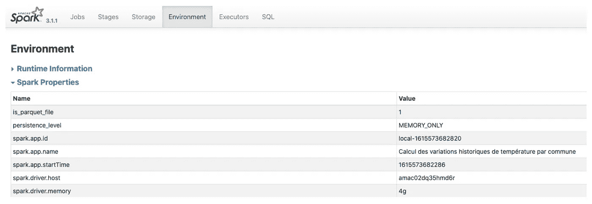

*作者图片*

在与本文相关的代码中，参数直接在 Spark 应用程序代码中定义。

# 预备步骤:衡量优化是否必要

在项目中，优化流程是一个耗时且成本高昂的步骤。必须事先说明理由。
通常，约束与用例相关联，并在与涉众的**服务水平协议** ( [**SLA**](https://fr.wikipedia.org/wiki/Service-level_agreement) )中定义。我们监控相关指标(例如处理时间、分配的内存)，同时检查它们是否符合 SLA。
估计优化应用程序并达到目标所需的时间并不容易。它通常需要软件工程方面的经验。本文并没有假装这样做，而是旨在建议可以快速使用的行动。
另一方面，这些建议提供了需要改进的地方。从一个人治疗的*简介*开始可能会很有趣。这将针对最相关的建议进行触发。

# 建议 1:使用 Apache Parquet 文件格式

**Apache** **Parquet 格式**正式成为**面向列的存储**。其实更多的是行列存储之间的[混合格式](https://youtu.be/1j8SdS7s_NY?t=645) **。用于**表格数据**。同一列中的数据是连续存储的。**

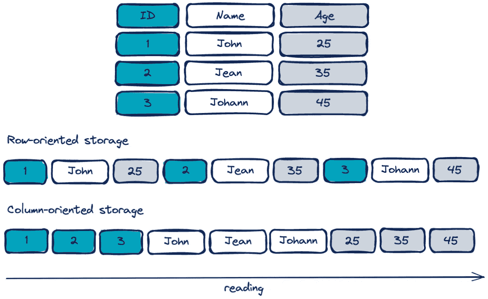

*作者图片*

当对列的子集和大型的*数据框架*执行查询(*转换*)时，这种格式特别合适。这是因为它**仅将与所需列相关联的数据加载到存储器**中。
此外，由于压缩**方案**和**编码**根据类型化而特定于每一列的**，因此它改善了这些二进制文件的读/写及其在磁盘上的大小。
这些优势使其成为 *CSV* 格式的一个非常有趣的替代方案。这是 Spark** 推荐的**格式，也是写的默认格式。
如果 Spark 与 [*数据块*](https://databricks.com/spark/about) 一起使用，另一个特别有趣的格式是 delta 格式，它提供了[自动优化工具](https://docs.databricks.com/delta/quick-start.html#optimize-a-table)。在本文中，我们将重点介绍 Spark 的开源版本。然而，强烈建议感兴趣的读者探索 Spark 与 Databricks 生态系统的集成。**

# 建议 2:最大化 Spark 中的并行性

Spark 的效率基于其大规模并行处理多个任务的能力。因此，我们越是促进任务的分解，任务完成得就越快。这就是为什么**优化 Spark 作业通常意味着并行读取和处理尽可能多的数据**。而要实现这个目标，就需要**把一个数据集分割成几个分区**。

对*数据集*进行分区是一种将数据排列成磁盘上连续数据块的可配置、可读子集的方式。然后，可以独立并行地读取和处理这些分区。正是这种独立性使得海量数据处理成为可能。理想情况下，Spark 为每个任务和每个 CPU 内核组织一个线程。每个任务都与一个分区相关。因此，第一直觉是配置至少与可用 CPU 核心数量一样多的分区。在执行 Spark 作业的大部分时间里，所有内核都应该被占用。如果它们中的一个在任何时候可用，它应该能够处理与剩余分区相关联的作业。目标是通过将 Spark 作业阶段分成大量任务来避免瓶颈。这种流动性在分布式计算集群中至关重要。下图说明了网络中机器之间的这种划分。

*作者图片*

可以创建分区:

*   读取数据时通过设置***spark . SQL . files . maxpartitionbytes***参数(默认为 128 MB)。
    一个好的情况是数据已经存储在磁盘的几个分区中。例如， *parquet 格式的数据集*，其文件夹包含大小在 100 到 150 MB 之间的数据分区文件。
*   直接在 Spark 应用程序代码中使用 Dataframe API。一个例子:

这最后一种方法*联合*减少了分区的数量，同时避免了网络中的*洗牌*。

人们可能想通过降低参数***spark . SQL . files . maxpartitionbytes***的值来增加分区的数量。但是，这种选择会导致**小文件问题**。由于文件系统执行的操作(例如，打开、关闭、列出文件)，会导致 *I/O* 性能下降，这种情况通常会随着像 *HDFS* 这样的分布式文件系统而加剧。如果分区数量太大，也会出现调度问题。

在实践中，这个参数应该根据可用资源根据经验来定义。

# 建议 3:小心洗牌操作

在 *Spark* 中有一种特殊类型的分区叫做**洗牌分区**。这些分区是在涉及混洗的作业阶段创建的，即当执行**宽转换**(例如 groupBy()、join())时。这些分区的设置**会影响网络和读/写磁盘资源**。

可以修改***spark . SQL . shuffle . partitions***的值来控制分区的数量。默认情况下，该值设置为 200，对于某些处理来说，这个值可能太高了，会导致执行节点之间在网络中交换太多的分区。该参数应根据数据的大小进行调整。直觉可能是以至少等于集群中 CPU 核心数量的值开始**。**

Spark 将混洗操作的中间结果存储在执行器机器的本地磁盘上，因此磁盘的质量，尤其是 I/O 质量非常重要。例如，使用 SSD 磁盘将显著提高此类转换的性能。

下表描述了我们也可以影响的主要参数。

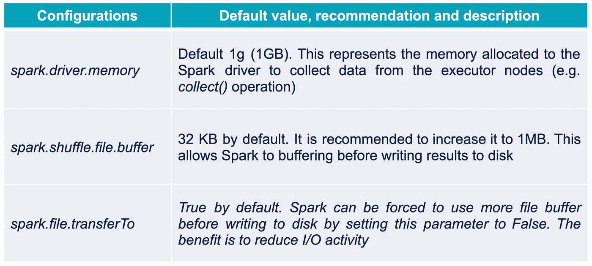

# 建议 4:使用广播散列连接

几个*数据帧*之间的连接是一个常见的操作。在分布式环境中，执行节点之间在网络中交换大量数据来执行连接。根据表的大小，这种交换会导致网络延迟，从而降低处理速度。Spark 提供了几种连接策略来优化这种操作。其中有一个如果可以选择的话特别有意思:**广播哈希加入(BHJ)** 。

当合并的*数据帧*中的**数据帧“足够”小，可以在所有执行节点**(广播操作)的内存中复制时，这种技术是合适的。下图说明了这种策略的工作原理。

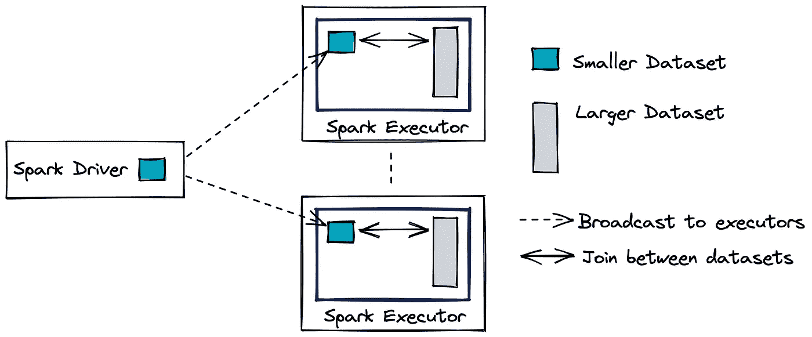

*作者图片*

第二个*数据帧*被传统地分解成分布在集群节点中的分区。通过复制最小的表，**除了预先广播该表之外，连接不再需要集群中的任何重要数据交换**。这种策略极大地提高了连接的速度。要修改的 Spark 配置参数是***Spark . SQL . autobroadcasthashjoin***。默认值为 10 MB，即如果两个表中的一个小于该大小，则选择该方法。如果有足够的内存可用，那么增加这个值或将它设置为-1 以强制 Spark 使用它可能会非常有用。

# 建议 5:缓存中间结果

为了优化计算和管理内存资源，Spark 使用*惰性评估*和 *DAG* 来描述作业。这提供了在动作之前快速**重新计算步骤的可能性，如果必要的话**，因此只执行 DAG 的一部分。为了充分利用这一功能，非常明智的做法是**存储昂贵的中间结果**，如果有几个操作在 DAG 的下游使用它们的话。实际上，如果一个动作正在运行，其计算可以基于这些中间结果，因此在该动作之前仅重放 DAG 的子部分。

让我们以下面的 DAG 为例:

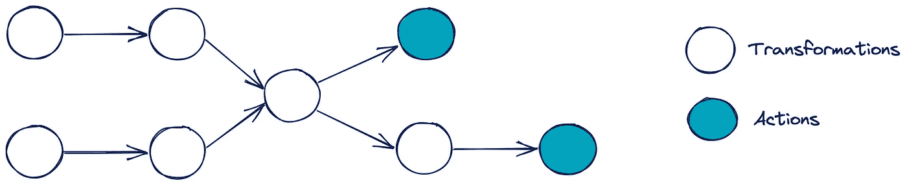

*作者图片*

为了获得这两个动作的结果，在下面的两个 Dag 中描述了处理。

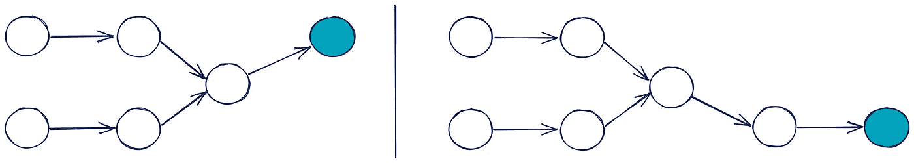

*作者图片*

为了加速执行，可以决定缓存中间结果(例如连接的结果)。

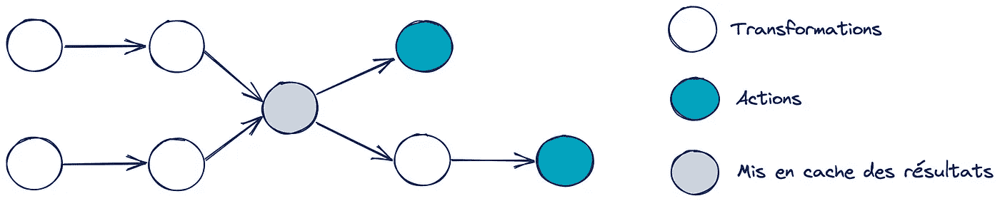

*作者图片*

现在简化了第二个动作的处理。请注意，在第一次操作期间，结果尚未存储在内存中。

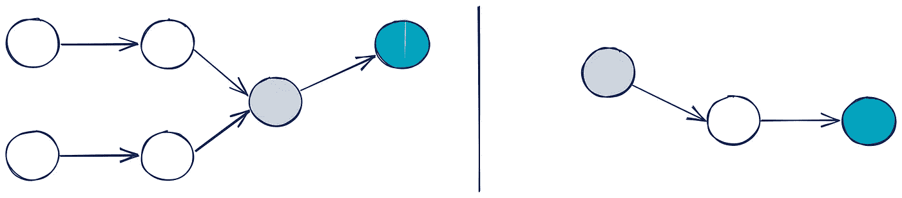

*作者图片*

如果这种缓存可以加速作业的执行，那么当这些结果被写入内存和/或磁盘时，我们就要付出**的代价。应该在处理流水线的不同位置测试节省的总时间是否超过成本。当 DAG 上有多条路径时，这一点尤其重要。**

缓存两列模拟表节省时间的示例:

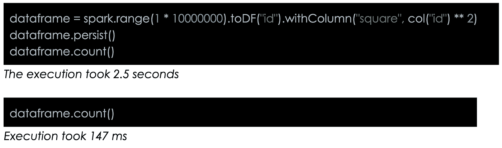

> 注意:缓存和任何*火花转换*一样，是在运行*动作*时执行的。**如果该动作的计算仅涉及数据的一个子部分，则仅存储该子部分的中间结果**。在前面的示例中，如果调用了收集第一行的 *take(1)* *操作*，那么只有包含第一行的分区会被缓存。

可以使用以下命令缓存表:

下表描述了不同的缓存选项:

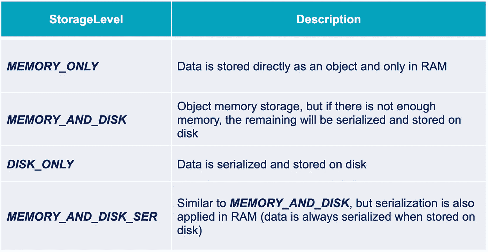

选项的完整列表可在[此处](https://spark.apache.org/docs/latest/rdd-programming-guide.html#rdd-persistence)获得。

# 建议 6:管理执行器节点的内存

Spark 执行器的内存分解如下:

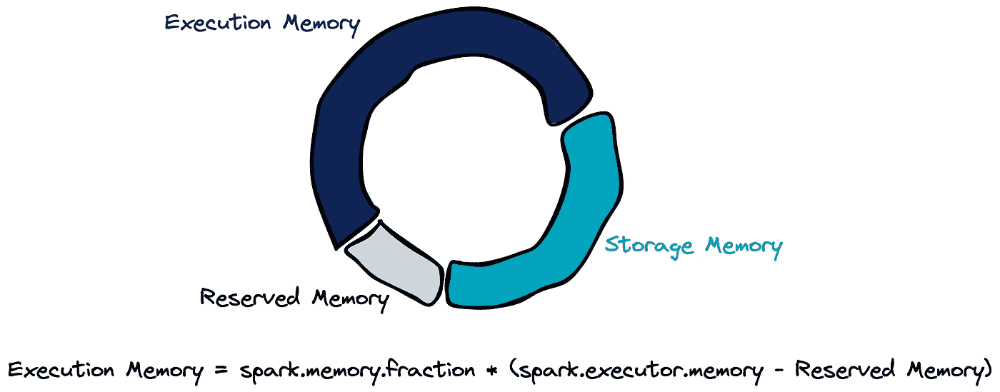

*作者图片*

默认情况下，***spark . memory . fraction***参数设置为 0.6。这意味着一旦保留的内存被移除，60%的内存被分配用于执行，40%用于存储。默认情况下这是 300 MB，用于防止*内存不足(OOM)* 错误。

我们可以修改以下两个参数:

*   ***spark . executor . memory***
*   **spark . memory . fraction**

# 结论

在本文中，我们详细介绍了一个优化 *Spark 作业*的策略。其主要目标是**为那些希望优化流程但时间有限的人提供一个框架**。贪婪方法的六个建议的指导方针旨在最大化减少计算时间的可能性。下图通过关联每个阶段的建议总结了建议的方法。

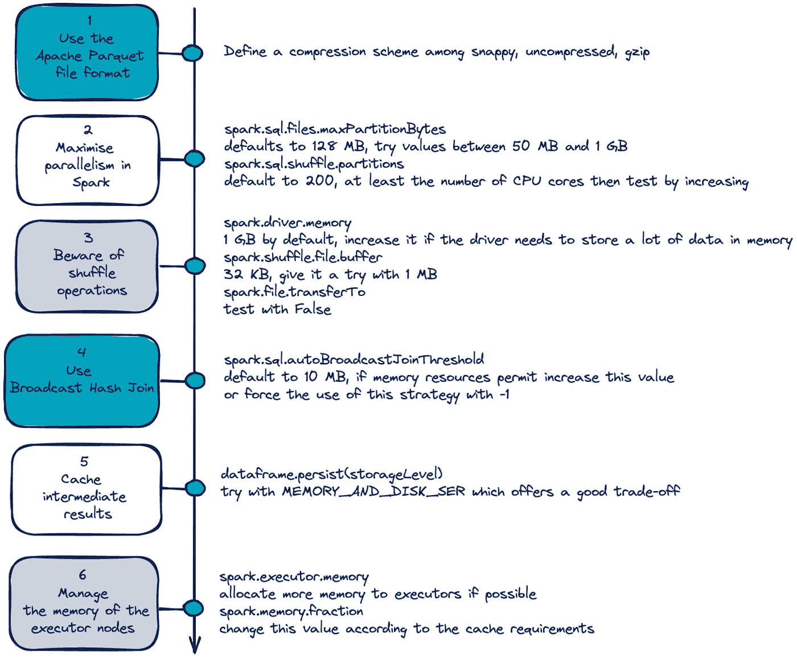

*作者图片*

这个过程中每一步的价值都是根据 Spark 的操作来解释的。事实上，即使对配置提出了一些建议，理解它在引擎盖下如何工作也是至关重要的。每个用例都有自己的特点，没有一种方法是通用的。在这方面，本文介绍了 Spark 中的优化。

**更进一步**

*   本文旨在避免在集群中系统地使用动态资源分配来加速处理。尽管如此，研究它当然是有趣的。Spark 提供了以下参数来根据工作负载管理集群的弹性:
    *spark . dynamic allocation . enabled，
    spark . dynamic allocation . minexecutors，spark . dynamic allocation . schedulerbacklogtimeout，spark . dynamic allocation . max executors，spark . dynamic allocation . executorid time out*
*   Spark 中还有很多其他的表连接策略:[https://databricks . com/session/optimizing-Apache-Spark-SQL-joins](https://databricks.com/fr/session/optimizing-apache-spark-sql-joins)
*   当然，Spark 非常重视优化其处理。为了更深入地了解内部工作和当前项目，以下链接可能会有用:[钨项目](https://databricks.com/blog/2015/04/28/project-tungsten-bringing-spark-closer-to-bare-metal.html)、 [Catalyst 优化器](https://databricks.com/blog/2015/04/13/deep-dive-into-spark-sqls-catalyst-optimizer.html)和[自适应查询执行](https://medium.com/swlh/spark-sql-adaptive-query-execution-3adc68973c91)(3.0 版本中的新特性)

感谢阅读；)