# 6 SQL 窗口函数编码排序问题

> 原文：<https://towardsdatascience.com/6-sql-window-functions-coding-problems-on-ranking-interview-countdown-p1-9be0ccf66453?source=collection_archive---------3----------------------->

## 面试倒计时 P1:SQL 面试快到了，你正在寻找一些有挑战性的练习来测试你的准备情况？你来对地方了！

特里斯坦·加塞特在 [Unsplash](https://unsplash.com?utm_source=medium&utm_medium=referral) 上拍摄的照片

*> > >还不是中等会员？考虑与我的* [***推荐链接***](https://anbento4.medium.com/membership) *注册，以获得 Medium 提供的一切服务，费用低至每月 5 美元***！**

# *你的面试倒计时开始了吗？*

*恭喜你！如果你正在阅读这篇文章，你可能已经通过了第一轮筛选面试，并被邀请进入下一步:*一轮 SQL 编码*。*

*无论你的下一次面试是在 24 小时后还是 2 周后，有一件事是肯定的:当你通过解决实际的练习来尽最大努力复习最常见的 SQL 主题时，时间正在流逝。*

*为了帮助你测试你的知识，并意识到 SQL 窗口函数的流行程度，下面我分享了一些具有挑战性的排名练习，通过重新创建你与技术面试官的互动。*

> *这一切都是巧合，但我想不起在我的任何一次 SQL 面试中，没有人要求我使用窗口函数来解决问题。*

*称之为巧合吧，但我想不起在我的任何一次 SQL 面试中，没有人要求我使用窗口函数解决问题。我建议您特别注意 **RANK()** 、 **DENSE_RANK()** 和 **ROW_NUMBER():** *这些函数可用于对特定窗口内的数据进行排名，或者，如果您愿意，还可以生成组内排名指数*。*

*接下来的所有编码问题都是对 SQL 挑战的细微重新解释，这些挑战来自于**[**StrataScratch**](https://platform.stratascratch.com/coding?via=antonello)，这是一个优秀的平台，专门为希望从事数据科学或数据工程职业的人提供。***

***在他们的平台上，你可以找到 FAANG 和其他主要科技公司提出的最新和最现实的面试问题，并决定你是否希望使用 SQL 或 Python 来解决这些问题。***

> ***现在是时候写一些代码了！你准备好了吗？***

*** [## 下一次编码面试前要掌握的 7 个基本 SQL 概念

### 通过从真实面试中解决问题来练习，最终得到你应得的工作。

towardsdatascience.com](/7-fundamental-sql-concepts-you-will-be-challenged-with-in-faang-interviews-d26097a8d867) 

## 问题#1— RANK()函数|难度:难

**采访者:** *“如您所见，表格****twitch _ sessions****包括一个****user _ id****字段，该字段不是唯一的，而是在特定用户每次开始新会话时记录的。****session _ type****字段将告诉您在会话开始时，该特定的用户 id 是查看者还是流媒体工具":*

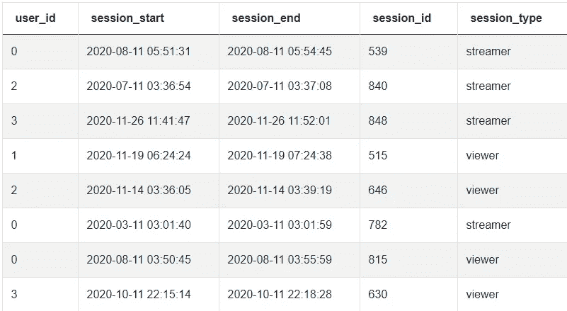

来自 **twitch_sessions** 表的前几行。

**面试官:** *“我想让你找出第一次以观众身份进行会话的用户完成的会话数量。您应该只返回他们的用户 ID 和会话数。”*

**预期产出:**

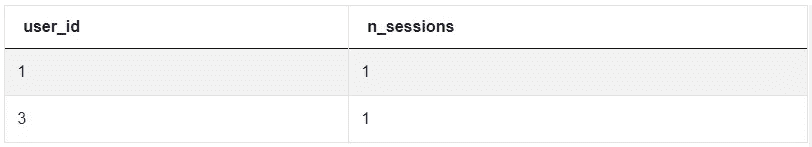

**面试官的提示:** *“在编写任何代码之前，我会建议你从描述你希望在这里实现什么开始。在这种特定情况下，将请求分成 2-3 个步骤可能是明智的选择。”*

## 解决方案 A)使用 CTEs +内部连接:

我强烈建议您在编写 SQL 编码问题的解决方案时使用[通用表表达式(cte)](https://learnsql.com/blog/when-to-use-cte/)。在我看来，cte 非常简洁，可读性强，能帮助你逐步分解你的解决方案，更有效地与面试官分享你的推理。

在这种情况下，我使用了`cte1`来创建一个由`user_id`排序的排名，排序由`session_start` ( *是您应该关心的唯一时间戳*)。然后我使用在第一次 CTE 中计算出的排名作为`cte2`中的过滤器，来隔离在第一次会话中观看的用户。最终，在外部语句中，我用`cte2`内部连接了原始表，使其像过滤器一样工作，并计算了会话数。

在这里使用`rank()`函数是有意义的，因为您只是在寻找第一个会话，当通过时间戳排序时，不太可能出现平局。

## 解决方案 B)使用子查询+ IN()运算符

解决这个问题的另一种方法是使用两个子查询。代码可能看起来更紧凑，但也更难阅读，并且无助于识别不同的步骤。如前所述，一般来说，你应该更喜欢 cte，因为它们是行业标准，而且如果你过于频繁地使用子查询，你的同事会暗地里讨厌你，:D*** 

## ***问题#2 - RANK()函数|难度:中等***

******面试官:*** *"表格****online _ retail****包含了 2010 年至 2011 年我们网站上销售的商品数据。考虑将* ***描述*** *字段作为项目名称。还为您提供了* ***发票日期*** *、* ***单价*** *和* ***数量****:****

***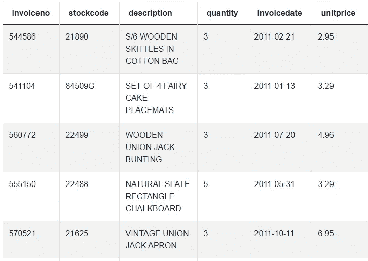***

*****在线 _ 零售**表的前几行。***

******面试官:*** *“我问你的是找出每个月最畅销的物品，其中最畅销的物品是用公式* ***(单位*数量)*** *计算出来的。请输出月份号、商品描述以及客户支付的金额。”****

*****预期输出:*****

***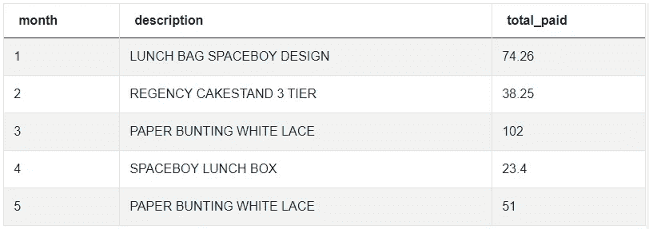***

## ***解决方案:***

***显然，这个解决方案看起来很简单，但是有很多理论***

***参与其中。例如，要使代码紧凑，您必须知道:***

*   ***不能在`GROUP BY`子句中包含窗口函数。***
*   ***但是，您可以在窗口函数中嵌套聚合函数，因为窗口函数是在它们之后进行逻辑计算的。这不完全是他们教你的第一件事吧？***

***在这个特殊的例子中，我创建了一个按发票月份划分的排名，并使用一个聚合函数作为`ORDER BY`子句的参数。***

***在外部的`SELECT`语句中，我只是过滤了带有`rnk = 1`的条目。使用一般的`rank()`函数是可行的，因为问题不是要求唯一的排名值。***

## ***问题#3 — DENSE_RANK()函数|难度:简单***

*****面试官:** *"表格* ***公寓*** *以* ***公寓 id*** *为主键，包括房产类型、床位和卧室数量、位置以及房东 id 等详细信息。你会发现这些数据非常直观。”****

***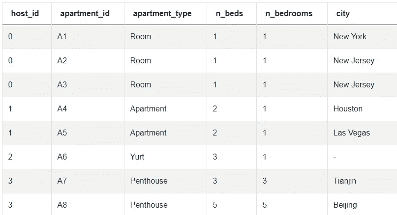***

*****公寓**桌前几排。***

*****面试官:** *“要求很简单:根据我们网站上列出的床位数对每个主持人进行排名。请记住，一个主机可以管理多个属性。拥有最多床位的主机应排在第一位(rank = 1)，拥有最少床位的主机应排在最后。拥有相同床位数的主机应该获得相同的排名，并且排名应该避免差距。”****

*****预期输出:*****

***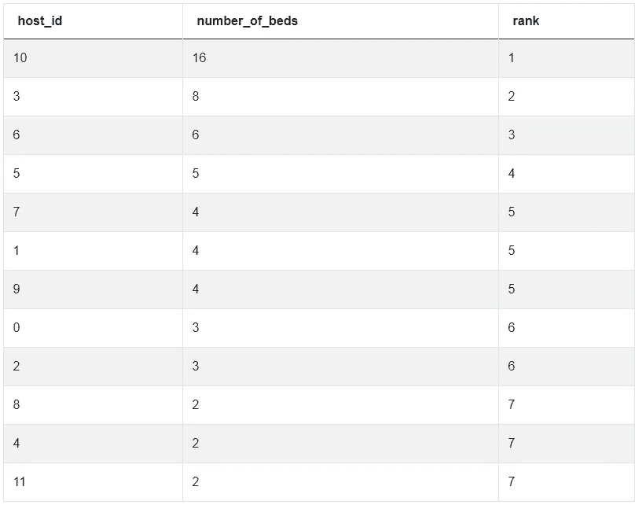***

## ***解决方案:***

***与前面的解决方案一样，我使用嵌套聚合函数来生成一个按`sum(n_beds)`(*注意，在窗口函数中，您可以声明一个嵌套聚合，但是您不能在别名下传递完全相同的聚合，您必须显式地键入它*)。这一次的请求是在出现一个或多个平局的情况下不要在排名中引入差距，因此我使用了`DENSE_RANK()`函数:***

## ***问题#4— DENSE_RANK()函数|难度:中等***

***面试官: *“在这个问题中，你需要两张桌子。第一个是****RC _ calls****，包含我们的客户服务部门收到的电话的详细信息，支持我们的母公司(公司 1)和其子公司(公司 2)。第二个表****RC _ users****包含用户及其联系的具体公司的详细信息。我们希望了解更多关于用户扭曲我们联系率的情况。”****

******

***来自 **rc_calls** 表的前几行。***

***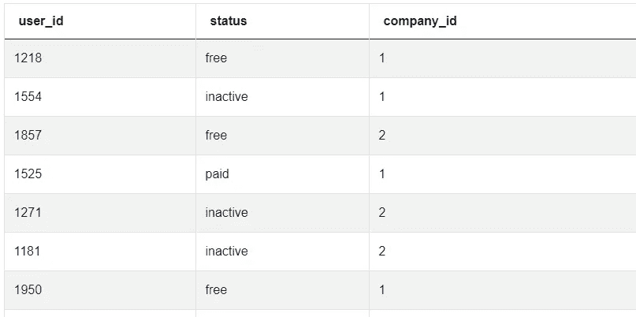***

***来自 **rc_users** 表的前几行。***

*****面试官:** *“为了做到这一点，对于每家公司，我要求您返回致电客服最多的前 2 名用户。你应该输出****company _ id****，****user _ id****，以及用户的排名。如果有多个用户具有相同的等级，则保留所有用户。****

*****预期输出:*****

***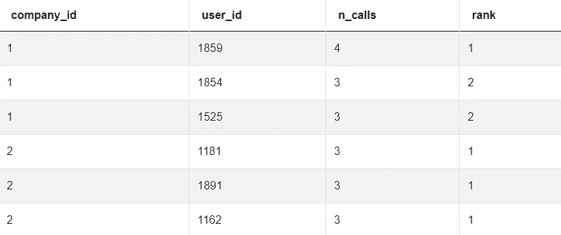***

## ***解决方案:***

***请注意，请求是按公司返回前 2 名(组)*“有问题的”*客户。但是，具有相同排名的客户(只要是`≤ 2`)都应该显示出来，这意味着如果出现多个并列的情况，最终的解决方案可能包括 4 行以上。***

***因此简单地在查询末尾使用`LIMIT 4`，将会导致错误的答案。取而代之的是，我使用了`DENSE_RAN()`将相同的等级分配给具有相同呼叫次数的所有客户，而没有在等级值之间引入差距。***

## ***问题 5 — ROW_NUMBER()函数|难度:简单***

*****面试官:** *“表****email _ logs****以字段* ***id*** *为主键，* *包含了我们电子邮件服务用户的活动信息。”****

***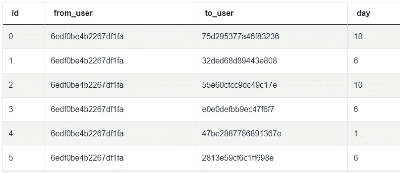***

***来自 **email_logs** 表的前几行。***

***采访者: *“我问你的是生成和每个用户的电子邮件活动排名，其中电子邮件活动我的意思是发送的电子邮件数量。发送电子邮件数量最多的用户将被排在第一位(rank = 1)，以此类推。****

****你应该输出用户字符串 id，电子邮件总数和他们的活动排名。请* ***分配唯一的排名，即使多个用户拥有相同数量的电子邮件*** *。按电子邮件总数降序和按用户字母顺序排列记录。”****

*****预期输出:*****

***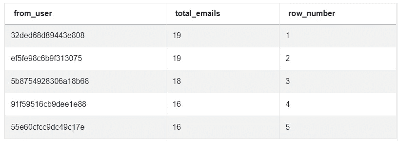***

## ***解决方案:***

***当要求您生成一个具有唯一值或包含特定行数的排名时，您应该使用`ROW_NUMBER()`函数:***

## ***问题#6 — ROW_NUMBER()函数|难度:难***

*****面试官:** *“在最后这个练习中，你将使用* ***被提名人 _ 电影记录*** *表格。这是一份演员名单(* ***姓名*** *)和他们参与过的电影以及他们演技的***)。在提供解决方案时，请记住名称可能会出现多次，而电影* ***id*** *字段是唯一的。*****

****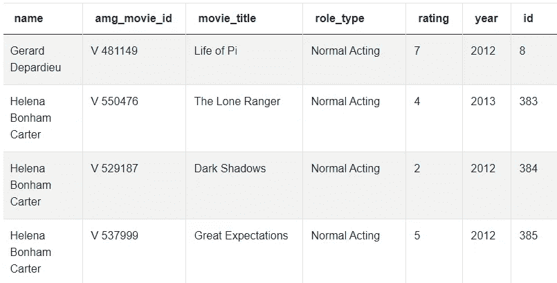****

******提名 _ 从影记录**表的前几行****

******面试官:** *“你应该从第二部最新电影开始计算评分，并计算每一位演员和他们出演的电影的平均终身评分* *。输出演员列表、他们在第二部最新电影中的评分、平均终身评分以及两个评分之间的差异(倒数第二平均)。”*****

******预期输出:******

****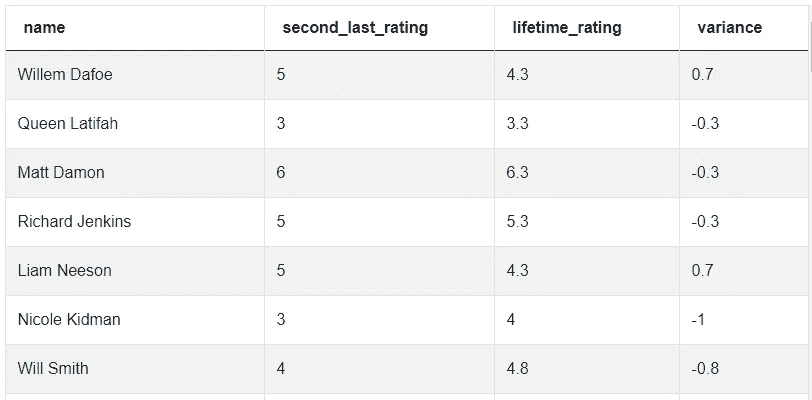****

## ****解决方案:****

****请注意，我是如何使用第一个 CTE 按演员计算排名的，按电影 ID 排序(*对应每个演员* *)，最低的 ID 对应最近的电影*)，使用第二个 CTE 计算演员的平均终身评分。然后，我使用最外部的查询来计算倒数第二部电影评分和平均终身评分之间的评分差异:****

# ****结论****

****在这篇关于 SQL 编码面试的第一篇文章中，我与你分享了 6 个来自真实面试的关于排名的窗口函数问题。上面分享的问题是[**StataScratch**](https://platform.stratascratch.com/coding?via=antonello)**的财产，他们好心地授权我使用他们的一些材料来写这篇教程。如果你喜欢这篇文章的风格，我会建议你去看看他们的网站****，在那里你会发现数百个类似的挑战。**********

**********给我的读者的一个提示** : *这篇文章包括附属链接，如果你购买的话，我可以给你一点佣金，不需要额外的费用。*********

# ******你可能也喜欢******

****** [## Python 中复制的 8 个流行的 SQL 窗口函数

### 关于如何利用业务分析中的 Pandas 高效复制最常用的 SQL 窗口的教程…

towardsdatascience.com](/8-popular-sql-window-functions-replicated-in-python-e17e6b34d5d7)  [## 在你开始第一个项目之前，要掌握 15 个 Git 命令

### 您需要掌握的最后一个 Git 教程是命令行版本控制。

towardsdatascience.com](/15-git-commands-you-should-learn-before-your-very-first-project-f8eebb8dc6e9)  [## Python 编码面试前要解决的 10 个算法

### 在这篇文章中，我介绍并分享了 FAANG 中经常出现的一些基本算法的解决方案

towardsdatascience.com](/10-algorithms-to-solve-before-your-python-coding-interview-feb74fb9bc27)******