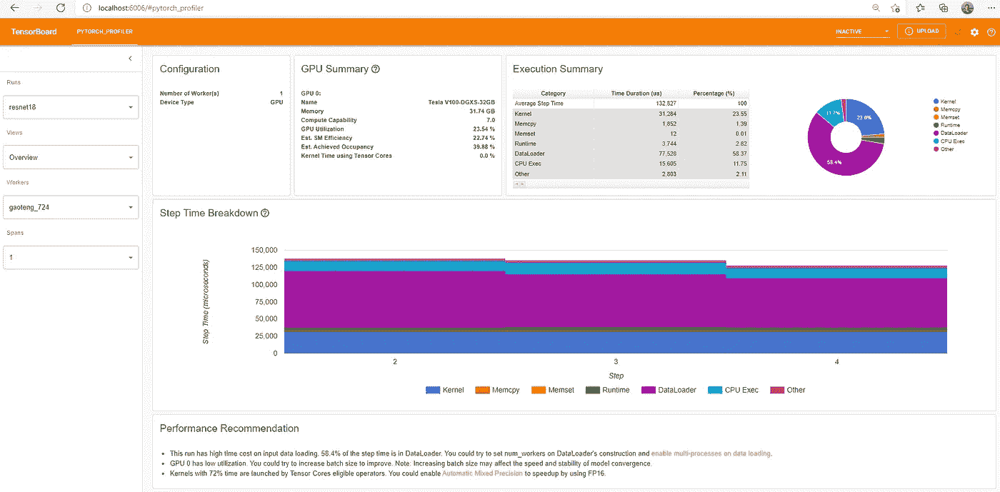
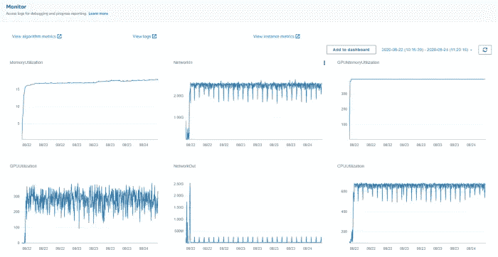
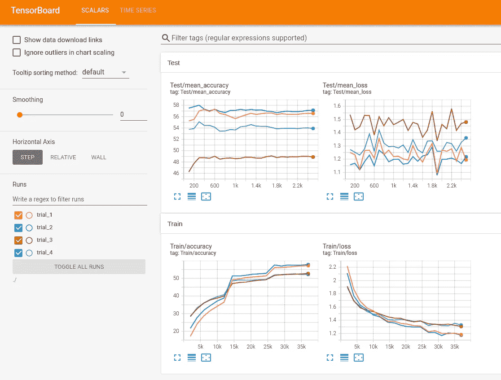

# 将机器学习项目迁移到云的 6 个步骤

> 原文：<https://towardsdatascience.com/6-steps-to-migrating-your-machine-learning-project-to-the-cloud-6d9b6e4f18e0?source=collection_archive---------12----------------------->

## [实践教程](https://towardsdatascience.com/tagged/hands-on-tutorials)

## 如何使用云培训资源来提升您的培训能力


由[杰里米·毕晓普](https://unsplash.com/@jeremybishop?utm_source=medium&utm_medium=referral)在 [Unsplash](https://unsplash.com?utm_source=medium&utm_medium=referral) 上拍摄的照片

无论你是一家成长中的初创公司的算法开发人员、大学研究实验室的数据科学家，还是一名 [kaggle](https://www.kaggle.com/) 爱好者，总有一天你在现场的培训资源不再能满足你的培训需求。在这篇文章中，我们的目标是那些(最终)准备好将其机器学习(ML)工作负载迁移到云的开发团队。我们将讨论在这一重大转变过程中需要做出的一些重要决定。自然地，任何包含这种努力的所有步骤的尝试都注定要失败。机器学习项目有许多形状和形式，随着其复杂性的增加，像迁移到云这样的重大变化也在增加。在这篇文章中，我们将强调我们认为最重要的一些考虑因素，这些因素对于大多数典型的深度学习项目来说是共同的。

我们将使用 pytorch 版本 1.9 演示我们在一个简单的 [pytorch](https://pytorch.org/) cifar10 模型上布置的步骤，该模型摘自[本 pytorch 教程](https://pytorch.org/tutorials/beginner/blitz/cifar10_tutorial.html)。虽然我们的演示将限于特定的机器学习框架和框架版本，但我们将提出的一般要点也与其他框架和版本相关。

我要感谢 Yitzhak Levi 为这个职位做出的贡献。

# 为什么要在云端训练？

在开始迁移步骤之前，让我们回顾一下在云中培训的一些主要优势:

1.  **可访问性**:云服务提供了对各种机器学习培训环境的访问。培训环境有两个组成部分:1 .硬件系统和 2。支持软件堆栈。云服务通常支持一长串参数不同的硬件实例类型，例如:CPU 内核的类型和数量、训练加速器的类型和数量、网络带宽、内存大小、磁盘大小等等。广泛的选择使您能够选择最适合您的项目需求的实例类型。此外，云服务提供了一长串支持各种流行培训框架的预配置软件映像。这些软件映像不仅可以为您节省大量的系统配置时间，而且通常还包括专门针对底层云环境的优化。
2.  **可扩展性**:在本地培训环境中，您会受到所拥有的培训实例数量的限制，与之相反，基于云的培训环境几乎可以实现无限的可扩展性。这使得通过在多台机器上分配单个培训作业和/或并行运行多个培训实验来加速您的培训项目成为可能。
3.  **存储基础设施**:您希望迁移到云的驱动因素可能来自培训相关的基础设施需求，而不是计算实例。例如，您的培训工作可能会使用非常大的数据集，以至于需要一个您无法在内部支持的存储基础架构。一旦您将数据转移到云中，您可能会发现在与您的训练数据位于同一位置的训练环境中进行训练比将数据传输到您自己的个人环境中更为理想。

鉴于这些(以及其他)优势，无怪乎有一种向云培训发展的趋势。然而，重要的是要意识到为了迁移到云，您需要对您的培训应用程序进行调整。在接下来的部分中，我们将尝试总结我们认为成功实现这一转变的一些关键步骤。

1.  选择培训云服务
2.  选择培训软件映像
3.  调整您的程序以访问云中的培训数据
4.  扩展您的程序以在多个工作人员上运行
5.  调整您的程序以在云中运行性能分析
6.  监控基于云的训练实验

# 步骤 1 —选择云服务

鉴于大量的云服务提供商和不断增加的人工智能相关产品列表，很容易看出人们可能会发现选择最佳培训服务的任务是多么艰巨。最受欢迎的云服务提供商有[亚马逊网络服务](https://aws.amazon.com/free/?trk=ps_a134p000003yhfZAAQ&trkCampaign=acq_paid_search_brand&sc_channel=ps&sc_campaign=acquisition_IL&sc_publisher=google&sc_category=core-main&sc_country=IL&sc_geo=EMEA&sc_outcome=Acquisition&sc_detail=amazon%20web%20services&sc_content=Brand_amazon_web_services_e&sc_matchtype=e&sc_segment=456914465945&sc_medium=ACQ-P|PS-GO|Brand|Desktop|SU|Core-Main|Core|IL|EN|Text&s_kwcid=AL!4422!3!456914465945!e!!g!!amazon%20web%20services&ef_id=Cj0KCQiAhMOMBhDhARIsAPVml-GCVQPAf2mEre2GiB903vSSKeTCavPr8DxgK0fFsMB-GH_8y1suCVsaAnZ3EALw_wcB:G:s&s_kwcid=AL!4422!3!456914465945!e!!g!!amazon%20web%20services&all-free-tier.sort-by=item.additionalFields.SortRank&all-free-tier.sort-order=asc&awsf.Free%20Tier%20Types=*all&awsf.Free%20Tier%20Categories=*all)(AWS)[微软 Azure](https://azure.microsoft.com/en-us/) 和[谷歌云平台](https://cloud.google.com/gcp?utm_source=google&utm_medium=cpc&utm_campaign=emea-il-all-en-bkws-all-all-trial-e-gcp-1010042&utm_content=text-ad-none-any-DEV_c-CRE_500236788699-ADGP_Hybrid%20%7C%20BKWS%20-%20EXA%20%7C%20Txt%20~%20GCP%20~%20General%23v2-KWID_43700060384861729-aud-606988878414%3Akwd-26415313501-userloc_9050473&utm_term=KW_google%20cloud%20platform-NET_g-PLAC_&gclid=Cj0KCQiAhMOMBhDhARIsAPVml-HbMk4LJQkJrt0l6FdO0YyxgKiMfl06fvcDQzA6y_jJEZka2C5I1OYaAmH9EALw_wcB&gclsrc=aw.ds) (GCP)，它们都提供多种不同的培训选择。有人可能会说，这一步的困难是因为有大量的可能性。

许多选项之间的差异可以分为两种类型:1 .可归因于云服务的文档化功能的差异；2 .难以预料的差异，只有在实际测试云服务后才能发现。

记录的差异可能包括服务成本、支持的实例类型列表和支持的培训框架列表等参数。例如，您可能会发现最适合您的工作负载的实例类型只由一个服务提供商提供。

难以预料的差异可能包括您选择的实例类型的可用性、数据从存储中流出的速度，或者对扩展到多实例培训的限制。例如，您可能会发现，使用一种培训服务时，云存储中的数据流速度要比使用另一种服务时快得多。

不幸的是，这些难以预料的差异可能会对你的训练表现产生有意义的影响，因此在确定最适合你的训练选项时可能是决定性的。

## **托管与非托管培训服务**

各种各样的基于云的机器学习服务使开发人员能够在广泛的抽象层次上进行交互。一方面，您将拥有只提供裸机培训实例的服务，将完整实例配置和软件堆栈创建的任务留给用户。另一方面，你会发现*管理的*服务，其中用户可以将训练项目的许多元素，如训练算法的选择，甚至训练数据的创建，委托给服务提供商。为了突出受管服务和不受管服务之间的一些差异，我们将提供一个如何使用每种服务类型的示例。

**托管培训示例**:要使用诸如 [Amazon SageMaker](https://aws.amazon.com/pm/sagemaker/?trk=ps_a134p000007BxdvAAC&trkCampaign=acq_paid_search_brand&sc_channel=PS&sc_campaign=acquisition_IL&sc_publisher=Google&sc_category=Machine%20Learning&sc_country=IL&sc_geo=EMEA&sc_outcome=acq&sc_detail=amazon%20sagemaker&sc_content=Sagemaker_e&sc_matchtype=e&sc_segment=532435490322&sc_medium=ACQ-P|PS-GO|Brand|Desktop|SU|Machine%20Learning|Sagemaker|IL|EN|Text&s_kwcid=AL!4422!3!532435490322!e!!g!!amazon%20sagemaker&ef_id=Cj0KCQiAhMOMBhDhARIsAPVml-HxIwfeABmnxXbZ9ia_5DV_TckDGpMSH2mFhSpu8jrCgntII8hcHB4aAuhfEALw_wcB:G:s&s_kwcid=AL!4422!3!532435490322!e!!g!!amazon%20sagemaker) 或 [Google Vertex AI](https://cloud.google.com/vertex-ai) 之类的服务来执行托管培训会话，您可以使用服务 API 来指定诸如培训实例类型、所需实例的数量、选择的框架和版本、培训代码的位置以及上传培训结果的路径等细节。托管服务将继续启动所请求的系统，并自动下载和运行培训代码。当训练结束时，产生的工件将被上传到预先配置的位置，并且训练实例将被终止。将记录训练会话的记录，捕获训练会话的细节，包括指向训练代码和结果工件的指针。这些捕获的记录可用于分析培训服务的使用模式，并促进更好的成本管理和治理。

托管服务可能会提供额外的功能来促进端到端的机器学习管道。例如， [Amazon SageMaker](https://aws.amazon.com/sagemaker/) 包括广泛的功能和工具，如用于标记数据的[Amazon sage maker Ground Truth](https://aws.amazon.com/sagemaker/groundtruth/)，用于监控和分析培训课程的[Amazon sage maker Debugger](https://docs.aws.amazon.com/sagemaker/latest/dg/train-debugger.html)，用于比较培训实验的 [Amazon SageMaker Studio](https://aws.amazon.com/sagemaker/studio/) ，以及用于优化部署模型的 [Amazon SageMaker Neo](https://aws.amazon.com/sagemaker/neo/) 。

在下面的代码块中，我们提供了一个如何使用 [Amazon Sagemaker 的](https://aws.amazon.com/pm/sagemaker) python API 实例化托管 cifar10 pytorch 培训作业的示例。

```
from sagemaker.pytorch import PyTorch

estimator=PyTorch(entry_point='cifar10.py',
                    role=<AWS IAM role>,
                    py_version='py3',
                    framework_version='1.9.0', #pytorch version
                    instance_count=1,
                    instance_type='ml.g4dn.xlarge',
                    )
estimator.fit()
```

**无管理培训示例**:开展无管理培训课程的一种方式是:

1.  使用 [AWS EC2](https://aws.amazon.com/free) 或谷歌的[计算引擎](https://cloud.google.com/compute/)创建一个或多个带有您选择的机器学习软件映像的训练实例。
2.  通过 SSH 连接到培训实例，手动配置环境，下载培训代码，并开始培训会话。
3.  手动监视训练进度，并在完成后关闭实例。
4.  可以选择记录培训课程的详细信息，用于实验再现、使用模式分析或管理。

显然，非托管选项需要大量的人工干预。与此同时，直接使用训练机器可以实现很大的灵活性。这与管理选项相反，后者通常会限制对训练机器的访问。

**训练编排** :
训练编排是指机器学习训练作业的自动化部署和管理。如今，几乎有几十种工具为编排基于云的培训工作提供支持。这些服务根据其成本和功能支持的细节而有所不同。培训协调工具可用于构建一个专门针对您的需求定制的托管培训环境。您可以通过一种方式来设计您的环境，这种方式提供了托管服务(如自动化和实验跟踪)和非托管服务(如直接与培训实例连接的自由)的优点。自然，创建和维护个性化的托管环境可能需要付出巨大的努力。

## 选择一个必须的选项

尽管我们做了冗长的解释，你可能还是会对如何选择合适的培训服务感到有些困惑。正如我们在上面讨论的，这个决定由于潜在的未知因素而变得复杂。这里有一个我们的开发团队可能会采用的策略。借用强化学习领域的一个术语，我喜欢称之为选择基于云的培训服务的探索开发策略。

1.  根据你目前(有限的)知识，从众多选项中选择一个。这个决定可能取决于你的舒适程度或成本考虑。
2.  尝试以这样一种方式设计您的代码，最小化对任何一个选项的依赖，并最大化您轻松地从一个服务转换到另一个服务的能力。
3.  找出您当前解决方案的弱点和提高效率的机会。
4.  将你的一部分发展时间用于*探索*替代培训服务选项。如果确定了改进的选项，请返回步骤 1。

# 步骤 2—选择训练软件映像

无论您选择何种培训服务，配置 API 都将包含用于确定软件培训映像的控件。根据服务的不同，这可能是一个虚拟机映像(如[亚马逊机器映像(AMI)](https://docs.aws.amazon.com/AWSEC2/latest/UserGuide/AMIs.html) 或[谷歌计算引擎映像](https://cloud.google.com/compute/docs/images))或 [Docker](https://www.docker.com/) 映像。如上所述，云服务提供了一长串预先配置的软件映像。这些因操作系统类型和版本、驱动程序版本、软件包成分等而异。在大多数情况下，我们倾向于使用我们选择的培训服务提供的官方图片。这些映像不仅经过了严格的测试，而且通常还包括专门为底层云环境设计的优化。然而，您可能会发现没有一个图像完全符合您的需求。您可能需要安装特定的 CUDA 驱动程序或特定的软件安装包。或者，您可能已经有了一个精心培育的 Docker 映像，并希望将其带到云中。许多云服务支持自定义映像的创建和使用。

即使在您选择自定义映像的情况下，我们也发现从现有的官方服务映像派生自定义映像是最安全的。这里我们展示了一个案例，我们用最新版本的 [opencv](https://opencv.org/) 和一个自主开发的 python 实用程序包扩展了一个官方的 AWS pytorch Docker 映像。

```
FROM 763104351884.dkr.ecr.us-east-1.amazonaws.com/pytorch-training:1.9.0-gpu-py38-cu111-ubuntu20.04RUN apt-get update && apt-get -y install python3-opencv
COPY my_utils.pkg ./my_utils.pkg
RUN pip install my_utils.pkg
```

一旦你创建了你的 Docker 镜像，你需要把它上传到云注册中心，比如亚马逊 ECR 或谷歌容器注册中心。更多细节参见[文档](https://docs.aws.amazon.com/AmazonECR/latest/userguide/docker-push-ecr-image.html)。在下面的代码块中，我们修改了 Amazon SageMaker 启动脚本，以使用我们创建的自定义图像。

```
from sagemaker.pytorch import PyTorch

estimator=PyTorch(entry_point='cifar10.py',
                    role=<AWS IAM role>,
                    **image_uri=<path to image in ECR>,** 
                    instance_count=1,
                    instance_type='ml.g4dn.xlarge',
                    )
estimator.fit()
```

# 步骤 3—在云中访问您的培训数据

将机器学习应用程序迁移到云中时，您需要做出的下一个决定是如何访问您的训练数据。在本帖中，我们将假设你的数据集由基于云的对象存储解决方案维护，例如[亚马逊 S3](https://aws.amazon.com/s3/) 或[谷歌存储](https://cloud.google.com/storage)。访问数据的最简单方法是将完整的训练数据集下载到训练实例的本地磁盘上，然后像在本地环境中一样进行精确的训练。但是，您的数据集可能太大，无法放在本地磁盘上，或者您可能不愿意让您的训练实例在下载整个数据集的过程中保持空闲。云服务提供了许多与云存储中的数据交互的方式(我们在[这篇文章](https://julsimon.medium.com/deep-dive-on-tensorflow-training-with-amazon-sagemaker-and-amazon-s3-12038828075c)中已经提到了其中的一些)。无论您选择哪个选项，都可能需要对代码进行一些修改。

我们将通过修改我们的 cifar10 pytorch 示例，从存储在[亚马逊 S3](https://aws.amazon.com/s3/) 的数据集中提取数据，来演示您的代码所需的适应类型。我们将使用的对象存储接口方法是最近发布的 [Amazon Sagemaker 快速文件模式](https://aws.amazon.com/about-aws/whats-new/2021/10/amazon-sagemaker-fast-file-mode/)。快速文件模式(FFM)将 S3 中的数据暴露给机器学习应用程序，使得它看起来好像正在访问本地文件系统。这提供了访问数据的便利，就像数据存储在本地一样，而没有在训练之前实际下载数据的开销和成本。为了使我们的程序使用快速文件模式，需要对培训脚本的[数据加载部分](https://pytorch.org/tutorials/beginner/blitz/cifar10_tutorial.html#load-and-normalize-cifar10)和 Amazon SageMaker 培训作业实例化脚本进行小的调整。下面的代码块突出显示了这些更改。对于这个例子，我们假设训练数据位于*S3://my-bucket/cifar-training-data/*。

培训脚本:

```
**dataroot=os.environ["SM_CHANNEL_TRAINING"]**
transform=transforms.Compose([transforms.ToTensor(),
     transforms.Normalize((0.5, 0.5, 0.5), (0.5, 0.5, 0.5))])
batch_size=4

trainset=torchvision.datasets.CIFAR10(**root=dataroot**, train=True,
                                      transform=transform)
trainloader=torch.utils.data.DataLoader(trainset,                 
              batch_size=batch_size, shuffle=True, num_workers=2)

testset=torchvision.datasets.CIFAR10(**root=dataroot**, train=False,transform=transform)
testloader=torch.utils.data.DataLoader(testset, 
              batch_size=batch_size, shuffle=False, num_workers=2)
```

SageMaker 启动脚本:

```
from sagemaker.pytorch import PyTorch

estimator=PyTorch(entry_point='cifar10.py',
                    role=<AWS IAM role>,
                    py_version='py3',
                    framework_version='1.9.0', #pytorch version
                    instance_count=1,
                    instance_type='ml.g4dn.xlarge',
                    **input_mode='FastFile'** )
estimator.fit(**"s3://my-bucket/cifar-training-data/"**)
```

更多关于快速文件模式的话题，请看[这篇](/amazon-sagemaker-fast-file-mode-d12829479c39)最近的帖子。

应该注意的是，如何存储大型数据集的细节，包括数据如何分区和存储格式，都需要仔细设计，因为它会对数据的访问速度产生有意义的影响。你可以在这篇博文的[中找到关于这个话题的更多细节。](https://julsimon.medium.com/making-amazon-sagemaker-and-tensorflow-work-for-you-893365184233)

# 步骤 4——如何利用多名员工加速培训

如上所述，迁移到云的优势之一是它提供了扩展您的培训工作的机会，以便在多个员工上并行运行。一种常见的方法是执行*数据分布式训练。*在数据分布式培训学习中，每个工人对培训数据的不同子集(本地批次)执行一个培训步骤。然后，它发布其结果梯度，并考虑所有工人学习的组合知识来更新其自己的模型。通过对 *N* 名员工进行数据分布式培训，你有可能将你的培训速度提高多达 *N* 倍。不可避免的是，将您的培训分配给多个员工也需要对您的代码进行调整。我们将在简单的 cifar10 pytorch 示例中演示这一点。pytorch 中有许多流行的实现分布式训练的框架，最著名的是内置的[分布式数据并行](https://pytorch.org/tutorials/intermediate/ddp_tutorial.html#getting-started-with-distributed-data-parallel)库和 [Horovod](https://horovod.readthedocs.io/en/stable/) 。在这里，我们演示了对我们的两个脚本所需的更改，以便使用 [Horovod](https://horovod.readthedocs.io/en/stable/) 在具有 4 个 GPU 的训练实例上运行分布式训练。

下面的代码块包括对[优化器定义](https://pytorch.org/tutorials/beginner/blitz/cifar10_tutorial.html#define-a-loss-function-and-optimizer)和[训练循环](https://pytorch.org/tutorials/beginner/blitz/cifar10_tutorial.html#train-the-network)所需的更改。有关使用 Horovod 的 pytorch 分布式培训的更多详细信息，请查看官方 [Horovod pytorch turorial](https://horovod.readthedocs.io/en/latest/pytorch.html) 。

```
**import horovod.torch as hvd

*# Initialize Horovod*
hvd.init()

*# Pin GPU to be used to process local rank (one GPU per process)*
torch.cuda.set_device(hvd.local_rank())
net.cuda()**import torch.optim as optimcriterion = nn.CrossEntropyLoss()
optimizer = optim.SGD(net.parameters(), lr=0.001, momentum=0.9)***# Add Horovod Distributed Optimizer*
optimizer = hvd.DistributedOptimizer(optimizer,  
                         named_parameters=net.named_parameters())

*# Broadcast parameters from rank 0 to all other processes.*
hvd.broadcast_parameters(net.state_dict(), root_rank=0)
hvd.broadcast_optimizer_state(optimizer, root_rank=0)**for epoch in range(2):  # loop over the dataset multiple times
    running_loss = 0.0
    for i, data in enumerate(trainloader, 0):
        # get the inputs; data is a list of [inputs, labels]
 **inputs, labels = data[0].cuda(), data[1].cuda()** # zero the parameter gradients
        optimizer.zero_grad() # forward + backward + optimize
        outputs = net(inputs)
        loss = criterion(outputs, labels)
        loss.backward()
        optimizer.step() # print statistics
        running_loss += loss.item()
        if i % 2000 == 1999:    # print every 2000 mini-batches
            print('[%d, %5d] loss: %.3f' %
                  (epoch + 1, i + 1, running_loss / 2000))
            running_loss = 0.0**if hvd.rank() == 0:
    # save checkpoint to location that will be autonmatically
    # uploaded to S3    
    model_dir = os.environ.get('SM_MODEL_DIR', '/tmp')**
    **torch.save(net.state_dict(), 
               os.path.join(model_dir, 'cifar_net.pth'))** print('Finished Training')
```

以下代码块演示了如何使用 Amazon SageMaker 的 API 来启动 Horovod 作业:

```
from sagemaker.pytorch import PyTorch
**distribution={
            'mpi': {
                'enabled': True,
                'processes_per_host': 4,
                'custom_mpi_options': '--NCCL_DEBUG INFO'
            }
        }**
estimator=PyTorch(entry_point='cifar10.py',
                    role=<AWS IAM role>,
                    py_version='py3',
                    framework_version='1.9.0', #pytorch version
                    instance_count=1,
 **instance_type='ml.g4dn.12xlarge',**#4 GPU instance
                    input_mode='FastFile',
                    **distribution=distribution** )
estimator.fit("s3://my-bucket/cifar-training-data/")
```

注意，我们依赖于对输入数据集的混洗操作来确保四个 [Horovod](https://horovod.readthedocs.io/en/stable/) 训练过程中的每一个都接收不同的训练批次。或者，您可以实现一个数据分片方案，将输入数据分成 4 个不相交的数据子集，每个子集对应一个训练过程。如果您选择对数据进行分片，您应该知道一些分片实现会将整个数据集下载/流式传输到每个训练过程，然后进行分片，而不是在数据源进行分片。这可能会使您的培训资源超负荷，造成不必要的成本浪费。

在这篇文章中，我们没有提到为了适应增加的全局批处理大小，可能需要对优化器设置进行的调整。关于分布式培训的更多细节，包括你可能面临的一些挑战，请查看下面的帖子。

</a-guide-to-highly-distributed-dnn-training-9e4814fb8bd3>  

# 步骤 5——如何分析您的运行时性能

训练机器学习模型可能很昂贵，这不是什么秘密。作为 ML 应用程序开发人员，降低成本的主要方法之一是通过定期分析培训的执行速度和系统资源的使用方式来寻找提高培训效率的机会。虽然这在任何培训环境中都是一个好习惯，但在云环境中进行培训时，这一点至关重要，因为在云环境中，培训效率低下的成本影响是直接的。如果您的训练代码还没有包含用于分析运行时性能的钩子，现在是时候加入它们了。有许多不同的工具和方法来进行性能分析。在这里，我们将演示如何修改我们的 cifar10 [训练循环](https://pytorch.org/tutorials/beginner/blitz/cifar10_tutorial.html#train-the-network)，以使用 pytorch 的内置[性能分析挂钩](https://pytorch.org/docs/stable/profiler.html)。我们已经配置了分析器，将结果存储在亚马逊 S3 云存储中。为了简单起见，我们编写了脚本来在单个 GPU 上捕获分析数据。

```
**# configure profile on rank 0 only
active = 3 if hvd.rank()==0 else 0
log_dir = os.path.join(model_dir, 'profile')**
**with torch.profiler.profile(
    schedule=torch.profiler.schedule(wait=1,warmup=1, 
                                     active=active,repeat=1),     
    on_trace_ready=torch.profiler.tensorboard_trace_handler(
                                              log_dir),
    activities=[torch.profiler.ProfilerActivity.CPU,   
                torch.profiler.ProfilerActivity.CUDA],
    record_shapes=True,
    with_stack=True) as prof:**
    for epoch in range(2):  # loop over the dataset multiple times
        running_loss = 0.0
        for i, data in enumerate(trainloader, 0):
            # get the inputs; data is a list of [inputs, labels]
inputs, labels = data[0].cuda(), data[1].cuda() # zero the parameter gradients
            optimizer.zero_grad() # forward + backward + optimize
            outputs = net(inputs)
            loss = criterion(outputs, labels)
            loss.backward()
            optimizer.step()
 **prof.step()** # print statistics
            running_loss += loss.item()
            if i % 2000 == 1999:    # print every 2000 mini-batches
                print('[%d, %5d] loss: %.3f' %
                      (epoch + 1, i + 1, running_loss / 2000))
                running_loss = 0.0
```

下图显示了 TensorBoard 中的概要分析示例。有关如何在 TensorBoard 中分析分析结果的详细信息，请查看 pytorch 分析教程。



分析总结(来自[tensor board Profiler Turorial](https://pytorch.org/tutorials/intermediate/tensorboard_profiler_tutorial.html)

许多云服务将收集培训系统利用率指标，并向用户公开这些指标(例如，通过[亚马逊云观察](https://aws.amazon.com/cloudwatch/)或[谷歌云监控](https://cloud.google.com/monitoring))。这些可用于识别培训效率低下的情况，并做出适当的改变。例如，您可能会发现您的 GPU(通常是最重要的训练资源)非常空闲，并推断出不同的训练实例类型(具有较低的 GPU 能力)可能更适合您的需求。
以下是系统利用率指标如何出现在 Amazon SageMaker web 界面中的示例:



实例指标(来自 Amazon SageMaker 控制台)

Amazon SageMaker 提供了额外的性能分析工具，详见这篇博文。

# 步骤 6——如何监控你的训练实验

在机器学习培训项目的过程中，您可能会使用不同的架构、输入数据或超参数运行几十个不同的实验。为了从这些实验中收集有用的信息并能够进行改进，你必须有合适的工具来比较它们。在基于云的训练环境中进行监控需要从所有独立的训练实验中收集评估指标，并将它们存储在一个集中的位置。您需要做出的一个关键设计决定是*推送*还是*拉取*度量数据。在基于*推送*的解决方案中，每个实验将被编程为推送至预定义的集中监控服务。虽然这似乎是最直接的选择，但它可能需要复杂的云网络和云权限设计。在基于*拉*的解决方案中，每个实验将其指标上传到云存储，监控服务被编程为从那里拉指标。虽然这不需要任何特殊的云配置，但您可能会发现它不太方便。

市场上有很多工具用于监控基于云的训练实验。这些工具包括 [Comet.ml](https://www.comet.ml/site/) 、[海王星](https://neptune.ai/)、[权重&偏向](https://www.wandb.com/)、[神圣](https://github.com/IDSIA/sacred)、 [MLflow](https://mlflow.org/) 、[公会 AI](https://guild.ai/) 、 [cnvrg.io](https://cnvrg.io/) 、 [ClearML](https://clear.ml/) ，还有很多很多。这些服务因其成本和功能细节而异。

## 自动提前停车

在一个典型的机器学习项目中，你可能会发现自己在并行运行多个实验，并预计其中一些可能会失败。在基于云的环境中，非常需要自动检测并尽早终止失败的实验。这可能会大大降低成本。集成自动监控将要求您编写规则来检测常见的训练失败，如爆炸或消失梯度、非递减损失等。

在下面的代码块中，我们提供了一个如何将监控和早期停止整合到我们的 cifar10 pytorch 脚本中的示例。为简单起见，我们使用[张量板](https://www.tensorflow.org/tensorboard)来比较实验指标。

```
**from torch.utils.tensorboard import SummaryWriter****# choose path in S3 so that metrics can be tracked during training
writer = SummaryWriter(<predetermined path in S3>)
halt_training = False**for epoch in range(2):  # loop over the dataset multiple times
 **if halt_training:
        break**    running_loss = 0.0
    for i, data in enumerate(trainloader, 0):
        # get the inputs; data is a list of [inputs, labels]
        inputs, labels = data[0].cuda(), data[1].cuda() # zero the parameter gradients
        optimizer.zero_grad() # forward + backward + optimize
        outputs = net(inputs)
        loss = criterion(outputs, labels)
 **# terminate training if loss is invalid**        **if np.isnan(loss.item()) or np.isinf(loss.item()):           
            print('Invalid loss, terminating training')
            halt_training = True
            break** 
        loss.backward()
        optimizer.step() # print statistics
        running_loss += loss.item()
        if i % 2000 == 1999:    # print every 2000 mini-batches
            print('[%d, %5d] loss: %.3f' %
                  (epoch + 1, i + 1, running_loss / 2000))
            running_loss = 0.0
 **if hvd.rank()==0:
                writer.add_scalar('training loss',
                            running_loss / 2000,
                            epoch * len(trainloader) + i)**
```

在这种情况下，我们编写了脚本来将培训指标上传到云存储。为了将它们可视化并与其他实验进行比较，你需要*将结果*拉入 TensorBoard。这是一个张量板度量标量可视化的例子。



TensorBoard 中的实验比较(作者)

关于在 pytorch 中使用 TensorBoard 的更多细节，请查看本教程。

Amazon SageMaker 提供了专门的监控和自动停止工具。更多详情请参见此处[此处](https://aws.amazon.com/blogs/aws/amazon-sagemaker-experiments-organize-track-and-compare-your-machine-learning-trainings/)和[此处](/upgrade-your-dnn-training-with-amazon-sagemaker-debugger-d302fab5ee61)。

# 摘要

基于云的培训提供了一定程度的灵活性和可扩展性，这在您的本地环境中几乎是不可能重现的。在这篇文章中，我们已经介绍了成功过渡到云计算所需的一些步骤。我相信，除了这种转变的机制之外，云中的培训还需要心态的转变和对基本开发习惯的调整，就像在以前的博客文章中讨论的那样。

</6-development-habits-for-increasing-your-cloud-ml-productivity-becdc41eb289>  

对我来说，想到天空中的云，就会唤起兴奋、创新和无尽机遇的感觉。我发现用这样的感觉来描述 cloud ML 的潜力并不为过。我希望你也是。