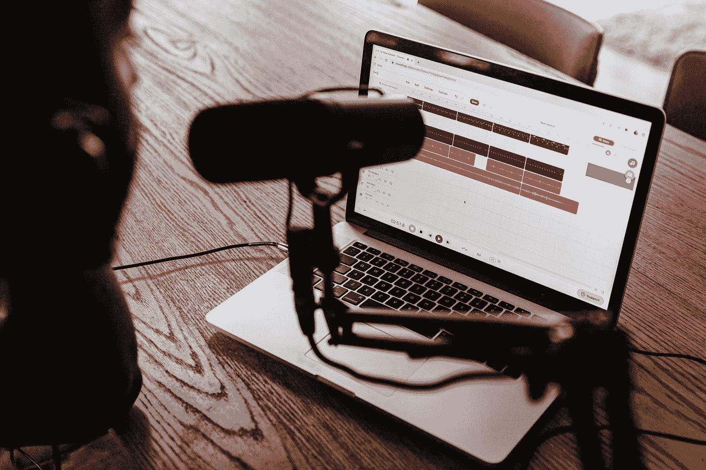

# 你应该收听的 6 个科技和编程播客

> 原文：<https://towardsdatascience.com/6-tech-and-programming-podcasts-you-should-tune-in-to-8897d256827d?source=collection_archive---------4----------------------->

## 随时随地学习和聆听故事

由 [Unsplash](https://unsplash.com?utm_source=medium&utm_medium=referral) 上的 [Soundtrap](https://unsplash.com/@soundtrap?utm_source=medium&utm_medium=referral) 拍摄的照片

我们都过着忙碌的生活；总是有很多事情同时发生。在我们的一天中，我们努力在自己身上下功夫，进一步提高我们的技能，为未来的自己创造新的、更好的机会。但是，有时候，花时间学习新技能并不是一件容易的事情。

自从我是一名高中生，我就自学了多重任务。我总是渴望学习新的技能来提高自己，但是我有许多杂务和任务需要完成。因此，我过去是，现在仍然是一个在旅途中学习新事物的爱好者。尽管我很喜欢阅读书籍和教程，但我需要一种可以在完成其他家务时使用的资源。

那是我深入播客世界的地方。我可以用来学习新事物的技术播客，可以帮助我更好地了解就业市场的职业播客，以及许多其他类型的播客。播客是一种无需在特定地点甚至特定时间学习的好方法。2020 年是激动人心的一年。这是许多新播客出现的原因。

</6-best-python-ides-and-text-editors-for-data-science-applications-6986c4522e61> [## 数据科学应用的 6 个最佳 Python IDEs 和文本编辑器

towardsdatascience.com](/6-best-python-ides-and-text-editors-for-data-science-applications-6986c4522e61) 

这也有助于将人们的注意力转移到神奇的播客世界。当然，有很多播客可以让你了解科技、生活甚至心理健康的任何方面。但是，在这篇文章中，我将为所有级别的程序员介绍我最喜欢的 6 个编程播客。因此，如果你正在开始你的编码世界之旅，或者想要复习你的知识，请收听这些播客。

# №1:语法 FM

让我们从网络开发播客 gem 开始吧， [SyntaxFM](https://syntax.fm) 。这个播客是由全栈开发者[韦斯·博斯](https://twitter.com/wesbos)和网络开发者[斯科特·托林斯基](https://twitter.com/stolinski)创建的。这个播客包含了许多关于编程和 web 开发各个方面的采访和深入讨论。SyntaxFM 经常每月分享 9~10 集，长度不一，有的短至 20 分钟，有的则是详细密集的 70+分钟剧集。

除了播客，如果你喜欢韦斯和斯科特传递信息的方式和教学方法，你可以从他们那里找到许多其他伟大的资源，如韦斯的[课程](https://wesbos.com/courses)和斯科特的 [YouTube](https://www.youtube.com/c/leveluptuts) 频道。所以如果你想进入网络开发的世界，不要再往前看了；这是给你的播客。

# №2:代码新手播客

接下来是为科技和编程领域的新手准备的播客。[Code Newbie](https://codenewbie.org/podcast)播客对你来说是一个很好的资源，如果你正在起步，需要一个指南和信息丰富的地方来开始你的技术之旅。这个播客涵盖了科技领域的所有基础知识。这个播客的伟大之处在于，它没有专注于特定的技术方面，而是试图提供许多不同领域的有用信息，如 web dev 和数据科学。

Code Newbie podcast 还提供了开发人员和程序员关于他们的学习和职业生涯的故事，您可以使用这些故事来推进和简化您自己的旅程。这个播客经常一个月分享 4~6 集，平均每集 30~55 分钟。

</9-discord-servers-for-math-python-and-data-science-you-need-to-join-today-34214b93d6b8> [## 9 台用于数学、Python 和数据科学的 Discord 服务器，您需要立即加入

towardsdatascience.com](/9-discord-servers-for-math-python-and-data-science-you-need-to-join-today-34214b93d6b8) 

# №3:跟我说说 Python

作为一个 Python 爱好者，我总觉得 Python 有很大的潜力可以用在不同的广阔领域。说到 Python，我确信我总能学到新的东西或者更好地掌握现有知识。所以，如果你像我一样是一个 Python 爱好者，[跟我说说 Python](https://talkpython.fm/episodes/all)就是为你准备的播客。想学习一些关于 Python 的新知识或者知道可以用它做什么？跟我聊 Python 会回答你所有的问题。

每日与我分享一个新的话题，每个话题都在讨论和探索 Python 生态系统以及你可以使用它的各种应用。还包括对开发者、Python 爱好者，甚至各个应用领域的研究人员的各种采访。

# №4:瓢虫播客

总的来说，科技行业的男性多于女性，有时女性很难让自己的声音被听到并得到尊重。瓢虫播客[是一个很棒的女性主导的播客，讨论科技生活的各个方面，从学习一项新技能或语言到找工作，甚至谈判工资和职位。](https://ladybug.dev/episodes)

该播客提供了关于核心技术概念的剧集，来自成功职业旅程的女性开发人员的故事，以及关于个人发展和成长的话题。这个播客中我最喜欢的一个焦点是他们的读书俱乐部，他们在那里讨论不同的书籍，甚至深入讨论撰写和出版电子书的过程。

# №5:开发者茶

如果你想学点新东西，但你只有午休时间，我们的下一个播客[开发者茶](https://spec.fm/podcasts/developer-tea)就是为你准备的。这个播客提供了 15~20 分钟的关于编程和应用程序开发的各种主题的短片。

开发者茶由程序员兼开发者 [Jonathan Cutrell](https://twitter.com/jcutrell) 主持，旨在帮助开发者在职业生涯中脱颖而出，并对技术世界产生积极影响。截至本文撰写之时，该播客已有超过 1300 万次下载。这个播客的另一个优点是，你可以通过乔纳森的 Twitter 账户或电子邮件与其讨论。

</5-new-data-science-books-that-you-should-consider-reading-c90aec1d5b0d>  

# №6:和我一起学习编码

你可以通过各种途径进入科技行业；你可以去 it 学校学习工程、计算机科学或其他相关领域，或者你可以报名参加训练营，在比获得学位更短的时间内学习。但是，可能最常见的途径是在线自学编码。

[跟我学编程](https://learntocodewith.me/podcast/)是一个很棒的播客，由[劳伦斯·布拉德福德](https://twitter.com/learncodewithme?ref_src=twsrc%5Egoogle%7Ctwcamp%5Eserp%7Ctwgr%5Eauthor)主持。劳伦斯采访了许多自学成才的开发人员和程序员，并与他们讨论了他们的旅程和遇到的挑战，以及他们如何克服这些挑战。此外，该播客专注于教人们如何过渡到技术，并提供可行的建议，帮助他们获得技能报酬。

# 最后的想法

处理我们每天需要完成的许多任务和杂务并不容易。可能会让人不知所措，而且时间非常棘手。那么，我们怎样才能在完成日常任务的同时提高自己呢？幸运的是，有一些学习媒介可以让你在做其他事情的同时学到一些东西。

我在做日常家务时最喜欢做的事情是听一两个播客，在打扫、吸尘或烹饪时学习一些新东西，并有效利用我的时间。听播客不需要你在特定时间保持静止或收听，这使它成为忙碌的人或习惯于多任务处理的人的理想学习资源。

</6-data-science-slack-workshops-you-need-to-join-b0c00952105d>  

这就是为什么我决定写这篇文章来和你分享 6 个我最喜欢的编程播客，给各个层次的人；无论您是刚开始编程，还是已经在这个领域工作并需要刷新您的记忆，您都会在这些播客中找到您需要的内容。所以，下次你发现自己在做无聊的家务时，收听这些播客，享受学习的乐趣。