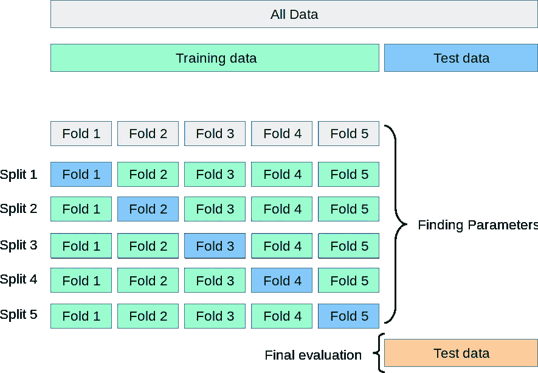

# 我做了 6 件事来持续改进我的机器学习模型

> 原文：<https://towardsdatascience.com/6-things-i-do-to-consistently-improve-my-machine-learning-models-36cd87aaf9fd?source=collection_archive---------12----------------------->

## …接近并超越 90 分的绩效

玛利亚·特内娃在 [Unsplash](https://unsplash.com?utm_source=medium&utm_medium=referral) 上拍摄的照片

我记得我在 Kaggle 上的第一堂 ML 课程。我接触了决策树，并在过度使用的 Ames Housing 数据集上执行了我的第一个“严肃的”回归任务。我太高兴了！我甚至认为机器学习并没有那么难……多么愚蠢！

事实证明，决策树就像是 ML 中的“Hello World ”,而我只是把我的小脚趾伸进了美丽的数学和数据世界。从那以后，我学到了很多，也提高了很多(或者说我认为我做到了)。

现在，我不仅仅是根据目标盲目训练我喜欢的模特。我已经不再编写模板代码，开始更加认真地对待数据预处理。由于这些变化和许多其他变化，我的模型开始取得稳健的结果，甚至在大型数据集上也经常达到 85 点以上的性能。

因此，在本文中，我将列出我学到的 6 件最重要的事情，以持续推动我的模型实现最佳性能。

<https://ibexorigin.medium.com/membership>  

获得由强大的 AI-Alpha 信号选择和总结的最佳和最新的 ML 和 AI 论文:

<https://alphasignal.ai/?referrer=Bex>  

## 1️⃣.找出控制过拟合/欠拟合的超参数

毫不奇怪，我对 ML 世界了解的第一件事是过度拟合的问题以及如何与之斗争。生成一个具有良好通用性的健壮模型是一个循序渐进的过程，初始阶段从模型初始化开始。

选择基线模型后，搜索对其目标函数影响最大的参数。通常，这些超参数直接影响模型的学习，最重要的是，它如何推广。

最好的方法是通读模型的文档。在阅读了足够多的文档后，您会发现某些关键字会立即暗示该参数与控制过拟合有关。

例如，基于树的模型和集合模型使用术语“修剪”来控制每棵树的深度。随机森林有`n_estimators`，`max_features`影响每棵树的建造。Sklearn 用户指南也说`max_depth`和`min_samples_split`很重要。

对于线性模型，最常见的关键词有*正则化*、*惩罚*等。逻辑回归和线性支持向量机具有`C`——正则化强度的逆，或存在于所有支持向量机中的`alpha`和`gamma`超参数。常见的惩罚类型被称为“L1”和“L2”，并且[山脊](https://scikit-learn.org/stable/modules/generated/sklearn.linear_model.Ridge.html) / [套索](https://scikit-learn.org/stable/modules/generated/sklearn.linear_model.Lasso.html)算法本身就支持它们。

要建立基本性能，您可以使用默认值或文档中建议的值。通常，这些值不是最佳的，应该在工作流程的最后阶段使用超参数优化器进行调整。

## 2️⃣.将数据分成 3 组，而不是 2 组

除非您仍在使用玩具数据集，否则真实世界的数据通常数量庞大。在这种情况下，您可以将数据分为 3 组(1 组训练，2 组验证)，以生成更可靠的结果。

如果不使用交叉验证，那么 1 个训练和 1 个测试集的问题又是过度拟合。你要做的所有工作都将依赖于以随机种子分割的那一对训练/测试集。在模型从训练集学习之后，您可以调整它的超参数，直到它为您的测试集提供最佳的可能得分。

这种情况下的最高分并不一定意味着您的模型现在可以很好地概括看不见的数据。这个特殊的分数只能告诉你的模型在那一小部分随机选择的样本上做得有多好。这是又一次过度拟合，只是在伪装。

一个简单的解决办法是使用另一套坚持己见的办法。模型从训练中学习，您在测试中优化它，最后，您使用第三个验证集检查它在看不见的数据上的真实性能。这里有一个帮助器函数来完成这项工作:

## 3️⃣.广泛使用交叉验证

当您的机器上没有 10+内核，并且您的数据集非常大时，最好使用最后一个技巧。

不过，如果你*真的*有这种奢侈，那就广泛使用交叉验证。了解不同类型的交叉验证，并找到适合您独特情况的交叉验证。例如，Sklearn 提供了 [12 个独特的交叉验证分裂器](https://scikit-learn.org/stable/modules/cross_validation.html)，每个分裂器都有一个共同的目的——防止我使用几个模型为每个样本生成多个预测的过度拟合。通过使用交叉验证，您可以获得以下好处:

1.  不浪费任何数据—所有折叠完成后，所有数据都被用作训练集和测试集。
2.  消除了由于意外地在过于有利的训练/测试集上进行训练而导致模型表现过于乐观的可能性。
3.  报告 ML 带来的内在不确定性——通过获得几个分数，您可以计算平均分数来查看总体性能，并查看标准偏差来了解结果可能有多大差异。

尽管交叉验证在每个折叠中内部使用 2 个集合来评估模型性能，但您仍应保留一个集合用于最终测试，如 Sklearn 用户指南中所述:

图片由 Sklearn 提供

## 5️⃣.超越简单的估算技术

当我刚开始的时候，我并不真正关心丢失的值。我玩的大多是玩具数据集，简单的均值/模式插补技术绰绰有余(谁能怪我？).

在处理了更大的数据集之后，我的方法改变了。首先，我不再盲目地应用插补技术，而是开始问为什么数据首先会丢失。更广泛地说，我探索了想念的类型。一般来说，有三种:

1.  完全随机失踪(MCAR)
2.  随机失踪(三月)
3.  非随机缺失(MNAR)

这三种类型的名称非常相似，但有细微的区别。找出丢失的数据属于哪一类可以缩小你可以用来估算它的技术。

除了均值/中值插补等简单技术之外，还有两种基于模型的方法。在 Sklearn 中，这些是:

1.  KNN 插补(`sklearn.impute.KNNImputer`)
2.  迭代插补(`sklearn.impute.IterativeImputer`)

两者都在 R 中有实现，我惊讶地发现，用于输入缺失值的 R 生态系统更加成熟。在这里讨论这些方法会偏离本文的最初目的，所以我可以向你推荐我的另一篇文章:

</going-beyond-the-simpleimputer-for-missing-data-imputation-dd8ba168d505>  

还有一个问题是哪种技术更好，效果如何。您可以使用多种技术并评估一个估计量来查看每种技术对预测的影响，但这种方法不适用于大型数据集。

我最喜欢的是绘制插补完成前后的特征分布图:

作者图片

不同 K 值的 KNN 插补比较。如您所见，K=2 时，橙色线更接近原始(蓝色)分布。

估算分布越接近原始分布，技术就越好。当然，这种方法也有缺点，尤其是当缺失值的比例很大时。

## 5️⃣.执行特征选择或降维

拥有更多数据并不总是更好。当数据具有不必要数量的预测变量(特征)时，情况肯定如此。

具有太多对估计器的预测能力没有太大贡献的特征会导致过度拟合、更多的计算成本和增加的模型复杂性。这些特征往往具有较低的方差，或者彼此之间高度相关。您可以使用 PCA 的特征选择或维度缩减来移除数据集中的冗余变量。

**特性选择**当你对每一个特性都有了深刻的理解时，技术有时是首选。甚至在应用复杂的算法之前，你可以利用你的领域知识或者仅仅通过探索每个变量是如何和为什么被收集来丢弃一些。然后，您可以使用其他技术，如基于模型的特征选择。

例如，Sklearn 提供了`SelectFromModel`或递归特征消除(RFE)包装算法来自动找到最重要的预测变量集。为了实现更高的性能，passing ensemble 算法在这里也能很好地工作。

**PCA 降维**是减少特征数量最有力的技术之一。它获取高维数据，并通过尽可能多地保留原始方差，将其投影到更低的维度(更少的特征)。Sklearn 实现的 PCA ( `sklearn.decomposition.PCA`)在 Kaggle 比赛中往往表现相当不错。

您可以直接指定想要保留的要素数量或通常执行的操作-传递一个介于 0 和 1 之间的百分比来表示想要保留的变化量。PCA 会自动找到能够解释传递方差的最小特征数。

PCA 的一个缺点是涉及到大量的数学运算，而且你会牺牲可解释性，因为在 PCA 之后，你将无法解释这些特征。

## 6️⃣.特征工程

一旦你在 ML 世界中走得足够久，你将开始越来越多地听到关于特征工程的激动人心的讨论。大多数专业人士声称特征工程是一门艺术，这是理所当然的！

特征工程是数据预处理的广义术语。它涉及的操作范围从基本的数据清理到转换现有数据，以显示特征中看不见的结构和模式。这就是为什么它被称为一门艺术——你能想出的东西没有限制，只有你的创造力和领域知识。

许多 Kaggle 大师和行业内的从业者表示，他们大部分时间都在做特征工程。在许多采访中，Kaggle 竞赛的获胜者声称特征工程是他们成功的关键(我特别听到一位 Kaggle 特级大师在被问及他如何赢得比赛时使用了“特征工程超越所有人”这一短语)。

特征工程就是充分利用你所拥有的东西。通过将给定的数据转换为其最佳形式，可以确保您执行的所有其他操作都将达到其最佳性能。机器学习大师的杰森·布朗利说得好:

> 当您的目标是从预测模型中获得尽可能好的结果时，您需要充分利用现有资源。这包括从您使用的算法中获得最佳结果。它还包括最大限度地利用数据，以供算法使用。

顺便说一句，你可以看看他关于这个话题的[世界级文章](https://machinelearningmastery.com/discover-feature-engineering-how-to-engineer-features-and-how-to-get-good-at-it/)来了解关于特性工程的炒作到底是怎么回事。

## 感谢您的阅读！！！

我希望本文中讨论的技巧能让初学者大开眼界。我通过反复试验和阅读许多其他人的作品来学习每一种语言。通过在您自己的实践中正确地应用它们，您应该能够将您的模型的性能扩展到接近 90 点性能甚至更高！

## 您可能也会感兴趣…

*   [19 个你不知道存在的 Sklearn 功能| P(保证)= 0.75](/19-sklearn-features-you-didnt-know-existed-p-guarantee-0-75-79a5e9704dad?source=your_stories_page-------------------------------------)
*   [6 Sklearn 默默告诉你是菜鸟的错误](/19-sklearn-features-you-didnt-know-existed-p-guarantee-0-75-79a5e9704dad?source=your_stories_page-------------------------------------)
*   [训练机器学习模型时要做的 5 件超级高效的事情](/5-short-but-super-productive-things-to-do-during-model-training-b02e2d7f0d06?source=your_stories_page-------------------------------------)