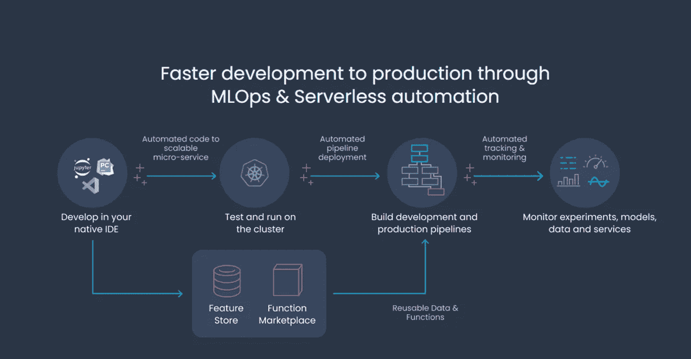
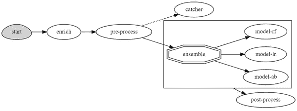
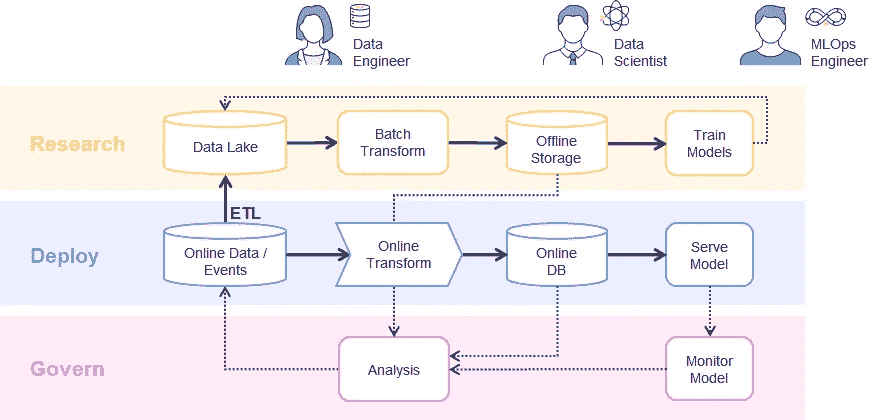
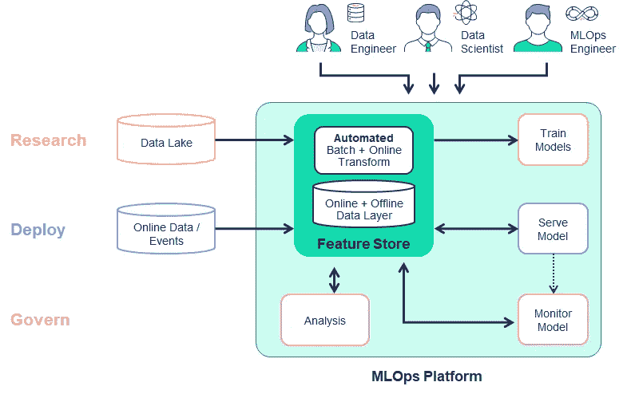
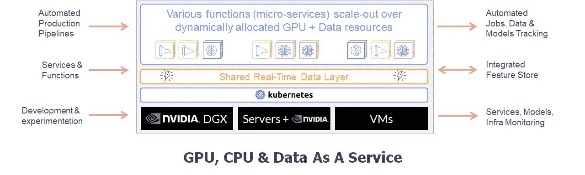
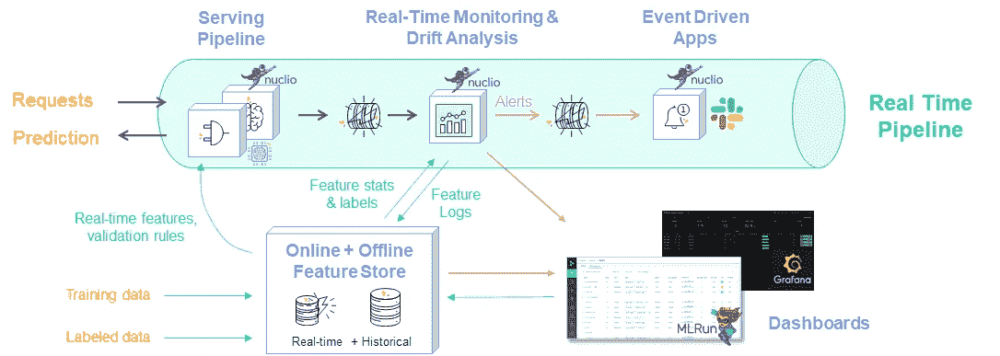
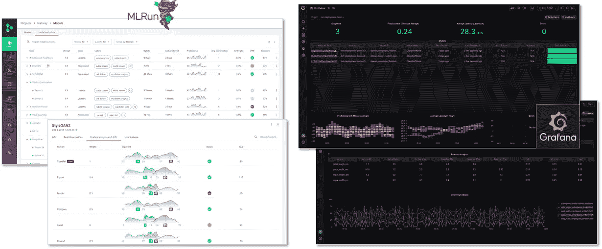

# MLOps 加速和简化的 6 个技巧

> 原文：<https://towardsdatascience.com/6-tips-for-mlops-acceleration-simplification-36539adab29b?source=collection_archive---------25----------------------->

(图片由作者提供)

MLOps(机器学习操作)是通过将数据科学应用于生产来提高企业生产力的关键。因此，对于任何想通过人工智能获得竞争优势的公司来说，这是必不可少的。在这篇文章中，我将根据我在全球企业中的经验，介绍六个技巧和最佳实践来加速和简化您的生产之路。这是我在 NVIDIA 最近的 GTC 会议上的一次演讲的概述，你可以点击这里查看。希望你觉得有用！

# 挑战#1:漫长而艰难的生产之路

在研究中开发模型仅仅是个开始。要确保该模型在线运行并在实际业务应用中产生价值，仍有许多步骤需要完成。其中包括:

*   将代码、脚本、依赖项和配置打包到容器中
*   大规模收集和准备来自运营和在线来源的数据
*   用大规模数据、各种算法和参数训练模型
*   将模型整合到实时/交互式管道中，从实时数据中获取信息
*   监控模型准确性并创建自动化再培训工作流
*   为每一步添加工具、跟踪、版本控制和安全性
*   重构代码以提高性能，从而满足应用 SLA
*   创建持续开发和交付(CI/CD)管道

完成这些过程可能需要几个月的时间，而且是资源密集型的。

# 解决方案:整合自动化并采用无服务器方法

生产过程自动化可以将时间从几个月缩短到几周。这可以通过无服务器框架来实现，该框架可以自动将简单的代码或笔记本转换为受管的弹性微服务。开源工具可以提供帮助，比如 [MLRun](https://www.iguazio.com/open-source/mlrun/) ，一个[开源](https://github.com/mlrun/mlrun) MLOps 编排框架。(完全披露:我和我的团队维护它)。MLRun 自动将代码转换成强大的无服务器函数，并允许将多个函数简单地组合成批处理、CI/CD 或实时管道。

MLRun 功能完全由自动跟踪、监控、日志、版本控制、安全性和水平可伸缩性管理，这有助于消除大量开发和开发运维工作。它们还在不影响性能或可扩展性的情况下加快了生产速度。

在 MLRun 中，我们可以使用自己的功能或市场功能进行数据准备、培训、模型测试、服务等。然后，我们可以在几分钟内组成复杂的 ML 管道，并通过完整的实验跟踪和工件版本控制来大规模运行它们。

MLRun 开发流程(图片作者提供)

MLRun 支持多个无服务器运行时引擎(job、dask、spark、MPI/Horovod、Nuclio..)来大规模解决各种工作负载(数据分析、机器学习、深度学习、流、API、服务……)。它支持多个管道/CI 引擎来运行 ML 工作流，包括 Kubeflow 管道、Github 操作、GitLab CI/CD 等。

函数还可以用于组成实时生产管道、处理流处理、数据丰富、模型服务、集成、监控等等。MLRun 实时管道构建在流行的高性能开源无服务器框架 [Nuclio](https://nuclio.io/) 之上(我和我的团队也维护这个框架)。

MLRun 服务图表示例(图片由作者提供)

查看[服务图](https://docs.mlrun.org/en/latest/serving/graph-example.html)和[分布式 NLP 管道](https://docs.mlrun.org/en/latest/serving/distributed-graph.html)的示例笔记本，了解使用 MLRun 部署实时生产管道有多简单。

# 挑战#2:重复工作和孤立工作导致的低效率

机器学习工作在不同的团队之间进行分配:数据科学、工程和 MLOps。这些团队中的每一个都使用不同的工具集，这使得协作非常困难，并迫使资源密集型代码和管道重构。此外，在当前的实践中，团队最终构建了三个独立的管道架构来解决研究、生产和治理需求，这导致了资源腰部和代码重构或重新实现。

数据科学管道(图片由作者提供)

从图中我们可以看到，数据转换逻辑在研究和生产管道中并不相同，导致了不准确的特征和模型结果。更不用说重复劳动了。

# 解决方案:整合数据科学、数据工程和开发运维的平台和流程

通过一个统一的面向生产的工作流程和支持协作的技术整合所有工作，将使团队能够协同工作。它还将提高准确性，并为组织快速、持续地部署人工智能。这符合所有利益相关者的需要。

例如，数据科学家将能够构建功能，而无需不断向数据工程师请求数据，MLOps 团队将能够重新部署，而无需重新设计，等等。此外，利用平台核心的功能存储可以统一所有三种使用情形(研究、生产和管理)的数据收集、转换和编目流程，从而在 MLOps 流程中最耗费人力的部分之一节省时间和精力。

拥有一个端到端的平台来整合这一切:特征库、ML 训练管道、模型服务和监控，这对实现加速和自动化非常重要。这样一个平台节省了时间、精力以及将不同组件拼接在一起以获得完整的企业级工作解决方案的麻烦。

MLOps 平台架构(图片由作者提供)

# 挑战#3:未充分利用的资源和有限的扩展

当每个开发人员或团队都有自己的专用硬件、虚拟机或 GPU 时，结果就是基础架构孤岛。这些孤岛导致资源浪费和管理复杂性。与将所有这些资源聚集在一起相比，它们还会限制我们大规模处理数据或缩短执行时间的能力。

企业希望确保他们利用在人工智能基础设施上的投资，以确保他们的计算，数据和 GPU 资源得到充分利用。

# 解决方案:使用共享的弹性资源池

将资源集中到一个可以动态收缩或增长的弹性集群中，将实现资源共享、更智能的分配和资源节约。找到一个解决方案，加快生产时间，并充分利用您的人工智能基础设施。

这里有一个这样的例子:

(作者图片)

通过采用服务器和虚拟机，在集群上运行 Kubernetes，添加数据层以跨微服务移动数据，并在集群上调度工作负载，您应该能够获得更好的规模和性能。包括一套工具、不同方面的服务、开发环境和跟踪方面。，这将加速 TTP，并确保消耗更少的资源，池是共享的，并且可以根据需要运行更大规模的工作负载。

# 挑战#4:处理数据和特性占用了您团队 80%的时间

处理数据需要大量的工作。虽然 AutoML 工具已经变得越来越普及，并且简化了模型构建部分，但是您仍然需要不断地使用、准备、存储和接收特定于应用程序的数据。数据处理是 ML 中最耗时和资源密集型的任务。

# 解决方案:使用特征库来简化特征工程

特征工程能够将我们的原始数据转化为有意义的东西，以满足 ML 工作负载。例如，添加活动时间、聚合数据和计算统计数据、连接不同来源的数据、运行情感分析、图片旋转等等。然后，这些功能可用于培训离线数据、在线生产管道以及监控和治理。

这个挑战的解决方案是一个[功能商店。](https://www.iguazio.com/feature-store/)功能商店是构建用于自动创建培训和生产功能的管道的中心位置。优步、Twitter 和 Spotify 等科技巨头建立了自己的功能商店，而功能商店的开源和商业工具很少。当你选择你的，一定要检查它是否符合你的需要。例如，如果您计划接收流数据，请检查要素存储是否可以即时运行计算并执行连接、聚合等操作。，以及它与其他 MLOps 组件的集成程度。

# 挑战#5:不准确的模型和有限的可见性

只有我们保持相同的数据、假设和行为，模型才会保持准确。但是这种情况很少发生，因为这些变化总是会导致模型漂移和不准确。

例如，新冠肺炎显著改变了消费者的行为，从购买更多的食物到减少航班。如果您的模型没有相应地修改，它们将产生无效和不准确的结果。

我们必须不断监控我们的数据和模型，并在它们出现偏差时发出警报。如果不能及时发现和识别这些挑战，模型将会不准确，这会导致负面的业务结果或法律风险。

# 解决方案:确保模型监控和再培训构建到您的 MLOps 管道中

在您的[MLOps 管道](https://www.iguazio.com/mlops/)中包含一个反馈和漂移感知系统，以测量预测结果和实际结果之间的差异。系统应该会触发警报，这样您就可以对变更采取行动，例如重新训练模型、切换模型等。

这个反馈系统的模型应该跟踪实时流中的一切，函数从特征存储中获取统计信息，并将其与实时行为进行比较。如果识别出不当行为，将向微服务触发警报。然后，微服务将通过电子邮件向您触发警报，重新培训或切换模型，或运行任何其他自定义操作。

带监控的生产管道(图片由作者提供)

使用 MLRun 时，模型活动在数据库中被跟踪，并使用 Grafana 或 MLRun 仪表板可视化。以下是一些仪表板快照:

MLRun & Grafana 中的模型监控(图片由作者提供)

# 挑战#6:不断发展的工具集和陡峭的学习曲线

MLOps 和数据科学背后有很多技术，并且有大量的工具，而且数量还在不断增加。理解你需要什么来开始，或者支持一个特定的用例，这可能是压倒性的。数据局部性、安全性、协作等考虑因素。都需要考虑。通常，一旦你对你的人工智能基础设施软件栈做出决定，一些新的东西就会出现并改变这个等式…

# 解决方法:采取一种“开放但有管理的”心态

您希望您的堆栈面向未来。您希望能够利用不断增长的数据科学社区的最新更新。我同意这种方法，并且总是建议尽可能多地使用开源工具。除了它们的质量，开源社区还提供了很多答案和支持。然而，根据您的需要，您自己集成、维护、保护和支持它们可能会变得非常困难。这就是领先的开源工具和托管服务体验的预烤堆栈可能会有所帮助，并帮助您专注于构建您的人工智能应用程序。

MLOps 可能令人生畏，但分享我们的集体经验将使我们更聪明、更快。我希望我的文章对你有所帮助，如果你愿意，你可以在这里观看我的完整演讲。