# 自定义熊猫数据框显示的 5 个技巧

> 原文：<https://towardsdatascience.com/6-tips-to-customize-the-display-of-your-pandas-data-frame-ce5a8caa7783?source=collection_archive---------17----------------------->

## 使 Jupyter 笔记本中的数据框更加直观


图片来自 [Pixabay](https://pixabay.com/?utm_source=link-attribution&amp;utm_medium=referral&amp;utm_campaign=image&amp;utm_content=314153) 的 [Mocho](https://pixabay.com/users/mocho-156870/?utm_source=link-attribution&amp;utm_medium=referral&amp;utm_campaign=image&amp;utm_content=314153)

Pandas 是数据科学社区中最受欢迎的 Python 库之一，因为它为数据探索和可视化提供了灵活的数据结构和庞大的 API。数据科学家花费大部分时间探索数据和执行探索性数据分析。Jupyter Notebook 提供了一个交互式平台来执行探索性数据分析，最受数据科学家和数据分析师的青睐。

`**dataframe.head()**` 是来自 Pandas 包的一个函数，用来显示数据帧的前 5 行。Pandas 使用预定义的 HTML+CSS 命令在笔记本上以格式化的方式显示数据框。默认情况下，我们受到笔记本中熊猫数据框显示的行数和列数的限制。有时，有必要改变显示格式，使 EDA 更加直观和格式化。使用`**pandas.options.display**` 选项可以改变数据框的格式。

30+显示选项可以改变，以自定义显示格式；在本文中，我们将讨论 5 个流行的自定义数据框显示格式的技巧，以使其更加直观。

```
***Checklist:***
**1\. Display of Columns
2\. Display of Rows
3\. Width of the cell
4\. Decimal value formatting
5\. Data frame info**
```

在开始之前，我使用`**pd**`作为熊猫库的别名，`**import pandas as pd**` ，`**df**`是指向数据集的变量。

# **1。改变列的显示:**

使用 Pandas 加载数据集后，我们会受到输出显示单元格中列数的限制。`df.head()`Pandas 库中的函数对于获得数据帧前 5 行的第一次切割概览至关重要。列的数量是有限的，这使得很难可视化整个列集。

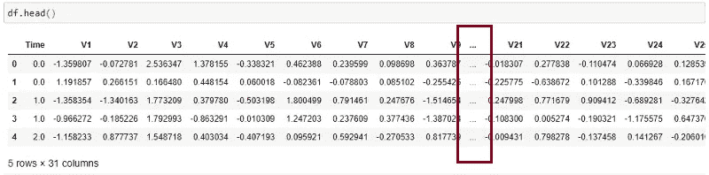

(图片由作者提供)，默认 max_columns 的数据框显示

默认情况下，输出显示限制为 20 列，前 10 列和后 10 列由三个点分隔显示。


您可以选择改变输出单元格中显示的列数。使用`**pd.set_option(“display.max_columns”, x)**`，显示的列数将变为`**x**`。如果代替 x 传递的是 **None** ，那么所有的列都将显示在输出单元格中。

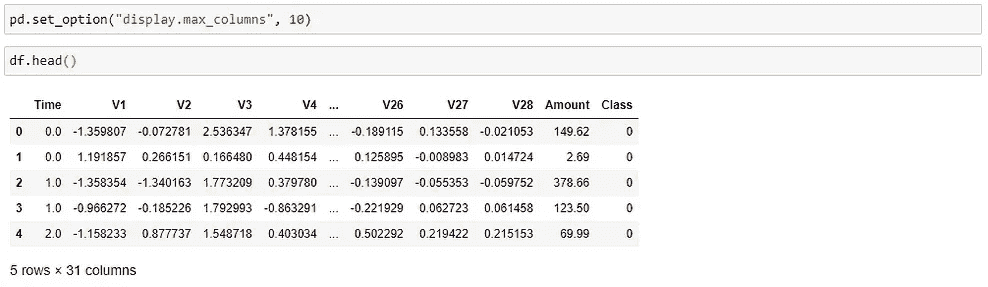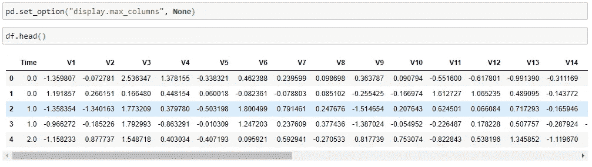

(图片由作者提供)，**左:**显示 max_columns 设置为 10，**右:**显示 max_columns 设置为 None

通过改变列数的显示选项，可以非常直观地得到数据框的第一次切割可视化。

# 2.改变行的显示:

Pandas 还提供更改数据框行的显示选项。默认情况下，Pandas 将截断超过 60 行的行，并在输出单元格中只显示顶部和底部的 5 行。

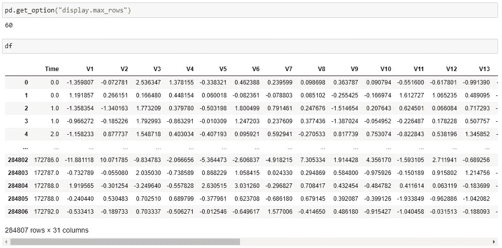

(按作者排序的图像)，默认 max_rows 的示例数据集显示

用户可以使用`pd.set_option(“display.max_rows”, x)`改变输出单元格中显示的行数，当用 x 替换 None 时，显示数据框中的所有行。用户可以向下滚动并可视化数据框的值。

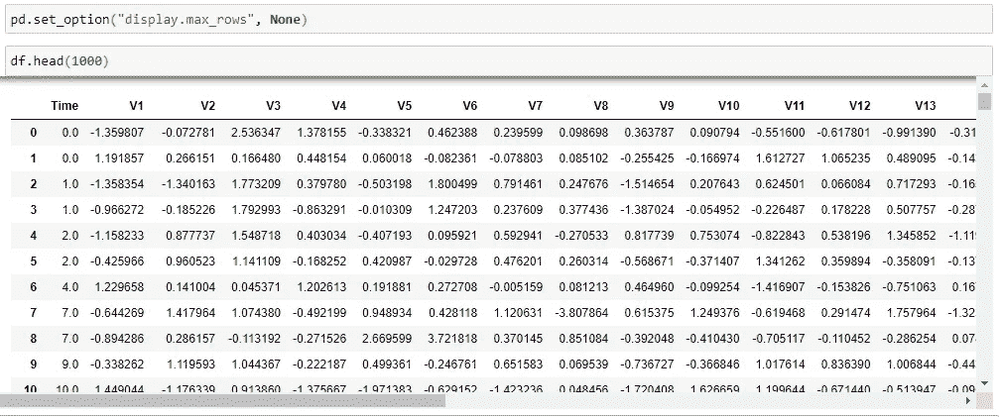

(按作者排序的图像)，max_rows = None 的示例数据集显示

# 3.改变单元格的宽度:

Pandas 显示选项不仅可以改变输出像元中显示的行数和列数，还可以改变数据框像元的宽度。默认情况下，单元格的最大宽度可以是 50。超过 50 个字符的单元格，剩余的字符将被截断。

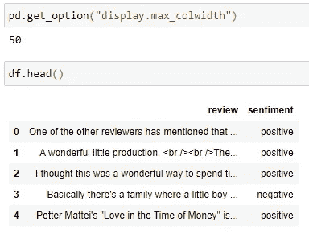

(作者图片)，显示默认列宽

在上面的示例数据集中，review 列中的文本值在 50 个字符后被截断。`**pandas.display.options**`提供使用`**pd.set_option(“display.max_colwidth”, x)**`改变输出单元格中显示的字符数的功能，其中 x 是字符数。

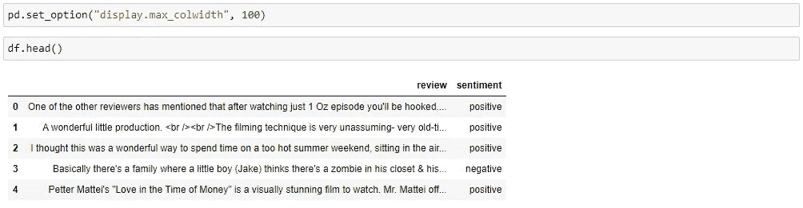

(图片由作者提供)，**左:**显示 max_colwidth = 100，**右:**显示 max_colwidth = 200

# 4.十进制数值格式:

默认情况下，Pandas 将数据框中的浮点值格式化为 6 位小数，对于小数点后超过 6 位的值。


(按作者分类的图像)，具有默认精度的样本数据集

如果您打印第一行`V1`列的值，我们会得到小数点后有 13 位的真实特征值`*-1.3598071336738*` *。*

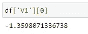

`pandas.display.options`提供改变浮点数精度的能力，使用`pd.set_option(“display.precision”, x)`其中 x 是精度。

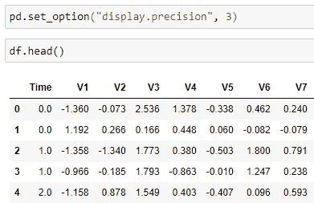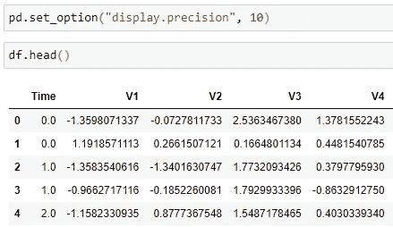

(图片由作者提供)，**左:**样本数据集显示精度= 3，**右:**样本数据集显示精度= 10

更改要素值的精度实际上不会影响数据集，但会限制笔记本输出像元中的显示。

# 5.数据帧信息:

`dataframe.info()`是 Pandas 中的一个常用功能，用于获取数据框的概况。这将显示数据框的列名、非空值计数、列的数据类型。

info()函数将其约束限制在包含 100 个要素或列的数据框内。下图显示了 info()函数为只有两个要素的数据集返回的内容。

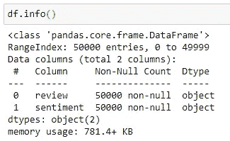

(图片由作者提供)，IMDB 数据集的数据框剖面图

对于具有超过 100 个特征的数据集，`**info()**`函数不返回列名、非空值计数和每个列的数据类型。

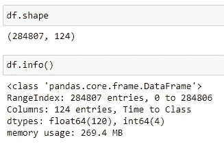

(按作者分类的图片)，列数大于 100 的数据集的数据框剖面

用户可以改变`**max_info_columns**`的默认约束，以获得数据框的整个轮廓概览。

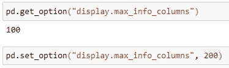

# 结论:

在本文中，我们讨论了如何改变熊猫数据框中的显示选项。文章中提到的 6 个技巧在执行数据理解和数据探索任务时非常有用。通过改变上面讨论的显示选项，可以更好地可视化笔记本中的数据框。

# 参考资料:

[1]熊猫文档:[https://Pandas . pydata . org/Pandas-docs/stable/user _ guide/options . html](https://pandas.pydata.org/pandas-docs/stable/user_guide/options.html)

> 感谢您的阅读