# 机器学习可解释性的 6 个顶级 Python 包

> 原文：<https://towardsdatascience.com/6-top-python-packages-for-machine-learning-interpretability-f9fec3c2d1e9?source=collection_archive---------15----------------------->

## 你需要解释你的机器学习模型


作者图片

> 如果您喜欢我的内容，并希望获得更多关于数据或数据科学家日常生活的深入知识，请考虑在此订阅我的[简讯。](https://cornellius.substack.com/welcome)

开发机器学习模型是任何数据科学家都应该做的事情。我遇到过许多数据科学研究，它们只关注建模方面和评估，而没有解释。

然而，许多人还没有意识到机器学习可解释性在业务流程中的重要性。根据我的经验，业务人员会想知道模型是如何工作的，而不是度量评估本身。

这就是为什么在这篇文章中，我想向你介绍我的一些顶级的机器学习可解释性 python 包。让我们开始吧！

# 1.黄砖

[Yellowbrick](https://www.scikit-yb.org/en/latest/about.html) 是一个开源的 Python 包，它用可视化分析和诊断工具扩展了 scikit-learn [API](http://scikit-learn.org/stable/modules/classes.html) 。对于数据科学家，Yellowbrick 用于评估模型性能和可视化模型行为。

Yellowbrick 是一个多用途的软件包，您可以在日常建模工作中使用。尽管 Yellowbrick 的大部分解释 API 都是基础级别的，但它对于我们的第一个建模步骤仍然很有用。

让我们用一个数据集例子来试试 Yellowbrick 包。首先，让我们安装软件包。

```
pip install yellowbrick
```

安装完成后，我们可以使用 Yellowbrick 中的数据集示例来测试这个包。

```
#Pearson Correlation

from yellowbrick.features import rank2d
from yellowbrick.datasets import load_credit

X, _ = load_credit()
visualizer = rank2d(X)
```

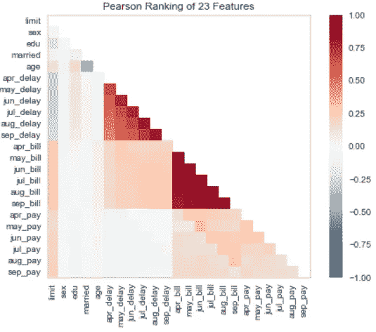

使用 Yellowbrick rank2d 函数的 Pearson 相关性(图片由作者提供)

通过一条线，我们能够使用皮尔逊相关方法来可视化特征之间的相关性。它是可定制的，因此您可以使用另一个相关函数。

让我们尝试开发模型来评估模型性能和解释模型。我将使用 Yellowbrick 用户指南中的示例数据集，并生成一个区分阈值图，以找到区分二进制类的最佳阈值。

```
from yellowbrick.classifier import discrimination_threshold
from sklearn.linear_model import LogisticRegression
from yellowbrick.datasets import load_spamX, y = load_spam()
visualizer = discrimination_threshold(LogisticRegression(multi_class="auto", solver="liblinear"), X,y)
```

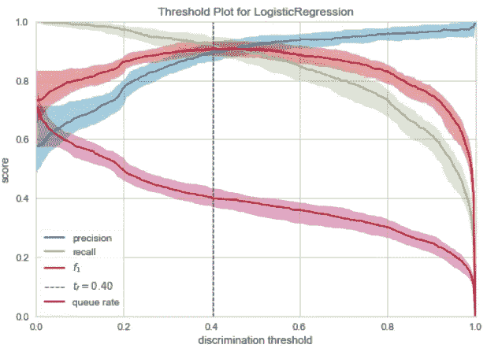

由 Yellowbrick 绘制的阈值图(图片由作者提供)

使用黄砖阈值图，我们可以解释该模型在概率阈值为 0.4 时表现最佳。

如果你好奇 Yellowbrick 能做什么，请访问[主页](https://www.scikit-yb.org/en/latest/index.html)了解更多信息。

# 2.ELI5

[ELI5](https://github.com/TeamHG-Memex/eli5) 是一个帮助机器学习可解释性的 Python 包。取自 Eli5 包，该包的基本用途是:

1.  检查模型参数，并尝试弄清楚模型如何全局工作；
2.  检查模型的单个预测，并找出模型做出决策的原因。

如果说 Yellowbrick 侧重于特征和模型性能解释，那么 ELI5 侧重于模型参数和预测结果。就我个人而言，我更喜欢 ELI5，因为它的解释足够简单，商务人士可以理解。

让我们用一个样本数据集和随机森林模型分类器来试试 ELI5 包。我会使用 seaborn 包中的数据集，因为它是最简单的。

```
#Preparing the model and the dataset
from sklearn.ensemble import RandomForestClassifier
from sklearn.model_selection import train_test_splitmpg = sns.load_dataset('mpg').dropna()
mpg.drop('name', axis =1 , inplace = True)#Data splitting
X_train, X_test, y_train, y_test = train_test_split(mpg.drop('origin', axis = 1), mpg['origin'], test_size = 0.2, random_state = 121)#Model Training
clf = RandomForestClassifier()
clf.fit(X_train, y_train)
```

最基本的 ELI5 功能是显示分类器权重和分类器预测结果。让我们尝试这两个函数来理解解释是如何产生的。

```
import eli5
eli5.show_weights(clf, feature_names = list(X_test.columns))
```

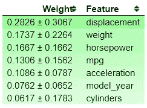

分类器特征重要性权重(作者图片)

从上面的图像中，您可以看到分类器显示了分类器特征的重要性及其偏差。您可以看到位移特征是最重要的特征，但是它们有很高的偏差，表明模型中存在偏差。让我们试着展示一下预测结果的可解释性。

```
eli5.show_prediction(clf, X_train.iloc[0])
```

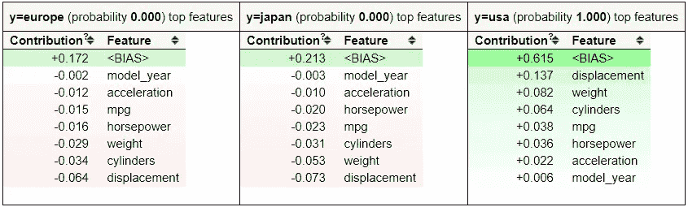

预测结果贡献(图片由作者提供)

使用 ELI5 的显示预测功能，我们可以获得特征贡献信息。哪些特征有助于某些预测结果，这些特征对概率的影响有多大。这是一个很好的功能，您可以轻松地向业务人员解释模型预测。

然而，最好记住上面的函数是基于树的解释(因为我们使用随机森林模型)。给你一个商业人士的解释可能就足够了；但是，由于模型的原因，可能会有偏差。这就是为什么 ELI5 提供了另一种方法来解释基于模型度量的黑盒模型——它被称为排列重要性。

让我们先试试排列重要性函数。

```
#Permutation Importance
perm = PermutationImportance(clf, scoring = 'accuracy',
random_state=101).fit(X_test, y_test)
show_weights(perm, feature_names = list(X_test.columns))
```

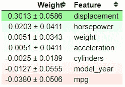

排列重要性结果(图片由作者提供)

排列重要性背后的思想是如何评分(准确度、精确度、召回率等。)随着特征的存在或不存在而移动。在上面的结果中，我们可以看到 displacement 的得分最高，为 0.3013。当我们改变位移特征时，它将改变模型的精度高达 0.3013。正负符号后的值是不确定度值。排列重要性方法本质上是一个随机过程；这就是为什么我们有不确定值。

位置越高，这些特征对得分的影响越大。底部的一些特征显示了一个负值，这很有趣，因为这意味着当我们改变特征时，该特征增加了得分。发生这种情况是因为，偶然地，特征排列实际上提高了分数。

就我个人而言，ELI5 已经给了我足够的机器学习可解释性，但我仍然想向您介绍一些 Python 包。

# 3.SHAP

如果我们在谈论机器学习的可解释性时不提及 [SHAP](https://shap.readthedocs.io/en/latest/index.html) ，那就不完整。对于那些从未听说过它的人来说，SHAP 或**(SHapley Additive explaints)**是一种解释任何机器学习模型输出的博弈论方法。用一个更简单的术语来说，SHAP 用 SHAP 值来解释每个特征的重要性。SHAP 利用 SHAP 值之间的差异对模型的预测和零模型进行了开发。SHAP 是模型不可知的，类似于排列重要性，所以它对任何模型都是有用的。

让我们尝试使用样本数据集和模型来更详细地解释 SHAP。首先，我们需要安装 SHAP 软件包。

```
#Installation via pip
pip install shap #Installation via conda-forge 
conda install -c conda-forge shap
```

在这个示例中，我将使用 titanic 示例数据集，并且只依赖数字列。这仅用于示例目的，不应成为数据分析的标准。

```
#Preparing the model and the dataset 
from sklearn.ensemble import RandomForestClassifier
from sklearn.model_selection import train_test_split titanic = sns.load_dataset('titanic').dropna() 
titanic = titanic[['survived', 'age', 'sibsp', 'parch']] #Data splitting for rfc X_train, X_test, y_train, y_test = train_test_split(titanic.drop('survived', axis = 1), titanic['survived'], test_size = 0.2, random_state = 121) #Model Training 
clf = RandomForestClassifier() clf.fit(X_train, y_train)
```

我们已经用泰坦尼克号的数据训练了我们的数据，现在我们可以试着用 SHAP 来解释这些数据。让我们利用模型的全局可解释性来理解 SHAP 是如何工作的。

```
import shap 
shap_values = shap.TreeExplainer(clf).shap_values(X_train) shap.summary_plot(shap_values, X_train)
```

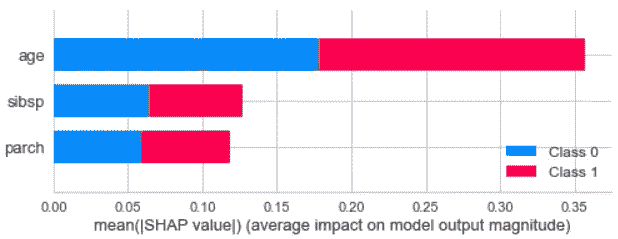

要素对预测结果的总体影响(图片由作者提供)

从结果可以看出，年龄特征对预测结果的贡献最大。如果您想查看特定类对预测的贡献，我们只需要稍微调整一下代码。假设我们要查看类 0，这意味着我们使用下面的代码。

```
shap.summary_plot(shap_values[0], X_train)
```

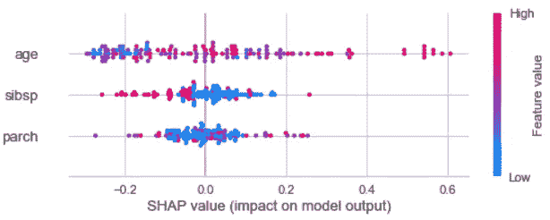

功能对类 0 的影响(图片由作者提供)

从上图中，我们可以看到每个数据对预测概率的贡献。颜色越红，数值越高，反之亦然。此外，当该值在正侧时，它有助于类 0 预测结果概率，反之亦然。

SHAP 不局限于全球可解释性；它还为您提供了解释单个数据集的功能。让我们尝试解释第一行的预测结果。

```
explainer = shap.TreeExplainer(clf)
shap_value_single = explainer.shap_values(X = X_train.iloc[0,:])
shap.force_plot(base_value = explainer.expected_value[1],
                shap_values = shap_value_single[1],
                features = X_train.iloc[0,:])
```

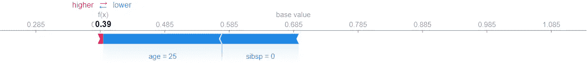

第一行的单个预测结果解释(图片由作者提供)

从上图中可以看出，预测更接近于 0 类，因为它是由 age 和 sibsp 功能推动的，而 parch 功能的贡献很小。

# 4.Mlxtend

Mlxtend 或**机器学习扩展**是一个用于数据科学日常工作生活的 Python 包。包中的 API 并不局限于可解释性，而是扩展到各种功能，比如统计评估、数据模式、图像提取等等。然而，我们将讨论我们当前文章的可解释性 API 绘制的**决策区域。**

决策区域图 API 将生成一个决策区域图，以可视化该特征如何决定分类模型预测。让我们尝试使用示例数据和来自 Mlxtend 的指南。

首先，我们需要安装 Mlxtend 包。

```
pip install Mlxtend
```

然后，我们使用示例数据集并开发一个模型来查看 Mlxtend 的运行情况。

```
import numpy as np
import matplotlib.pyplot as plt
import matplotlib.gridspec as gridspec
import itertools
from sklearn.linear_model import LogisticRegression
from sklearn.svm import SVC
from sklearn.ensemble import RandomForestClassifier
from mlxtend.classifier import EnsembleVoteClassifier
from mlxtend.data import iris_data
from mlxtend.plotting import plot_decision_regions# Initializing Classifiers
clf1 = LogisticRegression(random_state=0)
clf2 = RandomForestClassifier(random_state=0)
clf3 = SVC(random_state=0, probability=True)
eclf = EnsembleVoteClassifier(clfs=[clf1, clf2, clf3], weights=[2, 1, 1], voting='soft')# Loading some example data
X, y = iris_data()
X = X[:,[0, 2]]# Plotting Decision Regions
gs = gridspec.GridSpec(2, 2)
fig = plt.figure(figsize=(10, 8))for clf, lab, grd in zip([clf1, clf2, clf3, eclf],
                         ['Logistic Regression', 'Random Forest', 'RBF kernel SVM', 'Ensemble'],
                         itertools.product([0, 1], repeat=2)):
    clf.fit(X, y)
    ax = plt.subplot(gs[grd[0], grd[1]])
    fig = plot_decision_regions(X=X, y=y, clf=clf, legend=2)
    plt.title(lab)
plt.show()
```

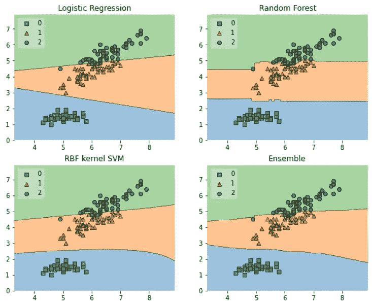

基于不同机器学习分类器的决策区域绘制(图片由作者提供)

从上面的图中，我们可以解释模型做出的决定。当他们做出预测时，你可以看到每个模型之间的差异。例如，X 轴值越高，类 1 的逻辑回归模型预测结果越大，但 Y 轴上没有太大变化。它与随机森林模型形成对比，在随机森林模型中，划分不会随着 X 轴值发生很大变化，而 Y 轴值对于每个预测都似乎是恒定的。

决策区域的唯一缺点是它仅限于二维特征，因此它对于预分析比实际模型本身更有用。然而，它对于与商务人士的交谈仍然是有用的。

# 5.PDPBox

PDP 或**部分依赖图**是显示特征对机器学习模型的预测结果的边际效应的图。它用于评估特征和目标之间的相关性是线性的、单调的还是更复杂的。

用部分依赖情节来解释的好处是对于商务人士来说很容易解释。这是因为部分相关函数的计算足够直观，人们可以理解:当我们干预一个特征时，部分相关图的计算具有因果解释，并且我们测量预测中的变化；这是我们可以衡量解释的时候。

让我们尝试使用用户指南中的样本数据来更好地理解 [PDPBox](https://github.com/SauceCat/PDPbox) 。首先，我们需要安装 PDPBox 包。

```
pip install pdpbox
```

然后，我们可以尝试按照[用户指南](https://github.com/SauceCat/PDPbox/blob/master/tutorials/pdpbox_binary_classification.ipynb)了解更多关于 PDPBox 如何帮助我们创建可解释的机器学习的信息。

```
import pandas as pd
from pdpbox import pdp, get_dataset, info_plots#We would use the data and model from the pdpboxtest_titanic = get_dataset.titanic()titanic_data = test_titanic['data']
titanic_features = test_titanic['features']
titanic_model = test_titanic['xgb_model']
titanic_target = test_titanic['target']
```

当我们有了数据和模型后，让我们尝试使用 info plots 函数来检查特征和目标之间的信息。

```
fig, axes, summary_df = info_plots.target_plot(
    df=titanic_data, feature='Sex', feature_name='gender', target=titanic_target
)
_ = axes['bar_ax'].set_xticklabels(['Female', 'Male'])
```

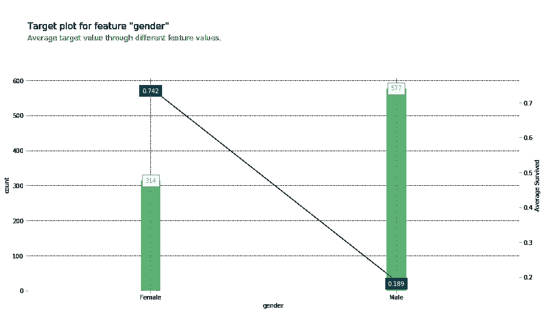

二进制特征的目标图(来源:[https://github . com/sauce cat/PDPbox/blob/master/tutorials/PDPbox _ binary _ class ification . ipynb)](https://github.com/SauceCat/PDPbox/blob/master/tutorials/pdpbox_binary_classification.ipynb))

用一个函数就可以得到目标和特征的统计信息。使用该功能很容易向商务人士解释。让我们一起检查模型预测分布函数和特征。

```
fig, axes, summary_df = info_plots.actual_plot(
    model=titanic_model, X=titanic_data[titanic_features], feature='Sex', feature_name='gender')
```

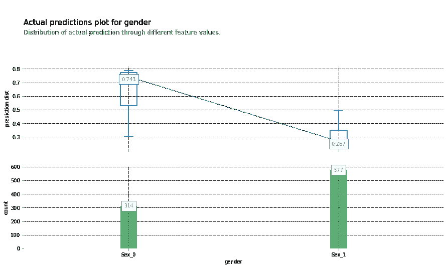

二元特征的实际预测图(来源:[https://github . com/sauce cat/PDP box/blob/master/tutorials/PDP box _ binary _ class ification . ipynb)](https://github.com/SauceCat/PDPbox/blob/master/tutorials/pdpbox_binary_classification.ipynb))

现在，让我们继续使用 PDP 绘图功能来解释我们的模型预测。

```
pdp_sex = pdp.pdp_isolate(
    model=titanic_model, dataset=titanic_data, model_features=titanic_features, feature='Sex')fig, axes = pdp.pdp_plot(pdp_sex, 'Sex')
_ = axes['pdp_ax'].set_xticklabels(['Female', 'Male'])
```

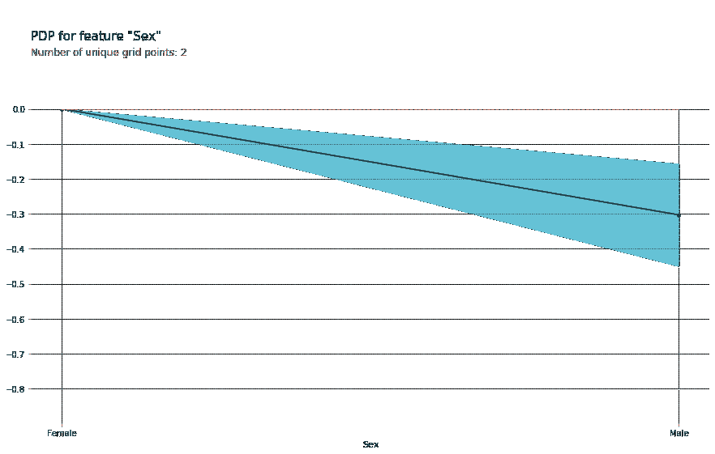

性特征 PDP 剧情(来源:[https://github . com/sauce cat/PDP box/blob/master/tutorials/PDP box _ binary _ class ification . ipynb)](https://github.com/SauceCat/PDPbox/blob/master/tutorials/pdpbox_binary_classification.ipynb))

从上图中，我们可以理解为，当性别特征为男性时，预测概率会降低(意味着男性存活的可能性更小)。这就是我们如何使用 PDPbox 来获得模型可解释性。

# 6.解释性语言

[InterpretML](https://interpret.ml/docs/getting-started.html) 是一个 Python 包，包含了很多机器学习可解释性 API。这个软件包的目的是给你一个基于 plotly 的交互式绘图，以了解你的预测结果。

通过使用我们已经讨论过的许多技术——即 SHAP 和 PDP，InterpretML 为您提供了许多解释您的机器学习(全局和局部)的方法。此外，这个包拥有一个 Glassbox 模型 API，当您开发模型时，它为您提供了一个可解释性函数。

让我们用一个样本数据集来试试这个包。首先，我们需要安装 InterpretML。

```
pip install interpret
```

我想用解释的玻璃盒子模型给你一个例子，因为，对我个人来说，使用起来很有趣。让我们尝试使用 titanic 数据集样本来开发模型。

```
from sklearn.model_selection import train_test_split
from interpret.glassbox import ExplainableBoostingClassifier
import seaborn as sns#the glass box model (using Boosting Classifier)
ebm = ExplainableBoostingClassifier(random_state=120)titanic = sns.load_dataset('titanic').dropna()#Data splitting
X_train, X_test, y_train, y_test = train_test_split(titanic.drop(['survived', 'alive'], axis = 1), 
                                                    titanic['survived'], test_size = 0.2, random_state = 121)
#Model Training
ebm.fit(X_train, y_train)
```

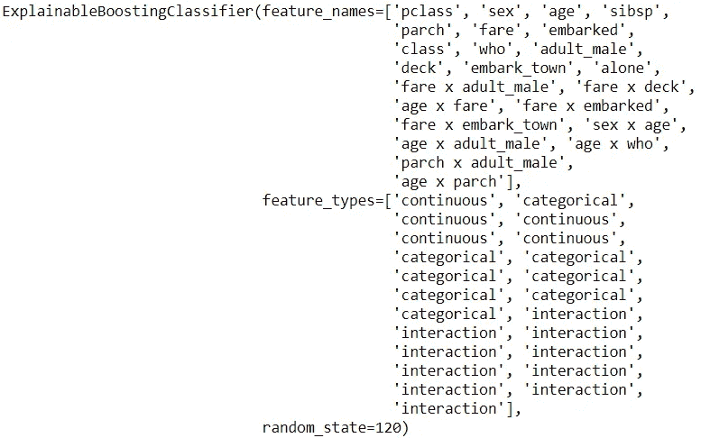

由玻璃盒模型开发的模型和特征结果(图片由作者提供)

使用 InterpretML 中的玻璃盒模型，它会自动对您的特征进行热编码，并为您设计交互特征。让我们试着为这个模型找到一个全局的解释。

```
from interpret import set_visualize_provider
from interpret.provider import InlineProvider
set_visualize_provider(InlineProvider())from interpret import showebm_global = ebm.explain_global()
show(ebm_global)
```

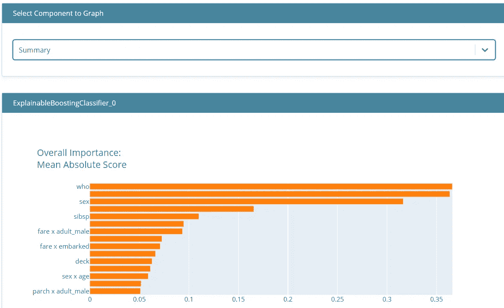

玻璃盒子全球解读(图片由作者提供)

从上图中，我们可以看到模型特征重要性的总结。它显示了基于模型特征重要性的所有被认为重要的特征。

可解释的是一个交互式的图，您可以用它来更具体地解释模型。如果我们只看到上图中的摘要，我们可以选择另一个组件来指定您想要看到的特性。这样，我们可以解释模型中的特征如何影响预测。

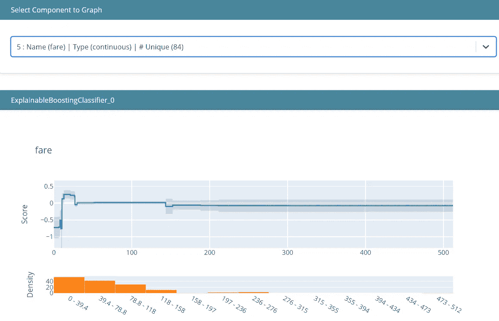

票价全球可解释性(图片由作者提供)

在上图中，我们可以看到低票价降低了生存的机会，但随着票价变高，它增加了生存的机会。然而，你可以看到密度和条形图-许多人来自一个较低的票价。

很多时候，我们不仅对全局的可解释性感兴趣，也对局部的可解释性感兴趣。在这种情况下，我们可以使用下面的代码来解释它。

```
#Select only the top 5 rows from the test data
ebm_local = ebm.explain_local(X_test[:5], y_test[:5])
show(ebm_local)
```

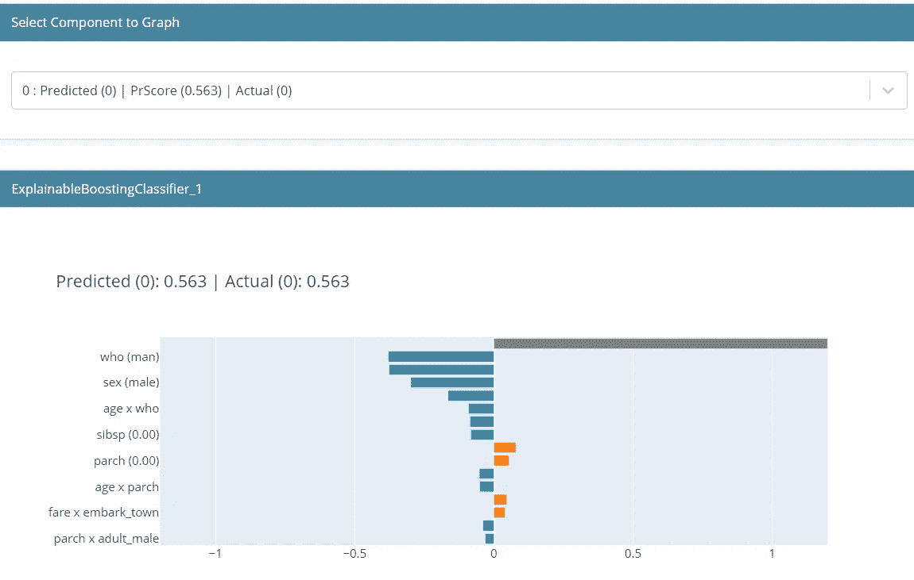

首行局部可解释性(图片由作者提供)

**局部可解释性**显示了单个预测是如何做出的。根据用户指南，这里显示的值是来自模型的**对数优势**分数，它们被相加并通过逻辑连接函数得到最终预测。我们可以看到，在这个预测中，男性性工作者对降低生存几率的贡献最大。

# 结论

机器学习的可解释性对于任何数据科学家来说都是一个重要的工具，因为它允许您更好地向业务用户传达您的结果。

在这篇文章中，我已经概述了另一个 6ML 可解释性 Python 包:

1.  **黄砖**
2.  **ELI5**
3.  **SHAP**
4.  **Mlxtend**
5.  **PDPBox**
6.  **InterpretML**

希望有帮助！

访问我的[**LinkedIn**](https://www.linkedin.com/in/cornellius-yudha-wijaya/)**或 [**Twitter**](https://twitter.com/CornelliusYW) **。****

> **如果您没有订阅为中等会员，请考虑通过[我的推荐](https://cornelliusyudhawijaya.medium.com/membership)订阅。**