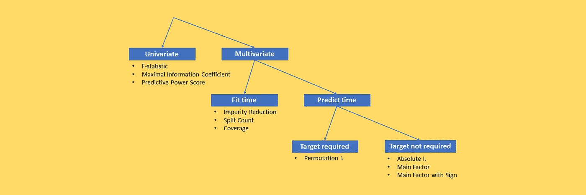
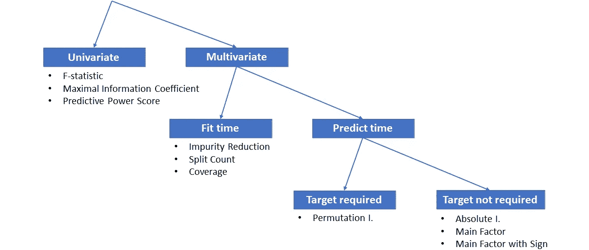
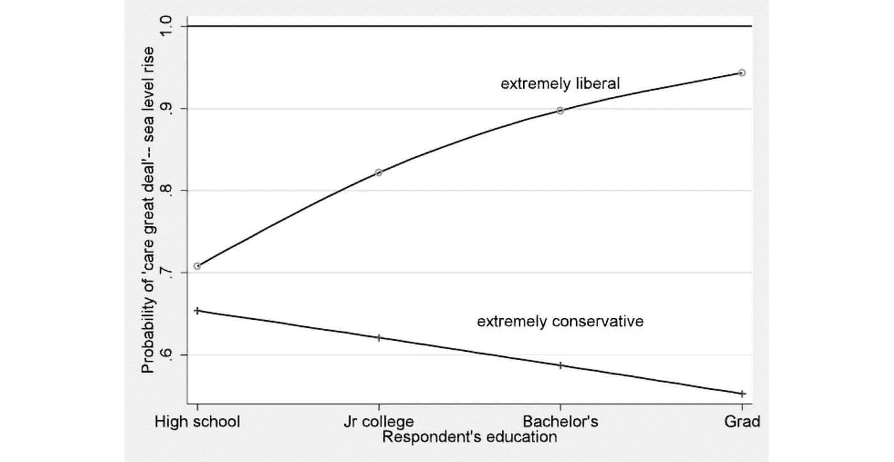
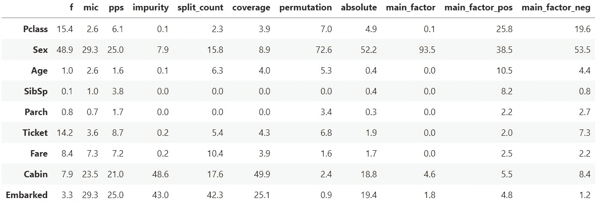

# 任何数据科学家都应该知道的 6 种“特性重要性”

> 原文：<https://towardsdatascience.com/6-types-of-feature-importance-any-data-scientist-should-master-1bfd566f21c9?source=collection_archive---------6----------------------->

## “特性重要性”的完整指南，这是 ML 中最有用(也是最难理解)的概念之一



[图片由作者提供]

特征重要性是机器学习实践者的一个基本概念。

由于其简单性和直观性，该指标不仅被数据科学家持续监控，而且**也经常传达给预测模型的非技术利益相关者**。

但是，尽管很直观，“特性重要性”的概念也有些模糊。其实有很多种不同的计算方式。因此，了解它们及其利弊非常重要，以确保我们回答的正是我们想要回答的问题。

本文的目的是阐明计算特性重要性的各种方法。

# 但是我们所说的“特性重要性”是什么意思呢？

在深入这个主题之前，我们最好就“特性重要性”的含义达成一致。

假设我们有一个数据帧，叫做 *X* ，其中每行代表一个“观察”，每列代表一个特征(或“特性”)。我们也有一个现象(或“目标变量”)，我们希望对每个观察结果进行预测。

特征重要性是分配给每一列(或特征)的 0 到 100 之间的分数，告诉**该特征在预测目标变量**方面有多强大。

注意，我们还要求**所有特征的总和应该是 100** 。所以我们隐含地假设我们已经观察到了所有可能有助于解释目标变量的特征。

# 特征重要性的分类

让我们从特性重要性类型的概念图开始。



功能重要性类别的概念图。[图片由作者提供]

我们遇到的第一个区别是单变量和多变量的重要性。两者的区别在于:

*   **单变量**重要性单独考虑每个特征**。**
*   ****多元**重要性有条件地衡量每个特征**对所有其他特征**的贡献。**

**这两种类型的重要性传达了非常不同的含义，我们可以说是“正交的”。这就是为什么我个人更喜欢**提供两种类型的重要性:一个单变量和一个多变量**。这样最终用户可以得到更完整的画面。**

# **1.单变量的**

**单变量重要性的目标是让**得到目标变量对每个特征的依赖程度，忽略所有其他特征**。分数可以从封闭公式(如皮尔逊相关)或预测模型(如随机森林的 ROC 曲线下的曲线)获得。然后，将所有特征的分数归一化为总和 100。**

**一般来说，单变量重要性的主要优点和缺点如下:**

*   ****优点**:这很容易理解，因为我们人类倾向于单变量推理。此外，它不会受到相关特性的影响。**
*   **反对意见:这可能会把现实过于简单化。事实上，它没有考虑到这些特性之间是如何相互影响的。**

**让我解释一下，当我说单变量重要性不受相关特征影响时，我的意思是什么。**

**假设你有两个特征，身高和年龄，你用一个随机森林来预测你的目标变量。这是它们的重要性:**

****

**特征重要性(2 个特征)。[图片由作者提供]**

**两者同样重要，都接近 50%。**

**然而，如果你有高度相关的**特性，会发生什么呢？例如，如果您不仅有以年为单位的年龄，还有以天为单位的年龄和以月为单位的年龄，并且您试图计算多元重要性，您将得到以下结果:****

****

**多元特征重要性。[图片由作者提供]**

**由于关于年龄的 3 个特征携带相同的信息，年龄的整体重要性(大约 50%)实际上在它们之间共享。**

**但是，如果我们使用单变量重要性，我们会得到一个不同的图像，即所有的特征得到近似相同的重要性水平，这更准确地反映了事实:**

****

**单变量特征重要性[图片由作者提供]**

**既然我们已经看到了单变量重要性的优点和缺点，让我们来看看属于这一类别的一些方法。可以使用许多算法，但是，作为一个例子，我们将看到 3 个用 Python 实现的相关方法。**

## ****- F 统计量****

**分类目标变量的最简单类型的单变量重要性由 [F 统计](https://en.wikipedia.org/wiki/F-test)(也称为 ANOVA)给出。在这种情况下，您希望根据数值特征的值预测由 2 个或更多类组成的目标变量。然后，计算 F 统计量，作为特征的组间变异性和组内变异性的**比率。****

**注意，**对于连续的目标变量**，**这等同于使用皮尔逊相关性**，因为相关性可以通过[简单公式](https://stats.stackexchange.com/questions/56881/whats-the-relationship-between-r2-and-f-test)被“转换”为 F 统计量。**

**Scikit-learn 有两个处理分类和连续情况的函数，分别是`f_classif`和`f_regression`，因此您可以通过以下方式使用它:**

```
from sklearn.feature_selection import f_classiff = pd.Series(f_classif(X, y)[0], index = X.columns)
fimpo = f / f.sum() * 100
```

**如果`y`是绝对的，或者**

```
from sklearn.feature_selection import f_regressionf = pd.Series(f_regression(X, y)[0], index = X.columns)
fimpo = f / f.sum() * 100
```

**如果`y`连续。**

## **-最大信息系数**

**f 统计或皮尔逊相关非常简单。事实上，第一种方法只解决方法之间的差异，第二种方法只解决线性关系。**

**一种更稳健的方法是使用[互信息](http://www.scholarpedia.org/article/Mutual_information)，这可以被认为是在已知一个随机变量的情况下，降低另一个随机变量的不确定性。注意，这也说明了**非线性关系**。**

**然而，MI 的主要缺点是它要求特征是离散的，而事实往往并非如此。[最大信息系数](https://en.wikipedia.org/wiki/Maximal_information_coefficient#:~:text=In%20statistics%2C%20the%20maximal%20information,(MINE)%20class%20of%20statistics.)旨在克服这一问题，因为它自动为我们收集连续特征，以使它们之间的 MI 最大。**

**在 Python 中，可以在库 Minepy 中找到 MIC 的实现(可以通过`pip install minepy`安装)。假设`X`是一个熊猫数据帧，而`y`是一个熊猫系列，那么你可以通过以下方式获得每个特性的 MIC:**

```
from minepy import MINEdef get_mic(x, y):
    mine = MINE()
    mine.compute_score(x, y)
    return mine.mic()f = X.apply(lambda feature: get_mic(feature, y))
fimpo = f / f.sum() * 100
```

## **-预测能力得分**

**既然我们想要估计一个特征和一个目标变量之间的关系，为什么不在那个单一特征上拟合一个预测模型，比如决策树？这是预测能力评分(PPS)背后的想法，它首次出现在[this against Data Science 文章](/rip-correlation-introducing-the-predictive-power-score-3d90808b9598)中。**

**诀窍在于模型是非线性的，所以它也能够捕捉**非线性关系**。此外，PPS 还具有一些其他方便的特性，例如不对称，并且可以针对分类/数字特征/目标的每种可能的组合来实现。**

**专用的 Python 库可以通过`pip install ppscore`安装。**

```
import ppscoref = ppscore.predictors(pd.concat([X, y], axis = 1),
  column_target).set_index(‘x’)[‘ppscore’]
fimpo = f / f.sum() * 100
```

# **2.多变量的**

**多元重要性试图回答这样一个问题:一个特性的总体重要性是什么，**考虑到我们对所有其他特性的了解**？换句话说，它也考虑了特征之间的相互作用。**

**我们来看看多元重要性的利弊。**

*   **优点:它更完整，因为它考虑了互动。此外，消除预测模型的模糊性也很有用。**
*   ****缺点**:如上一段所示，当特征高度相关时，可能会产生误导。**

**让我们从劳伦斯·汉密尔顿的论文中借用一个例子来解释为什么交互很重要。教育水平可能不能说明一个人对海平面上升有多担心。但是，如果你将这一特征与政治意识形态结合起来，它突然变得相关了。因此，教育水平对这一主题的单变量重要性较低，而其多变量重要性较高。**

****

**特征(教育和政治意识形态)之间相互作用预测海平面上升的例子。谁在乎极地的汉密尔顿？2008 年美国民意调查结果**

**在多元重要性中，可以区分两个子类别:**

*   ****Fit-time** :模型一训练好，特征重要性就可用。**
*   ****预测时间**:只有在模型对某些数据进行评分后，特征重要性才可用。**

**让我们分别来看看它们。**

# ****3。适合时间****

**在拟合时间，可以在训练阶段结束时计算特征重要性。因此，**它反映了模型对训练数据的学习**。简化一点，一个特性在训练阶段用得越多，这个特性就越重要。**

**这也称为“内在”重要性，因为计算方法是特定于模型的。**

*   ****优点**:速度快，因为可以直接从训练好的模型外推，所以除了训练模型之外什么都不需要。它也很方便，因为它内置在一些 Python 模型中。例如，在 Scikit-learn 中，调用`model.feature_importances_`就足够了。**
*   ****缺点**:它可能会赋予那些在看不见的数据上不能很好工作的特性很高的重要性。此外，它依赖于模型:对于某些模型来说，即使不是不可能，也是很难计算的。此外，基于杂质的特征对树的重要性强烈偏向于高基数特征(见 [Scikit-learn 文档](https://scikit-learn.org/stable/modules/permutation_importance.html))。**

**由于拟合时间的重要性是依赖于模型的，我们将只看到对基于树的模型有效的方法的例子，如随机森林或梯度推进，这是最流行的方法。**

## **-杂质减少**

**在决策树中，选择分裂是为了减少观察组中的杂质(如基尼系数、熵或均方误差)。因此，很自然地将导致杂质最大程度减少的特征视为最重要的特征。**

**因此，特征 *f* 的重要性被计算为在 *f* 上分裂的所有节点的平均杂质减少量(由该节点中的观察数量加权)。**

**这是 Scikit-learn 模型调用`model.feature_importances_`的默认重要性。**

**举个例子，**

```
from sklearn.ensemble import RandomForestClassifierrf = RandomForestClassifier().fit(X, y)
fimpo = pd.Series(rf.feature_importances_ * 100, index = X.columns)
```

## **-分割计数**

**另一种方法，这里描述为，是简单地计算一个特征在所有树上被分割的次数。直觉上，一个被使用了 10 次的特性比一个只被使用了 5 次的特性重要两倍。**

**这个方法在 XGBoost 库中是本地可用的:**

```
from xgboost import XGBClassifierxgb = XGBClassifier().fit(X, y)
f = pd.Series(xgb.get_booster().get_score(importance_type='weight'))
fimpo = f / f.sum() * 100
```

## **-覆盖范围**

**计算拆分数量可能会产生误导。例如，一些拆分可能只涉及少量的观察，因此它们实际上并不相关。为了克服这个问题，可以通过覆盖范围来加权每个分裂，即受分裂影响的观察的数量。**

**这个方法在 XGBoost 库中是本地可用的:**

```
from xgboost import XGBClassifierf = pd.Series(xgb.get_booster().get_score(importance_type='cover'))
fimpo = f / f.sum() * 100
```

# **4.预测时间**

**拟合时间重要性的主要缺点是它依赖于模型。因此，对于某些模型，如逻辑回归或神经网络，计算起来会很麻烦。**

**为了克服这个问题，存在一组可以在预测时计算的方法，即在模型已经完成训练阶段之后的**。这也意味着这些方法**可以应用于除训练数据集**之外的数据集。****

*   ****优点**:它与模型无关。此外，由于它是在预测时完成的，因此可以针对不同的数据集进行计算，这在实际应用中证明是非常有用的。**
*   ****缺点**:计算可能会很慢，因为可能需要进行迭代(排列重要性)或者采用复杂的方法(SHAP)。**

**在预测时间方法的范畴内，有两种主要类型的算法:**

*   ****目标必需**，除了模型的输入数据，还需要知道目标变量；**
*   ****不需要目标**:即使不知道目标变量，也可以使用这些方法。**

**让我们分别来看看它们。**

# **5.需要目标**

**在这个类别中，主要的算法是“排列重要性”。以下是它的利弊:**

*   ****优点**:它是模型不可知的。此外，由于它是在预测时完成的，因此可以针对不同的数据集进行计算，这在实际应用中证明是非常有用的。**
*   ****缺点**:目标变量不可用时不能使用。它受到高度相关特征的影响，事实上，当你随机打乱一个特征时，模型仍然会使用与你打乱的特征相关的其他特征。这将导致低估所有相关特征的重要性。**

## **-排列重要性**

**假设你已经训练了一个预测模型 *M* 。**

**顾名思义，该算法一次随机打乱一个特征，并在包含打乱的列的数据集上进行模型 *M* 的预测。然后，它计算预测的性能得分(例如，ROC 曲线下的面积)。**

**对数据集中的所有要素重复此操作。其思想是性能分数的恶化(与“未受破坏”的数据集上的 *M* 的性能相比)与特性的重要性成比例。请注意，此过程是在测试数据集上执行的，而不是在对模型进行定型的数据集上执行的。**

**例如，为什么要改变特性而不是输入一个固定的值？因为排列允许保留原始分布。这是更安全的，因为我们想利用一个已经在原始特征上的模型。**

**排列的重要性在 Scikit-learn 中很容易找到:**

```
from sklearn.inspection import permutation_importancef = permutation_importance(model, X, y)[‘importances_mean’]
fimpo = f / f.sum() * 100
```

# **6.不需要目标**

**在实际应用中，机器学习的全部意义在于对我们尚未观察到目标变量的实例进行预测。因此，计算这些实例的特征重要性特别有用。这是这套方法的主要特点。**

*   ****优点**:它也可以应用于我们没有目标变量的数据集。这对于现实世界的应用程序来说是至关重要的，当我们想要计算我们正在预测的最新数据的特征重要性时。**
*   ****缺点**:计算起来可能会很慢。**

**我们将看到的方法是基于 Shap 值的。Shap 可以通过同名 Python 库计算。假设您已经训练了一个模型，您可以通过以下方式获得相应的 Shap 值:**

```
import shapexplainer **=** shap.Explainer(model)
shap_values **=** pd.DataFrame(explainer(X).values, columns **=** X.columns)
```

## **-绝对重要**

**由于每个 Shap 值都说明了该要素的值将最终预测向上或向下“移动”了多少，因此某个要素的所有 Shap 值的总和是该要素在所选数据集上的相关性的理想代表。当然，在总结它们之前，Shap 值必须取绝对值，因为负面影响和正面影响一样重要。**

```
f = shap_values.abs().sum()
fimpo = f / f.sum() * 100
```

## **-主要因素**

**除了整体效应，我们可能更感兴趣的是每个观察的最相关的特征是什么。这种方法很有趣，因为特性重要性可以直接解释为百分比，所以更容易理解。例如，如果“年龄”的重要性是 25%，这将意味着对于 25%的观察，“年龄”是最重要的特征。**

**要获得这个量，只需逐行取最高的 Shap 值，然后计算该值。假设 Shap 值包含在熊猫数据帧中:**

```
fimpo = shap_values.abs().idxmax(axis = 1).value_counts(normalize=True) * 100
```

## **-带符号的主要因素**

**正如我们所见，Shap 值可能是正的，也可能是负的。正值有助于增加最终预测，而负值有助于降低最终预测。因此，了解哪些特性对这两个方向的影响最大有时会很有趣。**

**这相当于计算我们在上一段中看到的“主要因素”的重要性，就在移除负值或正值之后，这取决于您对哪个符号感兴趣。**

**例如，如果您想知道哪些特征与提高最终预测最相关，那么您应该将下限设置为 0:**

```
fimpo = shap_values.clip(lower = 0).abs().idxmax(axis = 1).value_counts(normalize = True) * 100
```

**相反，如果您想知道哪些特性与降低最终预测最相关，那么您应该将上限设置为 0:**

```
fimpo = shap_values.clip(upper = 0).abs().idxmax(axis = 1).value_counts(normalize = True) * 100
```

# **比较重要性**

**让我们来看看我们在[上看到的方法的结果，这是有史以来最著名的数据集](https://www.kaggle.com/c/titanic):**

****

**Titanic 数据集上特征重要性方法的比较。[图片由作者提供]**

**正如您所看到的，不同方法的估计值差别很大。**

**性别在排列和主要因素的重要性上惊人地高，始终高于所有的单变量方法。这表明性可能与其他特征有许多相互作用。**

**有趣的是，我们注意到“主要因素积极”和“主要因素消极”与“主要因素”有多么不同。比如看性，“主要因素负面”高于“主要因素正面”的事实，说明性更多时候是“谴责”一个乘客生命的决定性因素，而不是挽救它。**

**总的来说，要点是比较不同类型的重要性(通常至少一个单变量和一个多变量)有助于了解现象和预测模型。**

> ***感谢您的阅读！我希望你喜欢这篇文章。如果你愿意，* [*在 Linkedin 上加我*](https://www.linkedin.com/in/samuelemazzanti/) *！***