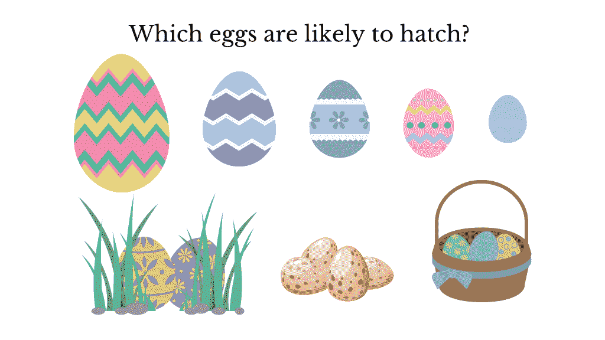
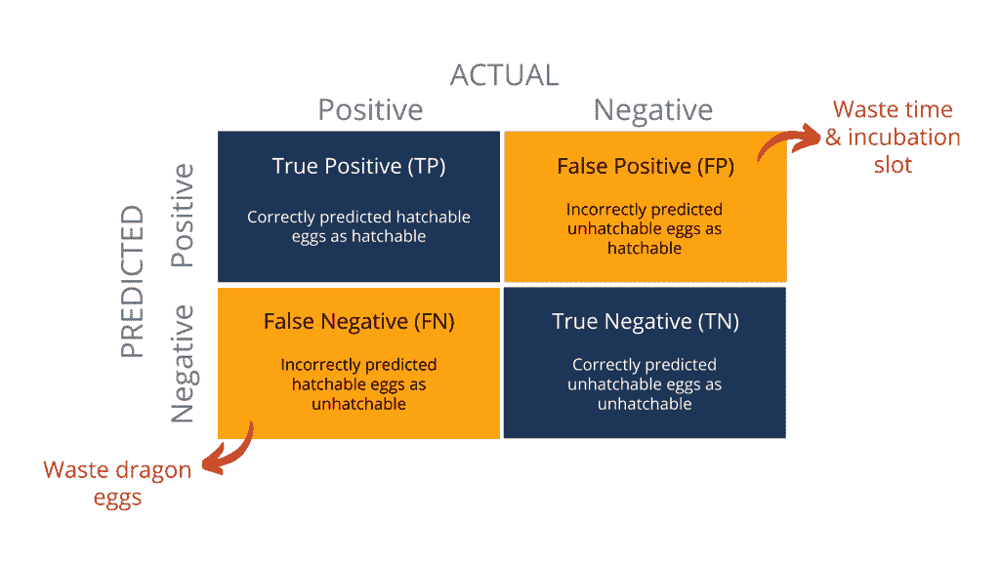
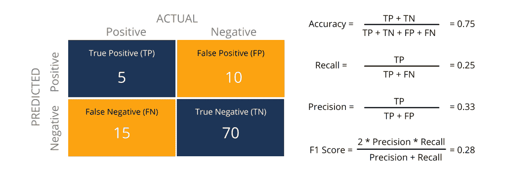
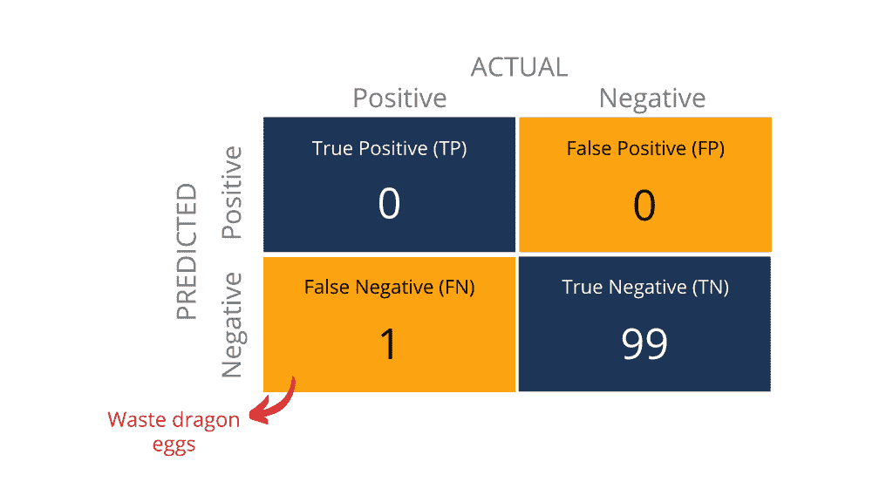
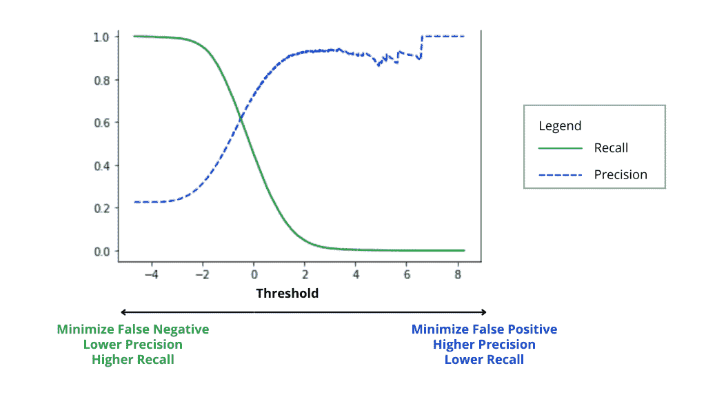
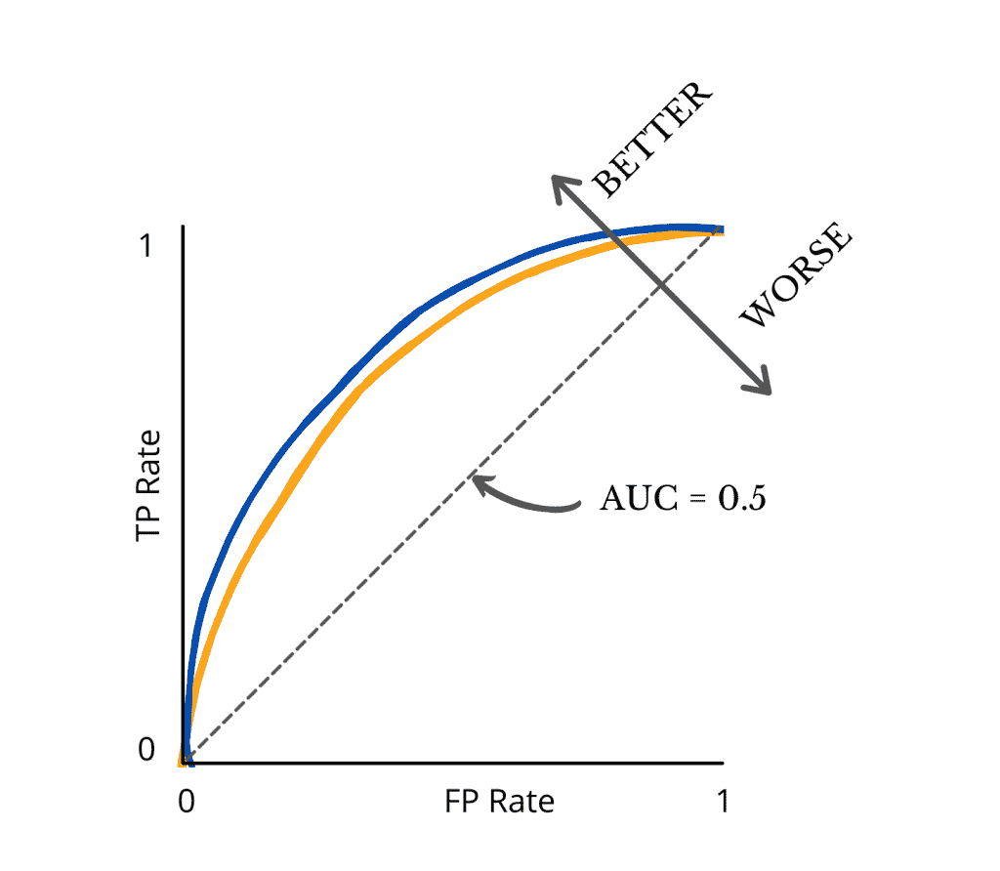

# 评估二元分类模型的 6 个有用指标

> 原文：<https://towardsdatascience.com/6-useful-metrics-to-evaluate-binary-classification-models-55fd1fed6a20?source=collection_archive---------36----------------------->

## 对准确性的追求可能会影响你选择一个糟糕的模型

*照片由* [***克雷格阿德利***](https://www.pexels.com/@thatguycraig000?utm_content=attributionCopyText&utm_medium=referral&utm_source=pexels) *从* [***像素***](https://www.pexels.com/photo/hungarian-horntail-dragon-at-universal-studios-3359734/?utm_content=attributionCopyText&utm_medium=referral&utm_source=pexels)

# 这是蝾螈！他有一个二元分类问题

*照片由* [*泰勒妮可*](https://unsplash.com/@taynicole0630?utm_source=unsplash&utm_medium=referral&utm_content=creditCopyText) *上* [*下*](https://unsplash.com/s/photos/boy?utm_source=unsplash&utm_medium=referral&utm_content=creditCopyText)

这是纽特。生活在一个神秘的世界里，纽特渴望成为最好的驯龙师。但是，只有当主人是孵化后第一个见到的生物时，龙才会接受它永远的主人。有点像一见钟情，巧合却又如此珍贵！

这就是为什么蝾螈一直在到处寻找可孵化的龙蛋。不幸的是，一个可孵化的蛋真的很难得到。

还有呢？区分可孵出的蛋和不可孵出的蛋是非常乏味的。蝾螈经常花上几个小时试图检查不同形状的龙蛋，这些龙蛋来自不同的物种，具有不同的外观，天知道还有多少环境因素会使蛋不太可能孵化。

作者图片

可怜的纽特无法孵化他发现的所有蛋，因为他的孵化器只有有限的插槽。因此，他必须在把自己逼疯之前找到更好的方法。毕竟，他想成为一名训练有素的驯龙师，而不是专业的鸡蛋分析师。

在去森林寻找龙蛋的路上，纽特遇到了狂热的科技爱好者马克斯。Max 分享了他在**上的想法，如何教计算机根据蛋的图像和发现蛋的相关环境读数来识别可孵化的蛋。**

然后嘣！纽特就是这样开始机器学习的。具体来说，Newt 需要训练一个分类模型来识别可孵化的蛋和不可孵化的蛋。

# 被选择宠坏了。选哪个？

谈到分类模型，Newt 有很多选择:逻辑回归、XGBoost 分类器、随机森林分类器、AdaBoost 分类器等等。

即使 Newt 可以入围单个模型，他也必须在不同的变量中选择最佳的一个，因为他调整了不同的超参数(又名超参数优化)或利用了不同的功能(又名功能工程)。

简而言之，在不同的模型类型、微调的超参数和特性中，Newt 需要一种可量化的方法来挑选最佳的分类模型。这就是评估指标的用途。

在接下来的部分中，我们将探索:

*   混淆矩阵:所有度量的基础
*   准确度、精确度、召回率、F1 分数
*   ROC 曲线和 ROC AUC

# 混淆矩阵:所有度量的基础

作者图片

混淆矩阵只是一种记录分类模型将事物正确或错误分类到相应桶中的次数的方法。

例如，该模型最初将 10 个蛋分类为可孵化的。然而，在这 10 个蛋中，只有 6 个蛋是可孵化的，而其余 4 个蛋是不可孵化的。在这种情况下，真阳性(TP)是 6，而假阳性(FP)是 4。

类似地，如果模型将 10 个鸡蛋归类为不可触摸的。其中 7 只实际上是不可孵化的，而剩下的 3 只可以孵化。我们说真阴性(TN)是 7，而假阴性(FN)是 3。

你可能已经听说过统计假设检验中的第一类和第二类错误。简单地说，假阳性是一类错误，而假阴性是二类错误。

这里最重要的一点是**假阳性和假阴性意味着两种不同的影响。**

例如，**如果模型导致太多的假阳性**，纽特将会浪费时间和他的孵卵器中有限的位置来照顾太多的不可处理的蛋。另一方面，**如果有太多的假阴性，纽特将会浪费很多可孵化的龙蛋，因为他不会孵化那些被模型错误归类为不可孵化的龙蛋**。

# 准确度、召回率、精确度和 F1 分数

混淆矩阵的 4 个象限的绝对计数使得普通蝾螈在不同模型之间进行比较具有挑战性。因此，人们通常将混淆矩阵概括为以下指标:准确度、召回率、精确度和 F1 值。

作者图片

在典型的 ML 项目中，这些计数和计算已经是自动化的。因此，您可以使用 [scikit-learn.metrics](https://scikit-learn.org/stable/modules/model_evaluation.html) 、 [tf.keras.metrics](https://www.tensorflow.org/api_docs/python/tf/keras/metrics) 等等轻松地检索这些预定义的值。

然而，不了解计数如何分布在混淆矩阵的 4 个象限中，盲目依赖单一指标可能是一个冒险的举动。下面是每个指标的概述以及不足之处。

## 准确(性)

准确性可能是最直观的理解指标，因为它关注的是预测与现实相符的频率(即真正的正面和真正的负面)。因此，精度为 0.99 的模型似乎比我们当前精度为 0.75 的模型好得多，对吗？

没那么快！

高精度可能会产生误导，因为它没有说明真正的正和真正的负是如何分布的。例如，我可以简单地将所有鸡蛋归类为不可触摸的，以获得下面的混淆矩阵以及号称 99%准确率的模型。

作者图片

很肯定纽特会大声尖叫，因为这个模型在帮助他寻找可孵化的蛋方面显然是无用的，因为所有的蛋都被贴上了不可孵化的标签。

即使预测在可孵化和不可孵化之间展开，还有另一个问题。**准确度并不能告诉纽特分类模型正在犯什么类型的错误。**

还记得我之前说过不同的错误对 Newt 意味着不同的影响吗？完全忽略假阳性和假阴性意味着 Newt 可能最终得到一个浪费他宝贵时间、孵化槽或龙蛋的模型。

幸运的是，精确度和召回率是考虑假阳性和假阴性的两个指标。向精确和回忆问好！

## 精确度和召回率

如果可孵化的蛋是 Newt 关注的，precision 旨在回答一个问题:考虑所有被模型(TP+ FP)分类为可孵化的蛋，它们中有多少实际上可以孵化成龙(TP)？

另一方面，recall(也称为 sensitivity)关注的是问题的一个非常不同的角度:在所有能孵化成龙的蛋(TP + FN)中，有多少能被模型(TP)发现？

**精度和召回率的范围都是从 0 到 1。一般来说，越接近 1，模型越好。**不幸的是，你不能两全其美，因为**提高精度会导致召回率下降，反之亦然**。下图说明了这种 ***精确召回的权衡。***

作者图片

这里有一个简单的方法来想象在精确度和召回率之间发生了什么。

1.  如果我们将所有的蛋分类为可孵化的(即全部为阳性)，那么 FN = 0，而 FP 显著增加。因此，召回率现在是 1，而精确度将下降到接近 0。
2.  如果我们把所有的鸡蛋都归类为不可触摸的(即所有的都是阴性)，那么 FP = 0，而 FN 急剧上升。这意味着精度现在是 1，而召回率会下降到接近 0。

考虑到精确度和召回率之间的权衡，Newt 应该如何选择最优的分类模型？嗯， **Newt 将不得不问自己减少假阴性比减少假阳性更重要还是更不重要。**

还记得我之前说过假阳性和假阴性意味着不同的影响吗？具体来说，Newt 将不得不在浪费可孵化的龙蛋(减少假阴性并有利于高精度)或浪费时间和孵化槽(减少假阳性并有利于高召回率)之间做出有意识的选择。

因为生命是宝贵的，而龙蛋是如此的难以获得，像 Newt 这样的热爱龙的人可能更愿意选择一个具有高召回率和低精确度的模型。

## F1 分数

但是如果我们的场景表明精确度和召回率都很重要呢？好吧，这就是 F1 分数的来源。

F1 得分通常被称为模型精度和召回率的调和平均值。类似于召回率和准确率，越接近 1，模型越好。

当精确度和召回率都不明显更重要时，这个指标通常**对评估分类模型有用。**

在现实生活的数据集中，数据可能是不平衡的，一个分类比另一个分类出现得更频繁。例如，欺诈案件可能比正常交易更少。 **F1 分数也可以方便地用于评估这种不平衡数据集的分类模型。**

这也结束了我们关于基于全能混淆矩阵的 4 个基本度量的部分。在下一节中，让我们用接收机工作特性(ROC)曲线更进一步。

# ROC 曲线和 ROC AUC

## 受试者工作特征曲线

我觉得报道 ROC 代表什么有点意思。故事是这样的！二战期间，美国陆军希望提高战场上探测敌方物体的能力。在所有的计划中，ROC 曲线被用来测量雷达接收机操作员根据雷达信号正确识别日本飞机的能力。

快进到现代，ROC 曲线已被用于各种行业，如医学、放射学、气象学以及机器学习。尽管如此，人们仍然引用它的原名:受试者工作特性(ROC)曲线。

作者图片

我们来看看上面展示的 ROC 曲线。我知道图表的名称和外观可能听起来有点吓人。但就其核心而言，以下是你需要知道的 4 个要点。

首先，**ROC 曲线是显示分类模型在所有决策阈值上的性能的图形。**

*   一般来说，ROC 曲线越靠近左上角，模型的性能越好。
*   最起码，模型的 ROC 曲线必须在黑色虚线之上(这表明模型至少比随机猜测表现得更好)。

其次，模型的性能通过两个参数来衡量:

*   真阳性(TP)率:又称回忆
*   假阳性(FP)率:也称为假警报的概率

第三，**判定阈值表示将预测概率转换成类别标签的值。**例如，假设蝾螈为可孵化的蛋选择 0.6 的阈值。如果模型计算出蛋可孵化的概率大于或等于 0.6，则该蛋将被分类为可孵化的。反之亦然，如果概率低于 0.6，则该蛋被分类为不可触摸的。

最后，**随着我们选择一个较低的阈值，更多的项目将被归类为阳性。这导致更多的 TP 和 FP，从而相应地提高 TP 率和 FP 率。**

除了可视化模型性能之外，ROC 曲线还说明了一个关键点:**确定理想阈值需要在 TP 率和 FP 率之间进行权衡，以实现您的业务目标。**

在这种情况下，如果蝾螈选择太高的阈值，他可能会浪费很多龙蛋，因为大多数被错误地归类为不可触摸的。另一方面，低门槛可以让他花几个月的时间孵化这么多的蛋，但永远不会收获任何回报。

## ROC AUC

作者图片

看上面的图片，相对容易看到蓝色曲线在黄色曲线上面，表示性能更好。但是如果我们有更多的代表不同模型的曲线呢？

嗯，图表可能会变得太混乱，任何人都无法辨认哪个是哪个。还有呢？对许多人来说，看数值比比较曲线要简单得多。

这就是 AUC(代表曲线下面积)派上用场的地方。从 0 到 1，AUC 测量整个 ROC 曲线下的整个二维面积。

在数学上不要太书呆子气，这里是你需要知道的:**AUC 值越高，模型在分类上表现越好。** **至少，一个模型的 AUC 必须大于 0.5，因为它必须比随机猜测表现得更好。**否则，我们为什么要浪费时间在机器学习上呢？

# 离别的思绪

所以你有它！对于什么是混淆矩阵，以及在下一个二进制分类挑战中应该关注哪些评估指标，不再有混淆。**选择对您的业务目标最有意义的指标是多么重要，我怎么强调都不为过。否则，你可能最终选择了一个看似最好的模型，但很快就让你陷入了困境。**

这就是我这篇博文的全部内容。现在让我们和纽特说再见，祝他好运，成为世界上最好的驯龙师！

感谢您的阅读。对我如何能做得更好有反馈，或者只是想聊天？在评论里告诉我或者在 [LinkedIn](https://www.linkedin.com/in/skyetran/) 上找到我。女士们先生们，祝你们愉快！

# 参考

1.  [分类:ROC 曲线和 AUC](https://developers.google.com/machine-learning/crash-course/classification/roc-and-auc)
2.  [使用 Scikit-Learn、Keras 和 TensorFlow 进行机器实践学习](https://learning.oreilly.com/library/view/hands-on-machine-learning/9781492032632/)
3.  [sci kit-学习指标&评分](https://scikit-learn.org/stable/modules/model_evaluation.html)

*原载于 2021 年 4 月 19 日 http://thedigitalskye.com**[*。*](https://thedigitalskye.com/2021/04/19/6-useful-metrics-to-evaluate-binary-classification-models/)*