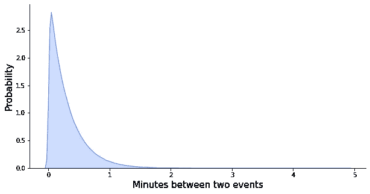

# 6 有用的概率分布及其在数据科学问题中的应用

> 原文：<https://towardsdatascience.com/6-useful-probability-distributions-with-applications-to-data-science-problems-2c0bee7cef28?source=collection_archive---------3----------------------->

## 带有示例和 Python 代码的实用概述。

它是一顶帽子吗？还是被蛇吃掉的大象？还是正态分布的混合？图片由作者提供。

概率分布是描述事情发生概率的数学函数。在我们周围的世界中发生的许多过程都可以用一些经过充分研究和分析的分布来描述。弄清楚这几个问题，对从统计上模拟一系列现象大有帮助。我们来看看六种有用的概率分布！

# 二项分布

可以说最直观也是最强大的概率分布是二项分布。它可用于模拟二进制数据，即只能取两个不同值的数据，即“是”或“否”。这使得二项式分布适用于建模决策或其他流程，例如:

*   客户是否购买了产品？
*   这种药是否有助于病人康复？
*   在线广告被点击了吗？

二项式模型的两个关键要素是一组试验(二元实验)和成功的概率(成功是“是”的结果:点击一个广告或治愈一个病人)。例如，试验可能包括 10 次抛硬币——每一次都是二元实验，有两种可能的结果:正面或反面。成功的概率，定义为抛人头，是 50%，假设硬币是公平的。

二项分布可以回答这个问题:用一枚公平的硬币在 10 次投掷中观察到不同数量的人头的概率是多少？

绘制二项式 PMF。省略了一些绘图格式代码。

在 10 次公平的硬币投掷中获得 X 个正面的概率。图片由作者提供。

上面画的二项式概率质量函数就是答案！你可以看到，在 10 次投掷中，最有可能观察到 5 个头，这种结果的概率大约是 25%。

二项式分布实际应用的一个例子是模拟广告横幅上的点击与非点击，其中成功的概率是点击率。二项式分布可以用作异常检测器。假设你向 750 个用户展示了你的广告，有 34 个用户点击了它。这给出了 4.5%的点击率。如果你知道你之前所有广告的平均点击率是 6%，你可能会问:这次观察到不超过 4.5%的概率是多少？要回答这个问题，您可以用成功概率为 6%的二项式分布对您的点击进行建模，如下所示:

假设点击率为 6%，在 750 次展示中获得 X 个头像的概率。图片由作者提供。

那么，在 750 次印象中观察到不超过 34 次点击的概率是多少？答案是从 0 到 34 的所有条形之和，或者:`binom.cdf(34, 750, 0.06)`也就是 4.88%，相当不可能。要么这个新广告真的很糟糕，要么这里有猫腻……你确定你的广告提供商真的*向 750 名用户展示了这个广告吗？*

> 二项式分布描述是-否数据。它可以作为异常检测器或贝叶斯 A/B 测试的工具。

二项式分布的另一个常见应用是用于[贝叶斯](/the-gentlest-of-introductions-to-bayesian-data-analysis-74df448da25) A/B 测试。假设您开展了两次营销活动，并希望对它们进行比较。简单比较两个点击率可能会产生误导，因为两个点击率都有随机成分，而且一个点击率可能会比另一个点击率高，这完全是偶然的结果。有两种方法可以确定哪个活动更好:你可以求助于经典的[假设检验](/the-hypothesis-testers-guide-75f7db2e4d0d)(稍后会有更多的介绍)，或者用贝叶斯方法明确估计活动 A 比活动 B 更好的概率。后者假设点击遵循二项式分布，并且贝叶斯后验概率的计算涉及二项式密度公式。如何做到这一点是一个值得单独处理的主题，但是如果你想学习贝叶斯 A/B 测试或贝叶斯统计，我鼓励你看看我关于主题的介绍文章[，或者我在 DataCamp 上教授的 Python 课程](/the-gentlest-of-introductions-to-bayesian-data-analysis-74df448da25)中的[贝叶斯数据分析。](http://www.datacamp.com/courses/bayesian-data-analysis-in-python)

两个广告活动的后验点击率:A 和 B。在这种情况下，B 更好，有 93%的概率。图片来自作者在 DataCamp 讲授的 Python 课程中的[贝叶斯数据分析。](http://www.datacamp.com/courses/bayesian-data-analysis-in-python)

# 泊松分布

另一个非常有用的分布是泊松分布。就像二项式一样，它也是一个离散分布，这意味着它有一个有限的可能结果集。对于二项式分布，只有两个:是或否。对于泊松分布，可能有更多，但它们只能是自然数:0，1，2，等等。

泊松分布可以用来描述在时间或空间上以某种速率发生的事件。这样的过程无处不在:客户每 X 分钟就在你的网上商店购买一件商品，每一件从生产线上下来的 Yth 产品都是有缺陷的。

泊松分布有一个参数，通常用希腊字母λ (lambda)表示，它表示事件发生的速率。典型的用例是从数据中估计λ，然后使用得到的分布来执行排队模拟，以帮助分配资源。

想象一下，您有一个部署在云中的机器学习模型，并实时接收来自客户的请求。你需要为多少云资源付费，才能 99%确定你可以为任何一分钟内到达模型的所有流量提供服务？要回答这个问题，首先需要知道平均一分钟内有多少请求。根据你的流量数据，平均有 3.3 次请求。这是您的λ，因此描述您的数据的泊松分布如下所示:

策划了泊松 PMF。省略了一些绘图格式代码。

基于 3.3 的平均速率，一分钟内出现 X 个请求的概率。图片由作者提供。

基于你的泊松分布，你可以计算出一分钟内观察到 2 个事件的概率:`poisson.pmf(2, 3.3)`，产生 20%，或者得到 5 个或更少请求的概率:`poisson.cdf(5, 3.3)`，88%。

> 泊松分布描述在时间和空间上以某种速率发生的事件。它可以用来进行排队模拟，帮助分配资源。

酷，但问题是:你需要每分钟处理多少个请求，才能 99%确定处理所有流量？回答这个问题的一种方法是模拟大量(比如说 1，000，000)一分钟的时间段，并计算请求数量的第 99 个百分位数。

这产生 8，意味着如果您购买足够的资源来处理每分钟 8 个请求，您可以 99%确定在任何一分钟内处理所有的流量。

# 指数分布

另一种与泊松分布密切相关的分布是指数分布。如果在某个时间段内发生的事件数量遵循泊松过程，那么这些事件之间的时间用指数分布来描述。

继续前面的例子，如果我们观察到平均每分钟 3.3 个请求，我们可以使用指数分布对请求之间的时间进行建模。让我们用秒来表示:每分钟 3.3 个请求就是每秒 0.055 个请求。有一点需要注意的是，在 Python 的 *scipy* 包中，指数分布是用一个比例来参数化的，这是速率的倒数。此外，指数分布是连续的而不是离散的，这意味着它可以取无限多的值。为了强调这一点，我们将其绘制为阴影区域，而不是竖条。正在讨论的分布如下所示:

绘制指数 PDF。省略了一些绘图格式代码。

两个事件之间相隔 X 分钟的概率，基于每分钟 3.3 个事件的平均速率。图片由作者提供。

平均每分钟超过三个请求，在大多数情况下，从一个请求开始到另一个请求到来不会超过一分钟。然而，有时长达五分钟的时间可能会不请自来！

就像二项式分布一样，指数分布也可以作为异常检测器。在 5 分钟没有看到请求后，您可能会开始怀疑您的系统是否还活着。五分钟或更长时间没有请求的概率是多少？这是从 5 开始向右直到无穷大的所有条的总和，它等于 1 减去从 5 开始向左的条，因为所有条的总和必须是 1。所以，是`1 — expon.cdf(4, 1/3.3)`，2.5%。不太可能，但偶尔会发生。

> 指数分布可用作异常检测器或预测模型的简单基准。

指数分布的另一个常见用例是作为预测模型的简单基准。例如，为了预测每个产品何时会再次被购买，您可能会使用梯度推进或构建一个奇特的神经网络。为了评估他们的表现，将他们与一个简单的基准进行比较是一个很好的做法。如果你把你的问题描述为预测下次购买的时间，那么指数分布就是一个很好的基准。一旦有了训练数据(`days_till_next_purchase = [1, 4, 2, 2, 3, 6, …, ]`)，你要做的就是对这些数据拟合指数分布，取其均值作为预测:
`avg, _ = expon.fit(days_till_next_purchase)`。

# 正态分布

正态分布，也称为钟形曲线，可能是最著名的一个，也是最广泛使用的一个——尽管经常是隐含的。

首先也是最重要的，作为统计推断基石的中心极限定理，都是关于正态分布的。我鼓励您在此阅读更多相关内容:

 [## 中心极限定理

### 关于数据科学家统计推断基石的相关性。

towardsdatascience.com](/central-limit-theorem-70b12a0a68d8) 

简而言之，CLT 认为，从随机数据样本中计算出的一些统计数据(如总和或平均值)符合正态分布。CLT 最重要的两个实际用例是回归分析和[假设检验](/the-hypothesis-testers-guide-75f7db2e4d0d)。

首先说回归。在回归模型中，因变量由一些预测变量加上一个误差项来解释，我们假设误差项是正态分布的。这种假定的误差正态性源于 CLT:我们可以把误差看作是由于忽略重要的预测因素或随机机会而引起的许多独立误差的总和。这许多误差中的每一个都可以有任何分布，但是它们的总和在 CLT 看来是近似正态的。

> 回归模型中误差正态性的假设可以用中心极限定理来证明。它对于一些假设检验也是有用的。

第二，假设检验。当我们谈到卡方分布和 f 分布时，后面会有更详细的例子。现在，考虑这个简短的例子:一家专门从事广告重定向的公司吹嘘他们的精确定向广告平均点击率为 20%。你对他们进行 1000 次展示的试点，观察到 160 次点击，这意味着点击率只有 16%。是瞄准不准，还是运气不好？

如果你考虑向 1000 个用户展示广告，这 1000 个用户是从大量用户中随机抽取的一个子集，那么 CLT 就会出现，点击率应该遵循正态分布。假设目标公司说的是实话，应该是均值为 0.2，标准差为 0.013 的常态。查看[我在 CLT](/central-limit-theorem-70b12a0a68d8) 上的帖子来计算，或者相信我。正在讨论的分布如下所示:

CTR 与观测 CTR 的参考分布。由作者生成。

在这种分布下，你观察到的 16%的点击率是不太可能的，这表明所谓的 20%的平均点击率很可能不是真的。

# 卡方分布

在 A/B/C 测试中， *χ* 2 或卡方分布派上了用场。假设你进行了一个实验，你随机地向用户展示了不同颜色版本的网站。你很好奇哪种颜色会导致网站上的大部分购买。每种颜色都向 1000 名用户展示过，结果如下:

网站色彩实验结果。图片由作者提供。

黄色版本似乎几乎是蓝色版本的两倍，但数字很低，所以你如何确定这些结果不是由于偶然？

假设检验拯救世界！要了解关于这个主题的更多信息，请不要犹豫，请阅读我的假设检验者指南:

 [## 假设检验者指南

### 一个简短的关于为什么可以拒绝假说，但不能接受它们的入门书，有例子和视觉效果。

towardsdatascience.com](/the-hypothesis-testers-guide-75f7db2e4d0d) 

这里，让我强调一下卡方分布在这个过程中的作用。第一步是假设三个网站版本平均产生相同的购买数量。如果这是真的，我们预计每个版本的购买数量是相同的，那将是`(17+9+14)/3`，或者 13.33 次购买。卡方分布允许我们测量如果颜色没有影响，观察到的购买与预期的偏离程度。

> 卡方分布对 A/B/C 测试很有用。它衡量了我们得到的实验结果仅仅是偶然的可能性。

事实证明，如果我们计算每种颜色的预期值和观察值之间的差异(经过适当的缩放和平方)，我们会得到一个符合卡方分布的测试统计值！然后，我们可以根据 p 值推断，我们观察到的购买数量的变化是由于偶然，还是实际上是由于颜色差异。

这个所谓的卡方测试是 Python 中的一行程序:

网站色彩实验的卡方检验。

我们得到卡方(`chisq`)值为 2.48，并且分布用 2 个自由度(`df`)来参数化。因此，正在讨论的分布如下所示:

绘制具有 2 个自由度的卡方 PDF。省略了一些绘图格式代码。

具有两个自由度的卡方分布。图片由作者提供。

在这种分布下，卡方值似乎很可能是 2.48，这让我们得出结论，不同颜色网站购买数量的差异可能仅仅是随机因素造成的。几乎 0.3 的高 p 值进一步证明了这一点。请查看 [HTG](/the-hypothesis-testers-guide-75f7db2e4d0d) 了解更多关于假设检验的信息。

# f 分布

还是坚持网站颜色实验吧，A/B/C 测试的例子。我们已经评估了颜色对一个离散变量的影响:购买数量。现在让我们考虑一个连续的变量，比如每个网站变体平均花费的秒数。

作为实验的一部分，我们随机向用户展示了不同的网站变体，并计算了他们在网站上花费的时间。下面是 15 个用户的数据(五个显示黄色版本，另外五个显示蓝色版本，最后五个显示绿色版本)。为了使这样的实验有效，我们需要 15 个以上的用户，这只是一个演示。

花在网站不同颜色变体上的时间。图片由作者提供。

我们感兴趣的是均值之间的差异在多大程度上大于随机产生的差异。如果它们非常大，那么我们可以得出结论，颜色确实影响了网站的停留时间。这种平均值之间的比较被称为 ANOVA 或方差分析。

这个推论与我们在讨论卡方分布时已经讨论过的非常相似。我们将检验统计量计算为组均值之间的变异性与组内变异之间的比率。这种统计遵循一种称为 f 分布的分布。知道了这一点，我们就可以用 p 值来拒绝(或不拒绝)均值仅因偶然性而不同的假设。

> 当我们测量的结果是连续的时，f 分布用于 A/B/C 测试。

在 Python 中，我们可以使用 *statsmodels* 包运行 ANOVA。内部计算基于线性回归模型，因此调用`ols()`并将数据收集到两列数据框中。

网站颜色对网站使用时间影响的方差分析(ANOVA)。

这是我们得到的`anova_table`:

ANOVA 输出。

我们的 F 分布用两个自由度参数进行参数化:一个用于颜色均值和总体平均值之间的差异(2)，另一个用于每种颜色内的差异(12)。因此，我们的分布如下:

以 2 和 12 个自由度绘制 PDF。省略了一些绘图格式代码。

具有 2 个和 12 个自由度的 F 分布。图片由作者提供。

由于我们得到的 F 统计值等于 7.6(因此，因为 p 值很小)，我们得出结论，在不同网站变体上花费的平均时间之间的差异不可能是随机造成的。颜色在这里确实起了作用！

# 概述

*   **二项式分布**对是非数据建模很有用。它可以作为异常检测器或贝叶斯 A/B 测试的工具。
*   **泊松分布**可以用来描述在时间或空间上以某种速率发生的事件。它通常用于进行排队模拟，帮助分配资源。
*   **指数分布**描述了两个事件之间的时间遵循泊松分布。它可以用作异常检测器或预测模型的简单基准。
*   **正态分布**描述了根据中心极限定理建立的随机数据样本计算的一些统计数据。由于这一点，我们可以假设回归模型中误差的正态性，或者很容易地进行一些假设检验。
*   **卡方分布**通常用于 A/B/C 测试。它衡量了我们得到的实验结果仅仅是偶然的可能性。
*   **当我们测量的结果是连续的时，f 分布**用于 A/B/C 测试，例如在 ANOVA 分析中。这个推论类似于使用卡方检验离散结果的推论。

感谢阅读！

如果你喜欢这篇文章，为什么不 [**订阅邮件更新**](https://michaloleszak.medium.com/subscribe) 我的新文章呢？并且通过 [**成为媒介会员**](https://michaloleszak.medium.com/membership) ，可以支持我的写作，获得其他作者和我自己的所有故事的无限访问权限。

需要咨询？你可以问我任何事情，也可以在这里 为我预约 1:1 [**。**](http://hiretheauthor.com/michal)

也可以试试 [**我的其他文章**](https://michaloleszak.github.io/blog/) 中的一篇。不能选择？从这些中选择一个:

 [## 数据测量级别

### 统计学家对变量类型、它们的意义以及对机器学习的影响的观点。

towardsdatascience.com](/data-measurement-levels-dfa9a4564176)  [## 处理缺失数据

### 一个统计学家关于如何(不)做它来保持你的机器学习工作流程的观点。

towardsdatascience.com](/handling-missing-data-5be11eddbdd)  [## 蒙特卡洛辍学

### 用一个小技巧免费改善你的神经网络，获得模型不确定性估计作为奖励。

towardsdatascience.com](/monte-carlo-dropout-7fd52f8b6571)