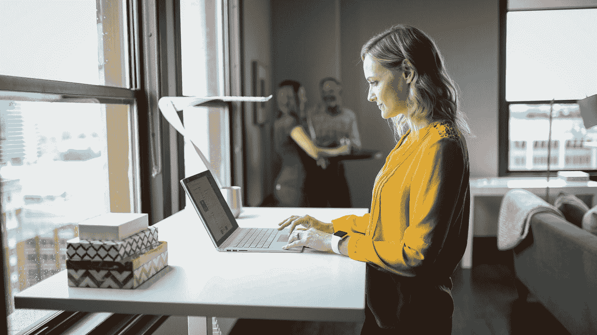

# 作为数据科学家，保持健康关系的 6 种方法

> 原文：<https://towardsdatascience.com/6-ways-to-maintain-a-healthy-relationship-as-a-data-scientist-706dd3bb4285?source=collection_archive---------34----------------------->

## 如何减轻屏幕时间观看的负面影响

[TheStandingDesk.com](https://unsplash.com/@thestandingdesk?utm_source=medium&utm_medium=referral)在 [Unsplash](https://unsplash.com?utm_source=medium&utm_medium=referral) 上拍照

在数据科学领域工作似乎经常需要在计算机屏幕前花费大量时间。无论是学习新工具、用 Python 和 R 开发编程，还是了解最新的研究论文。这还不包括从事副业项目、投资组合或其他与数据科学无关的任务的预期。

虽然这是数据科学家生活的一部分，但有时会对您的身心健康产生负面影响。临床研究表明，每天看屏幕超过 6 个小时会恶化一个人的情绪，导致抑郁。此外，坐在办公桌前会给你的脊椎和椎间盘带来额外的压力，尤其是不良姿势。

那么我们如何避免这些负面影响呢？

不幸的是，我们不能完全避免它们，但我们可以做些事情来降低风险，改善我们的整体健康和与屏幕时间的关系。在本文中，我将介绍一些您可以做的事情。

# 使用黑暗模式

如今，数据科学家使用的许多平台和软件都提供了某种“黑暗”模式设置。默认情况下，大多数平台在白色背景上显示黑色文本。切换到深色模式，通常意味着它将在深色背景上显示白色文本。

除了“深色”看起来更酷之外，你为什么想这么做？黑暗模式被认为可以减少蓝光照射，并有助于缓解长时间屏幕显示带来的眼睛疲劳。如果你在睡觉前看着屏幕，这也有助于你更容易快速入睡。

无论你是使用你的网络浏览器，R Studio，还是你最喜欢的 IDE，这些平台中的大部分都有能力很容易地将主题更改为暗设置。

照片由[潘卡杰·帕特尔](https://unsplash.com/@pankajpatel?utm_source=medium&utm_medium=referral)在 [Unsplash](https://unsplash.com?utm_source=medium&utm_medium=referral) 上拍摄

# **买一张立式办公桌**

如果你的空间允许，并且你的体力允许，站立式办公桌是一个很好的方式来帮助消除久坐的有害影响。这包括改善你的情绪和能量水平，减少背痛，提高生产力，甚至降低肥胖和代谢疾病的风险，这些疾病通常与久坐有关。

大多数立式办公桌的优点在于，它们可以调节，让你根据自己的喜好和舒适度来改变桌子和屏幕的高度。它还能让你轻松地变换坐姿和站姿，让你在长时间连续对着屏幕工作时获得更好的平衡。

# **优先安排锻炼时间**

就像你优先安排时间对你可以访问的新数据集进行探索性数据分析一样，在你的日历上安排锻炼时间(字面上或比喻上)也很重要。这可以简单到每小时从你的办公桌前站起来四处走走，或者中午去跑一会儿步。重要的是你要休息一下，从事一些你感兴趣的体育活动。

如果你真的雄心勃勃，跑步机办公桌可以让你两全其美。

# **只做你真正喜欢的副业**

作为数据科学家，很多时候，我们希望通过为我们的投资组合承担新项目来扩展我们的投资组合或技能范围，这些项目可以展示我们对特定领域的掌握。

这对初级数据科学家或仍在学术界的人尤其重要，他们可能需要严重依赖他们的投资组合和项目来获得一份没有专业经验的行业工作。在这种情况下，你可以接一些你认为会突出你认为雇主正在寻找的特定技能或领域重点的特定兼职项目。

不幸的是，这通常意味着在日常工作职责或课堂之外花费额外的时间来完成这些项目。实际上，你可能并不总是喜欢在空闲时间做这些项目，但却愿意去做，以达到你想要的目的。

我的建议是，知道自己的最终目标后，保持这种决心。但是当你得到了你想要的工作或职位时，试着在你的空闲时间专注于你真正喜欢的副业。这会给你带来更多的回报，激励你，你的健康也会感谢你！

# **尽可能将工作转移到屏幕外**

数据科学最有价值的方面之一是它是一个快速发展和变化的领域。对于最前沿的机器学习算法或人工智能的改进使用，总是有新的研究。这意味着大多数专业人士和数据科学家都有兴趣并有动力利用日常活动之外的空闲时间来了解最新信息，无论是通过阅读白皮书还是通常以数字形式呈现的文章和教程。

与其花更多的时间在屏幕前，一个避免额外时间的替代方法是打印研究论文并阅读它们。这不仅能减轻你眼睛的疲劳，而且更容易在纸上强调和记笔记，这有助于你更有效地吸收信息。

此外，您可以阅读关于这些主题的已出版书籍，而不是阅读关于数据科学主题的文章或其他在线材料。

[绿色变色龙](https://unsplash.com/@craftedbygc?utm_source=medium&utm_medium=referral)在 [Unsplash](https://unsplash.com?utm_source=medium&utm_medium=referral) 上的照片

# **减少你的工作时间**

这个很简单。不要长时间盯着屏幕。休息一下。不要每周工作超过 50 小时。

如果你整天在家伏案工作，每隔一个小时左右离开你的电脑。去你家/后院走走，或者去你的冰箱里喝一杯水。

如果你感到有压力要在截止日期前完成一个项目，减少你工作的时间，并因此看着屏幕，似乎是具有挑战性的。但是你可以做的一件事是更有效地利用你的时间，减少分心，让你用更少的时间做更多的事情。如果你没听说过帕累托原则，也就是 80-20 法则，它说:

> 80-20 法则认为，对于任何给定的事件，80%的结果(或输出)是由 20%的原因(或输入)造成的。

换句话说，你投入到一个特定项目或任务中的 20%的努力和时间，却完成了 80%的工作。这意味着剩下的时间对最终结果的贡献并不大，因此有很大的空间来最大化你的工作效率，并从你的屏幕前赢回时间！

# 最后的想法

在数据科学领域工作可能是一次有益的经历，你对它的热情可以驱使你花很多时间来掌握你的手艺和技能。然而，就像生活中的其他事情一样，适度和平衡是与它保持健康关系的关键。最重要的是你和照顾好自己。尽可能保持你的工作时间，想办法提高效率，让自己休息一下，或者找到更健康的工作替代方式。

数据科学的职业生涯是漫长的，所以要慢慢来。

## **参考文献**

(1)——[https://www . health line . com/health/the-mental-health-effects-of-being-constantly-online](https://www.healthline.com/health/the-mental-health-effects-of-being-constantly-online)

(2)——[https://www . health line . com/health/is-dark-mode-better-for-your-eyes](https://www.healthline.com/health/is-dark-mode-better-for-your-eyes)