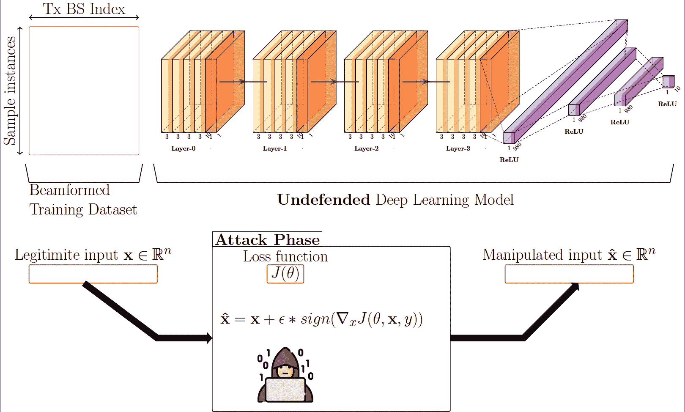
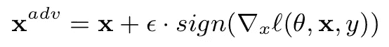
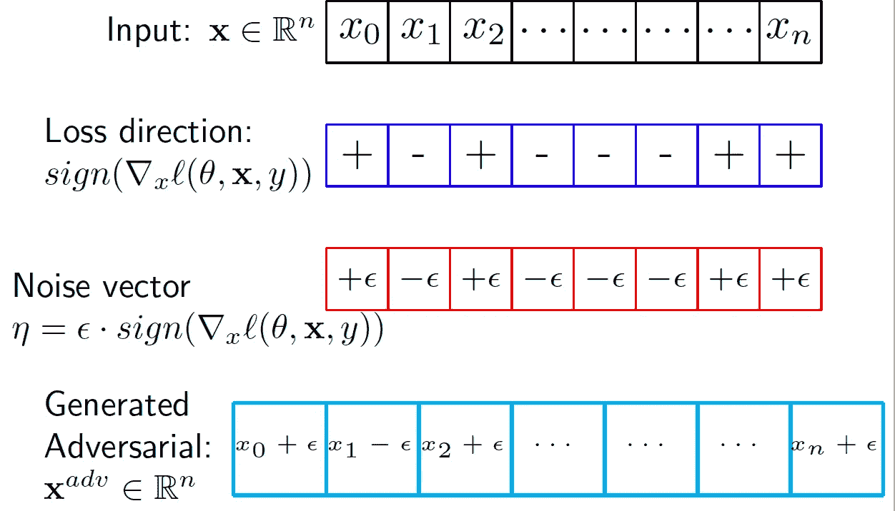
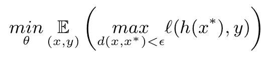
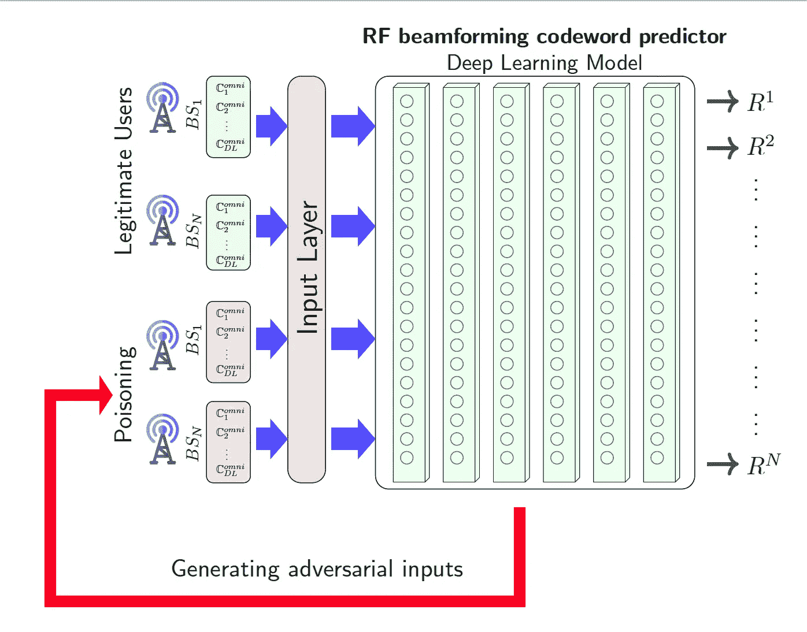
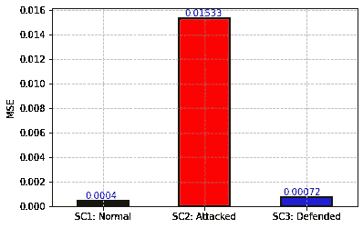

# 6G 和存在安全问题的人工智能

> 原文：<https://towardsdatascience.com/6g-and-artificial-intelligence-with-security-problems-22779a659d49?source=collection_archive---------28----------------------->

## 对抗机器学习攻击的 6G 解决方案:毫米波波束预测用例

6G 是下一代通信系统。近年来，机器学习算法已经广泛应用于各个领域，例如健康、交通和自动驾驶汽车。预测算法将用于 6G 问题。随着深度学习技术的快速发展，在应用算法时考虑安全问题变得至关重要。虽然机器学习为 6G 提供了显著的优势，但人工智能模型的安全性却被忽视了。由于它在现实世界中有许多应用，安全性是算法的一个重要部分。这篇文章提出了一种针对具有对抗性学习的 6G 机器学习模型的对抗性攻击的缓解方法。针对机器学习模型的对抗性攻击背后的主要思想是通过操纵针对 6G 应用的经过训练的深度学习模型来产生错误的结果。

**引用作品**
如果你觉得这个实现有用，请引用它:

```
@misc{ 6g-sec-problems,
   author = "Catak, FO. ",
   title = "6G with Adversarial Machine Learning Security Problems: Millimeter Wave Beam Prediction Use-Case",
   year = "2021",
   url = "https://arxiv.org/abs/1905.01999",
   note = "[arXiv:1905.01999 ]"
 }
```

## 1.6G 简介

直到 4G，已经探索了时频域技术来增加整体系统容量。5G 和其他技术的最新发展以前所未有的速度支持新兴应用，如智能家居、车载网络、增强现实(ar)、虚拟现实(VR)，这是由大规模多输入多输出(MIMO)、毫米波通信、网络切片、小蜂窝和物联网(IoT)的最新进展实现的。这些 5G 和超越技术的复杂结构可以通过使用**数据驱动方法**机器学习(ML)算法来捕获。ML 强大的学习、推理、智能识别能力允许网络结构在没有人工干预的情况下自我训练和调整以支持系统的不同需求。

另一方面，6G 容易受到对抗性的机器学习攻击。图显示了一个攻击场景。攻击者得到一个合法的输入， **x** ，创建一个带有 *e* 预算的噪声向量，将输入实例和精心设计的噪声相加，以创建对抗性输入 **x_adv.**



作者图片

## 2.对抗性机器学习

对抗性机器学习是一种攻击技术，它试图通过提供巧妙处理的输入和微小的差异来欺骗神经网络模型。明显的意图是在神经网络中产生一个故障。

深度学习模型的攻击方法有很多种，FGSM 是最直接最强大的攻击类型。FGSM 的工作原理是利用神经网络的梯度来创建一个对抗的例子来规避模型。对于输入实例 **x** 。



总体步骤如下:



作者图片

## 3.解决方案:对抗性训练

对抗性训练是一种广泛推荐的防御方法，它意味着使用受害者分类器的梯度来生成对抗性实例，然后使用对抗性实例及其各自的标签来重新训练模型。这种技术已经被证明可以有效地保护模型免受恶意攻击。

让我们首先考虑一个常见的分类问题，它具有维度为 *d* 的训练实例 **X** ，标签空间为**y**我们假设分类器 *h* 已经被训练为最小化损失函数 *l* 如下:



作者图片

我们修改了针对 6G 安全问题的优化函数。下图是**射频波束形成码字对抗训练**的示意图。



作者图片

## 5.让我们开始编码吧

我将用 Python 语言展示我们提出的方法。我导入通常的标准库来构建深度学习模型，以预测 RF 波束成形码字。

```
import tensorflow as tf
from scipy.io import loadmat, savemat
import numpy as np
from keras.models import Sequential
from keras.layers import Dense
from tqdm import tqdm
from keras.callbacks import ModelCheckpoint
import pickle 
from sklearn.metrics import mean_squared_error
import matplotlib.pyplot as plt
import pandas as pd
```

在这项工作中，我将使用公开可用的 [DeepMIMO 数据集](https://www.deepmimo.net)攻击射频波束形成预测模型。我将使用 FGSM 攻击和**均方误差**损失函数进行输入操作。我的 FGSM 攻击实现在这里。

```
loss_object = tf.keras.losses.MeanSquaredError()

def fgsm(model, input_instance, label, n_BS,n_beams, epsilon =0.01):
    tensor_input_instance = tf.convert_to_tensor(input_instance, dtype=tf.float32)
    adv_x = input_instance
    for idx in range(0, n_BS*n_beams-2, n_beams):
        with tf.GradientTape() as tape:
            tmp_label = label[:, idx:idx + n_beams]
            tape.watch(tensor_input_instance)
            prediction = model(tensor_input_instance)
            loss = loss_object(tmp_label, prediction)
            gradient = tape.gradient(loss, tensor_input_instance)
            signed_grad = tf.sign(gradient)
            adv_x = adv_x + eps * signed_grad
    return adv_x
```

## 我们场景中的参数

该表显示了射频波束形成、深度神经网络和对抗设置的所有参数。


```
# Reading input and output sets generated from MATLAB
# with DeepMIMO generator http://www.deepmimo.net
In_set_file=loadmat('DLCB_dataset/DLCB_input.mat')
Out_set_file=loadmat('DLCB_dataset/DLCB_output.mat')

In_set=In_set_file['DL_input']
Out_set=Out_set_file['DL_output']

# Parameter initialization
num_user_tot=In_set.shape[0]

DL_size_ratio = .8
count=0
num_tot_TX=4
num_beams=512
```

# 原始(未设防的)训练程序

```
def train(In_train, Out_train, In_test, Out_test,
          nb_epoch, batch_size,dr,
          num_hidden_layers, nodes_per_layer,
          loss_fn,n_BS,n_beams):

    in_shp = list(In_train.shape[1:])

    AP_models = []
    for idx in range(0, n_BS*n_beams-2, n_beams):
        idx_str = str(idx / n_beams + 1)
        act_func = 'relu'
        model = Sequential()
        model.add(Dense(100, input_dim=in_shp[0], activation=act_func))
        model.add(Dense(100, activation=act_func))
        model.add(Dense(100, activation=act_func))
        model.add(Dense(100, activation=act_func))
        model.add(Dense(n_beams, activation=act_func))
        model.compile(loss=loss_fn, optimizer='rmsprop', metrics=['mean_squared_error'])

        history = model.fit(In_train,
                            Out_train[:, idx:idx + n_beams],
                            batch_size=batch_size,
                            epochs=nb_epoch,
                            verbose=0,
                            validation_data=(In_test, Out_test[:,idx:idx + n_beams]))

        filehandler = open('history.pkl', 'wb') 
        pickle.dump(history.history, filehandler)
        filehandler.close()

        AP_models.append(model)
    return AP_models
```

# 培训过程(正常行为)

这里，我们将在没有任何攻击者的情况下训练 RF 波束成形码字预测模型。

```
count=count+1
DL_size=int(num_user_tot*DL_size_ratio)

np.random.seed(2016)
n_examples = DL_size
num_train  = int(DL_size * 0.8)
num_test   = int(num_user_tot*.2)

train_index = np.random.choice(range(0,num_user_tot), size=num_train, replace=False)
rem_index = set(range(0,num_user_tot))-set(train_index)
test_index= list(set(np.random.choice(list(rem_index), size=num_test, replace=False)))

In_train = In_set[train_index]
In_test =  In_set[test_index] 

Out_train = Out_set[train_index]
Out_test = Out_set[test_index]

#In_train, In_test, Out_train, Out_test =  train_test_split(In_set, Out_set, test_size=0.33)

# Learning model parameters
nb_epoch = 10    
batch_size = 100  
dr = 0.05                  # dropout rate  
num_hidden_layers=4
nodes_per_layer=In_train.shape[1]
loss_fn='mean_squared_error'

eps = 2.0 * 16.0 / 255.0

# Model training
AP_models = train(In_train, Out_train, In_test, Out_test,
                                      nb_epoch, batch_size,dr,
                                      num_hidden_layers, nodes_per_layer,
                                      loss_fn,num_tot_TX,num_beams)
# Model running/testing
DL_Result={}
mse_list = []
for id in range(0,num_tot_TX,1): 
    beams_predicted=AP_models[id].predict( In_test, batch_size=10, verbose=0)

    DL_Result['TX'+str(id+1)+'Pred_Beams']=beams_predicted
    DL_Result['TX'+str(id+1)+'Opt_Beams']=Out_test[:,id*num_beams:(id+1)*num_beams]

    mse = mean_squared_error(Out_test[:,id*num_beams:(id+1)*num_beams],beams_predicted)
    mse_list.append(mse)
print('mse:',np.mean(mse_list))

DL_Result['user_index']=test_indexmse: 0.00030647155448710575
```

# 攻击射频波束成形码字预测模型

射频波束形成预测模型的性能相当好，为 0.00039。现在，我们将使用 FGSM 攻击该模型。

```
import warnings
warnings.filterwarnings('ignore')
# Model running/testing
DL_Result={}
mse_list = []
for id in range(0,num_tot_TX,1): 
    # !!!!! Attack generation !!!!
    In_test_adv = fgsm(AP_models[id], In_test,Out_test,num_tot_TX,num_beams,eps)
    beams_predicted=AP_models[id].predict( In_test_adv, batch_size=10, verbose=0)

    DL_Result['TX'+str(id+1)+'Pred_Beams']=beams_predicted
    DL_Result['TX'+str(id+1)+'Opt_Beams']=Out_test[:,id*num_beams:(id+1)*num_beams]

    mse = mean_squared_error(Out_test[:,id*num_beams:(id+1)*num_beams],beams_predicted)
    mse_list.append(mse)
print('mse:',np.mean(mse_list))mse: 0.0151878763143215
```

## 对抗训练

被攻击模型的性能(即 mse=0.01532)比正常性能(即 mse=0.00039)差。让我们用对抗性训练来训练正常模式。

```
# Model training function
def adv_train(In_train, Out_train, In_test, Out_test,
          nb_epoch, batch_size,dr,
          num_hidden_layers, nodes_per_layer,
          loss_fn,n_BS,n_beams, eps):

    in_shp = list(In_train.shape[1:])

    AP_models = []
    mcp_save = ModelCheckpoint('model.hdf5', save_best_only=True, verbose=0, 
                                   monitor='val_mean_squared_error', mode='min')

    for idx in range(0, n_BS*n_beams-2, n_beams):
        idx_str = str(idx / n_beams + 1)
        act_func = 'relu'
        model = Sequential()
        model.add(Dense(100, input_dim=in_shp[0], activation=act_func))
        model.add(Dense(100, activation=act_func))
        model.add(Dense(100, activation=act_func))
        model.add(Dense(100, activation=act_func))
        model.add(Dense(n_beams, activation=act_func))
        model.compile(loss=loss_fn, optimizer='rmsprop', metrics=['mean_squared_error'])

        history = model.fit(In_train,
                            Out_train[:, idx:idx + n_beams],
                            batch_size=batch_size,
                            epochs=nb_epoch,
                            verbose=0,
                            validation_data=(In_test, Out_test[:,idx:idx + n_beams]))

        callbacks = [mcp_save]
        for _ in range(10):
            In_train_adv = fgsm(model, In_train,Out_train, n_BS, n_beams)
            In_train_adv = np.concatenate((In_train, In_train_adv), axis=0)

            Out_train_adv = np.concatenate((Out_train, Out_train), axis=0)

            history = model.fit(In_train_adv,
                                Out_train_adv[:, idx:idx + n_beams],
                                batch_size=batch_size,
                                epochs=nb_epoch*3,
                                verbose=0,
                                callbacks=callbacks,
                                validation_data=(In_test, Out_test[:,idx:idx + n_beams]))
            model.load_weights('model.hdf5')

        AP_models.append(model)
    return AP_modelsAP_models = adv_train(In_train, Out_train, In_test, Out_test,
                      nb_epoch, batch_size,dr,
                      num_hidden_layers, nodes_per_layer,
                      loss_fn,num_tot_TX,num_beams,eps)# Model running/testing
DL_Result={}
mse_list = []
for id in range(0,num_tot_TX,1): 
    # !!!!! Attack generation !!!!
    In_test_adv = fgsm(AP_models[id], In_test,Out_test,num_tot_TX,num_beams,eps)
    beams_predicted=AP_models[id].predict( In_test_adv, batch_size=10, verbose=0)

    DL_Result['TX'+str(id+1)+'Pred_Beams']=beams_predicted
    DL_Result['TX'+str(id+1)+'Opt_Beams']=Out_test[:,id*num_beams:(id+1)*num_beams]

    mse = mean_squared_error(Out_test[:,id*num_beams:(id+1)*num_beams],beams_predicted)
    mse_list.append(mse)
print('mse:',np.mean(mse_list))mse: 0.0006801871943259285
```

## 所有结果

现在，RF 波束成形码字预测模型在攻击下的性能优于无防御模型的性能。

```
vals = [0.00039551136731949614,0.01532598592375935,0.0007175213740754419]
df = pd.DataFrame({'Scenario':['SC1: Normal','SC2: Attacked','SC3: Defended'],'vals':vals})
df.plot.bar(x='Scenario',y='vals', rot=0,color=['green', 'red','blue'], 
            edgecolor='black',legend='',linewidth=2)
plt.xlabel('')
ax = plt.gca()
for i, v in enumerate(vals):
    ax.text(-0.17+i*0.97, 0.0002 + v, str(np.round(vals[i],5)), color='blue')
plt.ylabel('MSE')
plt.grid(True, which="both", ls="--")
plt.show()
```



作者图片

## 6.结论

本研究讨论了与射频波束成形码字预测模型的脆弱性和解决方案相关的安全问题之一:(1)基于深度学习的射频波束成形码字预测器是否容易受到对抗性机器学习攻击？(2)迭代对抗训练方法是波束形成预测中对抗攻击的缓解方法吗？为了回答这些问题，我们使用 DeepMIMO 光线跟踪场景进行了实验。我们的结果证实了原始模型易受修改的 FGSM 攻击。缓解方法之一是迭代对抗训练方法。我们的实证结果还表明，迭代对抗性训练成功地提高了 RF 波束形成预测性能，并创建了更准确的预测器，表明该策略可以提高预测器的性能。