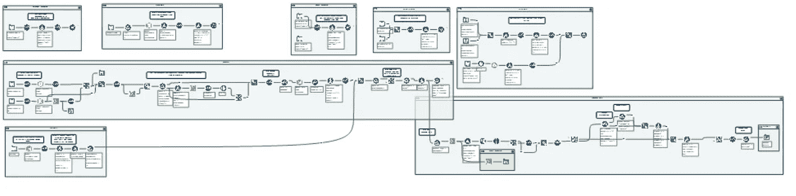
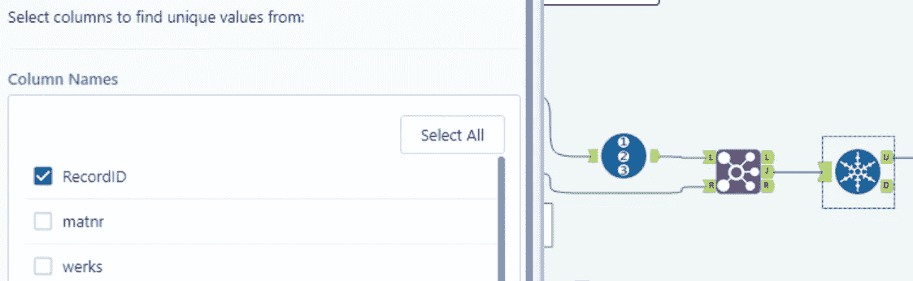
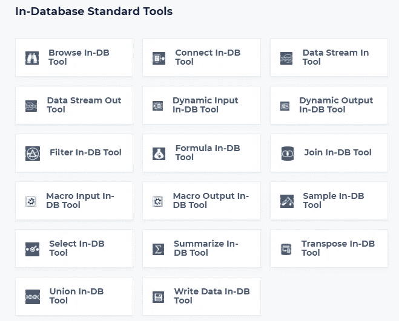

# 简化生活的 7 个最佳实践

> 原文：<https://towardsdatascience.com/7-alteryx-best-practices-to-simplify-your-life-b7155cdee56a?source=collection_archive---------15----------------------->

## 使用这些策略来减少重复工作、混乱，并加快您的开发时间

我经常给 Alteryx 的新用户同样的建议。所以我想*为什么不用这些技巧写一篇文章呢？*然后更多的人可以改进和简化他们的 Alteryx 开发过程。

这就是 7 个让你生活更轻松的最佳实践。

由[布雷特·乔丹](https://unsplash.com/@brett_jordan?utm_source=medium&utm_medium=referral)在 [Unsplash](https://unsplash.com?utm_source=medium&utm_medium=referral) 上拍摄的照片

(非常感谢我的经理 Shalini Polimetla，他教会了我许多这些最佳实践。)

## 1.保持您的工作流程井然有序

随着您的 Alteryx 工作流变得越来越复杂，遵循逻辑的思路变得越来越困难。幸运的是，有几个工具可以帮助您保持工作流程简单明了:

*   工具容器:你可以使用容器来分隔工作流程的各个部分。这允许您将过程分组为逻辑部分，并帮助其他人更快地理解您的过程。还可以最小化工具容器，以便工作流的特定部分不会运行，这对于在开发过程中加快运行时间很有用。
*   **注释框:**在工作流程的开发过程中，这些注释框可以很好地跟踪您自己的注释和问题。一旦工作流准备好生产或发送给其他队友，注释可以帮助其他人理解不同数据处理步骤背后的业务逻辑或原因。

图片作者。工作流组织中容器、注释和无线工具连接的使用示例。

*   **无线工具连接:**您可以右键单击任何工具，然后选择“使传出连接无线化”这将减少由于工具的输出数据分支到许多其他工具而造成的视觉混乱。

## 2.共享前打包工作流

打包一个工作流非常简单，它也可以让工作流的接收者省心。在 Alteryx 中，只需进入选项→导出工作流。这将创建一个 Alteryx 包文件(。yzp)，其行为类似于压缩文件。打包工作流的优点是它包括运行工作流所需的所有输入文件，因此用户不必搜索文件或重新输入所有输入路径。压缩文件夹还包括工作流中使用的任何支持宏。

## 3.连接数据时使用记录 ID 和唯一工具

这可能是我在过去一年使用 Alteryx 中学到的最重要的技巧。本质上，数据连接会使**变得混乱**。如果您将各种数据源放在一起，很容易在连接中丢失，然后突然出现重复记录的问题。或者，如果您是第一次使用数据集，这种技术可以帮助您理解表的主键，并找出应该如何将它们连接在一起。

图片作者。

技术很简单:在数据的左侧放置一个 RecordID 工具，然后在选择 RecordID 字段的情况下，在内部连接输出(J)之后放置一个独特的工具。这将确保原始数据流(左侧)中的记录不会重复。如果您确实看到来自 unique 工具的副本(D)输出的记录，那么理解*为什么会发生这种情况*是很重要的。这可能是因为您没有为两个表正确构建连接。

## 4.制作宏来简化重复的过程

如果您发现自己通过一遍又一遍地复制工具来复制工作流程中的流程，您可能有机会通过将这些流程转换为批处理宏来简化工作流程。要了解更多关于批处理宏的信息，请看 Alteryx 的“批处理宏入门”帖子:

<https://community.alteryx.com/t5/Alteryx-Designer-Knowledge-Base/Getting-Started-with-Batch-Macros/ta-p/488165>  

## 5.首次运行前保存您的工作流程

这是我从我的经理那里学到的一个观点:如果你没有先保存就运行一个工作流(即它将显示为 NewWorkflow1)，它将使用临时驱动器的处理能力。如果您保存然后运行，它会使用 c 盘的处理能力。我看到这将 10 分钟的运行时间缩短到 7 分钟或更少。

## 6.生产化时消除浏览工具和不必要的工具

根据数据集的大小，使用浏览工具可以显著降低工作流的处理时间。一旦你的工作流程处于稳定状态，你应该回顾它，消除浏览工具，并重新评估是否所有的工具都是必要的。

当我回顾我的工作流程时，如果我在时间紧迫的情况下开发它们，我会意识到我没有以最有效的方式设计它们。或者，也许需求在项目持续期间发生了变化，所以我现在可以删除工作流中一些不再有用的部分或工具。

## 7.卸载数据或使用数据库内工具进行数据库查询

图片来自 [Alteryx](https://help.alteryx.com/20213/designer/in-database-overview) 。

数据库内工具允许您在不将数据移出数据库的情况下执行数据清理/数据混合活动。当您处理大型查询时，这可以使您的工作流运行得更快。

要全面了解数据库内工具，可以参考 Alteryx 文档页面:

<https://help.alteryx.com/20213/designer/in-database-overview>  

此外，当我开发一个工作流时，我经常查询数据库并将结果存储在一个. yxdb ( [Alteryx 数据库文件格式中。](https://help.alteryx.com/20213/designer/alteryx-database-file-format))然后我用了。yxdb 文件作为我的工作流的输入，这样:1 .工作流程运行速度更快。当我重新工作和测试我的过程时，我不会用大量的查询来访问数据库。

由[菲利普·卡森伯格](https://unsplash.com/@fantasyflip?utm_source=medium&utm_medium=referral)在 [Unsplash](https://unsplash.com?utm_source=medium&utm_medium=referral) 上拍摄的照片

这就是我今天为您介绍的 Alteryx 最佳实践的全部内容，尽管我确信还有更多内容没有介绍。如果你有从经验中学到的策略，请随时留下你的专业评论！

如果您以前从未使用过 Alteryx，以下是我认为您应该尝试的一些原因:

</why-you-should-learn-alteryx-5e5fcbc557ae> 