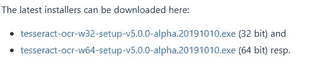
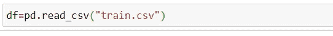
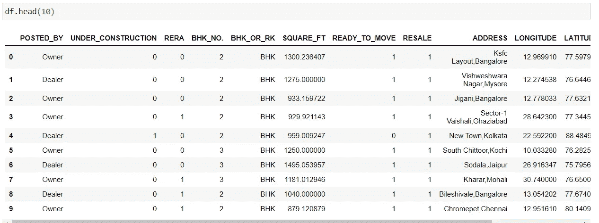
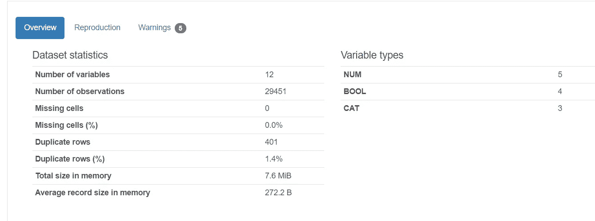
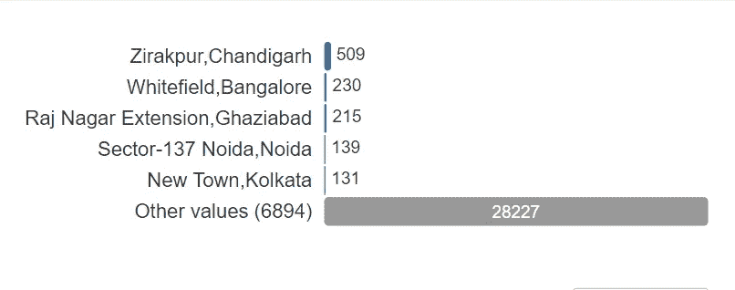
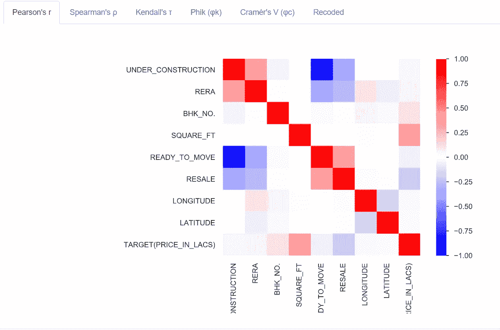

# 你必须知道的 7 个惊人的 Python 一行程序

> 原文：<https://towardsdatascience.com/7-amazing-python-one-liners-you-must-know-413ae021470f?source=collection_archive---------8----------------------->

## 加速熊猫，快速数据剖析，数据抓取，等等


图片来自 [**像素**](https://www.pexels.com/photo/man-in-red-polo-shirt-3779453/?utm_content=attributionCopyText&utm_medium=referral&utm_source=pexels)

# 1.从图像中抓取文本

`pytesseract` 是一个 python 库，可以帮助我们用一行 python 代码从图像中读取文本。首先是读取任何图像——我们可以使用 OpenCV 做到这一点。

让我们先安装它们。

```
pip install opencv-python
pip install pytesseract
```

我们需要[下载](https://github.com/UB-Mannheim/tesseract/wiki)一个. exe 文件来检查`pytesseract`在你的机器上是否工作正常。



```
import cv2
import pytesseractpytesseract.pytesseract.tesseract_cmd = "YOUR_DOWNLOADED_FILE_PATH"
```

如果上面的命令运行没有任何错误，那么这意味着我们是好的。

现在让我们加载一个图像，并用一行 python 代码读取文本。

```
img = cv2.imread("YOUR_IMAGE_PATH")
**text = pytesseract.image_to_string(img)**print(text)
```

# 2.一次性导入所有库

`**pyforest**` 是一个 python 模块，可以帮助我们在一行 python 中导入所有的库。您可以预期所有类型的通用 python 库都将被导入。这也包括大多数用于机器学习任务的库。这个库也有一些助手模块，比如`os`、`tqdm`、`re`等等。

```
**pip install pyforest**
```

要检查库列表，运行此`**dir(pyforest)**` **。**

导入`pyforest`后，可以直接运行`pd.read_csv()`、`sns.barplot()`、`os.chdir()`等等。

# 3.获取数据分析报告

`pandas_profiling`是一个 python 库，可以帮助我们在几秒钟内得到一个惊人的数据剖析报告。可以下载分析报告以供进一步使用。

```
pip install pandas_profiling
```

安装库后，您可以导入它，如下所示:

```
import pandas_profiling
import pandas as pd
```

我们使用熊猫来导入数据集。



导入数据



数据快照

```
**hourse_price_report=pandas_profiling.ProfileReport(df).to_file('house_report.html')**
```

您的数据报告将保存为 HTML 文件。

部分数据报表截图:



*总体数据汇总*



*每个变量的详细信息*



*变量间每个相关性的详细可视化*

# 4.合并两本词典

如果您有两个字典 dic1 和 dic2，并且希望所有的键-值对都从 dic2 转移到 DIC 1——下面一行代码会有所帮助。

```
dic1.update(dic2)
```

# 5.将字符串列表转换为整数

当我们接受字符串形式的用户输入时，这种方法非常方便。python 的下面一行可以把你的字符串列表转换成整数。

```
list(map(int, ['1', '2', '3']))
```

**输出:**【1，2，3】

# 6.从网站抓取数据

网络抓取并不困难，但要将废弃的内容转化却是一项繁琐的任务。在这里，我使用一行 python 代码从维基百科页面中抓取关于比特币的数据。

```
import pandas as pd
data = pd.read_html(“[https://en.wikipedia.org/wiki/Bitcoin](https://en.wikipedia.org/wiki/Bitcoin)")
```

现在我们可以使用数据变量来获得想要的信息。

# 7.加快你的熊猫行动

`modin`是一个 python 库——使用 [Ray](https://github.com/ray-project/ray/) 或 [Dask](https://dask.org/) 来提供一种毫不费力的方式来加速你的熊猫笔记本、脚本和库。

使用下面一行代码来安装`modin`。

```
**pip install modin**
```

现在，你可以这样安装它。

```
**import** **modin.pandas** **as** **pd**
```

这就是你需要做的。不需要对代码做进一步的修改。

# 结论

本文到此为止。我们已经讨论了一些令人惊奇的 python 一行程序。其中一些非常有用，比如`pyforest` ——当你必须一次安装所有的库时。和，`modin` 图书馆，以加快你的熊猫操作，如读取数据帧和作出任何改变。

我希望你喜欢这篇文章。敬请期待！

谢谢你的阅读！

以下是我的一些最佳选择:

<https://betterprogramming.pub/10-python-tricks-that-will-wow-you-de450921d96a>  </5-data-science-projects-that-you-can-complete-over-the-weekend-34445b14707d> [## 你可以在周末完成的 5 个数据科学项目

towardsdatascience.com](/5-data-science-projects-that-you-can-complete-over-the-weekend-34445b14707d) <https://betterprogramming.pub/how-a-single-mistake-wasted-3-years-of-my-data-science-journey-b7ca1e962085>  

> *走之前……*

如果你喜欢这篇文章，并且想继续关注更多关于 **Python &数据科学**的**精彩文章**——请点击这里[https://pranjalai.medium.com/membership](https://pranjalai.medium.com/membership)考虑成为一名中级会员。

请务必考虑使用[我的推荐链接](https://pranjalai.medium.com/membership)报名。通过这种方式，会员费的一部分归我，这激励我写更多关于 Python 和数据科学的令人兴奋的东西。

还有，可以随时订阅我的免费简讯: [**Pranjal 的简讯**](https://pranjalai.medium.com/subscribe) 。