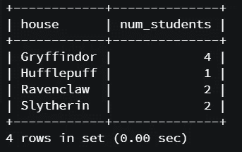
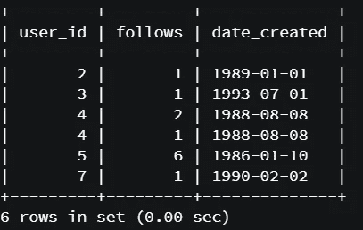
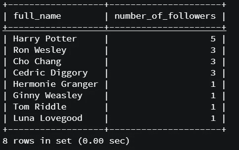
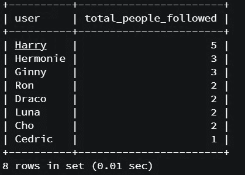
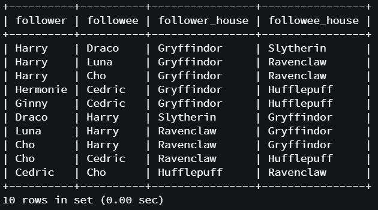
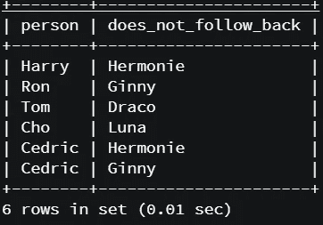

# 针对数据分析角色的 7 个初级到中级 SQL 面试问题

> 原文：<https://towardsdatascience.com/7-beginner-to-intermediate-sql-interview-questions-for-data-analytics-roles-e465f26b8fe6?source=collection_archive---------9----------------------->

## 通过 goormIDE 上的示例数据和 MYSQL 实现


照片由[卢](https://unsplash.com/@riku?utm_source=medium&utm_medium=referral)在 [Unsplash](https://unsplash.com?utm_source=medium&utm_medium=referral)

*(注:所有观点均为本人)*

# **简介**

大多数分析角色都需要良好的 SQL 知识，这也是编码测试的热门主题。无论什么职位，都需要 SQL 技能，你对这种语言的掌握越强，你就越有机会获得你想要的职位。

本文的目的是给你一套实用的例题来练习。它主要面向初级到中级，但其中一些问题与你在面试中会遇到的问题相差不远。

希望你会发现它们对你的准备有用。

*注意:回答以下问题可能有多种方法。此处提供的答案仅代表其中一种选择。当你通过它们进行推理时，请随意实现你自己的逻辑。*

# 数据

你将使用一个小型的社交媒体样本，比如数据。有两个表， *users，*包含关于人员配置文件的基本信息，而 *follows，*列出了哪些用户关注另一个给定的用户。

该数据的主题是哈利波特的魔法世界，其中用户来自哈利波特传奇中的各种角色。

因此，users 表将类似于下面的内容，其中有 **user_id、first_name、last_name** 和 **house** 列。

```
**user_id, first_name, last_name, house**
1,Harry,Potter,Gryffindor
2,Ron,Wesley,Gryffindor
3,Hermonie,Granger,Gryffindor
4,Ginny,Weasley,Gryffindor
5,Draco,Malfoy,Slytherin
6,Tom,Riddle,Slytherin
7,Luna,Lovegood,Ravenclaw
8,Cho,Chang,Ravenclaw
9,Cedric,Diggory,Hufflepuff
```

*跟随*表将报告哪两个用户 id 形成了前者跟随后者的关系的信息。因此，这些列将是**用户标识**、**跟随**(被跟随的用户的用户标识)，以及**日期**，其中创建了“跟随”关系。

```
user_id,follows,date
1,2,1993-09-01
2,1,1989-01-01
3,1,1993-07-01
2,3,1994-10-10
3,2,1995-03-01
4,2,1988-08-08
4,1,1988-08-08
1,4,1994-04-02
1,5,2000-01-01
5,1,2000-01-02
5,6,1986-01-10
7,1,1990-02-02
1,7,1996-10-01
1,8,1993-09-03
8,1,1995-09-01
8,9,1995-09-01
9,8,1996-01-10
7,8,1993-09-01
3,9,1996-05-30
4,9,1996-05-30
```

现在让我们看看如何以编程方式创建这些数据，以便能够对其运行查询。

# 设置:在 goormIDE 上运行 MYSQL 查询

为了运行您的查询，您可以使用 goorm.io IDE。

这是我在 Udemy 上参加“[终极 my SQL 训练营:从 SQL 初学者到专家](https://www.udemy.com/course/the-ultimate-mysql-bootcamp-go-from-sql-beginner-to-expert/)”课程时偶然发现的一个很好的资源。

您可以参考下面的链接注册并使用一个新的容器运行，在这个容器中，您将能够启动和关闭数据库，并运行 SQL 脚本。

[Goorm.io 注册说明](https://gist.github.com/nax3t/2773378c4d1bada8d66d12f4d5210248)

*(你会在下面的说明中找到一些课程的参考资料。即使你没有有效地学习这门课程，你也可以很容易地理解它们，因为这将使你同样能够从 goorm.io 容器中运行你的 SQL 脚本)*

一旦你设置好了，现在是时候创建哈利波特数据库并开始查询了！

# 数据库和表格创建

首先，让我们创建一个数据库来存储我们的表。你可以给它起任何你喜欢的名字，我把它命名为*社会。*

然后，创建*用户*和*跟随*表，数据类型如下。 *user_id* 列在*用户*和*之后充当主键和外键，将两个表链接在一起。*

```
DROP DATABASE IF EXISTS social;
CREATE DATABASE social;
USE social;CREATE TABLE users(
  user_id INTEGER PRIMARY KEY,
  first_name TEXT NOT NULL,
  last_name TEXT,
  house TEXT);CREATE TABLE follows(
  user_id INTEGER,
  follows INTEGER,
  date_created DATE,
  FOREIGN KEY (user_id) REFERENCES users(user_id),
  FOREIGN KEY (follows) REFERENCES users(user_id));
```

一旦完成，就该插入你在上面看到的数据了。您可以使用“插入到[表格]中”命令来完成此操作。您可以随意将下面的内容复制到您的脚本中，并通过*source name _ of _ SQL _ file . SQL*命令在 MYSQL 容器中运行它。

```
INSERT INTO users (user_id,first_name,last_name,house
) VALUES (1,"Harry","Potter","Gryffindor"),
(2,"Ron","Wesley","Gryffindor"),
(3,"Hermonie","Granger","Gryffindor"),
(4,"Ginny","Weasley","Gryffindor"),
(5,"Draco","Malfoy","Slytherin"),
(6,"Tom","Riddle","Slytherin"),
(7,"Luna","Lovegood","Ravenclaw"),
(8,"Cho","Chang","Ravenclaw"),
(9,"Cedric","Diggory","Hufflepuff");INSERT INTO follows (user_id,follows,date_created)
VALUES (1,2,STR_TO_DATE("1993-09-01", '%Y-%m-%d')),
(2,1,STR_TO_DATE("1989-01-01",'%Y-%m-%d')),
(3,1,STR_TO_DATE("1993-07-01",'%Y-%m-%d')),
(2,3,STR_TO_DATE("1994-10-10",'%Y-%m-%d')),
(3,2,STR_TO_DATE("1995-03-01",'%Y-%m-%d')),
(4,2,STR_TO_DATE("1988-08-08",'%Y-%m-%d')),
(4,1,STR_TO_DATE("1988-08-08",'%Y-%m-%d')),
(1,4,STR_TO_DATE("1994-04-02",'%Y-%m-%d')),
(1,5,STR_TO_DATE("2000-01-01",'%Y-%m-%d')),
(5,1,STR_TO_DATE("2000-01-02",'%Y-%m-%d')),
(5,6,STR_TO_DATE("1986-01-10",'%Y-%m-%d')),
(7,1,STR_TO_DATE("1990-02-02",'%Y-%m-%d')),
(1,7,STR_TO_DATE("1996-10-01",'%Y-%m-%d')),
(1,8,STR_TO_DATE("1993-09-03",'%Y-%m-%d')),
(8,1,STR_TO_DATE("1995-09-01",'%Y-%m-%d')),
(8,9,STR_TO_DATE("1995-09-01",'%Y-%m-%d')),
(9,8,STR_TO_DATE("1996-01-10",'%Y-%m-%d')),
(7,8,STR_TO_DATE("1993-09-01",'%Y-%m-%d')),
(3,9,STR_TO_DATE("1996-05-30",'%Y-%m-%d')),
(4,9,STR_TO_DATE("1996-05-30",'%Y-%m-%d'));
```

数据库、表和数据都设置好了，让我们开始查询吧！

# 问题 1

> 每栋房子有多少用户？

要回答这个问题，您可以使用 COUNT 函数和 GROUP BY 列来合计 users 表中每个 house 特性的用户数。

**查询**

```
SELECT house,
count(*)as num_students
FROM users
GROUP BY house;
```

**结果**



来源:作者

# 问题 2

> 列出以下所有在 1993 年 9 月 1 日之前创建的链接

要回答这个问题，您可以使用 WHERE 语句来筛选下表中在指定日期之前创建的所有行。

**查询**

```
SELECT *
FROM follows
WHERE date_created<"1993-09-01";
```

**结果**



来源:作者

# 问题 3

> 列出 1993 年 9 月 1 日之前建立的所有链接，但这次使用用户的名字

这个问题相当于问题 2，只是您现在的任务是将关注者和被关注者的 *user_id* 与他们的名字相关联，这些名字出现在 *users* 表中。

为此，可以使用*follow*表与 *users* 表的双重连接，从而将*follow*表中的 *user_id* 列的名字和*follow*表中的*follow*列的名字都作为源。

WHERE 语句仍然确保您过滤 1993 年 9 月 1 日之前建立的链接。您还可以利用别名来重命名输出结果。

**查询**

```
SELECT u.first_name as follower,
u2.first_name as followee,
date_created 
FROM follows
JOIN users as u ON follows.user_id=u.user_id
JOIN users as u2 ON follows.follows=u2.user_id
WHERE date_created<"1993-09-01";
```

**结果**


来源:作者

# 问题 4

> 统计一下从 1999 年 12 月 31 日起，每个用户有多少人关注。根据“用户全名，追随者数量”给出结果

带着这个问题，你基本上有兴趣知道谁是拥有最多追随者的用户。您可以通过在【T2 跟随表中按照*跟随*列对数据进行分组，然后计算有多少用户跟随特定的 *user_id* 来解决这个问题。

WHERE 语句按日期过滤，并与 *users* 表连接，以引入每个追随者的名字。为了创建全名，CONCAT 语句用于合并 *users* 表的 *first_name* 和 *last_name* 列，然后根据关注者的数量对结果进行排序。

**查询**

```
SELECT concat(first_name," ",last_name) as full_name,
COUNT(*) as number_of_followers
FROM follows
JOIN users ON follows.follows=users.user_id
WHERE date_created<"1999-12-31"
GROUP BY full_name
ORDER BY number_of_followers DESC;
```

**结果**



来源:作者。

不出所料，哈利波特成为最受欢迎的用户！

**问题 5**

> 列出每个用户关注的用户数量

这个问题是对问题 4 的补充，因为它问的是相反的关系。您可以通过类似的逻辑来解决这个问题:使用*follow*表中的 *user_id* 列来引入*用户*的名字，然后在统计*follow*表中的行数的同时，按同一列对数据进行分组。

和以前一样，您可以对结果进行排序，以了解谁在关注他人方面最活跃。《哈利·波特》再次拔得头筹！

**查询**

```
SELECT first_name as user,
count(follows) as total_people_followed
FROM follows
JOIN users ON follows.user_id=users.user_id
GROUP BY user
ORDER by total_people_followed DESC;
```

**结果**



来源:作者

**问题 6**

> 列出来自 follows 的所有行，其中一个房子的人跟踪另一个房子的人。给出带有用户名的结果。

此问题要求您列出不同房屋的用户之间的所有关系。您可以使用的逻辑是分别使用 *user_id* 和*follow*列，为*follow*表中的每一行引入姓名和房屋信息。

完成后，您可以筛选出跟随者和被跟随者不在同一家的行。在这个查询中使用别名可以帮助您在添加到最终结果时澄清每一列。

**查询**

```
SELECT u.first_name as follower,
u2.first_name as followee,
u.house as follower_house,
u2.house  as followee_house
FROM follows
JOIN users as u ON follows.user_id=u.user_id
JOIN users as u2 ON follows.follows=u2.user_id
WHERE u.house!=u2.house;
```

**结果**



来源:作者

**问题** 7

> 列出所有未回应的后续(即 A 跟随 B，但 B 不跟随 A)

要解决此查询，您可以:

*   从下表中列出所有*从动者-从动者*对，作为**【Concat(follows . user _ id，" "，follows . follows)】**
*   通过将对反转为**【Concat(follows . follows，" "，follows . user _ id)】**来识别相反的下列关系
*   仅保留原来的*从动件-从动件*副列表中没有的相反的下列关系(即*跟随*表)

查询的其余部分返回到 *users* 表，以引入姓名信息，从而在最终输出中将其排列为“用户名”+“第一个用户没有跟随的用户名”。

这样，您可以在我们的数据库中确定 6 种关系，其中左边的用户不跟随右边的用户，假设右边的用户跟随左边的用户。(即“即使赫莫尼跟着哈利，哈利也不跟着赫莫尼”)

**查询**

```
SELECT u.first_name as person,
u2.first_name as does_not_follow_back
FROM follows
JOIN users as u on follows.follows=u.user_id
JOIN users as u2 on follows.user_id=u2.user_id
WHERE Concat(follows.follows," ",follows.user_id) NOT IN (SELECT Concat(follows.user_id," ",follows.follows) as relationship FROM follows);
```

**结果**



来源:作者

# 摘要

希望这些练习对你有用。如前所述，请随意实现您自己的逻辑，因为使用 SQL 通常有多种方式来获得给定的结果。

感谢阅读！

**访问我的免费数据科学资源清单** [**这里**](https://landing.mailerlite.com/webforms/landing/k1n3r2)

[](https://edo-romani1.medium.com/membership) [## 通过我的推荐链接加入 Medium-Edoardo Romani

### 作为一个媒体会员，你的会员费的一部分会给你阅读的作家，你可以完全接触到每一个故事…

edo-romani1.medium.com](https://edo-romani1.medium.com/membership)