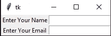
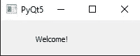
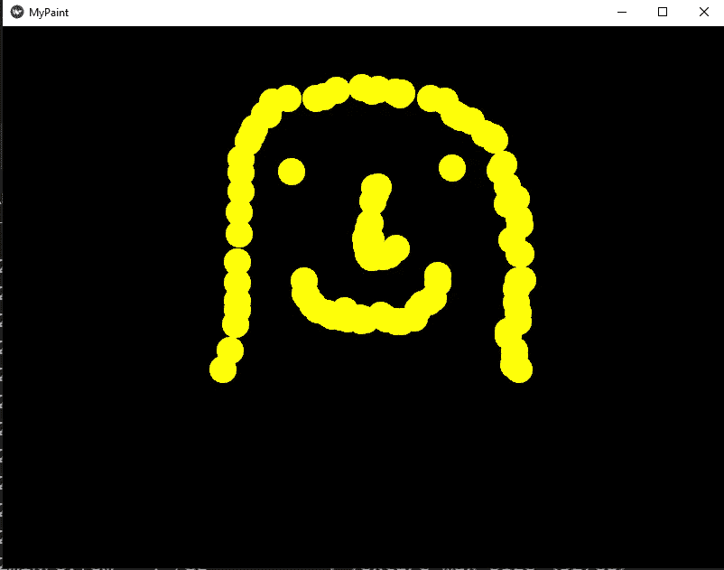
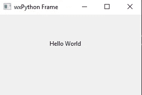

# 7 款面向 Python 开发人员的最佳 UI 图形工具，带入门代码

> 原文：<https://towardsdatascience.com/7-best-ui-graphics-tools-for-python-developers-with-starter-codes-2e46c248b47c?source=collection_archive---------2----------------------->

## Python 中用于开发酷用户界面技术的七个最佳 UI 图形工具


[UX 店](https://unsplash.com/@uxstore?utm_source=medium&utm_medium=referral)在 [Unsplash](https://unsplash.com?utm_source=medium&utm_medium=referral) 上拍照

Python 是一种非常通用的语言，它可以完成不同编程语言想要完成的大多数任务。虽然 Python 更频繁地用于与人工智能、数据科学、数据可视化、数据分析和其他类似操作相关的应用程序和项目，但我们绝不局限于这些边界。作为一名使用 Python 的开发人员，您可以执行 web 开发、构建游戏、构建大量 GUI 工具等等。

用 Python 构建的图形用户界面(GUI)对于各种项目都非常有用。您可以使用这些技术使您的项目独特、美观、视觉上吸引人、高度互动的环境，并为用户提供其他类似的精彩功能。你甚至可以将这些工具用于开发具有机器学习或深度学习模型的人工智能项目，使其从其他此类项目创意中脱颖而出。

在这篇文章中，我们将客观地看一些最好的 GUI 工具，这些工具在 Python 编码的帮助下可供开发者使用。我们将探索七个这样的库，它们为用户实现他们想要的 GUI 应用程序提供了最好的目标。为了遵循本文并相应地实现您的所有代码，我建议读者选择他们最喜欢的编辑器，并尝试一些代码。

我个人使用 Visual Studio 代码进行编程，但是您可以随意使用您的首选。然而，如果你很难选择最适合自己的选项，下面的链接列出了十多个优秀的 Python 编辑器，并给出了优缺点，它将帮助你决定最适合你的编码的编辑器。

</a-concise-guide-of-10-awesome-python-editors-and-how-to-choose-which-editor-suits-you-the-best-465c9b232afd>  

# 1.Tkinter:



作者图片

Python 中可用的 Tkinter 包是大多数图形相关应用程序的最佳工具之一。通过简单的 pip 安装，它可用于 Windows 和 Linux 平台。Tkinter 库允许用户在它包含的众多选项的帮助下开发高质量的图形界面。

Tkinter 具有各种选项，可借助框架、按钮和检查按钮为您的应用程序提供有价值的结构，用于创建交互式选择、用标签显示信息、用 Canvas 绘制数据和统计信息等等。起始代码以下起始代码的代码参考取自此[链接](https://www.geeksforgeeks.org/python-gui-tkinter/)。查看更高级的代码和更多信息。

## 起始代码:

```
from tkinter import *master = Tk()Label(master, text='Enter Your Name').grid(row=0)
Label(master, text='Enter Your Email').grid(row=1)e1 = Entry(master)
e2 = Entry(master)e1.grid(row=0, column=1)
e2.grid(row=1, column=1)mainloop()
```

在上面显示的代码块中，我们创建了一个简单的程序，通过它我们创建了两个简单的网格框，用于注册特定个人的姓名和电子邮件。请随意进一步探索这个库，并构建更复杂的项目。

# 2.PyQt5:



作者图片

Qt 是一组跨平台的 C++库，实现了访问现代桌面和移动系统许多方面的高级 API。Qt 平台为开发人员提供了各种独特的解决方案来开发大量的应用程序和解决大量复杂的任务。通过一个简单的 pip install 命令，您可以从下面的 GUI 应用程序开始。

借助 Python 和 PyQt5 库开发 GUI 应用程序相当简单，只需几行代码就可以完成。下面的代码块演示了我们如何用这个包生成交互式 GUI 界面。

## 起始代码:

```
import sys
from PyQt5.QtCore import *
from PyQt5.QtGui import *
from PyQt5.QtWidgets import *def window():
   app = QApplication(sys.argv)
   w = QWidget()
   b = QLabel(w)
   b.setText("Welcome!")
   w.setGeometry(100,100,200,50)
   b.move(50,20)
   w.setWindowTitle("PyQt5")
   w.show()
   sys.exit(app.exec_())if __name__ == '__main__':
   window()
```

下面的代码块将显示一个带有欢迎命令的图形用户界面。可以添加更高级的小部件和元素，使代码更有吸引力。以下启动代码的代码参考取自此[链接](https://www.tutorialspoint.com/pyqt5/pyqt5_hello_world.htm)。查看更高级的代码和更多信息。

# 3.Pygame:

与前面讨论的两个 GUI 工具不同，Pygame 在比较中略有不同。使用 Pygame，您可以从头开始构建 Python 游戏。虽然它们的性能和图形与其他一些编程语言如 C#和一些精英游戏设计软件相比可能不是最好的，但对于大多数初学者来说，这仍然是一个很好的入门方式，因为编码过程很容易。

除了构建游戏之外，使用 Pygame 的主要优势之一是它拥有的 GUI 功能。它允许开发人员创建一个 GUI 界面，用它可以控制许多动作。Pygame 中有很多选项可以用来开发用户界面中的实体(比如小部件或图标)并控制一些想要的动作。下面是一些入门代码，让你从这个模块中获得更多的经验，从头开始开发更多的项目。

## 起始代码:

```
#imports the pygame library module
import pygame# initilize the pygame module
pygame.init()# Setting your screen size with a tuple of the screen width and screen height
display_screen = pygame.display.set_mode((800,600))# Setting a random caption title for your pygame graphical window.
pygame.display.set_caption("pygame test")# Update your screen when required
pygame.display.update()# quit the pygame initialization and module
pygame.quit()# End the program
quit()
```

在上面的编码部分，我们已经讨论了一些用 Pygame 创建特定大小的图形窗口的起始代码。在这个 Python 库的帮助下，你可以构建更多的应用程序和游戏。要理解为什么每个开发者都应该花时间用 Python 和 AI 开发游戏的五个原因，请查看我以前的一篇文章，关于你应该这样做的五个原因。

</5-reasons-why-you-should-develop-a-game-with-python-and-ai-9f5f276e7637>  

# 4.开放式简历:


图片来自[维基](https://en.wikipedia.org/wiki/File:Lenna_(test_image).png)

Open-CV 是计算机视觉任务和图像处理的最佳库之一。这个库为执行各种任务提供了极好的工具。在 Open-CV 的帮助下，还可以构建 GUI 应用程序以及可定制的界面。虽然 Open for GUI 的可用选项没有其他选项多，但是您可以构建大量的技术内容。

将上面的图片以 Lena 的格式保存在你的桌面上(或者从上面提到的链接下载),并确保是. png 格式。下面是您可以使用 Open-CV 库执行的一些操作的起始代码。

## 起始代码:

```
# Importing the opencv module
import cv2# Read The Image
image = cv2.imread("lena.png")# Frame Title with the image to be displayed
cv2.imshow("Picture", image) 
cv2.waitKey(0)# Convert the color image to grayscale image
gray = cv2.cvtColor(image, cv2.COLOR_BGR2GRAY)# Display Grayscale image
cv2.imshow("Gray Picture", gray)
cv2.waitKey(0)
```

上面的起始代码探索了 Open-CV 库的一些功能的基本实现。如果您有兴趣进一步探索这个特定的库，并了解更多关于计算机视觉的知识，请查看我以前的一篇文章，该文章涵盖了 Open-CV 入门的完整初学者指南，链接如下。

</opencv-complete-beginners-guide-to-master-the-basics-of-computer-vision-with-code-4a1cd0c687f9>  

# 5.基维:



作者图片

另一个奇妙的开源包是 Kivy，它允许用户创建一些高质量的图形用户界面。它可以与 Python 的 pip 安装一起安装。它为开发人员提供了一个最好的业务友好的交叉开发平台，增加了对大多数应用程序的 GPU 加速支持。

除了提供这些令人难以置信的特性，它还允许开发人员在 Raspberry Pi 等设备上实现他们的代码。下面是一个简单的代码块，演示了 Kivy 的工作示例。以下启动代码的代码参考取自此[链接](https://kivy.org/doc/stable/tutorials/firstwidget.html)。查看更高级的代码和更多信息。

## 起始代码:

```
**from** kivy.app **import** App
**from** kivy.uix.widget **import** Widget
**from** kivy.graphics **import** Color**,** Ellipse

**class** MyPaintWidget**(**Widget**):**

    **def** on_touch_down**(**self**,** touch**):**
        **with** self.canvas**:**
            Color**(**1**,** 1**,** 0**)**
            d = 30.
            Ellipse**(**pos=**(**touch.x - d / 2**,** touch.y - d / 2**),** size=**(**d**,** d**))**

**class** MyPaintApp**(**App**):**

    **def** build**(**self**):**
        **return** MyPaintWidget**()**

**if** __name__ == '__main__'**:**
    MyPaintApp**()**.run**()**
```

上述代码块中设计的 GUI 界面将帮助您借助每次单击来绘制一个椭圆形状的对象。我决定用下面的选项画一张随机的脸，这个功能在上面贴的图中很明显。玩得开心，做你自己的创新设计，以及查看 Kivy 包的更多选项。

# 6.wxPython:



作者图片

wxPython 很容易通过一个简单的 pip install 命令来安装，并且可以用来创建令人惊叹的 GUI 框架。它们基本上是 Python 中包装类的扩展，用于创建大量应用程序。对于本文中提到的一些其他 GUI 选项来说，它是一个很好的跨平台选择，可以创建一些简单的项目。

这个包非常容易使用，并创建 GUI 界面。由于其简单性，我们可以轻松地创建窗口、面板、标签和其他功能。下面的代码块展示了如何构建一个 GUI 来显示一些标签。以下启动代码的代码参考取自此[链接](https://www.tutorialspoint.com/wxpython/index.htm)。查看更高级的代码和更多信息。

## 起始代码:

```
import wx 

app = wx.App() 
window = wx.Frame(None, title = "wxPython Frame", size = (300,200))

panel = wx.Panel(window) 
label = wx.StaticText(panel, label = "Hello World", pos = (100,50))

window.Show(True) 
app.MainLoop()
```

# 7.Flask / Django:


由[约书亚·阿拉贡](https://unsplash.com/@goshua13?utm_source=medium&utm_medium=referral)在 [Unsplash](https://unsplash.com?utm_source=medium&utm_medium=referral) 上拍摄的照片

虽然本文的其他部分已经广泛地介绍了桌面上不同类型的图形用户界面(GUI)的工作过程，但是我们将研究两种用于构建基于 web 的 GUI 的 web 开发工具。Flask 和 Django 是两个 Python 库，它们将帮助执行许多动作和操作来创建基于 web 的 GUI 网络。

在下一节中，我们讨论了 Flask 和 Django 的一些简单代码块。这些代码只是供初学者探索他们拥有的巨大潜力。Flask 代码将使您能够在运行程序后提供给您的本地桌面主机中运行所需的打印命令。在以后的文章中，我们将分别探讨 Flask 和 Django，并了解如何用它们编写机器学习项目。一些应用是网络上的人工智能视频监控。

## 烧瓶的起始代码:

```
from flask import Flask, render_template, redirect, url_forapp = Flask(__name__)[@app](http://twitter.com/app).route("/")
[@app](http://twitter.com/app).route("/home")
def home():
 # return "<h1>HELLO!</h1>This is the home page "
 return render_template("home.html") # Render the home.html in the templates folderif __name__ == "__main__":
 app.run(debug=True) #Debugable mode
 # app.run() # Normal Run
```

## Django 的起始代码:

```
from django.http import HttpResponsedef index(request):
    return HttpResponse('Hello, World!')
```

# 结论:


照片由 [Neven Krcmarek](https://unsplash.com/@nevenkrcmarek?utm_source=medium&utm_medium=referral) 在 [Unsplash](https://unsplash.com?utm_source=medium&utm_medium=referral) 上拍摄

*“设计无处不在。从你穿的裙子到你拿的智能手机，都是设计。”——*[***【萨马达拉基尼***](https://careerfoundry.com/en/blog/ux-design/15-inspirational-ux-design-quotes-that-every-designer-should-read/)

Python 编程语言提供了巨大的潜力，可以创建出色的图形用户界面工具来执行各种项目。除了为众多任务增加视觉和美学吸引力之外，它还允许开发人员使他们的项目具有高度交互性。这些 GUI 工具对于大多数实际应用都非常有效，包括软件设计项目、人工智能项目、机器学习或深度学习模型、web 开发等等。

在本文中，我们探索了一些奇妙的图形用户界面工具，开发人员可以用它们来实现一些独特的功能。借助 Python 及其为开发人员提供的丰富的库选项，我们可以用 Tkinter 或 PyQt5 构建一个经典的 GUI 框架。我们还可以用 Pygame 或 Open-CV 分别为游戏和计算机视觉应用构建更独特的 GUI。Kivy 和 wxPython 是另外两个很棒的桌面 GUI 选项。最后，我们还探索了 Flask 和 Django，使用它们我们可以构建基于 web 的 GUI。

虽然我们已经探索了 Python 中用于开发独特应用程序的七个奇妙的 GUI 工具和库，但仍有许多精彩的工具有待探索。如果你有任何其他很酷的建议，一定要在下面评论出来。

如果你对这篇文章中提到的各点有任何疑问，请在下面的评论中告诉我。我会尽快给你回复。

看看我的其他一些文章，你可能会喜欢读！

</17-must-know-code-blocks-for-every-data-scientist-c39a607a844d>  </15-numpy-functionalities-that-every-data-scientist-must-know-f6d69072df68>  </6-best-projects-for-image-processing-with-useful-resources-f860f3dfe977>  </7-best-free-tools-for-data-science-and-machine-learning-3e630125f87e> [## 数据科学和机器学习的 7 个最佳免费工具

towardsdatascience.com](/7-best-free-tools-for-data-science-and-machine-learning-3e630125f87e) 

谢谢你们坚持到最后。我希望你们都喜欢这篇文章。祝大家有美好的一天！