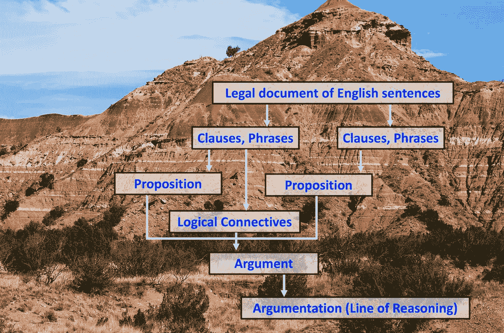

# 法律论证挖掘面临的 7 大挑战

> 原文：<https://towardsdatascience.com/7-challenges-for-argument-mining-in-law-fb98a6df7b0c?source=collection_archive---------34----------------------->

## 认识并克服主要任务如何让我们更接近成功

维恩·R·沃克的图片，[迈克尔·泽兹奇](https://unsplash.com/@lazycreekimages?utm_source=unsplash&utm_medium=referral&utm_content=creditCopyText)在 [Unsplash](https://unsplash.com/s/photos/mountain-soil-layers?utm_source=unsplash&utm_medium=referral&utm_content=creditCopyText) 上的照片

法律中的论点挖掘是从法律文件中自动提取论点或推理单元。事实证明，编写自动挖掘法律论据的软件极其困难。即使是律师也很难识别、分类和提取法律论据。但是，如果我们认识到并克服成功的 7 个主要挑战，整个任务会变得更容易管理。

# **定义一个论证单位**

法律中的论点挖掘有一个技术定义。它是从自然语言法律文档中自动提取论证或推理单元，目标是为论证的计算模型和推理引擎提供结构化数据。(参见[阿特金森等著《走向人工论证》 *AI 杂志*(2017)](https://doi.org/10.1609/aimag.v38i3.2704)； [Habernal 和 Gurevych，《用户生成的网络话语中的论证挖掘》*计算语言学(2017)*](https://www.aclweb.org/anthology/J17-1004)；[劳伦斯和里德，《论元挖掘:一项调查》*计算语言学* (2020)](https://doi.org/10.1162/coli_a_00364) 。)

什么是"**实参**"？一个论证由论证成分和这些成分之间的逻辑关系组成。

一个论证单元包含至少两个命题作为组成部分——一个结论和一个或多个前提。“命题”是一个完整的思想，可以是真的或假的，通常可以用一个简单的陈述句来表达。例如，英语句子“孩子踢了球”表达了孩子踢了球的命题。但其他英语句子可以表达同样的命题(如“球被孩子踢了”)。法语和西班牙语的句子可以表达同样的命题。所以，我们可以把一个命题想象成自然语言中一个简单的句子所表达的逻辑意义。逻辑研究由命题组成的论点，而不管这些命题在自然语言中是如何表达的。

我们可以附加附加标签参数组件。比如，斯蒂芬·图尔敏(Stephen Toulmin)的有影响力的模型将结论称为“主张”，并将前提分为“数据”和“授权”。( [Stephen E. Toulmin，*论证的用途:更新版*(剑桥大学出版社 2003)](https://doi.org/10.1017/CBO9780511840005) 。(**数据**被定义为“我们作为主张基础的事实”(Id。, 90.)在法律诉讼中，被接受的证据起着这种数据的作用。例如，证据的一部分可能是“证人作证说事件的发生和描述的一样。”图尔敏将**认股权证**描述为“一般的、假设性的陈述，它可以充当桥梁，并授权我们的特定论点所承诺的那种步骤。”(Id。, 91.)在法律辩论中，这种意义上的正当理由可以是常识性的概括、科学方法或法律确立的推理规则。例如，一个常识性的搜查令可能是，“如果证人作证说事件如所描述的那样发生了，那么它很可能发生了。”争论的结论可能是事件确实如描述的那样发生了。

论元单元也可以在**逻辑关系**中有所不同，这些逻辑关系将它们的命题成分联系在一起。(参见[劳伦斯和里德(2020)，第 777 页](https://doi.org/10.1162/coli_a_00364)。)前提通过演绎或概率推理关系与结论相连。此外，前提本身在逻辑上可能是复杂的，由通过逻辑连接词(如合取和析取)连接在一起的多个命题组成。

# **采矿过程**

因此，一个论证单元由一个前提或一组逻辑相连的前提推断出的结论组成。法律中论点挖掘的**目标**是:

识别法律文件中与论点相关的句子；

从句子中提取论点的命题成分；

从单词和短语中提取论点的逻辑关系；

准确构建完整的论证单元；和

将论证单元连接成连贯的推理线(“论证”)。

“挖矿”的**过程**通常是分层发生的。从表面上看，法律文件是一系列的句子(通常被分成段落，这些段落可能被分成更大的文件部分)。句子(或从句，有时是句子中的短语)表达命题。这些句子中的一些单词或短语通常表达工作中的逻辑关系(例如，“和”、“或”、“因此”、“除非”)。论点挖掘需要使用适当的逻辑关系将适当的命题连接在一起，以反映所提出的论点。它还要求将整个论点相互联系起来(例如，支持或反对的论点)。

采矿作业必须“挖出”所有这些结构，并“把它们带到地表”——让它们看得见。它必须正确地这样做，而不歪曲原始文件的含义。本文开头的图形图像表明了这种采矿作业的分层性质。

# **自动论点提取面临的 7 大挑战**

自动化采矿需要创建可以很好地执行这些任务的软件，只需要很少或不需要人工帮助。根据我在法律推理、逻辑和自动提取过程方面的长期经验，我将整个过程分为 7 个主要任务，每个任务都有其挑战。如果我们能够成功地处理每一个问题，我们就已经朝着自动挖掘法律论据的方向前进了一大步。在这次讨论中，我将集中从**事实调查决定**中提取论据——也就是说，从书面法律文件中提取论据，以宣布事实的审判者如何将法律规则应用于证据，以得出关于事实的结论。此类决定通常由初审法院或行政法庭发布。

## *1。挖掘法律规则的可计算系统*

从法律判决中挖掘论据的第一个挑战是以可计算的形式获取管理法律规则。法律规则确定了需要证明的问题，也构建了证明过程。律师头脑中保存着一套复杂的法律规则，他们在辩论中经常使用这些规则。我们在哪里可以找到这样的法律规则？机器能提取它们，然后形成系统吗？我们应该如何在计算机中表示和存储这样的规则系统？我发现[我们可以使用一种特殊形式的推理树(一种“规则树”)](https://sites.hofstra.edu/vern-walker/2020/07/31/1-mining-computable-systems-of-legal-rules/)来表示法律规则，这种推理树可以在辩论中充当图尔敏保证。软件如何提取和制定规则树的细节必须留到另一个故事中。但是正如我在另一个帖子[中解释的，我们知道法律中的论证挖掘需要以可计算的格式](https://medium.com/@vern.r.walker/legal-rules-structure-the-reasoning-in-legal-documents-fbd59c67a17b)捕获法律规则，所以它们可以用于论证。

## *2。将事实结论映射到法律问题*

法律规则告诉我们要证明的问题，但法院或法庭必须决定在特定案件中满足哪些规则。论点挖掘的第二个挑战是确定法庭对所提出的法律问题的结论，包括将每个结论映射到其适当的法律问题(该结论“关于”哪条规则)。一方的律师解释证据并运用法律规则，目的是说服事实的审判者得出有利于律师委托人的结论。决策者撰写的决定通常会说明法律规则是什么，当事人的论点，相关证据，决策者对证据的推理，以及事实结论的审理者(称为“事实认定”)。从一个案件的书面判决中挖掘论据的一个主要任务是识别那些宣布法庭事实发现的句子(或句子的一部分)。这些[“判决”告诉我们法庭接受了哪些论点](https://sites.hofstra.edu/vern-walker/2021/05/19/3-legal-findings-state-a-tribunals-decisions-on-the-issues/)，以及法庭拒绝了哪些论点。

## *3。确定“相关”证据*

但是案件中的哪些证据是哪个结论或发现的前提呢？论点挖掘的第三个挑战是识别与任何特定事实结论相关的证据。在法律上，如果证据比没有证据的情况下得出的结论更有可能或更不可能，那么证据就是“相关的”。(例如，参见[联邦证据规则 401](https://www.law.cornell.edu/rules/fre/rule_401) 。)能否创建一个通用算法，将证据归类为这种法律意义上的“相关”？从类似案例的决策报告中进行精确的论证挖掘可以帮助我们回答这样的问题。也许我们可以归纳进化出将证据类型与发现类型联系起来的方法。

## *4。从证据和规则到发现的推理*

假设我们可以挖掘法律规则、事实发现和相关证据，那么将它们联系在一起的推理是什么？第四个挑战是识别决策者的推理。如上所述，证据为论证提供了最基本的“数据”，法律规则提供了一些推论的“依据”但是大多数中间推论(从证据到结论的推理路径)并没有被法律规则规定。事实的调查者利用常识、统计理论、科学或其他来源。一个问题的各个方面的律师可能会争论得出推论的不同途径。然而，我们希望确定法庭自己的推理，以区别于各方的论点。首先，我们可以从报道的判决中找出任何明确陈述这种推理的句子。但是如果推理只是隐含的呢？如果我们发展一个典型论证模式或方案的信息分类法，我们也许能够提供这种隐含的推理。

## *5。识别论证模式*

法律论证挖掘的第五个挑战是制定一套充分的循环论证模式。典型的模式或方案有助于提供隐含的推论。此外，我们需要对决策中的论证单位进行分类。类别或类型将允许我们计算不同情况下不同论点的成功率或失败率。如果我们能够归纳生成一个有用的分类系统，过去的决策可以为开发这样一个类型系统提供经验基础。我们必须开发这样一个系统来对参数单元进行分类，并标记足够数量的数据，然后我们才能希望自动检测参数类型的实例。

## *6。创建足够精确的语义数据*

在挖掘过程的每一步，我们都希望开发预测模型来帮助我们进行分类。法律论证挖掘的第六个挑战是创建足够精确的语义数据，这样我们就可以开发这样的模型。语义数据由根据其含义或重要性标记或分类的文本部分组成。在特定的法律领域中， [*法律*-语义数据](https://www.legalsemantics.org/)捕获了*法律*的含义或意义。创建足够数量的好数据既困难又昂贵。机器学习算法可以创建有助于数据生成的模型，但它们无法消除首先创建足够准确的数据的需要。幸运的是，[经验工作表明](https://sites.hofstra.edu/vern-walker/2019/12/05/automatic-classification-rhetorical-roles-sentences/)法律语言是如此规则，以至于相对少量的语义数据就可以充分训练机器学习算法。

## *7。开发机器学习预测模型*

但是“充分训练”在这里是什么意思呢？机器学习能在法律中成功挖掘论点吗？法律论证挖掘的第七个挑战是开发机器学习模型，可以自动创建足够准确的语义数据。何为“足够准确”取决于预期的用例、法律文档文本的语言特征以及我们需要的语义数据的抽象性。目前，我们可以创建足够的语义数据来训练模型，当律师和法官执行各种任务时，这些模型可以为他们增加重要的价值。这些预测模型有助于自动化应对这 7 项挑战所涉及的许多子任务。但全自动提取整个论点一般可能是一个长期的难题。

# **结论**

我们可以把从法律判决中挖掘论据的问题分解成一系列的任务，每一项都提出了挑战。总体而言，该战略包括:

识别那些可能包含不同类型逻辑信息的句子类型；

从这些句子中提取所需的逻辑信息；和

使用论元模式来表达文本包含的论元单元。

当我们从法律文件的语言层面深入挖掘，深入到所选句子的单词级别时，我们使用文本的语言特征来给它贴上更抽象的逻辑概念的标签。因此，论证挖掘既矛盾又困难，尤其是在法律领域。但是确定一系列的挑战，并在每项任务上取得进展，给了我们一个成功解决整个问题的策略。