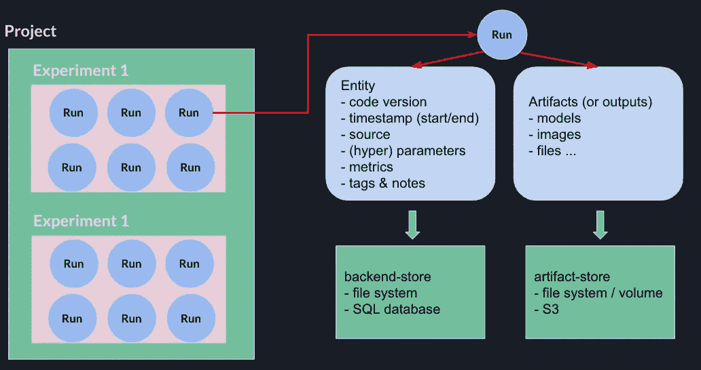
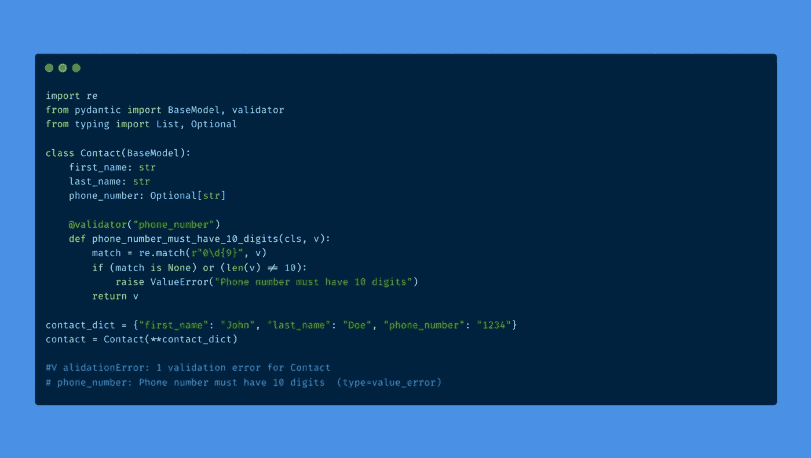

# 将机器学习模型推向生产之前的 7 个考虑事项

> 原文：<https://towardsdatascience.com/7-considerations-before-pushing-machine-learning-models-to-production-efab64c4d433?source=collection_archive---------10----------------------->

## 在投入生产之前进行快速的健全性检查


Arie Wubben 在 [Unsplash](https://unsplash.com?utm_source=medium&utm_medium=referral) 上拍摄的照片

作为一家重视可扩展性的公司的一部分，作为一名数据科学家，我每天都看到将基于人工智能的解决方案投入生产所带来的挑战。

这些挑战是众多的，涵盖了许多方面:建模和系统设计、数据工程、资源管理、SLA 等。

我不会假装精通任何一个领域。然而，我知道实现一些软件工程原则和使用正确的工具对我的工作有很大的帮助，使我的工作可重复并为生产做好准备。

> ***在这篇文章中，我将与你分享我在生产我的模型之前的 7 个考虑因素。***

让我们谈谈这个💬

# **1 —处理随机性**

> 确定性代码就不那么令人担心了

机器学习模型不是确定性的:如果你使用相同的数据和相同的超参数训练一个神经网络两次，你不会得到相同的模型。这两个模型对相同测试数据的输出可能看起来非常相似，但它们并不完全相同。

这种差异是由多种原因造成的。一个非常常见的问题与模型最初的训练方式有关。事实上，优化者，或者通俗地说，成本函数最小化(即模型的训练，基本上)背后的算法在更新权重值之前计算梯度时引入了随机性:这种随机性来自于对训练集的采样。


SGD —随机梯度下降(用户修改的图像)

🔴尽管随机性是神经网络和许多其他机器学习模型的固有部分，但在某些情况下，尤其是在可重复性很重要的情况下，这是一种不可取的品质。

## 解决方案:设置随机种子🌱

通过为所有使用随机性的包(NumPy，SciPy，Torch，TensorFlow)设置种子，您可以强制您的代码具有确定性。
例如，如果您正在使用 NumPy 和 Pytorch，您可以这样做:

如果你使用 Tensorflow，你可以用另一种方法:

# **2 —记录您的模型、指标和工件**

> 代码不是唯一应该被版本化的资产

跟踪你的机器学习实验是在任何时间点重现它们的关键。

您当然可以用老方法来完成，将您的模型保存在文件夹中，将您的度量保存在 JSON 或(甚至更糟)Excel 文件中，但是这使得很难与人协作，并且随着时间的推移保持一致的数据结构。

我最近开始使用 [MLflow](https://mlflow.org/) 来跟踪我的机器学习项目，我非常高兴。

在 MLflow 术语中，每个项目都可以被认为是一个**实验**，在**中有多个**运行**。**



作者图片— MLflow 术语

每次运行对应一个迭代，您可以记录:

*   模型超参数和附加配置
*   模型权重和二进制文件
*   运行产生的其他工件:文本文件、图像、日志文件或任何您想要的东西

MLflow 将这些数据存储在**跟踪服务器**上。这可以是您在个人计算机上启动的本地服务器(在这种情况下，存储系统将是您的文件系统),也可以是您部署在云上的远程服务器。

> 在云上使用跟踪服务器是非常有意义的，因为团队可以一起工作并将工件推到同一个中心位置。

如果您有兴趣了解更多关于 MLflow 的信息，请查看我以前关于这个主题的帖子。

[](/how-to-use-mlflow-on-aws-to-better-track-machine-learning-experiments-bbcb8acded65) [## 如何在 AWS 上使用 MLflow 来更好地跟踪你的机器学习实验

### 记录一切以获得更好的再现性

towardsdatascience.com](/how-to-use-mlflow-on-aws-to-better-track-machine-learning-experiments-bbcb8acded65) 

**如何看待 MLflow 的实际应用？**下面是一小段代码，它执行许多模型拟合，并针对超参数的每个组合，将指标和数据记录到 MLflow 中。

如您所见，开销是最小的。代码实际上没有变化。

# 3-创建管线并对其进行调度

> 你必须把你的 python 脚本放到某个地方

你的代码在你的本地计算机上正确运行是一回事:你只需要按下一个按钮或者输入一个命令并运行它。

然而，在生产环境中，您的代码被集成到一个**管道中。**必须安排这个管道定期运行，以应对潜在的故障转移，启动虚拟机来运行您的代码并对其进行扩展，向用户显示信息，发出警报或通知等。

你的代码只是整个机器的一小部分🏭。

有一个流行的解决方案来创建管道并编排它们: [**气流**](https://airflow.apache.org/) **。**

气流以由**任务组成的有向无环图(或**Dag**)的形式接近管道。任务是执行 python 代码的计算单元。**

Airflow 为您提供了以任何顺序重新排列任务的语法，只要它们符合 DAG(这意味着永远没有循环)。)


图片由作者修改

它还提供了以编程方式调度任务的灵活性。

要了解更多关于气流的知识，我推荐去看看这个人的视频:他们解释得很好。

# **4 —外部化配置(如路径)**

> 或任何其他敏感信息

您应该避免将路径等变量硬编码到代码中。

我们都做过一次，它可能看起来像这样:

```
**import pandas as pd****data = pd.read_csv("../../../../data.csv")**
```

> 但是在我的电脑上可以用！

这种做法的问题是，任何运行您的代码的人都必须将文件放在与您完全相同的位置，否则将面临一个`OS error`。这不太实用，而且限制了你作品的可复制性。

路径应该被认为是配置参数，因此必须放在外部配置文件中，或者注入到环境变量中，或者从其他系统中读取。通过将逻辑与配置分离，您的代码更加模块化，也更易于维护。

当您的代码在生产环境中运行时，路径和配置很少。硬编码:它们是从外部文件系统读取或加载的。

在特定项目中加载环境变量而不污染全局名称空间的一个解决方案是使用`**python-dotenv**`库 **(** `**pip install python-dotenv**` **)。**

为了能够使用这个包，首先必须创建一个`.**env**`文件，并把它放在项目的根目录下。该文件将包含您希望注入到项目运行时的环境变量。这些环境变量可以包括**路径**、**凭证**、**主机名**等。

```
**API_KEY=my_secret_key
PORT=3030
OUTPUT_PATH=/opt/trained_models/**
```

然后，在主脚本中添加下面一行:

```
**from dotenv import load_dotenv**
```

要使环境变量可访问，请执行以下操作:

```
**from dotenv import load_dotenv
import os****api_key = os.environ["API_KEY"]**
```

如果您想轻松地从代码中外部化环境变量，那么`**python-dotenv**`是一个流行的选择。要了解更多信息，你可以查看我以前的帖子:

[](/stop-hardcoding-sensitive-data-in-your-python-applications-86eb2a96bec3) [## 停止在 Python 应用程序中硬编码敏感数据

### 使用将您的设置和凭据保密。环境文件

towardsdatascience.com](/stop-hardcoding-sensitive-data-in-your-python-applications-86eb2a96bec3) 

# 5 —设置 CI-CDs 以自动化工作流程

> git push——等待奇迹

在将项目部署到生产环境之前，您通常希望在验证单元测试时，确保它在临时环境中正确地构建和部署。

CI-CD 工作流允许您在 Git 事件(如特定分支上的 push 或 pull 请求)触发时自动化此类(以及更多)流程。

我使用带有 Github 动作的 CI-CD 管道来自动化:

*   单元测试和代码覆盖率
*   通过运行代码格式化程序(例如 [Black](http://mypy-lang.org/) 或静态类型检查程序( [mypy](http://mypy-lang.org/) )对代码进行完整性检查
*   构建 Python 包并在 S3 上存储它们的轮子
*   自动部署到远程服务器

关于最后一点，如果你有兴趣用 FastAPI 构建一个机器学习 API，并用 Docker 和 Github 操作部署它，可以看看我以前的帖子。

[](/how-to-deploy-a-machine-learning-model-with-fastapi-docker-and-github-actions-13374cbd638a) [## 如何用 FastAPI、Docker 和 Github 动作部署机器学习模型

### 具有 CI/CD 的端到端管道

towardsdatascience.com](/how-to-deploy-a-machine-learning-model-with-fastapi-docker-and-github-actions-13374cbd638a) 

# 6 —不要相信用户的输入，要事先验证

> 永远不要相信用户。有时他们根本不知道他们在做什么，当他们知道时，他们可能想弄乱你的代码。所以要做好准备。

当您将代码投入生产时，您可以期待任何事情。字面上。

如果您期望一个整数，但却收到一个字符串，您的代码不应该无声地失败或抛出一个用户无法理解的无法解释的错误信息。

当您的代码在这种特定情况下失败时，它必须向最终用户表明，他刚刚输入的内容不符合程序的预期。代码可能需要特定的类型、匹配正则表达式的字符串或区间值。如果它接收到不一致的东西，用户必须明确地知道它，**。**

这就是我们所说的**数据验证。**

有不同的方法来处理数据验证。为此，我喜欢使用的一个特殊的库是 Pydantic:它为您提供了在类的每个属性上添加验证的灵活性。



作者制作的图像

要了解更多关于 Pydantic 以及如何使用它有效地验证用户输入的信息，可以看看我以前发表的关于这个主题的文章。

[](/8-reasons-to-start-using-pydantic-to-improve-data-parsing-and-validation-4f437eae7678) [## 开始使用 Pydantic 改进数据解析和验证的 8 个理由

### 改善您的应用程序需要控制它们的数据质量

towardsdatascience.com](/8-reasons-to-start-using-pydantic-to-improve-data-parsing-and-validation-4f437eae7678) 

# **7 —使用模板引导您的项目**

我讨厌重复，我总是努力使任务自动化。我不知道自动化的一个特殊方面是构建项目。

组织项目可能是一项乏味且重复的任务。当我开始一个新项目，并希望它的结构与我以前的工作一致时，我必须检查旧项目，将它们的结构复制粘贴到新文件夹中，删除不必要的文件，添加新文件，重写配置文件，等等。这不是一个特别困难的任务，但是时间值得花在别的事情上。

> 你可以通过使用 Cookiecutter 库来自动化这个过程。

Cookiecutter 允许你创建模板来启动一个项目:如果你的一些项目遵循相同的结构，这是非常实用的。您所要做的就是调用 cookiecutter，并将您感兴趣的模板的 URL 传递给它。Cookiecutter 会询问您一些信息，您可以在终端上填写这些信息，一旦完成，您的项目就创建好了。


作者图片

如果您想了解更多关于 cookiecutter 以及如何自动化您的数据科学项目的结构，您可以看看我以前的帖子，在那里我尝试了一些开源的 Cookiecutter 模板，这些模板实施了行业的最佳实践。

[](/automate-the-structure-of-your-data-science-projects-with-cookiecutter-937b244114d8) [## 使用 Cookiecutter 自动化数据科学项目的结构

### 停止手工操作，重新使用项目模板

towardsdatascience.com](/automate-the-structure-of-your-data-science-projects-with-cookiecutter-937b244114d8) 

# 资源

将机器学习引入生产不仅仅是关于训练模型和执行分析:它包括各种软件工程实践。这篇文章是对我目前正在实践的原则以及我正在使用的工具的一个小小的概述。

一如既往，这里有一些很好的资源，可以用来学习如何生产你的机器学习模型。

*   [https://dev . to/azure/10-top-tips-for-reproducible-machine-learning-36g 0](https://dev.to/azure/10-top-tips-for-reproducible-machine-learning-36g0)
*   https://neptune.ai/blog/how-to-solve-reproducibility-in-ml
*   [https://medium . com/Microsoft azure/9-advanced-tips-for-production-machine-learning-6 bbdebf 49 a 6 f](https://medium.com/microsoftazure/9-advanced-tips-for-production-machine-learning-6bbdebf49a6f)
*   [https://towards data science . com/6-tips-for-mlops-acceleration-simplification-36539 adab 29 b](/6-tips-for-mlops-acceleration-simplification-36539adab29b)
*   [https://www . montecallodata . com/why-production-machine-learning-fails-and-how-to-fix-it/](https://www.montecarlodata.com/why-production-machine-learning-fails-and-how-to-fix-it/)

# 感谢阅读🙏

这篇文章概述了我用来改进代码并为生产做准备的原则。如果你有其他的建议，把它们列在列表中，并在评论中告诉我😉

今天就这些了。直到下一次更多的编程技巧和教程。👋


照片由[卡斯滕·怀恩吉尔特](https://unsplash.com/@karsten116?utm_source=unsplash&utm_medium=referral&utm_content=creditCopyText)在 [Unsplash](https://unsplash.com/@karsten116?utm_source=unsplash&utm_medium=referral&utm_content=creditCopyText) 上拍摄

# 新到中？您可以每月订阅 5 美元，并解锁无限的文章— [点击此处。](https://ahmedbesbes.medium.com/membership)