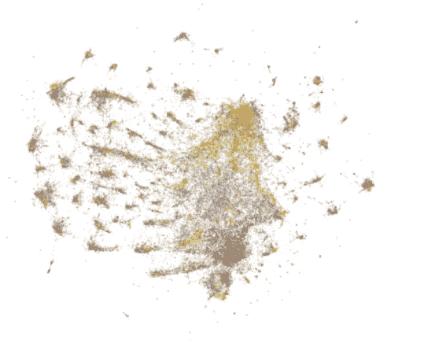
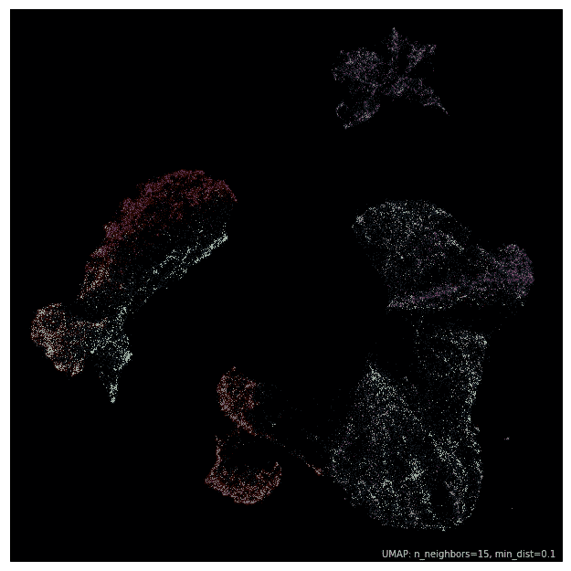
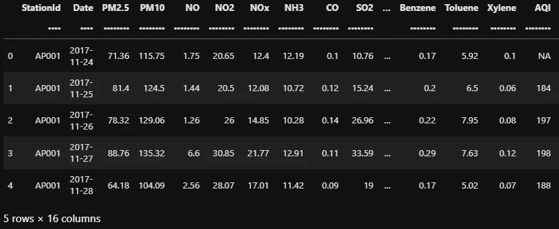
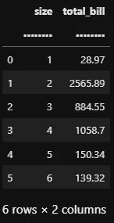
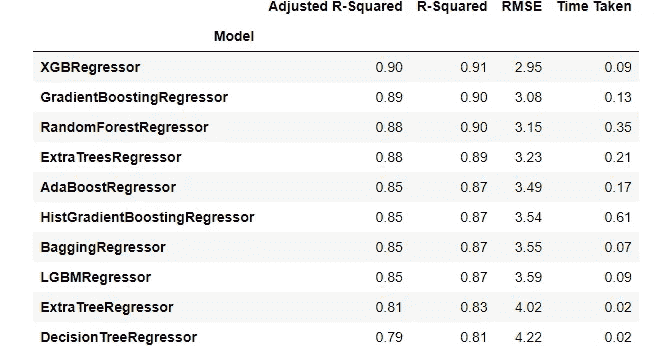
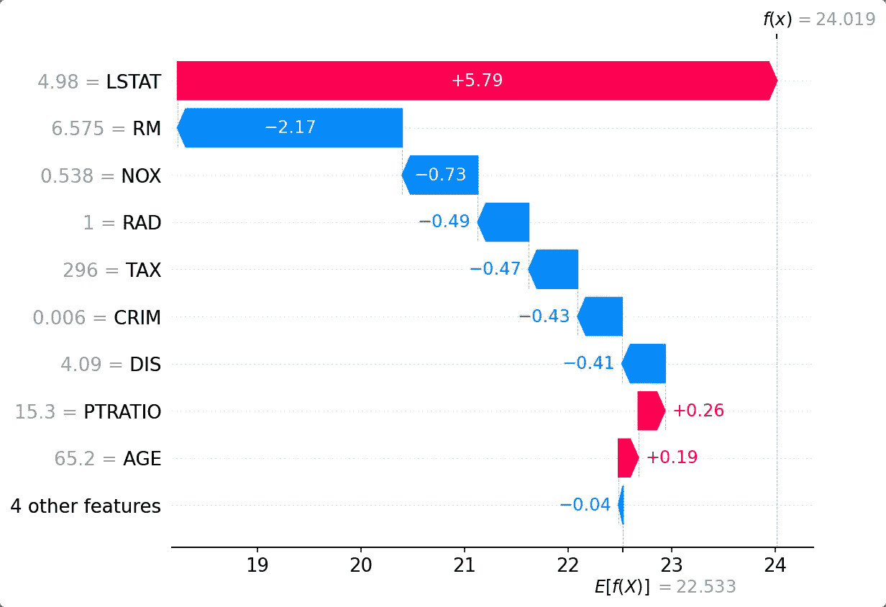
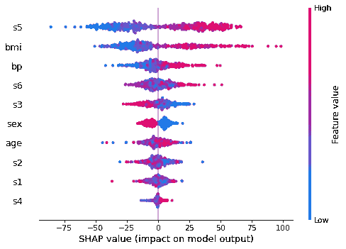
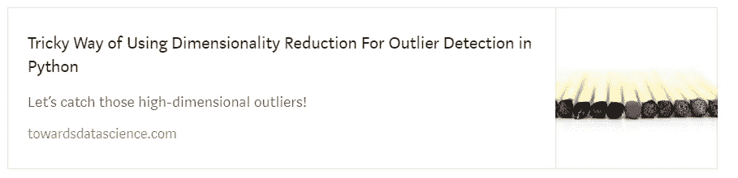

# Kagglers 正在使用的 7 个很酷的 Python 包

> 原文：<https://towardsdatascience.com/7-cool-python-packages-kagglers-are-using-without-telling-you-e83298781cf4?source=collection_archive---------0----------------------->

## 让我来揭示秘密…


**照片由**[](https://www.pexels.com/@miphotography?utm_content=attributionCopyText&utm_medium=referral&utm_source=pexels)****上的** [**像素组成。**](https://www.pexels.com/photo/pineapple-with-brown-sunglasses-459601/?utm_content=attributionCopyText&utm_medium=referral&utm_source=pexels) **除特别注明外，所有图片均为作者所有。****

**Kaggle 是数据科学和机器学习趋势的热点。**

**由于它的竞争性，顶级玩家不断寻找新的工具、技术和框架，使他们比其他人更有优势。如果一个新的包或算法提供了可操作的价值，它很有可能立即被采用并变得流行。**

**这篇文章是关于 7 个这样的趋势包，它们直接替代了许多过时的或者急需升级的工具和技术。**

**[](https://ibexorigin.medium.com/membership) [## 通过我的推荐链接加入 Medium-BEXGBoost

### 获得独家访问我的所有⚡premium⚡内容和所有媒体没有限制。支持我的工作，给我买一个…

ibexorigin.medium.com](https://ibexorigin.medium.com/membership) 

获得由强大的 AI-Alpha 信号选择和总结的最佳和最新的 ML 和 AI 论文:

[](https://alphasignal.ai/?referrer=Bex) [## 阿尔法信号|机器学习的极品。艾总结的。

### 留在循环中，不用花无数时间浏览下一个突破；我们的算法识别…

alphasignal.ai](https://alphasignal.ai/?referrer=Bex) 

# 1️⃣.UMAP



[**链接到地块的代码。**](https://www.kaggle.com/subinium/tps-jun-this-is-original-eda-viz/notebook?scriptVersionId=64865915&cellId=37)

上面是一个 100k 的行数据集，包含 75 个使用名为 UMAP 的包投影到 2D 的要素。每个点代表分类问题中的一个样本，并根据其类别进行颜色编码。

像这样的大规模数据集可能会让你在 EDA 期间感到痛苦，主要是因为它们带来的计算和时间开销。因此，重要的是，你创建的每个图都是准确的，并揭示了数据的一些重要内容。

我认为这是 UMAP(一致流形逼近和投影)在 Kaggle 上如此受欢迎的原因之一。它是高效的、低代码的，并且允许您从高维度的角度真正“看”数据:



图片来自 UMAP 文档。

当我看到这样的图时，它们让我想起了我当初为什么要进入数据科学——数据是美丽的！

## 🛠 GitHub 和文档

*   [https://umap-learn.readthedocs.io/en/latest/](https://umap-learn.readthedocs.io/en/latest/)
*   [https://github.com/lmcinnes/umap](https://github.com/lmcinnes/umap)

## 🔬报纸

*   [UMAP:一致流形逼近和降维投影](https://arxiv.org/abs/1802.03426)

## 💻演示

UMAP 提供了一个简单的兼容 Sklearn 的 API。导入`UMAP`模块后，在特征和目标数组(`X`，`y`)上调用其`fit`，默认情况下将它们投影到 2D:

`UMAP`估计器最重要的参数是`n_neighbors`和`min_dist`(最小距离)。把`n_neighbors`想象成一个控制投影缩放级别的手柄。`min_dist`是每个投影点之间的最小距离。

如果你希望投射到一个更高的维度，你可以像 Sklearn 的`PCA`一样调整`n_components`。

# 2️⃣.数据表

随着数据集规模越来越大，人们越来越关注内存外的多线程数据预处理工具，以摆脱 Pandas 的性能限制。

在这方面最有前途的工具之一是受 R 的`data.table`包启发的`datatable`。它由 H2O.ai 开发，支持大数据(高达 100 GB)的并行计算和内存外操作，符合当今机器学习应用的要求。

虽然`datatable`没有熊猫那么大的一套操作功能，但人们发现它在大多数常见操作上远远胜过它。在一个在 100M 行数据集上进行的[实验](https://www.kaggle.com/rohanrao/tutorial-on-reading-large-datasets)中，datatable 设法在一分多钟内将数据读入内存，比 pandas 快 9 倍。

## 🛠 GitHub 和文档

*   [https://github.com/h2oai/datatable](https://github.com/h2oai/datatable)
*   [https://datatable.readthedocs.io/en/latest/?badge=latest](https://datatable.readthedocs.io/en/latest/?badge=latest)

## 💻演示

`datatable`中的主要数据结构是`Frame`(如 DataFrame)。



```
>>> type(frame)datatable.Frame
```

一个简单的 GroupBy 操作:



# 3️⃣.懒惰预测

Lazypredict 是我见过的最好的一行程序包之一。

使用该库，您可以在一行代码中训练几乎所有的 Sklearn 模型加上 XGBoost 和 LightGBM。它只有两个估值器——一个用于回归，一个用于分类。将数据集上的任何一个模型与给定的目标相匹配，将评估 30 多个基础模型，并生成一份报告，列出它们在几个流行指标上的排名。

## 💻演示



像这样的洞察力将把你从选择基本模型的手动任务中解放出来，把时间花在像特征工程这样的任务上会更好。

## 🛠 GitHub 和文档

*   https://lazypredict.readthedocs.io/en/latest/index.html
*   【https://github.com/shankarpandala/lazypredict 

# 4️⃣.奥普图纳

我最近添加到技能库中的一个库是 Kagglers 的最爱——Optuna。

Optuna 是下一代自动超参数调整框架，设计用于当今 ML 和深度学习包中可用的几乎任何模型和神经网络。

与类似的工具如 GridSearch、TPOT、HyperOPT 等相比，它有几个优点。：

*   与平台无关:具有可与任何框架一起工作的 API，包括 XGBoost、LightGBM、CatBoost、Sklearn、Keras、TensorFlow、PyTorch 等。
*   内置了大量具有提前停止和修剪功能的优化算法
*   简单的并行化，只需很少或不需要修改代码
*   内置支持，以可视化方式探索调优历史和每个超参数的重要性。

我最喜欢的功能是它暂停/恢复/保存搜索历史的能力。Optuna 跟踪所有以前的调优，您可以继续搜索任意长的时间，直到获得您想要的性能。

此外，您可以通过添加一个额外的参数，将结果存储在本地或远程数据库中，从而使 Optuna 独立于 RAM 用于大规模数据集和搜索。

## 🛠 GitHub 和文档

*   [https://github.com/optuna/optuna](https://github.com/optuna/optuna)
*   [https://optuna.readthedocs.io/en/stable/](https://optuna.readthedocs.io/en/stable/)

## 🔬报纸

*   [Optuna:下一代超参数优化框架](https://arxiv.org/abs/1907.10902)

## 💻演示

为了简单起见，我们试图优化函数(x — 1) + (y + 3)。如您所见，`x`和`y`的调整值非常接近最佳值(1，-3)。

实际估值器的超参数调整有点复杂，所以你为什么不看看我的详细指南:

[](/why-is-everyone-at-kaggle-obsessed-with-optuna-for-hyperparameter-tuning-7608fdca337c) [## 为什么 Kaggle 的所有人都痴迷于 Optuna 进行超参数调优？

towardsdatascience.com](/why-is-everyone-at-kaggle-obsessed-with-optuna-for-hyperparameter-tuning-7608fdca337c) 

# 5️⃣.SHAP

可解释的人工智能(XAI)是人工智能和人工智能领域最强的趋势之一。由于其“黑箱”性质，公司和企业开始对人工智能解决方案的采用感到不安。

嘿，没人能责怪他们。如果数据科学家自己想出工具来理解他们创造的*模型，企业主的担忧和怀疑是完全有道理的。*

在 Kaggle 上的大师笔记本中经常出现的工具之一就是 SHAP。

SHAP(Shapley Additive explaints)是一种利用博弈论中的概念来解释模型如何工作的方法。在分数上，SHAP 用一种叫做沙普利值的东西来解释:

*   模型中的哪些特性最重要
*   任何单一预测背后的模型决策。例如，询问哪些特性导致了这个特定的输出。

《SHAP》最引人注目的方面是其统一的主题和独特的情节，打破了任何模型和神经网络的机制。以下是一个示例图，显示了单个预测的 Shapley 值的特征重要性:



相信我，SHAP 有更酷的情节。这是一个如此强大的工具，以至于 Kaggle 平台有一个围绕它构建的[完整免费课程](https://www.kaggle.com/learn/machine-learning-explainability)。

## 🛠 GitHub 和文档

*   [https://shap.readthedocs.io/en/latest/index.html](https://shap.readthedocs.io/en/latest/index.html)
*   [https://github.com/slundberg/shap](https://github.com/slundberg/shap)

## 🔬报纸

*   [解释模型预测的统一方法](https://proceedings.neurips.cc/paper/2017/hash/8a20a8621978632d76c43dfd28b67767-Abstract.html)
*   [从局部解释到全局理解，用可解释的人工智能为树木服务](https://www.nature.com/articles/s42256-019-0138-9)
*   [手术期间预防低氧血症的可解释机器学习预测](https://www.nature.com/articles/s41551-018-0304-0)

## 💻演示

下面是一个简短的片段，用于创建经典糖尿病数据集中所有预测的蜂群图:



# 6️⃣.急流 cuDF

如果你认为 GPU 是深度学习专用的，那你就大错特错了。

由开源平台 RAPIDs 创建的 cuDF 库使您能够在一个或多个 GPU 上运行表格操作操作。

与`datatable`不同，cuDF 有一个与 Pandas 非常相似的 API，因此提供了一个不太陡峭的学习曲线。由于它是 GPU 的标准，这个库非常快，当与它的熊猫式 API 结合时，它比`datatable`有优势。

使用 cuDF 的唯一麻烦是它的安装——它需要:

*   CUDA 工具包 11.0 以上
*   NVIDIA 驱动程序 450.80.02+
*   Pascal 架构或更好的架构(计算能力> =6.0)

如果您想不受安装限制地试用这个库，Kaggle 内核是一个很好的选择。这里有一个[笔记本](https://www.kaggle.com/rohanrao/tutorial-on-reading-large-datasets?scriptVersionId=49328159&cellId=14)让你开始。

## 🛠 GitHub 和文档

*   https://docs.rapids.ai/api/cudf/stable/
*   【https://github.com/rapidsai/cudf 

## 💻演示

以下是文档中的一个片段，显示了对 tips 数据集的简单 GroupBy 操作:

# 7️⃣.自动化 EDA 库

通常，我反对任何让程序员远离编写实际代码的库或工具。但是，由于 auto-EDA 库现在在 Kaggle 上非常流行，为了完整起见，我必须包括这一部分。

最初，这一部分应该只是关于 AutoViz 的，它使用 [XGBoost](/20-burning-xgboost-faqs-answered-to-use-the-library-like-a-pro-f8013b8df3e4?source=your_stories_page-------------------------------------) 来显示数据集最重要的信息(这就是我选择它的原因)。后来，我决定也包括一些其他人。

以下是我发现的最好的 auto EDA 库列表:

*   **DataPrep** —最全面的汽车 EDA [ [GitHub](https://github.com/sfu-db/dataprep) ，[文档](https://docs.dataprep.ai/index.html) ]
*   **AutoViz** —最快的自动 EDA [ [GitHub](https://github.com/AutoViML/AutoViz) ]
*   **PandasProfiling** —最早也是最好的 auto EDA 工具之一[ [GitHub](https://github.com/pandas-profiling/pandas-profiling) ，[文档](https://pandas-profiling.github.io/pandas-profiling/docs/master/rtd/)
*   **Lux** —最人性化最豪华的 EDA [ [GitHub](https://github.com/lux-org/lux) ，[文档](https://lux-api.readthedocs.io/en/latest/) ]

## 💻演示

如果你想看看每个软件包如何执行 EDA，请在 Kaggle 上查看这个伟大的[笔记本](https://www.kaggle.com/andreshg/automatic-eda-libraries-comparisson/notebook#6.-%F0%9F%93%8A-D-Tale-%F0%9F%93%9A)。

# 摘要

执行数据科学任务的可用工具和软件包数不胜数。每个人都有权利对此感到不知所措。

但是我真诚地希望这篇文章中概述的工具有助于将你的关注点缩小到最大的 ML 社区成员手中的趋势和交付结果。

[](https://ibexorigin.medium.com/membership)

# 以下是我的最新作品…

[](https://towardsdatascience.com/25-numpy-functions-you-never-knew-existed-p-guarantee-0-85-64616ba92fa8)[](https://towardsdatascience.com/fail-proof-formula-to-learn-any-package-ruthlessly-in-less-than-a-day-c85e49a55459?source=your_stories_page-------------------------------------)[](https://towardsdatascience.com/5-step-workflow-into-the-heart-of-matplotlib-and-create-amazing-plots-7f9d2164ff2b)[](https://towardsdatascience.com/10-underrated-sklearn-features-you-can-use-for-your-advantage-right-now-3a87b10a8d7f)[](https://towardsdatascience.com/tricky-way-of-using-dimensionality-reduction-for-outlier-detection-in-python-4ee7665cdf99?source=your_stories_page-------------------------------------)**