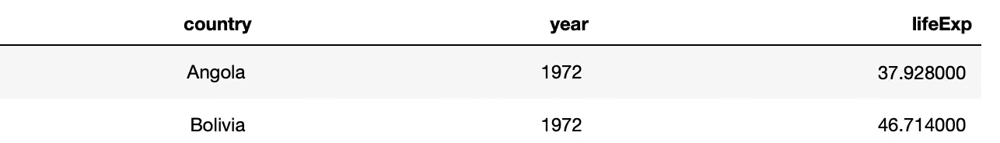

# 不到 5 分钟内完成 7 个数据辩论 Python 函数

> 原文：<https://towardsdatascience.com/7-data-wrangling-python-functions-in-under-5-minutes-a8d9ec7cf34b?source=collection_archive---------7----------------------->

戴维·克洛德在 [Unsplash](https://unsplash.com?utm_source=medium&utm_medium=referral) 上的照片

## PYTHON 教程-数据争论

## 最基本但最常用的数据操作函数的分步演练

# 1 导言

大家好，我是 Gregor，我是一名数据科学家，也是一名大部分时间都需要评估和清理数据的人。我喜欢在我的项目中平等地使用 Python/ Pandas 和 R/ tidyverse。我最近[分享了一篇文章，在文章中我概述了我最常用的用于数据争论的 R 函数](/7-data-wrangling-r-functions-for-your-next-data-science-project-in-under-5-minutes-d5a4ad55f99b)。我认为分享如何利用 Python 中的这些函数是个好主意，尤其是熊猫。

在下一节中，我将概述我对本文的技术设置，以便您自己立即使用本文中的示例。然后，在第 3 节中，我将使用 Gapminder 数据集展示这七个函数。如果您有任何问题或任何意见，请随时与我分享。

数据争论功能概述；作者图片

# 2 设置

为了展示这些功能，我将使用 **Gapminder 数据集**。Gapminder 数据集包含该国几十年来的预期寿命、人均 GDP 和人口数据。此外，我将 Jupyter 笔记本与熊猫结合使用。

这七项功能是熊猫套餐的一部分。如果你想知道我是如何构建我的代码的，它被称为**方法链**或管道(在 R 社区中)。我在我的另一篇文章中解释了[的基础知识。](/the-flawless-pipes-of-python-pandas-30f3ee4dffc2)

Gapminder 数据集(10 行)；作者图片

# 3 七个最基本但最常用的数据争论函数

**七个函数**允许您**选择**和**重命名**特定列，**排序**和**过滤**您的数据集，**创建**并计算**新列**，**汇总**值。我将在每个函数中使用 **Gapminder** 数据，以便于理解并应用于您的数据集。请注意，我们走得越远，我将使用这些函数的组合。

## 3.1 过滤器()—选择数据集中的列

仅选择列*洲*、*年*和*弹出*。

Gapminder 数据集(10 行)；作者图片

使用 *like* 运算符选择名称中包含 *co* 的所有列。请查看文档，了解更多有用的功能。

Gapminder 数据集(10 行)；作者图片

## 3.2 rename() —重命名列

将*年*列重命名为*年*，将*寿命预期*重命名为*预期寿命*。

Gapminder 数据集(10 行)；作者图片

## 3.3 sort_values() —对数据集进行排序

按*年*排序。

Gapminder 数据集(10 行)；作者图片

按 *lifeExp* 和 *year* 排序(降序)。

Gapminder 数据集(10 行)；作者图片

## 3.4 query() —过滤数据集中的行

过滤带有*年份* 1972 的行。

Gapminder 数据集(10 行)；作者图片

筛选出 1972 年和预期寿命低于平均值的行。

Gapminder 数据集(10 行)；作者图片

过滤年份*为 1972 年*且*预期寿命*低于平均值，且*国家*为*玻利维亚*或*安哥拉*的行。

Gapminder 数据集(2 行)；作者图片

## 3.5 assign()和 lambda —在数据集中生成新列

创建一个组合了*洲*和*国家*信息的列，以及另一个显示四舍五入后的*生命周期*信息的列。

Gapminder 数据集(10 行)；作者图片

## 3.6 agg()-在数据集中创建汇总计算

对于整个数据集，计算*人口*和*预期寿命*的平均值和标准差。

Gapminder 数据集(摘要)；作者图片

## 3.7 Group by()-将数据集分组并创建汇总计算

没有 *groupby()* 函数， *agg()* 函数就没那么有用了。将两者结合使用是创建新数据集的有效方法。在下面的例子中，我将按洲对数据集进行分组，然后我将为*人口*和*生活支出*创建汇总。

Gapminder 数据集(分组汇总)；作者图片

也可以按多个列进行分组。在下一个例子中，我使用 *groupby()* 和*洲*和*年*。

Gapminder 数据集(分组汇总)；作者图片

# 4 结论

在本文中，我向您展示了我最常用的操作数据集的 Pandas 函数。我为您提供了一些示例，希望这些示例为您尝试每个功能提供了一个完美的基础。

如果你想了解更多关于熊猫的信息，请务必查阅[官方文档](https://pandas.pydata.org/docs/user_guide/index.html)以及用于数据分析的书[Python](https://pandas.pydata.org/pandas-docs/version/1.2.3/pandas.pdf)。请让我知道你的想法和你最常用的功能。谢谢大家！