# 在不到 5 分钟的时间内为您的下一个数据科学项目提供 7 个数据辩论功能

> 原文：<https://towardsdatascience.com/7-data-wrangling-r-functions-for-your-next-data-science-project-in-under-5-minutes-d5a4ad55f99b?source=collection_archive---------9----------------------->

帕斯卡尔·范·德·万德尔在 [Unsplash](https://unsplash.com/collections/95135508/medium/af07ddeda5faed6872d60437a48d9819?utm_source=unsplash&utm_medium=referral&utm_content=creditCopyText) 上的照片

## R —教程—数据争论

## 最基本但最常用的数据操作函数的分步演练

# 1 导言

大家好，我是 Gregor，我是一名数据科学家，也是一名大部分时间都需要评估和清理数据的人。我喜欢在我的项目中平等地使用 Python/ Pandas 和 R/ tidyverse。因为我们在最近的项目中使用了 R 和 tidyverse 包，所以我想分享一些最基本但最常用的操作数据集的函数。

在下一节中，我将概述我对本文的技术设置，以便您自己立即使用本文中的示例。然后，在第 3 节中，我将使用 Gapminder 数据集展示这七个函数。如果您有任何问题或任何意见，请随时与我分享。

# 2 设置

为了展示这些功能，我将使用 **Gapminder 数据集**。Gapminder 数据集包含该国几十年来的预期寿命、人均 GDP 和人口数据。

这七个函数是由 Hadley Wickham 等人开发的软件包的一部分。它是 tidyverse 包装生态系统的一部分。在我看来，它使 R 成为如此强大和干净的数据科学平台。如果你想了解更多关于 tidyverse 的知识，我强烈推荐免费书籍“ [R for Data Science](https://r4ds.had.co.nz/) ”。

> dplyr 是一种数据操作语法，提供了一组一致的动词，帮助您解决最常见的数据操作挑战。

Gapminder 数据集(10 行)；作者图片

# 3 七个最基本但最常用的数据争论函数

**七个函数**允许您**选择**和**重命名**特定的列，**排序**和**过滤**您的数据集，**创建**和计算**新列**，以及**汇总**值。我将在每个函数中使用 **Gapminder** 数据，以便于理解并应用于您的数据集。请注意，我们走得越远，我将使用这些函数的组合。

## 3.1 select() —选择数据集中的列

仅选择列*、洲*、*年*和*流行*。

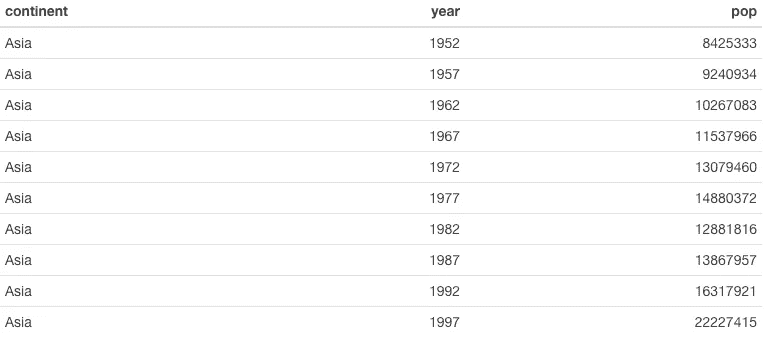

Gapminder 数据集(10 行)；作者图片

选择所有列*，除了*之外的*年*列。

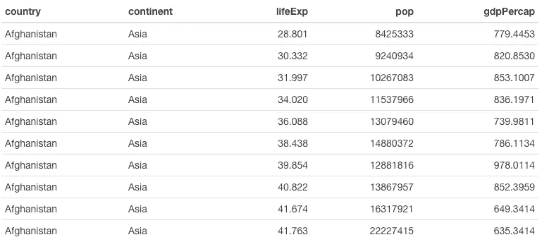

Gapminder 数据集(10 行)；作者图片

使用 *starts_with()* 选择以 *co* 开头的所有列。请查看文档以获得更多有用的函数，包括 *ends_with()* 或 *contains()* 。

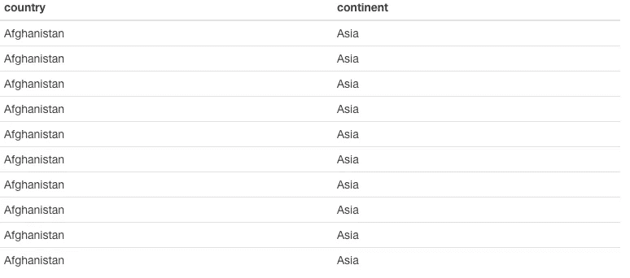

Gapminder 数据集(10 行)；作者图片

## 3.2 rename() —重命名列

将*年*列重命名为*年*，将*寿命预期*列重命名为*预期寿命*。

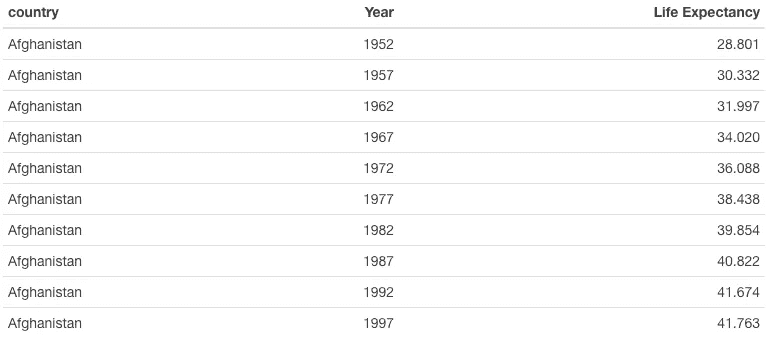

Gapminder 数据集(10 行)；作者图片

## 3.3 arrange() —对数据集进行排序

按*年*排序。

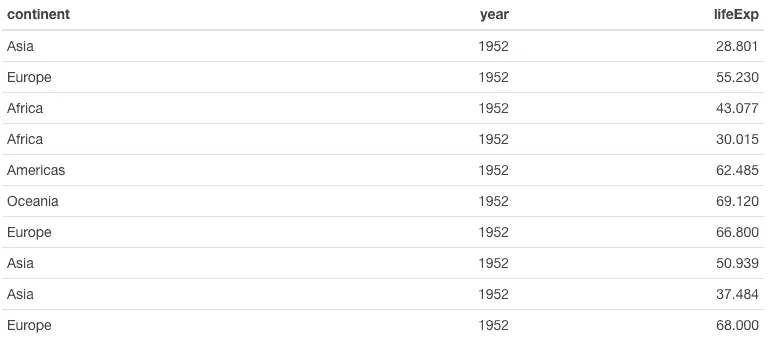

Gapminder 数据集(10 行)；作者图片

按 *lifeExp* 和 *year* 排序(降序)。

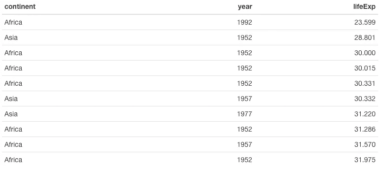

Gapminder 数据集(10 行)；作者图片

## 3.4 filter() —过滤数据集中的行

过滤带有*年* 1972 的行。

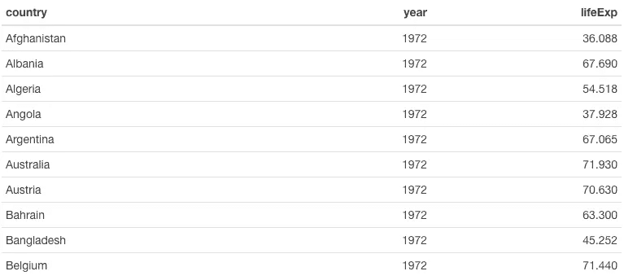

Gapminder 数据集(10 行)；作者图片

过滤年*1972 年*和预期寿命*低于平均值的行。*

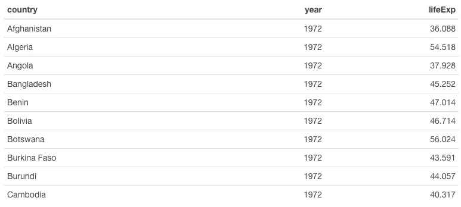

Gapminder 数据集(10 行)；作者图片

过滤年份为*1972 年*且*预期寿命*低于平均水平，且*国家*为*玻利维亚*或*安哥拉*的行。

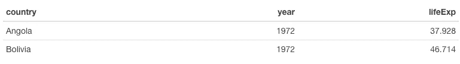

Gapminder 数据集(2 行)；作者图片

## 3.5 mutate () —在数据集中生成新行

创建一个组合了*洲*和*国家*信息的列，以及另一个显示四舍五入后的*生命周期*信息的列。

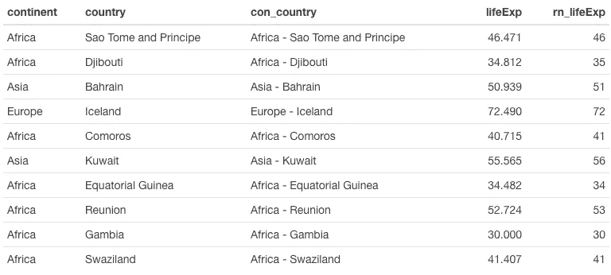

Gapminder 数据集(10 行)；作者图片

## 3.6 summarize 在数据集中创建汇总计算

对于整个数据集，计算*人口*和*预期寿命*的平均值和标准偏差。

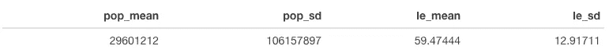

Gapminder 数据集(摘要)；作者图片

## 3.7 Group _ by()-将数据集分组并创建汇总计算

没有 *group_by()* 函数，summary 函数只有这么有用。将两者结合使用是创建新数据集的有效方法。在下面的例子中，我将按洲对数据集进行分组，然后我将为*人口*和*生活支出*创建汇总。

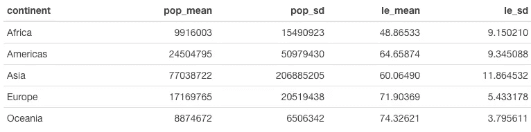

Gapminder 数据集(分组汇总)；作者图片

也可以按多个列进行分组。在下一个例子中，我将 *group_by()* 与*洲*和*年*一起使用。

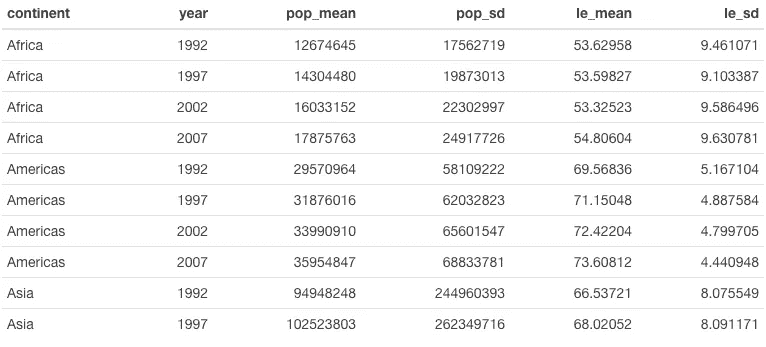

Gapminder 数据集(分组汇总)；作者图片

# 4 结论

在本文中，我向您展示了我最常用的操作数据集的 R 函数。我为您提供了一些示例，希望这些示例为您尝试每个功能提供了一个完美的基础。如果你想了解更多关于 R 和 dplyr 的信息，请务必查看[官方文档](https://dplyr.tidyverse.org/index.html)以及漂亮的 [R for Data Science](https://r4ds.had.co.nz) 书籍。

请让我知道你的想法和你最常用的功能。谢谢大家！