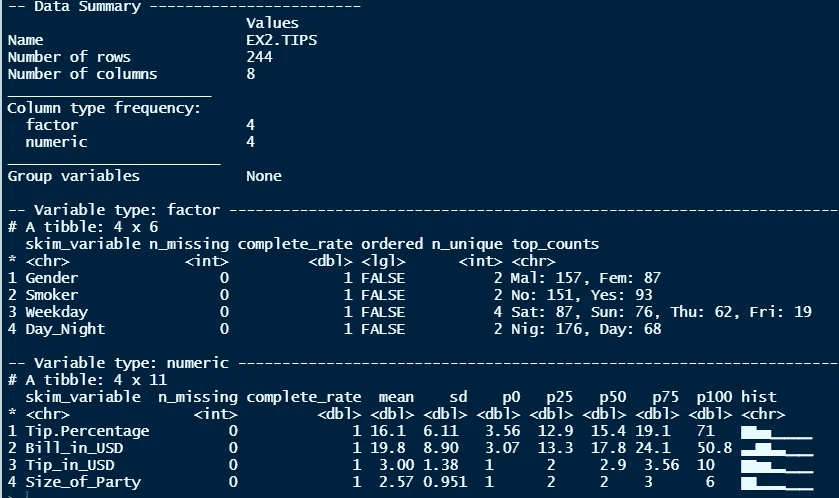
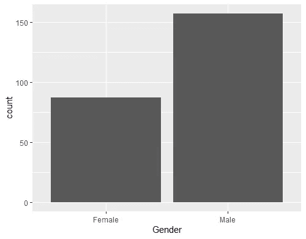
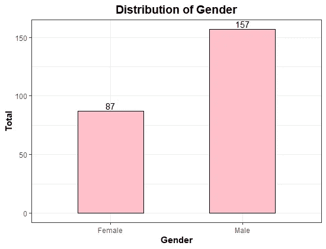
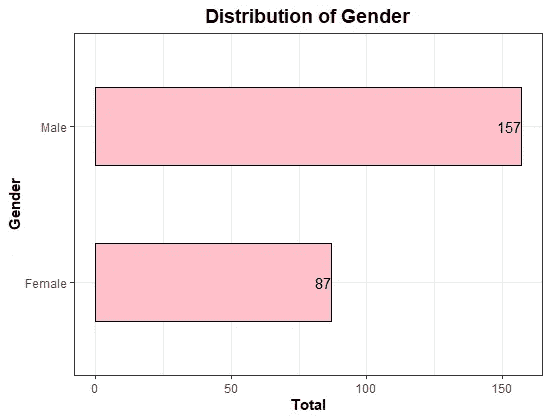
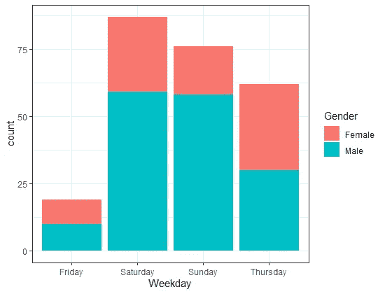
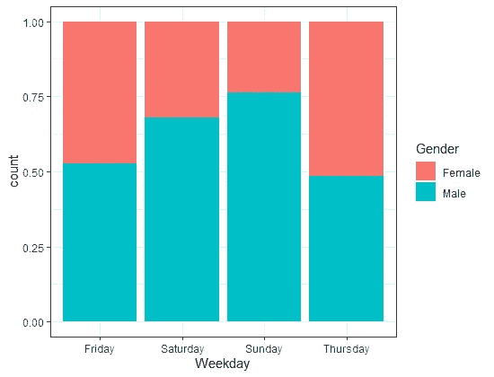
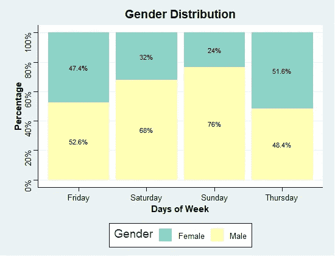
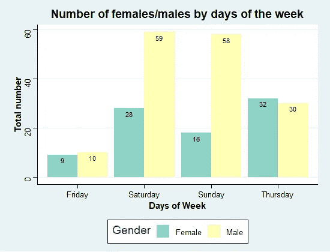
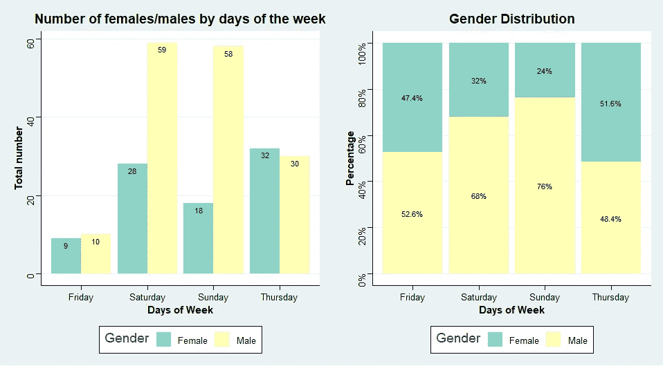

# 7 天挑战—掌握 Ggplot2:第 1 天—条形图

> 原文：<https://towardsdatascience.com/7-day-challenge-mastering-ggplot2-day-1-bar-chart-4b2ced928a31?source=collection_archive---------10----------------------->

## 从零开始了解 R 中的 ggplot2 可视化指南。


照片由[莫仁许](https://unsplash.com/@moren?utm_source=medium&utm_medium=referral)在 [Unsplash](https://unsplash.com?utm_source=medium&utm_medium=referral) 拍摄

# 介绍

我最初是一个 Python 用户，我已经使用 Python 完成了我所有的分析任务。因此，我认为没有必要同时知道 R。然而，当我在攻读统计学硕士学位时，我对 R 编程语言越来越感兴趣，尤其是它令人惊叹的图形。

我发现 R 可视化非常用户友好，尤其是在统计可视化任务中。而 ggplot2 是最有帮助的软件包之一，我认为它值得我花大力气去深入了解。我有一篇关于 ggplot2 中基本图的概述的文章， ***用 ggplot2*** 进行数据可视化的指南，你可以在这里 找到它 [**。**](/guide-to-data-visualization-with-ggplot2-in-a-hour-634c7e3bc9dd)

因为我想了解更多关于 ggplot2 的知识，以便将来研究，所以我决定接受挑战，在 7 天内掌握这个可视化软件包。我将在中间记录我的进步和成就。希望这能给我动力去完成我的挑战，同时也和读者分享我所学到的。

在我的第一篇文章中，我将向你展示我在制作整洁漂亮的条形图方面的探索。

# 基本条形图

条形图通常用于描述变量值的分布，或者比较数据类别中不同子组的数据。我相信条形图是最有用和最强大的基本图表之一，它可以帮助我们在各种情况下获得重要的洞察力。因此，每当我学习一个新的可视化库时，我通常从条形图开始。

但是首先，让我给你看一下我将在这篇文章中使用的数据集。你可以很容易的在 R `regclass`包中得到数据集。我将选择数据集 EX2。小费，这是我在不同聚会中给小费的记录。

以下是数据集的摘要:

```
library(regclass)
library("skimr")data(EX2.TIPS)
skim(EX2.TIPS)
```



先说一个简单的情节。

***目标:*** 我想找出数据集中有多少女性和男性。换句话说，我想看看“性别”这个变量的分布。剧情可以简单的通过`ggplot`和`geom_bar`的调用来完成。

```
library(ggplot2)
library('dplyr') #Count number of people in each gender
count_gender <- 
  EX2.TIPS%>%
  group_by(Gender) %>%
  summarise(count= n())#Plot x = gender, y= gender count
ggplot(count_gender, aes(x = Gender, y=count)) + 
geom_bar()
```



但是等等，没有标题和颜色的图表似乎有点简单。别担心。您可以轻松地用不同的属性定制您的条形图，例如颜色、条形的宽度。这里有几个可以用来更新图表的贡献。

*   为了改变你的条形图的颜色，用`geom_bar`中的`fill`属性标识你选择的颜色。为了改变条形图的颜色边框，使用`color`属性。
*   使用`ggtitle`、`xlab`、`ylab`改变 x、y 轴的名称
*   要自定义 x、y 轴和标题字体或颜色，请更改`theme`
*   要获得每根棒线上的数值，添加一个`geom_text`

```
ggplot(count_gender, aes(x = Gender,y=count)) + #customize bars 
 geom_bar(color="black",
           fill = "pink",
           width= 0.5,
           stat='identity') +#adding values numbers
  geom_text(aes(label = count), 
            vjust = -0.25) +#customize x,y axes and title
  ggtitle("Distribution of Gender") +
  xlab("Gender") + 
  ylab("Total")) +#change font
  theme(plot.title = element_text(color="black", size=14,          face="bold", hjust = 0.5 ),
       axis.title.x = element_text(color="black", size=11, face="bold"),
       axis.title.y = element_text(color="black", size=11, face="bold"))
```



如果你不想要一个垂直的条形图，而是一个水平的。很简单，加个`coord_flip()`元素就行了。这是我们得到的结果:



正如你在图表中看到的，显然参加聚会的男性人数是女性的近两倍。

# 堆积条形图

***目标:*** 对于一周中的每一天，我都想比较一下参加聚会的男性和女性的总数。

我可以用堆积条形图来观察这两种性别的差异。

将`geom_bar`中的`position`设置为 ***“堆叠”即可实现堆叠条形图。*** 此外，通过使`fill`等于“性别”，ggplot 将生成一个条形图，其中每个条形图(代表 ***“工作日】*** 变量的每个级别)由 ***【性别】*** 变量中的所有级别贡献。

下面是我的简单堆积条形图的样子:

```
ggplot(EX2.TIPS, aes(x = Weekday,fill=Gender)) + 
  geom_bar(position = "stack")
```



在上图中我们可以看到，有两个级别的**性别**和四个级别的**工作日**，一周中每一天每种性别的人数都有一个值。

不过为了比较一周不同日子的男女比例，我更喜欢用一个 ***分段柱状图。*** It 是一种堆积条形图，其中每个条形的总和为 100%。通过在`geom_bar`中指定参数`position = "fill"`，我们可以很容易地得到如下分段条形图:

```
ggplot(EX2.TIPS, aes(x = Weekday,fill=Gender)) + 
  geom_bar(position = "fill")
```



现在，让我们通过添加标签、标题以及自定义 x 轴、y 轴等来改进这个分段条形图。除了上面提到的一些控制元素，我们还有:

*   `scale_y_continuous`控制连续数据的位置刻度(y)
*   `scale_fll_brewer`设置条形图的颜色填充
*   为不同的图表背景安装软件包 ***ggthemes*** 。

详细来说，你可以看到下面的代码:

```
#Calculating the percentage of both genders in each day of the week
pctdata <- EX2.TIPS %>%
  group_by(Weekday,Gender ) %>%
  summarize(count = n()) %>% 
  mutate(pct = count/sum(count),
         percent_scale = scales::percent(pct))#Plotting ggplot(pctdata, aes(x = Weekday, y=pct, fill=Gender)) + 

 geom_bar(position = "fill", 
           stat = 'identity') +#Adjusting y-axis tick mark   
 scale_y_continuous(breaks = seq(0, 1, .2), 
                     label = percent) + 

#Adding value label
 geom_text(aes(label = percent_scale), 
            size = 3, 
            position = position_stack(vjust = 0.5)) + #Adusting color fill  
 scale_fill_brewer(palette = "Set3")  + 

#Adjusting title, labels 
 ggtitle("Gender Distribution") +

 xlab("Days of Week") + ylab("Percentage") +#Changing theme  
 theme_stata() + theme(
    plot.title = element_text(color="black", size=14, face="bold", hjust = 0.5 ),
    axis.title.x = element_text(color="black", size=11, face="bold"),
    axis.title.y = element_text(color="black", size=11, face="bold" ))
```



# 并排条形图

**目标:**我想跟踪在一周的不同日子里参加聚会的女性和男性人数。

我可以用一个分组的柱状图来看这一周两性的趋势。

那么，怎样才能得到分组条形图呢？使用 ggplot，很简单，因为您只需将`geom_bar`元素中的`position`更改为`dodge.`，与此同时，所有其他事情都以类似于我们绘制简单条形图的方式完成。

```
ggplot(count_day, aes(x = Weekday, y=count, fill=Gender)) + 

 geom_bar(position = "dodge", 
           stat = 'identity') +

 geom_text(aes(label = count),
            colour = "black", 
            size = 3,
            vjust = 1.5, 
            position = position_dodge(.9)) +  scale_fill_brewer(palette = "Set3")  +  ggtitle("Number of females/males by days of the week") + xlab("Days of Week") + ylab("Total number") + 

 theme_stata()+ theme(
    plot.title = element_text(color="black", size=14, face="bold", hjust = 0.5 ),
    axis.title.x = element_text(color="black", size=11, face="bold"),
    axis.title.y = element_text(color="black", size=11, face="bold" )) 
```



# 将不同的条形图放在一个地方

有时，我们想把两张图并排放在一起，以便于比较。在寻找一个我可以灵活运用的解决方案时，我偶然发现了这个*[***网站***](http://www.sthda.com/english/articles/24-ggpubr-publication-ready-plots/81-ggplot2-easy-way-to-mix-multiple-graphs-on-the-same-page/) ***。*** 不得不说很细致，解决方案很容易定制。我将通过使用`grid`库将他们的建议应用到我的案例中。*

*例如，我想得到我的 ***性别分布图*** ***(用 p 表示)*** 和 ***按一周的天数(用 m 表示)*** 并排的女性/男性数量。我是这样做的:*

```
*library(grid)# Creating a new page 
 grid.newpage()# Create layout: nrow = 1, ncol = 2
 pushViewport(viewport(layout = grid.layout(nrow = 1, ncol = 2)))

# A helper function to define a region on the layout
 define_region <- function(row, col){
   viewport(layout.pos.row = row, layout.pos.col = col)
 } 
# Identify plot positions
 print(p, vp = define_region(row = 1, col = 1))   
 print(m, vp = define_region(row = 1, col = 2))*
```

**

# *结论*

*是啊。这是我在 7 天挑战 ggplot2 的第一天学到的关于 ggplot2 的条形图的知识。如果你有关于这个酷图书馆的任何有趣的事情与我分享。让我知道。我很快会带着第二天的话题回来:**线图。***

# *参考*

*[http://www . sth da . com/English/articles/24-gg pubr-publication-ready-plots/81-gg plot 2-easy-way-mix-multiple-graphs-on-the-same-page/](http://www.sthda.com/english/articles/24-ggpubr-publication-ready-plots/81-ggplot2-easy-way-to-mix-multiple-graphs-on-the-same-page/)*

*[https://rkabacoff . github . io/data vis/bivariate . html #分类-分类](https://rkabacoff.github.io/datavis/Bivariate.html#Categorical-Categorical)*