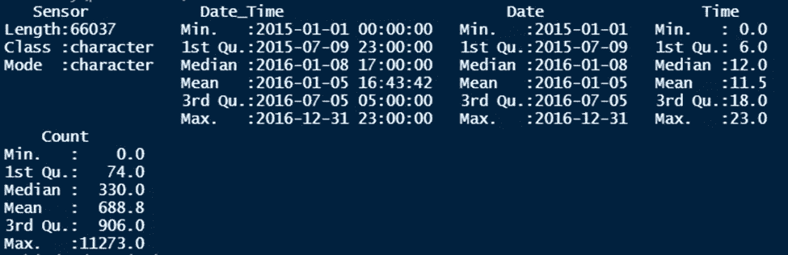
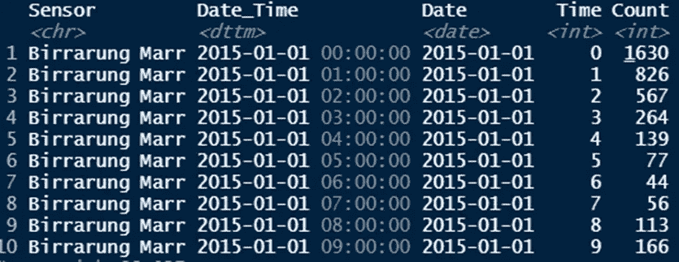
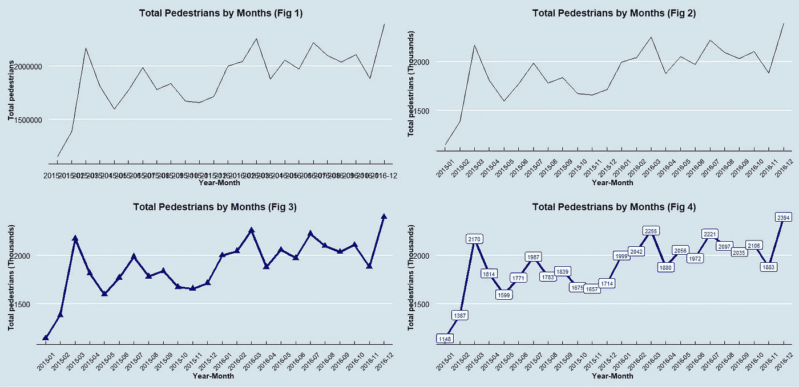
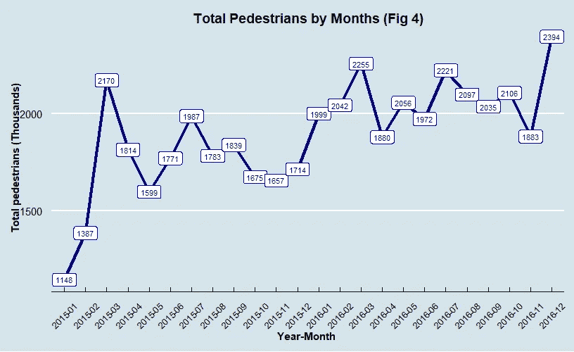
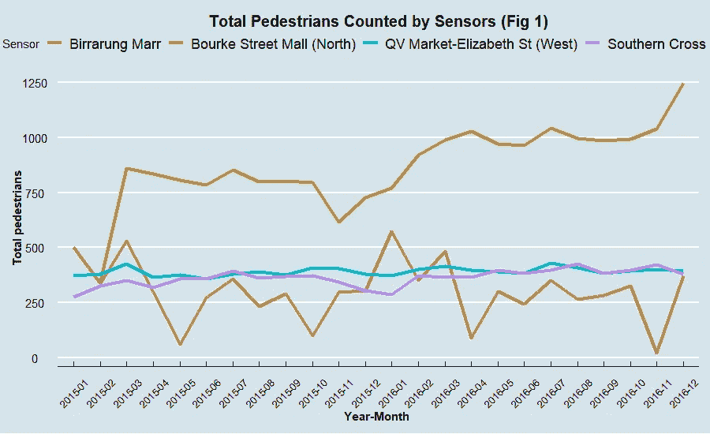
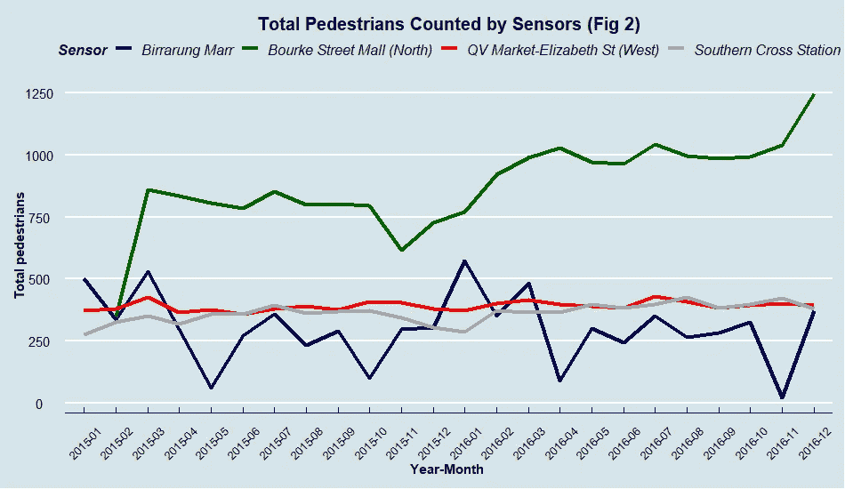
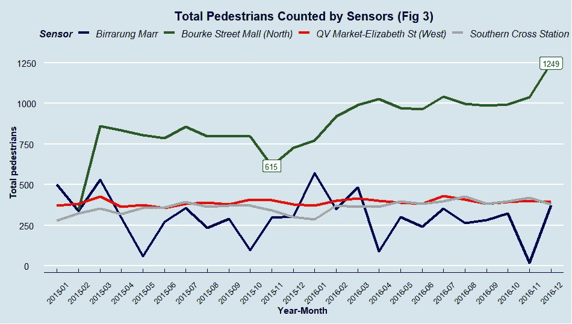

# 7 天挑战—掌握 Ggplot2:第 2 天—折线图

> 原文：<https://towardsdatascience.com/7-day-challenge-mastering-ggplot2-day-2-line-graph-2cfbdf164c81?source=collection_archive---------27----------------------->

## 从零线图了解 R 中的 ggplot2 可视化指南


照片由[思想目录](https://unsplash.com/@thoughtcatalog?utm_source=medium&utm_medium=referral)在 [Unsplash](https://unsplash.com?utm_source=medium&utm_medium=referral) 上拍摄

# 介绍

在我之前的帖子 [***7 天挑战—掌握 Ggplot2:第 1 天—条形图***](/7-day-challenge-mastering-ggplot2-day-1-bar-chart-4b2ced928a31) 中，我分享了我用一些核心元素绘制一个像样的条形图的经验。我今天会在这篇文章里继续和大家分享我的 ***线图*** 学习心得。

我想给你的是 ***而不是*** 一份如此全面的指南，告诉你你想知道的关于 ggplot2 的一切。范围太大，无法涵盖，而阅读一本书听起来是一个更好的解决方案。也就是说，你在这篇文章中所期待的是我对每种图表类型中的一些基本元素的介绍，我相信你可以对其进行定制，以灵活地应用于不同的情况。

所以，简而言之，我宁愿称我的文章为 ggplot2 可视化的小抄，也希望我的小抄能对你有些帮助。

# 资料组

折线图最常见的用途是描述对象随时间变化的趋势。例如:3 家出口公司从 2000 年到 2021 年的收益。

因此，我将使用 R 中的****【tsibble】***包中的一个时序数据集来可视化。我的数据集的名字是 ***【行人】*** 它提供了 2015 年至 2016 年墨尔本市不同传感器每天统计的行人数量的信息。*

*下面是我的数据集的一瞥:*

****

# *单线图*

****目标:一年中不同月份的行人总数。****

*我根据我之前关于 [**条形图**](/7-day-challenge-mastering-ggplot2-day-1-bar-chart-4b2ced928a31) 的帖子中提到的所有元素绘制了我的基本线图。它们包括对标题、x 轴、y 轴、主题、颜色等的控制。对于前面解释的每个属性，我不再解释，而是直接看图形代码。*

*与`geom_bar`用于在条形图中生成条形相同，`geom_line`用于在折线图中创建线条。*

*现在，让我们看看下面我的**简单折线图开发图**中的**图 1** 。通过使用`geom_line,` `theme,` `xlab,` `ylab,`和`ggtitle`**图 1** 创建起来没有任何困难。我为图 1 编写的代码如下所示。*

```
*#Calculating number of pedestrians per monthdf1 <- pedestrian
count_all <- df1 %>%  
             group_by(month_year) %>% 
             summarise(total = sum(Count))#Fig 1- simple line chartf1 <- ggplot(count_all, aes(x=month_year, y=total)) +

  ##Create a line by calling geom_line
  geom_line(group=1) + 

  ##Modify titles
  xlab("Year-Month ") +
  ylab("Total pedestrians (Thousands)") +
  ggtitle("Total Pedestrians by Months (Fig 1)") +

  #Change theme 
  theme_economist() + scale_fill_economist() + 
  theme(
  plot.title = element_text(color="black", size=14, face="bold",   hjust = 0.5 ),
  axis.title.x = element_text(color="black", size=11, face="bold"),
  axis.title.y = element_text(color="black", size=11, face="bold" ))*
```

**

*图 1:简单的折线图开发——作者提供的图片*

*有一个带`geom_line`的小通知。当你只为一个组绘制单线图时，记得在`geom_line`中注明`group=1`，否则你的图会出错。简单的理解，所有的点都要联系起来，于是 ***组=1*** 。*

*不过，我的 **fig 1** 图还是挺乱的，你也看到了。因为我的 y 轴上的刻度标签太大，所以很难跟踪这些值。更糟糕的是，由于我的 x 轴刻度标签是写在对方身上的，所以看不到。因此，为了解决这些问题，我对我的`theme`属性做了一个小小的修改:*

*   *定制`axis.text.x`让我的 x 轴文本标签旋转 45 度。调整`angle=45`得到结果。*
*   *用`scale_y_continuous`重新计算我在 y 轴上的数值，使我的数字有条理。*

*这是我如何把它转换成图 2 的。*

```
*#Adding figure 1 to figure 2 
f2 <- f1 + 
      ylab("Total pedestrians (Thousands)") +

##Modifying labels on axes
      theme(axis.text.x = element_text(angle = 45, vjust = 0.5,     hjust=0.5, size = 9))+
      scale_y_continuous(labels =  function(x) format(x/1000))*
```

*对于图 3 的**，**，我试图通过在图中添加`color`并调整我的图线的`size`来改进我的**图 2** 。此外，我还用`geom_point`元素给线图添加了点。*

```
*f3 <- f2 + 
   geom_line(group=1, size = 1.5, color = "darkblue") +
   geom_point(size = 3.5, color = "darkblue", shape =17)*
```

*`geom_point,`有很多种形状，你可以在这里 阅读更多关于它们的 [*来选择你的最佳选择。类似地，你可以通过指定`linetype`为其中之一来选择不同类型的线条:*"双点划线"、"空白"、"虚线"、"实线"、"长划线"、"点划线"、"点划线"**](http://www.sthda.com/english/wiki/ggplot2-point-shapes)*

*在**图 4** 中，我意识到我不再需要`geom_point`了，我想用实际值标记我的线图。我该怎么做？不费吹灰之力；只需要把`geom_label`加到上图你已经有的东西上。*

```
*#Adding graph labels
f4 <- f3 + geom_label(aes(label = round(total/1000,0)), size =3, color = 'darkblue')*
```

*我的最终图看起来比第一张好多了，对吧？*

**

*图 2:我的转换图——作者图片*

# ***多线图***

****目标:* *各传感器统计的一年中不同月份的行人总数。****

## *简单多线图*

*对于多线图来说，基本上，一切都和单线图一样。但是，`geom_line`属性有一点小小的不同，那就是我们不必在多线图中陈述`group=1`。相反，我们必须在`aes`属性中指定`group=Sensor` & `color=Sensor`，以便 R 可以理解和区分四组传感器。*

*下面是我如何用单线图中提到的属性和修改在 ***图 4*** 中实现多线图。*

```
*#Calculating number of pedestrians by each sensor during the period. 
count_sensor <- df1 %>%
   group_by(month_year,Sensor) %>%
   summarise(total = sum(Count))#Plotting##Specifying group and color group 
f5 <- ggplot(count_sensor, aes( x=month_year, y=total, group=Sensor,   color=Sensor)) +
   geom_line(size = 1.5) + ##Modifying titles, labels and background xlab("Year-Month") + ylab("Total pedestrians") + ggtitle("Total Pedestrians Counted by Sensors (Fig 1)") +

   scale_y_continuous(labels =  function(x) format(x/1000)) +

   theme_economist() + scale_fill_economist() + 

   theme(
     plot.title = element_text(color="black", size=15, face="bold", hjust = 0.5 ),
     axis.title.x = element_text(color="black", size=11, face="bold"),
     axis.title.y = element_text(color="black", size=11, face="bold" ),
     axis.text.x = element_text(angle = 45, vjust = 0.5, hjust=0.5, size = 9))*
```

**

*图 3:使用前面提到的元素的多线图—作者提供的图片*

## *修改(图例、颜色等)*

***颜色***

*我对图 4 中四条线的颜色不满意。我想改变它。好吧，如果你是这么想的，你可以用`scale_colour_manual.`轻松搞定*

```
*#Manually set the colors
f5 +
scale_colour_manual(values=c("darkblue","darkgreen","red","darkgrey"))*
```

***图例***

*你也可以改变你的传奇。以下是我们需要关注的几个属性:*

*   *`theme(legend.position = position):`将您的图形图例位置更改为“左”、“上”、“右”、“下”、“无”或 c( *x* 、*y*)*(x 和 y 值必须在 0 和 1 之间。c(0，0)表示(左，下)，c(1，1)表示(右，上)。**
*   *`theme(legend.background):`改变图例的背景。*
*   *`element_text`在`theme`属性中改变图例的字体大小。*

*因此，我应用这些来定制我的图形视觉:*

```
*f6 <- f5 + 
#Setting line colors
scale_colour_manual(values=c("darkblue","darkgreen","red","darkgrey"))+
#Adjusting legend theme   
##Position
theme(legend.position="top") + 
##Changing text contributes
theme(legend.title = element_text(colour="black", size=12, 
face="bold.italic"),
legend.text = element_text(colour="black", size=12, 
face="italic"))*
```

**

*图 4:自定义颜色和图例—作者提供的图像*

# *值标签修改*

*万一，我想只说明 ***【布克街购物中心(北)】*** 的最大和最小行人数量，怎么做呢？*

*很简单，只需过滤出你想要插入到图形中的标签值，放在`geom_label`元素下。*

```
*##Filter values 
values <- count_sensor %>% filter(Sensor == 'Bourke Street Mall (North)', month_year %in% c("2016-12","2015-11"))##Plot
f6 + geom_label(
     aes(label = round(total/1000,0)), data=values, size =3, color = 'darkgreen')*
```

**

*图 5:插入标签-作者图片*

*您可以将我过滤值标签的方法应用于类似的情况:*

*   *仅向一行添加标签*
*   *向特定级别的 x 值添加标签*

# *结论*

*以上是我在 ggplot2 中学习绘制折线图的一些技巧。我不得不说，随着我对这个库了解的越来越多，我发现了更多有趣的东西，我很兴奋能够进一步探索。图层绘图类型使可视化变得比以往更加容易和方便。*

*一定要坚持学习。*

*稍后请和我一起讨论**第三天题目:斜率图**。*