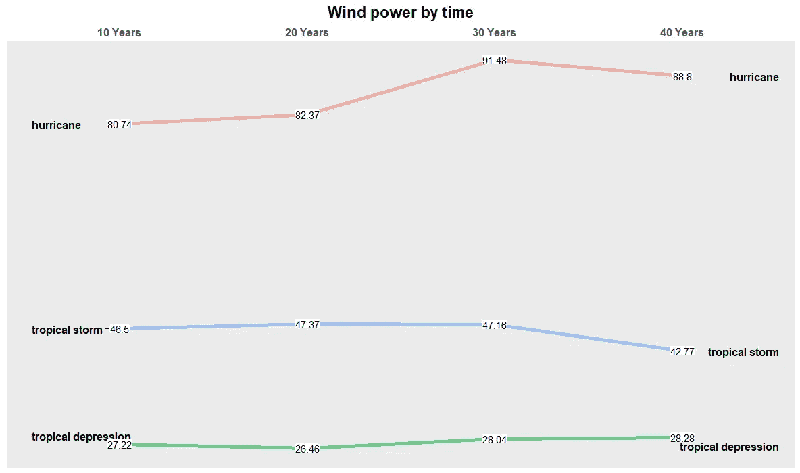

# 7 天挑战—掌握 Ggplot2:第 3 天—斜率图

> 原文：<https://towardsdatascience.com/7-day-challenge-mastering-ggplot2-day-3-slope-graph-a7cb373dc252?source=collection_archive---------16----------------------->

## 认识一个非常有趣的图形——斜率图


照片由[布鲁克·拉克](https://unsplash.com/@brookelark?utm_source=medium&utm_medium=referral)在 [Unsplash](https://unsplash.com?utm_source=medium&utm_medium=referral) 拍摄

# 介绍

在 [***掌握 ggplot2:第 1 天—条形图***](/7-day-challenge-mastering-ggplot2-day-1-bar-chart-4b2ced928a31) 和 ***第 2 天—线图*** 之后继续我的一系列学习可视化，我将分享一个激动人心的情节，我旅程的第 3 天的**斜率图**。但是，要了解 ggplot 如何工作的一般想法和一些简单的概念，您可以先查看我的文章 [***使用 ggplot***](/guide-to-data-visualization-with-ggplot2-in-a-hour-634c7e3bc9dd) 进行数据可视化的指南。

首先，斜率图用于显示两点之间的变化，而不太关心中间点。这在比较不同时间戳中的值和显示一段时间内的趋势时特别有用。如下图所示，图 1 是一个斜率图的例子。它比较了不同公司在 2007 年和 2020 年的收入。通过查看图表，我们可以很容易地看出 A 区是这段时间内增长最快的公司。


图 1:收入—按作者分类的图片

如果你想了解更多关于斜率图形和它们的解释，你可以在[***story telling with data***](https://www.storytellingwithdata.com/blog/2018/6/1/swdchallenge-slopegraph)*阅读更多。*

在这篇文章中，我将告诉你 4 个步骤来获得任何斜率图形。很简单。

现在，让我们试着用 ggplot2 得到这个有趣的图形。

# 数据集

我将使用来自`dplyr`包的数据集**“Storm”**。这些数据记录了从 1975 年到 2015 年 40 年间不同类型风暴的各种属性。下面，我总结一下我的数据集。

```
library(dplyr)
data = storms 
skim(data)
```


图 2:数据汇总—按作者分类的图片


图 3:标题(数据)—作者图片

# 让我们开始吧…

## 目标 1:通过斜率图将 1975 年不同类型风暴的平均风力与 2015 年进行对比。

1.  **变换数据集得到 1975 年和 2015 年的平均风力。**

```
mean_storm <- data %>% filter(year %in% c('1975','2015'))%>%
              group_by(year,status) %>% 
              summarise(avg_windpower = mean(wind))
```

这是我将用来可视化我的斜率图的数据框。


图 4:转换后的数据—按作者分类的图像

**2。画出坡度线**

在我看来，斜率图是各种各样的线图，或者说是一种特定类型的线图。因此，在第一阶段，获得一条斜线类似于生成一个应用了`geom_line`的线图。我将向您展示如何:

```
f1 <- ggplot(data = mean_storm, aes(x = year, y = avg_windpower, group = status, color=status,alpha=1)) +
  geom_line( size = 2) +
  geom_point( size = 4) +
  xlab("Year") + ylab("Avg wind power") +
  ggtitle("Average wind power in 1975 and 2015")f1
```


图 5:我的草图——作者图片

**3。移除不必要的元素**

我们离我们需要的东西越来越近了。在这一步，为了有一个清晰的斜率图形，我们必须删除和调整一些元素。基本上，所有的调整都发生在`theme()`属性中:

*   调整 x 轴标签并用`scale_x_discrete(position = "top").`将它们移动到图表的顶部，然后改变这些标签的字体大小使其更清晰。
*   通过获取`theme()`属性中的`legend.position = "none"`来移除图例
*   删除 y 轴上的所有内容，包括标题、标签、刻度线
*   通过将这些元素设置为`element_blank()`从 x 轴移除刻度线、标题
*   为了使图表更加清晰，我将删除图表中的所有网格线。为此，应该删除`theme`属性中的一些元素:`panel.grid.major.y, panel.grid.minor.y, panel.grid.minor.x, panel.grid.major.x`

这是我们移除一些东西后得到的结果:

```
f2 <- f1+  
  scale_x_discrete(position = "top") +## Changing font size of x-axis and main title of the graph
theme(
  plot.title = element_text(color="black", size=15, face="bold",  hjust = 0.5 ), 
  axis.text.x = element_text(vjust = 0.5, hjust=0.5, size = 12, face="bold"),## Removing grid lines
  panel.grid.major.y = element_blank(),
  panel.grid.minor.y = element_blank(),
  panel.grid.major.x = element_blank(),
  panel.grid.minor.x = element_blank(),## Removing the legend
  legend.position = "none",## Removing everything from the y axis
  axis.title.y     = element_blank(),
  axis.text.y      = element_blank(),## Removing title from the x axis 
  axis.title.x     = element_blank(),## Remove x & y tick marks
  axis.ticks       = element_blank())
```


图 6:删除元素后的图表——作者提供的图片

**4。给坡度线添加标签**

现在，我们的图表已经接近完成，但是如果没有图表值，它看起来还是很空。这就是为什么我们将为更多信息添加数据标签，而`geom_text()`属性将用于此目的。

*   使用`aes(label = "--")`写入每组对应的值
*   比如我想用风暴的名称和对应的风力来标注 2015 年每个风暴组的平均风力，就用`aes(labels=paste0(status,"-",round(avg_windpower,2),"km/h"))`。
*   此外，我们还可以通过控制不同的元素来定制标签的外观和位置，例如`hjust, vjust, size, alpha`

让我们看看添加不同的`geom_text()`元素后会有什么。

```
f2 + 
geom_text(data = mean_storm %>% filter(year == "1975"), 
aes(label = paste0(status, " - ", round(avg_windpower,2), "km/h")),   hjust = 1.1, 
fontface = "bold", 
vjust=0.25,
size = 4, 
alpha = 3) +

geom_text(data = mean_storm %>% filter(year == "2015"), aes(label = paste0(status, " - ", round(avg_windpower,2), "km/h")) , 
hjust = -0.1, 
fontface = "bold",
vjust = 0.25,
size = 4, 
alpha = 3)
```


图 7:典型的斜率图——作者图片

这比第一张图好多了，对吧？

但这并不是故事的结尾；请再忍耐一下，看看我们将在下一张图中遇到什么。

## 目标 2:用斜率图直观显示 10 年、20 年、30 年、40 年不同类型风暴的平均风力。

1.  **转换数据集以获得从 1975 年开始的 *10 年、20 年、30 年和 40 年的平均风速。***

好了，像往常一样，让我们从最基本的步骤开始，即获取数据框以进行可视化。

```
mean_storm2 <- data %>% 
  group_by(year,status) %>% 
  summarise(avg_windpower = mean(wind))df2 <- mean_storm2 %>% pivot_wider(names_from = status, values_from = avg_windpower)year <- c()
year[1] <- 1975
period <- c()while(max(year) < 2015) {
  next_year <- tail(year,1) + 10
  year <- c(year,next_year)
  }period <- c()
for (i in 1:length(year)) {
  period[i] = year[i] - year[1] 
}##Marking the period corresponding with each year (E.g: 1985 - period = 10 years)
df3 <- data.frame(year,period)df4 <- merge(x = df2, y = df3, by = "year", all.x = TRUE)df5 <- select(df4[!is.na(df4$period), ], -1)df6 <- df5 %>%
  pivot_longer(!period, names_to = "status", values_to = "avg_windpower")
df6$period <- as.character(df6$period)df7 <- subset(df6, period != '0')df7$period <- factor(df7$period, 
                            levels = c("10", "20", "30", "40"), 
                            labels = c("10 Years","20 Years","30 Years","40 Years"), 
                            ordered = TRUE)
```

这是我们转换后的数据框:


图 8:转换后的数据—按作者分类的图像

让我们进入第二步，这是绘制我们的斜率图。

**2。画出坡度线**

如前所述，我们将调整 x 标签的标题和位置，并使用`geom_line()`绘制草图

```
f2 <- ggplot(data = df7, aes(x = period, y = avg_windpower, group = status)) +
  geom_line(aes(color = status, alpha = 1), size = 2 ) +
  scale_x_discrete(position = "top") +
  theme_gray() +  ggtitle("Wind power by time") + 
  theme(plot.title = element_text(color="black", size=15, face="bold", hjust = 0.5 ))
```


图 9:草图——作者提供的图片

**3。移除不必要的元素**

与我们之前所做的类似，为了使图表更清晰，我们将从图表中删除一些元素。消除这些元素的代码与 ***目标 1 中的相应部分相同。*** 重复代码，下面是我们得到的:


图 10:删除不必要的元素——作者图片

**4。给坡度线添加标签**

*   这一部分的不同之处在于，我将使用`geom_label`而不是`geom_text.`来绘制该图。实际上，这两个元素以相同的方式工作。但是，`geom_label`在文本周围多加一个框，给数字足够的空间，避免数字值和图形之间的重叠。
*   此图中要使用的另一个额外元素是`geom_text_repel.`。该属性将有助于在线的两端获得不同组的标签，而不会使线重叠。只要一声令下，一切都变得整洁有序。

你可以看到我的图表如下:

```
f3 <- f2+
 geom_text_repel(data = df7 %>% filter(period == "10 Years"), 
                  aes(label = status) , 
                  hjust = "left", 
                  fontface = "bold", 
                  size = 4.2, 
                  nudge_x = -.45, 
                  direction = "y") +
 geom_text_repel(data = df7 %>% filter(period == "40 Years"), 
                  aes(label = status) , 
                  hjust = "right", 
                  fontface = "bold", 
                  size = 4.2, 
                  nudge_x = .5, 
                  direction = "y") +
 geom_label(aes(label = round(avg_windpower,2)), 
             size = 4, 
             label.padding = unit(0.05, "lines"), 
             label.size = 0.0)
```



图 11:最终图形——作者提供的图像

# 最后…

经过大量的添加和删除元素，我可以这个有趣的图表。就我个人而言，我并没有看到这种图形被普遍使用，然而学习一种新技术从来都不是多余的。希望你觉得我的文章在某些方面有帮助，感谢你一直读到最后。

我学习 ggplot 的第三天到此结束。我将从第 4 天继续我的学习之旅:统计使用图。

**参考**

 