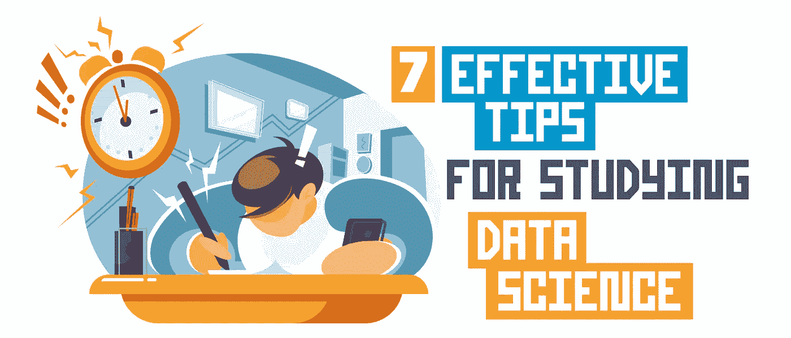
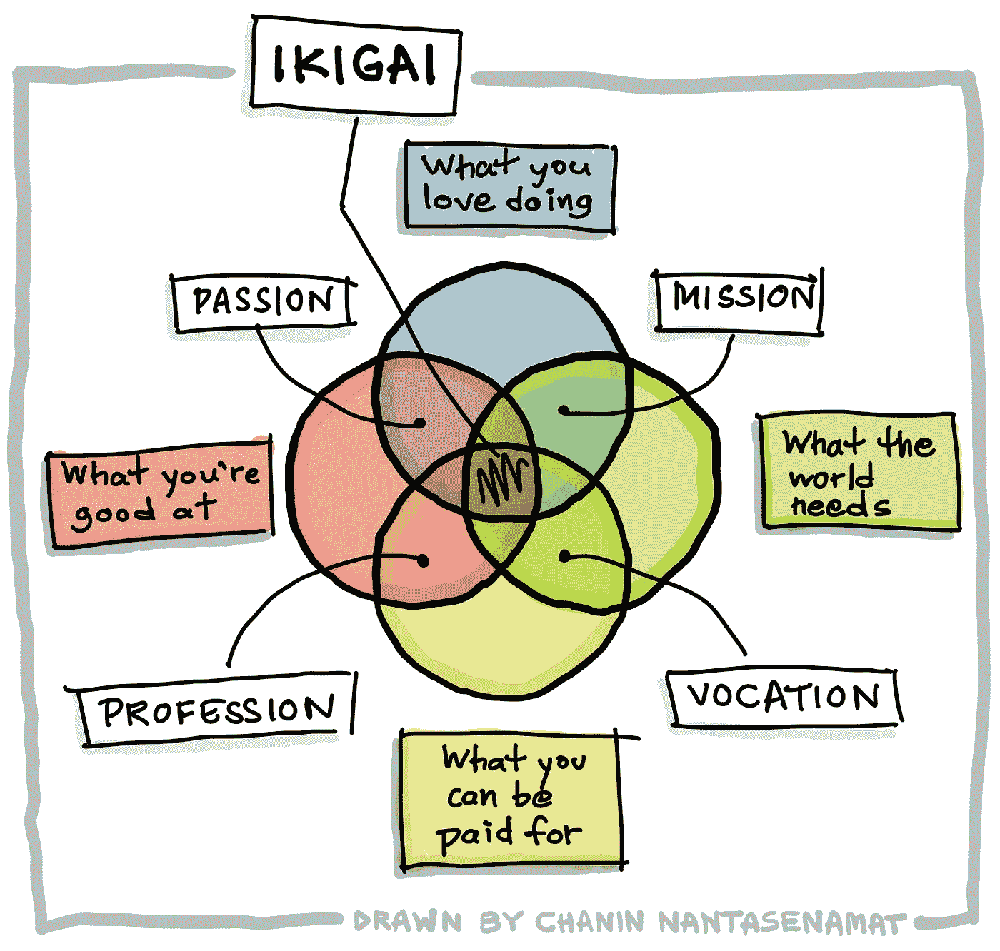
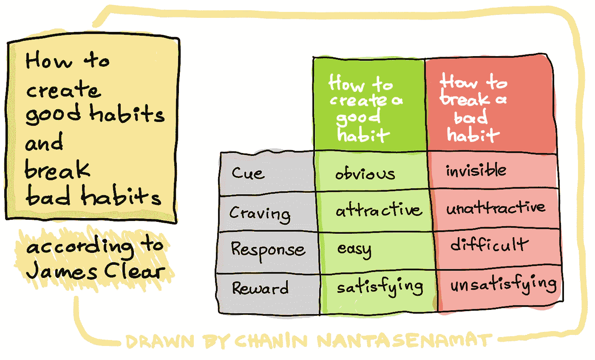
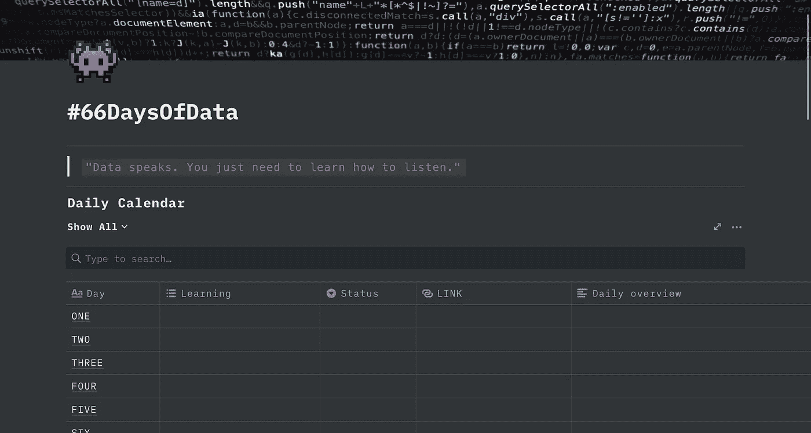

# 学习数据科学的 7 个有效技巧

> 原文：<https://towardsdatascience.com/7-effective-tips-for-studying-data-science-f7adbc1fbf6?source=collection_archive---------1----------------------->

由 [envato elements](https://1.envato.market/c/2346717/628379/4662) 的 [aqrstudio](https://elements.envato.com/user/aqrstudio) 使用图像创建(经许可)。

## 学习技巧

## 以下是您在学习数据科学时需要保持一致的内容

有抱负的数据科学家面临的最大挑战之一是一致性。如果您能够持续不断地获得数据科学方面的知识和技能，您将会惊讶地发现，一两年后您会积累多少知识。

如果你想在你的学习之旅中获得成功，但却在做你一直在做的事情，那么成功是如何找到你的。为了得到不同的结果，你需要采取不同的方法。

在本文中，我们将探讨 7 个技巧，你现在就可以使用它们来有效地学习数据科学并取得一些重大进展。

# 1.找到你的目标

很多人都在考虑在数据科学领域开始自己的职业生涯，但并不清楚他们为什么想这么做(如果你想，恭喜你！)虽然这完全可以理解，但从长远来看，这也会给你带来灾难。

众所周知，冲绳人长寿，这背后的秘密是他们所谓的 ***Ikigai*** 中强烈的使命感。

你有没有花一点时间问问自己关于你的 Ikigai。那么 Ikigai 到底是什么？可以认为是早上让你想起床的感觉。这种感觉来自下图中总结的 4 个主要概念的交集。

Ikigai 示意图。由作者绘制

你学数据科学是因为它好玩、有趣还是一个有趣的职业？了解“为什么”有助于你思考是什么吸引你进入数据科学的世界。也许你喜欢解决问题和研究。也可能是因为你只是好奇这个世界是如何运作的，想要了解更多。问自己这些问题有助于正确看待激情。

记住这一点，把它写下来或者贴在墙上。将来，当你陷入困境或失去希望时，回到这里充电，重新振作起来，意识到你已经开始了什么！

# 2.设定目标和制定计划

学习数据科学的最大挑战之一是我们难以设定有效的目标。我们经常设定太多的目标，导致我们失去动力和精力。

那么，你如何准确地设定你的目标，并制定必要的计划来实现它们呢？

其实很简单。以下是您需要分两步做的事情:

1.  在心中想到终点(目标)。
    (斯蒂芬·科维的 *7 个高效人士的习惯*)中的习惯 2
2.  逆向工程，列出为了达到目标你需要知道和/或做的事情。尽可能的详细。

# 3.勇气

我们可能听说过卡罗尔·德韦克提出的[成长心态，以及培养这种心态如何帮助我们以开放的心态迎接即将到来的挑战，以及在智力和身体上的成长。另一个重要的概念是勇气。](https://amzn.to/3gIMtu4)

生活总会投出曲线球。你无法提前知道哪些会来，哪些会错过。但是你可以把你的努力集中在重要的事情上，并培养反弹的技能和韧性。

心理学家、《T2》T3《勇气:激情和毅力的力量 T5》的畅销书作者安吉拉·杜克沃斯发现，激情和毅力(她称之为勇气)的结合是成功人士成功的原因。

我们很多人都知道不断学习新东西有多难。尽管困难重重，有坚持下去的意愿是至关重要的。这也有助于对生活采取积极的态度。当事情没有按预期进行或者遇到挫折时，往往很容易放弃。你需要勇气和动力的结合，让你在一段时间内朝着正确的方向前进。动机会让你在开始学习数据科学的旅程时充满热情，但毅力和习惯可以帮助你长期保持努力。旅途会有起有落，你只需要坚持下去。因此，成为像 66 天数据这样的社区的一部分可能会帮助你有更大的归属感，因为你并不孤单，而是有成百上千的其他有抱负的数据科学家在奋斗、成长和繁荣。

# 4.习惯

精通数据科学不是一蹴而就的。这是一个包括培养良好习惯的过程。

> “动力是你开始的动力。习惯是让你坚持下去的东西。”
> 
> —吉米·罗恩

根据《原子习惯》的作者 James Clear 的说法，你真正需要做的是开始创造好习惯，通过使*明显*、*吸引人*、*容易*和*满足*来解决由*暗示*、*渴望*、*反应*和*奖励*组成的关键因素。这些因素的倒置会让你打破坏习惯，也就是说，让它变得看不见、没有吸引力、困难和不令人满意。我在下面的图表中总结了这一点，我强烈推荐阅读*原子习惯*以获得更深入的报道。

# 5.一致性

学习中的一致性是一项具有挑战性，但却是必要的技能。鉴于数据科学领域的广阔性，学习数据科学需要毅力(*即*要学的东西实在太多了)。

## 5.1.把任务分成小块

学习数据科学不一定是一项包罗万象的任务。你可以把学习分解成小单元。从小处着手，你可以积累你的知识。每一天，你都离成为更好的自己更近了一步。你可能从一个简单的项目或分析开始，然后发展到更广泛的东西。

## 5.2.公共问责

如果你在学习过程中难以保持一致，Ken Jee 可能会给你答案。Ken 是我的好朋友，也是杰出的数据科学专家。他发起了 66 天数据倡议，旨在帮助你实现一致性。

要参与 ***66 天的数据*** 倡议，你只需要做以下事情:

1.  每天至少花 5 分钟学习或研究数据科学
2.  跟踪你的进展，反思什么有效，什么无效
3.  在 Twitter 或 LinkedIn 上公开分享你的学习进展

听起来很简单？这就是目标。正如你会注意到的，这个计划通过使学习尽可能简单来帮助你建立一个持续学习的习惯。分享您的进步所带来的公共责任也将有助于您在与数据社区中同样参与挑战的志同道合者一起学习的同时，积极参与并拥有一种期待的使命感。

# 6.关注过程

专注于这个过程有助于让你远离所有可能阻碍你前进的消极想法和焦虑。通过专注于当前时刻和实际完成工作(例如，进行实际的阅读，进行编码练习和项目等)。)你正在获得动力。当你越来越关注这个过程时，你就在寻找提高生产力的方法。你在思考:

> 我如何提高模型的性能？
> 
> 代码如何运行更高效，计算时间更少？

寻找解决方案并解决这些问题有助于你更有效率地投入到学习之旅中。当你快乐地学习时，学习就不会感觉像是一件苦差事，而是你日复一日期待去做的事情。

> “当你爱上过程，而不是产品时，你不必等待就能获得快乐，你可以在系统运行的任何时候感到满意”
> 
> —《原子习惯》的作者詹姆斯·克莱尔

参与挑战的好处是，比如 66 天的数据或 100 天的代码，它让你专注于这个过程。为什么这是因为公众的责任感，你把你每天的进步公布给整个社区看。

假设您丢失了帖子，社区中的其他人可能想知道发生了什么，或者您不想让其他人失望。因此，你每天都在努力进步，这样你就能成功应对挑战。

# 7.使用工具让你保持专注和有条理

## 7.1.番茄工作法

按照番茄工作法学习是一个很好的方法，可以帮助你有效地学习。

这个想法很简单:

1.  紧张学习 25 分钟
2.  休息 5 分钟进行伸展和放松，以便在开始其他回合之前进行充电。

这种方法的好处在于，时间限制有助于消除拖延，因为你将整个 25 分钟的时间用于研究、编码或处理数据项目。

这种深度工作如果加上排除干扰，比如把手机放在看不见的地方，可能有助于提高生产率。

## 7.2.生产力工具

[***观念***](https://www.notion.so/) 是一个伟大而免费的生产力工具，你可以用它来跟踪你的进展(66 天数据的第 2 步)，同时记笔记来反思哪些有效(然后加倍努力)哪些无效。

下面你会发现一个概念模板的例子，你可以用它来记录你的学习进度。

Ken Jee 的#66DaysOfData 概念模板

您甚至可以增强模板并对其进行定制，以包括您在数据科学学习过程中使用的最喜爱资源的链接，例如可用计算资源的链接(*例如* Google Colab、Kaggle 等)。)、API 文档、在线教程(如[真实 Python](https://realpython.com/) 、[机器学习大师](https://machinelearningmastery.com/)、 [GeeksforGeeks](https://www.geeksforgeeks.org/) 等。)，小抄等。记住*让事情变得简单*以便培养一个新习惯。

# 结论

进入数据科学可能是一项艰巨的任务，但有了正确的心态和正确的习惯，您就可以克服这些障碍并取得成功。不要认为学习数据科学是一个短期目标，所以不要担心你现在在哪里。今天你可能在努力跟上，但坚持下去，你会在 6 个月或一年后惊讶于你现在的位置。把这个学习之旅想象成一场马拉松，日复一日，循序渐进。你能行的！

# 公开

*   作为亚马逊的合作伙伴和 Kite 的会员，我可能会从合格的购买中获利，这将有助于未来内容的创作。

# 接下来读这些

*   [**如何用 Python 构建 AutoML 应用**](/how-to-build-an-automl-app-in-python-e216763d10cd)
    *使用 Streamlit 库的分步教程*
*   [**学习数据科学的策略**](/strategies-for-learning-data-science-47053b58c19f)
    *打入数据科学的实用建议*
*   [**如何免费搭建一个简单的作品集网站**](/how-to-build-a-simple-portfolio-website-for-free-f49327675fd9)
    *不到 10 分钟从头开始的分步教程*

## ✉️ [订阅我的邮件列表，获取我在数据科学方面的最佳更新(偶尔还有免费内容)!](http://newsletter.dataprofessor.org/)

# 关于我

我是泰国一所研究型大学的生物信息学副教授和数据挖掘和生物医学信息学负责人。在我下班后的时间里，我是一名 YouTuber(又名[数据教授](http://bit.ly/dataprofessor/))制作关于数据科学的在线视频。在我做的所有教程视频中，我也在 GitHub 上分享 Jupyter 笔记本([数据教授 GitHub 页面](https://github.com/dataprofessor/))。

<https://www.youtube.com/dataprofessor>  

# 在社交网络上与我联系

✅YouTube:[http://youtube.com/dataprofessor/](http://youtube.com/dataprofessor/)
♇网站:[http://dataprofessor.org/](https://www.youtube.com/redirect?redir_token=w4MajL6v6Oi_kOAZNbMprRRJrvJ8MTU5MjI5NjQzN0AxNTkyMjEwMDM3&q=http%3A%2F%2Fdataprofessor.org%2F&event=video_description&v=ZZ4B0QUHuNc)(在建)
♇LinkedIn:[https://www.linkedin.com/company/dataprofessor/](https://www.linkedin.com/company/dataprofessor/)
♇Twitter:[https://twitter.com/thedataprof](https://twitter.com/thedataprof)/
♇Facebook:[http://facebook.com/dataprofessor/](https://www.youtube.com/redirect?redir_token=w4MajL6v6Oi_kOAZNbMprRRJrvJ8MTU5MjI5NjQzN0AxNTkyMjEwMDM3&q=http%3A%2F%2Ffacebook.com%2Fdataprofessor%2F&event=video_description&v=ZZ4B0QUHuNc)
♇github:[https://github.com/dataprofessor/](https://github.com/dataprofessor/)
ϝinsta