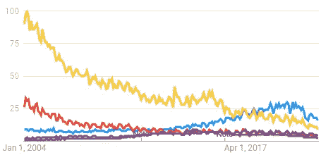
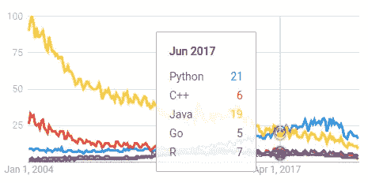
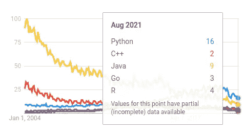
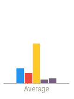
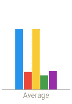
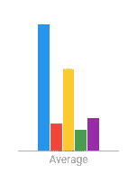
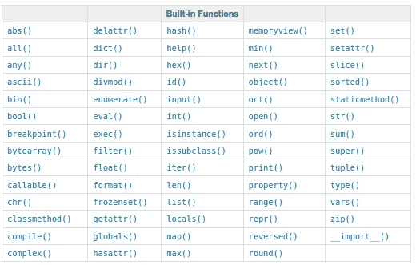

# 加速核心 Python 程序的 7 种令人尴尬的简单方法

> 原文：<https://towardsdatascience.com/7-embarrassingly-easy-ways-to-speed-up-your-python-program-88911b9192c1?source=collection_archive---------13----------------------->

来源: [Unsplash](https://unsplash.com/photos/JkaKy_77wF8)

## [小窍门](https://towardsdatascience.com/tagged/tips-and-tricks)

## 谁说没有‘免费的午餐’；)

[动机](#d36d)
∘ [那又怎样，谁在乎呢？](#3e11)
∘ [规则优化](#e065)
∘ [Python 的流行度](#dedb)
[代码示例](#fd6b)
∘ [实例化列表](#122f)
∘ [过滤列表](#4e7d)
∘ [检查还是抛出异常？](#60c8)
∘ [成员资格检查](#fc10)
∘[def vs . lambda](#b04c)
∘[唯一值](#cde0)
∘ [检查条件](#6762)
[结论](#1e1d)
∘ [备选方案](#2c24)
∘ [优化级别](#57b8)
∘ [其他关注点](#9546)
∘ [结论](#e3c0)

# 动机

最近，我意识到我有太多的故事要开始，却没有计划去完成:令人尴尬的大量工作正在进行中！

作为回应，我试图清理、组织并找出哪些部分有潜力。在即将到来的所有最佳候选中，有两个虽然不在最前面，但无疑是很好的主题:(1)一个加快代码速度的核心 python 技巧列表，以及(2)一篇关于优化基础的哲学文章。最初，重叠是最小的。然而，经过一点调整和合并后，我将向您介绍以下内容:一篇包含 Python 技巧列表的文章，从哲学角度阐述了加速代码的概念。

对于那些只对技巧列表感兴趣，而不是围绕它的故事，点击[这里](#fd6b)向前跳。

## 那又怎样，谁在乎呢？

那又怎样，谁在乎呢？在确定交付特定成本的价值时，一个问题应该是头脑风暴的首要问题。换句话说，如果什么的*无足轻重，什么*的*不存在，那又何必呢。因此，在意义*风险与回报*的共同困境中，权衡*回报*方面的一个简单机制是:无论如何，因为更多的细节取决于它的博客帖子——自我提醒；)*

这个博客的目的是分享一些代码片段，以及运行时，作为暗示最佳性能的手段，如果遵循。具体来说，我在表演中最喜欢的五个 Python 特有的技巧和诀窍。

对于那些感兴趣的人，我们将首先回顾一些基本的概念和一个通用的方法，当你打算加速你的代码库的时候。接下来，我们将在趋势线处达到顶峰，以描述掌握 Python 的价值:如果没有其他原因，它已经成为更受欢迎的语言之一，它只会继续扩展其功能和范围，同时通过忠实的消费者基础和开源标准保持其基础。为此，我们将使用 [Google Trends](https://trends.google.com/trends/?geo=US) 做一个简单的近似分析。

除了引言(即动机)部分的其余部分，我们还将讨论这些技术。最后，我们以讨论和相关资源列表结束。评论不仅受到鼓励，而且总是受到高度赞赏。提前感谢，希望大家喜欢，觉得有帮助！

## 最优化规则

在东北大学的计算机科学学院任教

优化有三个规则。

1.  不
2.  暂时不要
3.  轮廓

***不***①百分之九十的时间；有人认为一段代码需要优化，但事实并非如此。通常，需要其他解决方案来解决速度问题(例如，更好的硬件)。换句话说，优化代码是有成本的:优化所花费的时间成本，以及重构时代码中断所产生的工作量。此外，优化后的代码可读性可能更差，因此不再可维护(也就是说，这是一种与 Pythonic 思想相悖的权衡)。另一个副产品可能是内存使用的增加，这可能会带来一系列问题:是的，有可能使用传统的优化技术优化一些代码，但后来发现由于内存消耗的增加而导致的时间成本并没有加快速度。因此，除非你加速是必要的，*不要*，至少，直到所有其他选择都用尽(例如，硬件升级，移植到另一种语言，等等)。).

***…还没有*** (2)确保你的代码能够工作，至少有 85%的测试覆盖率。一旦代码是端到端的，就可以对它进行改进，这样就可以进行比较，以确保不会出错。因此，*不要…还不要*，直到代码完全完成并且不同的组件都经过了良好的测试，因为改进只是相对而言的。或许，把这个概念重新定义为一个问题会让你明白这一点。如果一开始就没有绝对的产品，那怎么能改进呢？

***简介*** (3)勿猜！首先， *Profile* 代码用来表征代码各部分的性能。然后，观察占用最多时间的代码片段，并将所有精力集中在那里。这不仅浪费了时间，而且还增加了在代码中引入问题的可能性，换来的是微不足道的速度提升。许多年前，作为一名大学生，在这个项目的早期，我在东北大学的电气&计算机工程系担任研究助理。具体来说，作为光学科学实验室的一员，与 NUCAR 合作。我的第一个任务的问题陈述是通过任何可能的方式来加速现有代码-解决方案包括从本地 CPU 上的多线程到将工作负载分割为计算集群中几十个节点上的独立作业处理，再到 NVIDIA GPU 上每个内核上数千个线程的并行处理。不管方法论如何，我很早就被教导永远不要盲目优化；始终*剖析*首先，了解代码中的瓶颈在哪里，然后针对那些特定的代码片段，以获得与最初运行速率相关的端到端加速。要点是，在没有首先测量绝对时间和总花费时间(即，如果一段代码被调用多次)，以及用整个程序测量所花费的时间百分比的情况下，不要为了加速而重构代码。

关于上面的每一条规则都可以说很多。文章末尾列出了几个相关资源。现在，让我们简单地看一下这些年来 Python 的发展趋势。

## Python 的流行

这一部分是通过截图讲述的，每个截图都通过下面的标题描述。

根据 [Google Trends](https://trends.google.com/trends/explore?date=all&geo=US&q=%2Fm%2F05z1_,%2Fm%2F0jgqg,%2Fm%2F07sbkfb,%2Fm%2F09gbxjr,%2Fm%2F0212jm) ，这里绘制的是公众对不同软件编程语言的兴趣(2004 年至今)。需要注意的是，Google Trends 限制我的账户只能同时比较不超过五个搜索查询。此外，选择在软件平台中与 Python 进行比较仅仅是基于我的第一直觉，除了 Python 之外，没有任何技术推理:事实上，这是一个冲动的选择，因为这里的动机不是与他人进行比较，而是提供相对曲线进行比较(例如，Python(蓝色)曲线单独看起来更好，因为它应该是正变化率的高增长。尽管如此，其他曲线提供了各种竞争对手的视图，因为作为时间函数的平均值真实地反映了 Python 的流行程度达到今天的一致性。我们接下来分析两个关键点:Python 第一次处于其他之上的点和它今天所处的点。然后，我们看到自 2004 年以来的平均值在过去几年中是如何持续增长的。

Python 自 2017 年 6 月首次领先(左)以来一直是顶级趋势；前一个月(即 2017 年 5 月)，Python 和 JAVA 并列 21 个兴趣点。如今，Python 仍然是最流行的编程语言(右图)。

2004 年以来的平均值测量到 2021 年 8 月至今(左)，7 年前从 2014 年至今(中)，3 年前(2018 年)至今(右)。同样的配色在剧情中使用，Python 用蓝色，C++用红色，JAVA 用黄色，Go 用绿色，R 用紫色。请注意，从最近几年的平均值来看，对 Python 的平均兴趣呈上升趋势。直到 2014 年，人们对 Python 的兴趣才开始超过其他人的平均水平。

# 代码示例

你们期待已久的部分。让我们一次回顾一种技术:没有使用特定的顺序，但是始终遵循相同的表示惯例和度量代码的方法。

## 实例化列表

可能是最简单的一个，所以我想先列出来。如何给空列表赋值？你认为速度重要吗？让我们来看两种标准的方法。

[https://towards data science . com/pandas-tips-tricks-need-for-speed-54e 217 cc 6 aa 0](/pandas-tips-tricks-need-for-speed-54e217cc6aa0)

(a)的记录时间为 0.8760 纳秒,( b)的记录时间为 0.4020 纳秒。这是 2.2 倍的加速！

不，这不是玩笑！是的，这也适用于其他容器(即`dict`对`{}`或`set`对`()`)。

## 过滤列表

以上三种方法实现了相同的结果:for 循环、函数式编程(即过滤器和 Lamba 表达式)和列表理解。下面是以毫秒为单位的运行时间:分别为 91.7118、55.3179 和 34.4341。每种方法都将前一种方法的时间缩短了一半。此外，随着样本数量的增加，这一比例呈指数增长。

## 检查还是抛出异常？

条件语句(即情况 1)花费了 150 纳秒，而请求原谅(即情况 2)仅花费了 43 纳秒，这是对最小代码更改的小加速(即快 3.5 倍)。

此外，问题还会扩大。举个例子，

## 成员资格检查

接下来，考虑在两种情况下检查列表中的值:(1)当值在列表容器的前面时，以及(2)当值接近末尾时。

前者耗时 0.0598 毫秒，后者耗时 7.7705 毫秒:前者比后者快了 130 倍。

因此，如果事先知道感兴趣的值，也许可以相应地设置容器。否则，考虑一个具有线性查找速度的容器，比如一个[字典](https://www.w3schools.com/python/python_dictionaries.asp)或[集合](https://www.w3schools.com/python/python_sets.asp)，它不保持顺序。

## Def 与 Lambda

两者中哪个更快。按照下面的说法，答案是`lambda`。

运行时间:(a) 1.24 纳秒和(b) 0.92 纳秒。差别很小(例如，大约 1.34 倍的加速)，但实际上，用更少的时间就能实现相同的功能。

注意，这个博客的目的是分享关于运行时的项目。因此，函数 def 与 lambda 的主题要比这广泛得多。对于有兴趣了解更多信息的人，请查看下面的资源列表。

## 独特的价值观

当我看到 Python 中这样做时，我感到很惊讶，但这似乎比它应该做的更多。因此，值得一提。

当涉及到在列表中查找唯一值时，您应该做的最后一件事是通过`for loop`来确定。而是转换成只允许唯一值的容器类型(即`set`)。

这里的时间几乎是无与伦比的:389 毫秒的先验；323 纳秒。这大约是 1，206 倍的加速。另外，它提高了可读性。如果需要对象是列表呢？简单，通过`list(set(tmp))`把`set`投回一个`list`。

## 检查条件

首先，让我们看看如何检查一个列表是否为空。

运行时间:(a) 1.3870 纳秒，(b) 0.7860 纳秒，以及(c) 0.3210 纳秒。与 a →b 和 a →c 相比，速度分别提高了 1.8 倍和 4.3 倍。

接下来，另一个常见任务:检查变量是否被设置`True`。

同样，比较 a →b 和 a →c，我们分别获得了 1.49 倍和 1.57 倍的加速比。

最后，让我们看看以`False`值为条件的`if`语句。

奇怪的是，尽管(b)和(c)相对于(a)都有加速，但(b)现在似乎是最快的，这与我几年前第一次写这个脚本时的情况不同。如果有人知道这是为什么，请分享:)

现在 a →b 和 a →c 分别有 1.80x 和 1.33x 的加速。

# 结论

## 可供选择的事物

有许多优化级别:我的意图不是忽略任何级别，因为所有级别都有其重要的用例。然而，为了将博客集中在一个特定的主题上，避免太多跨越其他优化方法和类型的话题是很重要的。为了完整起见，这里有几个荣誉提及。我希望接下来的段落提供了许多子主题，以便那些有兴趣了解更多信息的人进一步注意和研究。此外，相关资源中列出的参考资料也在最后提供。

让我们假设硬件成本限制了只能选择基于软件的解决方案(即，假设缺乏资金来购买更好、更新的最先进的芯片)。除了重构现有的 Python 代码或集成 Cython 等技术之外，Cython 是使用 *C++* (即 *Make* 或 *build* )编译 Python 代码的几种方法之一。Python 在期间工作的可中断性以及[https://towards data science . com/pandas-tips-tricks-need-for-speed-54e 217 cc 6 aa 0](/pandas-tips-tricks-need-for-speed-54e217cc6aa0)导致运行时变慢的原因得到了缓解。然而，我们可以改进算法和数据结构。例如，让我们看一个简单的问题:计算*运行总和*。对于那些不熟悉的人来说，*运行总和*是所有数字的总和，包括一些变量 *N* 。所以，如果 *N=5* ，那么*的运行总和*就是 5+4+3+2+1+0=15。没有必要添加 0，就像不添加第 N 个的*值一样，因为 Python 索引从 0 开始，到第 N-1 个*结束。首先，我们来看一个非 Pythonic 解决方案。

打印:50000005000000

打印:50000005000000

可以肯定的是:

现在让我们看看时机:

838.8276 毫秒对 129.4565 毫秒

通过使用内置核心功能，速度相差 146.521%。

Python 有各种各样的内置函数。以下是列表:即使你知道一些，也要确保全部知道:

内置函数:[来源](https://docs.python.org/3/library/functions.html)

测量容器的长度也是如此:

运行时间:596.0143 毫秒

运行时间:0.0033 毫秒

199.998%的速度差异(即从前者提升到后者)。

在这两种情况下，使用内置函数可以显著提高代码速度，这只会随着数据量的增加而增加。此外，不使用内置函数的代码片段缺乏可读性。因此，如果它存在，那就使用它！

另一种方法是移植构成瓶颈语言的代码片段，如 *C* 或 *C++* 。让我们不要忘记我们是如何走到这一步的:硬件升级的未满足成本。考虑到时间就是金钱，估计一下用低级语言实现代码所需要的时间。此外，考虑构建项目以使其在端到端的执行中保持内聚性所需的时间。换句话说，基于多个框架的项目永远是最后的手段:如果 Python 项目的内容仍然是基于 Python 的(即，不要通篇使用 *C++* 或任何其他语言的片段)，那么 Python 项目是最好的维护方式。如果上述成本超过了决策阈值，那么对于 SW 来说，首先用高级语言(例如 Python)实现作为*原理验证* (POC)然后用低级语言实现是很常见的，这是因为考虑到速度、部署(例如移动平台)以及其他促使人们将 Python 代码库转换为另一种语言的因素。最终，成本可能会很高，所以只要看起来值得，这就是一种约定俗成的工作流程。

## 优化级别

如前一节所述，改进算法可以提高代码质量(在时间和可读性方面)。下面列出了代码库可以优化的各个级别:

*   算法和数据结构
*   源代码和软件模式
*   建筑和设计
*   构建级别
*   编译时(核心 Python 不编译，但大多数平台都编译)
*   运行时间

## 其他问题

优化不仅仅包括加速。还必须考虑以下因素，这些因素也可能是感兴趣的项目。

*   记忆
*   储存；储备
*   磁盘空间
*   输入输出操作
*   网络输入输出
*   用电量
*   更多…

## 结论

这里给出了五个提高 Python 程序速度的技巧。这些建议是有意简单的，除了把它们变成习惯之外，只需要很少的工作。加速 Python 的问题是由考虑优化的基本规则、Python 的日益流行、获得加速的替代方法，以及最后，当优化代码不总是与速度有关时，相关子主题的列表所激发的。无论如何，我希望实际计时分享和支持的简单技巧和提示对您和您未来的 Python 程序有所帮助。编码快乐！

# 相关资源

*   [优化您的 Python 代码](/optimizing-your-python-code-156d4b8f4a29)
*   [Python 中更快的列表](https://levelup.gitconnected.com/faster-lists-in-python-4c4287502f0a)
*   [熊猫小贴士&招数:极品飞车](/pandas-tips-tricks-need-for-speed-54e217cc6aa0)

[Joseph Robinson](https://www.jrobsvision.com/) 是 [Vicarious Surgical Inc.](https://www.vicarioussurgical.com/) 的*高级传感、数据和人工智能* (ASDAI)部门的人工智能工程师——下一代手术机器人！正如各种方式所示，我相信人工智能组件对于未来的世界以及我们生活和互动的方式至关重要。在 [LinkedIn](https://www.linkedin.com/in/jrobby/) 上跟我连线，提到这个故事。