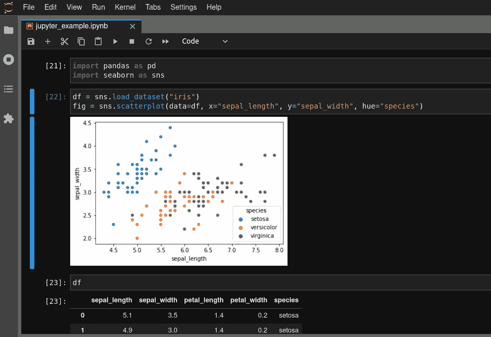

# 用于研究的 7 个基本 Python 技能

> 原文：<https://towardsdatascience.com/7-essential-python-skills-for-research-496e1888e7c2?source=collection_archive---------7----------------------->

## [提示和技巧](https://towardsdatascience.com/tagged/tips-and-tricks)

## 来自博士生的提示和技巧


由[凯特琳·贝克](https://unsplash.com/@kaitlynbaker?utm_source=medium&utm_medium=referral)在 [Unsplash](https://unsplash.com?utm_source=medium&utm_medium=referral) 上拍摄的照片

你做涉及编码的研究吗？许多科学领域的研究，从神经科学到机器学习到经济学，现在至少需要一些编写代码和分析数据的能力。在编码时，如果不小心，研究人员可能会遇到代码可读性、可再现性和生产率的问题。我是麻省理工学院的一名博士生，之前在科技行业和教育领域有工作经验。为了我的研究，我每天都用 Python 编写代码，通过大量的试验和错误，我已经学会了一些重要的“要做”和“不要做”。这个列表上的每一件事都是我希望能够回去告诉年轻的自己更快掌握的东西，我保证学习这些技能是值得花时间和精力的。其中一些技巧也是语言不可知的，所以即使 Python 不是你的首选，也要继续阅读。这绝对**不是一个完整的列表**，欢迎在评论中添加自己的推荐！

## 1.了解基础数据科学库

了解正确的库可能是绝望地盯着电子表格和从数据集中快速获得洞察力和可视化的区别。许多人没有意识到有一些经过时间考验的库，它们允许您加载数据集，分析它们的描述性统计数据，应用过滤器，并且只需几行代码就可以生成有意义的可视化效果。以下内容特别有用:

*   [熊猫](https://pandas.pydata.org/)(数据集加载和操作)
*   [NumPy](https://numpy.org/) 和 [SciPy](https://scipy.org/) (向量运算、数学/科学函数)
*   [Scikit-Learn](https://scikit-learn.org/stable/) (统计和经典 ML 算法)
*   [Matplotlib](https://matplotlib.org/)/[Seaborn](https://seaborn.pydata.org/)/[plottly](https://plotly.com/)(可视化/绘图)

[本帖](/a-complete-52-week-curriculum-to-become-a-data-scientist-in-2021-2b5fc77bd160)包含了一个很棒的资源列表，可以学习更多关于各种数据科学基础的知识。我还有一篇关于使用 Pandas 和 Plotly 进行数据可视化的文章:

[](/new-to-data-visualization-start-with-new-york-city-107785f836ab) [## 数据可视化新手？从纽约市开始

### 我是如何使用纽约的大量公开数据以及 Plotly 和 Pandas 来开发我的数据可视化的…

towardsdatascience.com](/new-to-data-visualization-start-with-new-york-city-107785f836ab) 

这些数据科学库的伟大之处在于，它们拥有优秀的示例文档，以及大量免费的在线教程。以下是以视频形式对 NumPy 的精彩介绍:[https://www.youtube.com/watch?v=lXZk0g60qRg](https://www.youtube.com/watch?v=lXZk0g60qRg)。以下是一个很棒的关于熊猫的视频系列:[https://www.youtube.com/watch?v=ZyhVh-qRZPA&list = PL-osie 80 tetswmv 9 I 9 c 58 MDD csskifdds](https://www.youtube.com/watch?v=ZyhVh-qRZPA&list=PL-osiE80TeTsWmV9i9c58mdDCSskIFdDS)。

## 2.掌握命令行

无论您是连接远程集群、导航您自己的文件系统，还是运行脚本，在某些时候您可能必须与命令行交互。您应该知道基本的 Linux shell 命令，如`ls`(列出目录中的文件)、`cd`(更改目录)、`mkdir`(创建目录)、`rm`(删除文件)、`wc`(计算行数、字数和字节数)、`mv`(移动文件)、`cp`(复制文件)、`grep`(快速搜索文件中的模式)、`head`(查看文件的第一个块)和`ssh`(安全连接到远程设备)。了解一些更特殊的命令也很有帮助，比如`ln`创建符号链接，而`scp`向/从远程服务器传输文件。请注意，这些命令在 Mac OS 和 Linux 上是相同的。没有必要记住每一个命令(虽然如果你忘记了一个命令是做什么的话，`man`命令是非常有用的)，但是上面提到的那些确实可以走很长的路。了解如何创建一个简单的 shell 脚本来一次运行一堆任务，以及如何使用`cron`来调度作业也很有帮助。以下教程是一个很好的起点:

[](https://ubuntu.com/tutorials/command-line-for-beginners#3-opening-a-terminal) [## 面向初学者的 Linux 命令行| Ubuntu

### Ubuntu 是一个开源软件操作系统，可以运行在桌面、云、互联网上

ubuntu.com](https://ubuntu.com/tutorials/command-line-for-beginners#3-opening-a-terminal) 

## 3.学习`git`和 GitHub

最长的一段时间，我对`git`有过表层的了解，但从未真正深入挖掘。我用 GitHub 上传代码文件并与合作者分享，但我把它当成一个带有语法高亮的 Google Drive。在一次编码实习中，我真的更好地理解了`git`，这极大地改善了我的工作流程。

在我的研究中，我经常需要使用`ssh`在远程服务器上执行长时间运行或计算密集型的任务。然而，我也喜欢在我的个人机器上直接编码的体验。使用`git`和 GitHub，我只需敲几下键盘就能让我的个人电脑与我的远程服务器保持同步。我总是可以回溯到以前提交的代码版本，所以我不必担心意外删除或弄乱我的代码。另一个有用的工作流是创建一个特性分支来试验一个想法，并且只有当这个想法成功时才将其合并回主分支。

下面的 YouTube 教程是学习掌握 git 的一个很好的起点:

请记住，git 中有很多功能，您可能需要一段时间才能掌握它。对自己要有耐心，记住最好的学习方法是通过做，而不仅仅是被动地看。重点学习以下 git 命令的含义和用法:`git init`、`git clone`、`git add`、`git commit`、`git push`、`git pull`、`git branch`、`git checkout`、`git merge`。

除了提高你自己的生产力，`git`也使协作变得更加容易。协作者可以克隆您的存储库，进行更改，将它们推送到一个新的分支，并打开一个 pull 请求供您审阅这些更改。本着开放科学和可复制性的精神，如今许多发表的论文都会包含一个带有研究人员代码的 GitHub repo 的链接，如果你使用 GitHub 来跟踪你自己的工作，那么当需要与更广泛的科学界分享你的工作时，这一步的大部分已经为你完成了。

## 3.使用代码格式化程序

什么是代码格式化程序？这是一个自动格式化代码的程序，它会处理好从逗号后的空格、换行符到 Python 字典和 JSON 等数据结构的易读显示等一切。你可以花更少的精力去担心一行中应该包含多少列表项，而把更多的精力放在实际解决问题和思考代码上。

我推荐`[black](https://black.readthedocs.io/en/stable/)`。我在 IDE (Visual Studio 代码)中设置了`black`,以便在每次保存时自动格式化我的代码。下面的例子展示了一些 Python 代码在应用自动格式化前后的样子。请注意，代码格式化程序会将长行分解成可读性更好的块。有些人可能不喜欢这样，尤其是如果他们真的喜欢将大量代码压缩到一行中。但是自动格式化程序使代码对其他人和您未来的自己来说更具可读性。自动格式化程序消除了编码体验中不必要的自由度，允许采用不同方法的编码人员共享更加一致的风格。《T2》的变化更可能反映实际内容，而不是风格。

## 4.组织和标准化您的文件系统

这似乎是一个相当琐碎的建议，但是在一个长项目中，跟踪不同的数据集、输出文件、可视化、脚本、Jupyter 笔记本等确实变得很困难。等。

对目录和文件夹使用标准化的命名约定。可以使用 Python 的`datetime`库来获取当前日期，以自动给程序输出文件(如日志或图像)添加时间戳。这可以避免您的程序用相同的名称覆盖以前的输出。试着把你的数据放在一个文件夹里，你的源文件放在另一个文件夹里，你的工件(比如可视化和绘图)放在另一个文件夹里。

```
from datetime import datetimetimestamp = datetime.now().strftime("%Y-%m-%d")filename = f"outputfile-{timestamp}.txt"
```

当将数据文件加载到您的程序中时，您可以使用`glob`库轻松地检索匹配某个字符串模式的文件，并且您可以使用`os.path.exists()`来检查文件是否存在。

```
import glob# returns a list of all files matching the pattern
list_of_files = glob.glob("outputfile-2021-10-*.txt")
```

## 5.使用笔记本探索和完整的实验程序

首先，我喜欢 Jupyter 实验室和 Jupyter 笔记本电脑。它们是加载数据集、执行清理和探索性数据分析(EDA)以及测试代码片段和功能的便捷方式。也就是说，做任何事情都有时间和地点，我对使用 Jupyter 做任何事情有一些问题。

首先，Jupyter 笔记本的输出将取决于你运行单元格的顺序。这可能会导致变量没有您期望的值的问题。Jupyter 笔记本也可能有点难以共享，如果您试图在输出单元格的海洋中找到某一位代码，那么真正长的笔记本可能会导致可读性噩梦。



一旦你在笔记本上完成了探索，我建议你将笔记本上的代码重构为一个完整的程序。使用`if __name__ == "__main__":`语法运行你的代码，并将大部分代码分解成内聚的函数。考虑留出一段时间，也许一周一次，当你查看你所有的笔记本和各种各样的脚本，并把它们重构为一个写得很好、评论很好、有凝聚力的程序。

## 6.使用命令行参数增强再现性

做研究经常涉及到处调整模型，直到你得到有趣的结果。我以前的做法是编辑代码文件，直接在代码中更改参数，然后再次运行。不幸的是，经常发生的情况是，你用一堆不同的设置运行代码，其中一个输出是有趣的，但是你不记得你调整了什么来得到那个输出。

相反，通常更好的做法是将任何运行时参数作为命令行参数提取出来，然后创建 shell 脚本，用不同的参数运行相同的代码。我使用`[argparse](https://docs.python.org/3/library/argparse.html)` Python 库来做这件事。这个库使得设置命令行参数变得容易，包括指定默认值、数据类型和标志参数。下面的代码片段显示了一个简单的程序示例，它读入 3 个命令行参数，并使用它们来读取一个文件，并有选择地打印一些行。

对于上面的程序，您可以创建一个如下所示的 shell 脚本，并使用某些参数来运行它:

```
#!/bin/bashpython argparse_example.py --inputfile datafile.csv --num_rows 100 --print_output
```

这使得记录你的工作变得更容易，让你确切地知道你为了得到不同的结果做了什么。实际的代码可以保持不变，并且您可以轻松地在 shell 脚本中为您想要尝试的每组参数添加新的一行。

## 7.创建一个实用程序类，为整个项目提供有用的功能

您的项目最终可能会有许多不同的程序，包括实验脚本、数据清理脚本、可视化脚本等等。许多这样的程序可能会重复使用相同的代码。我喜欢创建一个我的整个项目都可以访问的`utils.py`类，并将共享函数放在里面。例如，如果在我的整个项目中使用了名为`load_dataset()`和`clean_dataset()`的函数，我可以将它们放在`utils.py`中，其他程序可以用以下方式调用它们:

```
import utilsdata = utils.load_dataset("data.csv")
data = utils.clean_dataset(data)
```

很明显，这不是分离共享代码的唯一方法，也不是最适合您的用例的方法。但是在许多中小型研究项目中，这可能足以让您省去许多头痛的事情。数据集处理、预处理或绘图等重复任务可以抽象到一个文件中，很容易进行更改。您肯定不希望在多个文件中复制相同的代码，然后在更新一个版本但忘记更新另一个版本时遇到神秘的不一致。

## 结论

我希望你喜欢这些建议！完成研究的很大一部分是优化你的工作流程，消除生产力障碍。学习这些技能需要时间，但从长远来看，可以为你节省更多的时间和精力，并且肯定会在你的学术旅程中帮助你。如果您有其他建议，请在下面留下评论！