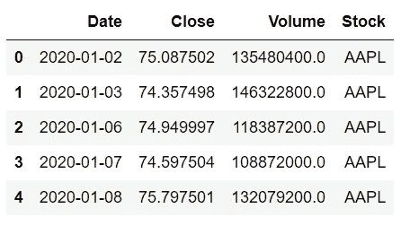
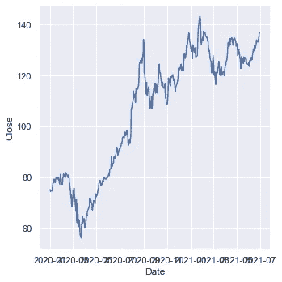
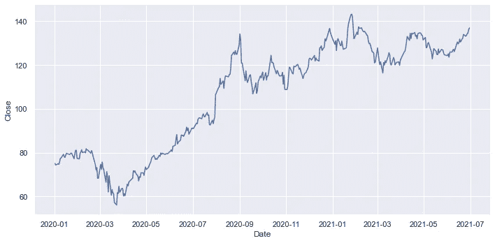
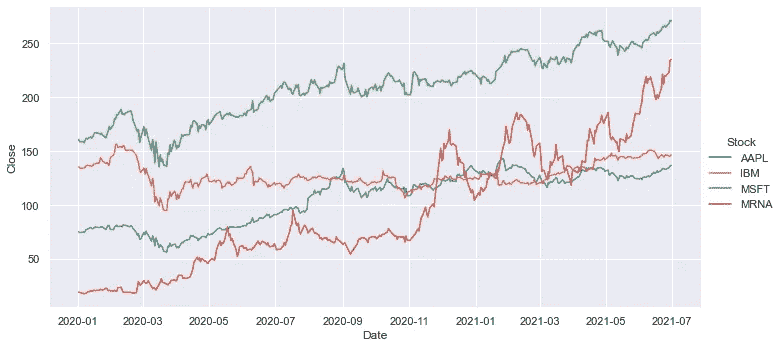
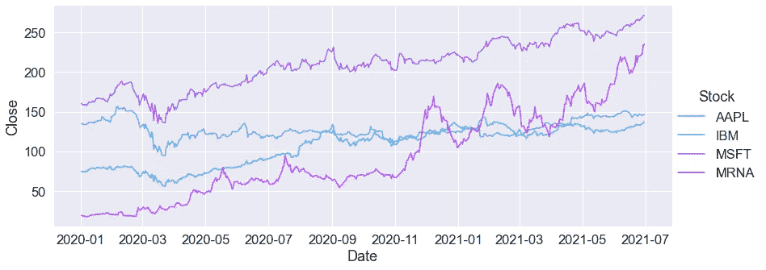
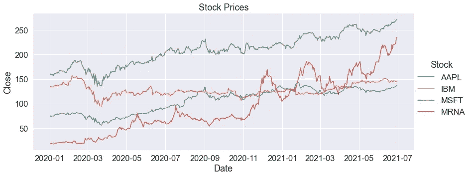
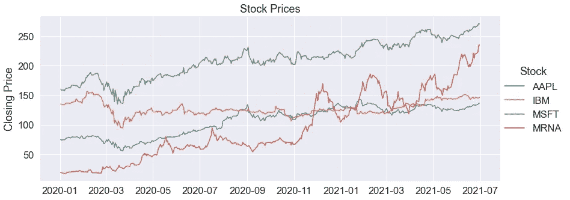
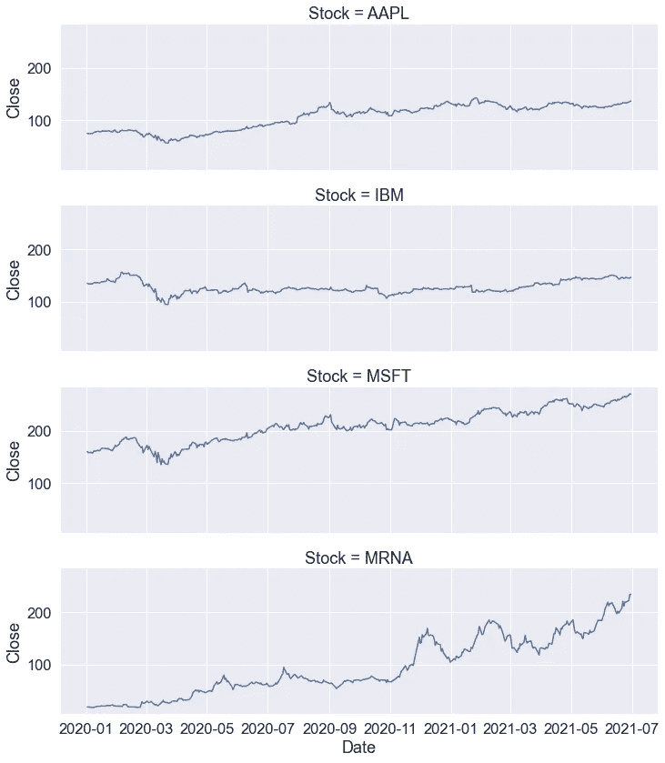

# 使用 Python Seaborn 掌握线图的 7 个示例

> 原文：<https://towardsdatascience.com/7-examples-to-master-line-plots-with-python-seaborn-42d8aaa383a9?source=collection_archive---------3----------------------->

## 实用数据可视化指南。


马库斯·温克勒在 [Unsplash](https://unsplash.com/s/photos/stock-price?utm_source=unsplash&utm_medium=referral&utm_content=creditCopyText) 上的照片

数据可视化是数据科学不可或缺的一部分。它帮助我们探索数据集和变量之间的关系，以创建适当的数据可视化。它们也是交付结果和发现的高效工具。

有几种不同类型的数据可视化。其中最常用的是线图，用于分析两个连续变量之间的关系。

在本文中，我们将通过 7 个例子来详细解释如何使用 Python 的 Seaborn 库创建线图。

线形图的主要用例是时间序列分析。它显示了变量的值是如何随时间变化的。例如，我们可以使用线图来显示一段时间内的股票价格。

让我们从获取一些股票价格数据开始。我们将使用[熊猫 datareader](https://pandas-datareader.readthedocs.io/en/latest/) 库来获取数据。第一步是导入库。

```
import pandas as pd
from pandas_datareader import dataimport seaborn as sns
sns.set(style="darkgrid")
```

下面的代码片段收集了苹果、微软、谷歌和 Moderna 在给定的开始和结束日期之间的股票价格。日期、收盘价、成交量和股票名称保存在股票数据框中。

```
start = '2020-1-1'
end = '2021-6-30'
source = 'yahoo'
stocks = pd.DataFrame(columns=["Date","Close","Volume","Stock"])stock_list = ["AAPL","IBM","MSFT","MRNA"]for stock in stock_list:
    df = data.DataReader(stock, start=start ,end=end, 
                         data_source=source).reset_index()
    df["Stock"] = stock
    df = df[["Date","Close","Volume","Stock"]]
    stocks = pd.concat([stocks, df], ignore_index=True)stocks.head()
```



股票数据框(图片由作者提供)

## 示例 1

在第一个例子中，我们创建了一条显示苹果公司每日股票价格的线。我们可以使用 Seaborn 的 relplot 或 lineplot 函数。

relplot 函数是一个图形级界面，用于绘制关系图，包括线图和散点图。线图功能也可用于绘制线图。

```
sns.relplot(
    data=stocks[stocks.Stock == "AAPL"], 
    x="Date", y="Close", 
    kind="line"
)
```

数据框的名称被传递给数据参数。因为我们只想查看苹果股票价格，所以我们应该使用股票名称来过滤数据点。x 和 y 参数用于选择要在 x 和 y 轴上绘制的内容。最后，使用 kind 参数确定绘图的类型。以下是这段代码返回的图形:



(图片由作者提供)

如果我们把它弄得宽一点，它肯定会看起来更好，因为日期看不清。

## 示例 2

在本例中，我们将了解如何调整绘图的大小。relplot 函数有两个参数可用于更新默认绘图大小。

高度参数改变绘图的高度。纵横比参数调整宽度与高度的比率。

```
sns.relplot(
    data=stocks[stocks.Stock == "AAPL"], 
    x="Date", y="Close",
    kind="line",
    height=5, aspect=2 
)
```



(图片由作者提供)

现在看起来好多了。

## 示例 3

在这个例子中，我们将探索色调参数。原始数据框包含同一时间段内 4 家不同公司的股票价格。我们可能需要在相同的可视化中绘制它们，以便进行比较。我们可以通过将包含股票名称的列名传递给 hue 参数来实现这一点。

```
sns.relplot(
    data=stocks, 
    x="Date", y="Close", hue="Stock", 
    height=5, aspect=2, 
    kind="line"
)
```



(图片由作者提供)

我们观察到，由于新冠肺炎疫苗接种，现代股票价格大幅上涨。

## 实例 4

在这个例子中，我们将对外观进行一些修改。例如，我们可以增加轴标题和图例的字体大小。另一个修改可以是在线的调色板上。

```
sns.set(font_scale=1.5)sns.relplot(
    data=stocks, 
    x="Date", y="Close", hue="Stock", 
    height=5, aspect=2.4, 
    kind="line",
    palette="cool"
)
```



(图片由作者提供)

调色板参数有许多选项。如果您不确定调色板的名称或尝试不同的名称，请键入错误的名称。在错误消息中，您将看到所有选项:)

## 实例 5

让我们也为我们的情节添加一个标题，使它看起来更好。

```
sns.relplot(
    data=stocks, 
    x="Date", y="Close", hue="Stock",
    height=5, aspect=2.4, 
    kind="line"
).set(title="Stock Prices")
```



(图片由作者提供)

## 实例 6

我们也可以像修改标题一样修改坐标轴标签。例如，将 y 轴更改为“收盘价”可能会提供更多信息。很明显，x 轴代表日期，所以我们实际上不需要它的标签。

```
sns.relplot(
    data=stocks, 
    x="Date", y="Close", hue="Stock",
    height=5, aspect=2.4, 
    kind="line"
).set(
    title="Stock Prices", 
    ylabel="Closing Price",
    xlabel=None
)
```



(图片由作者提供)

## 例 7

relplot 函数还允许在单个可视化中创建子图。例如，我们可以为每只股票创建一个线图。row 和 col 参数可以用来完成这项任务。

```
sns.relplot(
    data=stocks, x="Date", y="Close", 
    row="Stock",
    height=3, aspect=3.5,
    kind="line"
)
```



(图片由作者提供)

col 参数非常类似。它为每个图创建一个新列。因为宽度比高度大，所以行更适合我们的情况。

## 结论

relplot 函数为创建关系图提供了一种简单而直观的方法。修改绘图的某些特性也很容易，比如字体大小、标题、轴标签等等。

我们在本文中介绍的内容应该足以满足您的大部分需求。但是，如果需要做更具体的操作，可以随时访问官方文档。

感谢您的阅读。如果您有任何反馈，请告诉我。