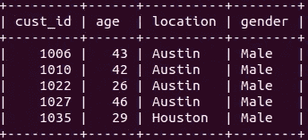
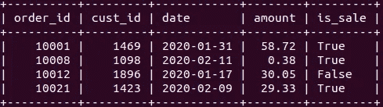

# 掌握 SQL 连接的 7 个示例

> 原文：<https://towardsdatascience.com/7-examples-to-master-sql-joins-9d16636a3bb7?source=collection_archive---------9----------------------->

## 综合实践指南


在 [Unsplash](https://unsplash.com/s/photos/share?utm_source=unsplash&utm_medium=referral&utm_content=creditCopyText) 上拍摄的 [Mineragua 苏打水](https://unsplash.com/@mineragua?utm_source=unsplash&utm_medium=referral&utm_content=creditCopyText)

SQL 是大多数关系数据库管理系统(RDBMS)用来管理以表格形式存储的数据的编程语言。关系数据库由多个相互关联的表组成。表之间的关系由共享列构成。

当我们从关系数据库中检索数据时，所需的数据通常分布在多个表中。在这种情况下，我们使用 SQL 连接来处理包括从两个或更多相关表中选择行的任务。

为了在从不同的表中选择行时保持一致，SQL 连接使用共享列。在本文中，我们将通过 7 个例子来演示如何使用 SQL 连接从多个表中检索数据。

我准备了两张表格，上面有编造的数据。第一个是 customer 表，它包含零售企业的客户信息。



客户表(图片由作者提供)

第二个是 orders 表，包含这些客户所下订单的信息。



订单表(作者图片)

这两个表通过 cust_id 列相互关联。

**注**:关系数据库管理系统有很多，比如 MySQL、SQL Server、SQLite 等等。尽管它们共享几乎相同的 SQL 语法，但可能会有一些小的差异。我在这篇文章中使用 MySQL。

## 示例 1

我们希望看到在 2020 年 1 月 17 日购买商品的顾客的平均年龄。

```
mysql> select avg(customer.age), orders.date
    -> from customer
    -> join orders
    -> on customer.cust_id = orders.cust_id
    -> where orders.date = '2020-01-17';+-------------------+------------+
| avg(customer.age) | date       |
+-------------------+------------+
|           32.7273 | 2020-01-17 |
+-------------------+------------+
```

在普通的 select 语句中，我们只写入要选择的列的名称。当我们连接表时，用表的名称指定列，以便 SQL 知道列来自哪里。

然后我们写下带有连接关键字的表的名称(例如，客户连接订单)。“on”关键字用于指示这些表是如何相关的。where 语句根据给定的条件筛选行。

## 示例 2

我们希望看到奥斯汀客户的平均订单量。

```
mysql> select avg(orders.amount)
    -> from customer
    -> join orders
    -> on customer.cust_id = orders.cust_id
    -> where customer.location = "Austin";+--------------------+
| avg(orders.amount) |
+--------------------+
|          50.572629 |
+--------------------+
```

逻辑是一样的。您可能已经注意到了第二个和第一个示例之间的一个小差异。在第二个示例中，我们没有选择位置，而是在 where 语句中将它用作过滤条件。两种选择都可以。我们不必选择用于过滤的所有列。

在选择列时应用聚合函数，就像在普通的 select 语句中一样。

## 示例 3

我们希望看到每个城市的平均订单量。

这与第二个例子相似，但有一点不同。我们还必须选择 location 列，因为它将用于对行进行分组。

```
mysql> select customer.location, avg(orders.amount)
    -> from customer
    -> join orders
    -> on customer.cust_id = orders.cust_id
    -> group by customer.location;+----------+--------------------+
| location | avg(orders.amount) |
+----------+--------------------+
| Austin   |          50.572629 |
| Dallas   |          47.624540 |
| Houston  |          50.109382 |
+----------+--------------------+
```

## 实例 4

我们希望看到最高订单金额和下订单的客户的年龄。

```
mysql> select customer.age, orders.amount
    -> from customer
    -> join orders
    -> on customer.cust_id = orders.cust_id
    -> order by orders.amount desc
    -> limit 1;+------+--------+
| age  | amount |
+------+--------+
|   41 |  99.95 |
+------+--------+
```

我们从客户表中选择年龄，从订单表中选择金额。筛选最高金额的一种方法是按降序对值进行排序，取第一个值。order by 语句根据给定列中的值对行进行排序。默认行为是按升序排序，但我们使用 desc 关键字来改变它。

## 实例 5

我们希望看到 id 为 1006 的客户的最高订单金额。

```
mysql> select max(orders.amount) 
    -> from customer 
    -> join orders 
    -> on customer.cust_id = orders.cust_id 
    -> where customer.cust_id = 1006;+--------------------+
| max(orders.amount) |
+--------------------+
|              93.18 |
+--------------------+
```

我们对 amount 列使用 max 函数，并过滤属于 id 为 1006 的客户的行。

## 实例 6

我们希望看到休斯顿的前 5 名客户在销售时的最高平均订单额。

我们将在 where 语句中使用两个条件，按 cust_id 列对值进行分组，根据平均金额按降序对行进行排序，并选择前 5 行。

```
mysql> select c.cust_id, avg(o.amount) as average 
    -> from customer c 
    -> join orders o 
    -> on c.cust_id = o.cust_id 
    -> where c.location = "Houston" and o.is_sale = "True" 
    -> group by c.cust_id 
    -> order by average desc limit 5;+---------+-----------+
| cust_id | average   |
+---------+-----------+
|    1821 | 70.150000 |
|    1299 | 67.405000 |
|    1829 | 65.225000 |
|    1802 | 64.295000 |
|    1773 | 64.012500 |
+---------+-----------+
```

在本例中，我们为每个表名和聚合列使用了一个别名。这使得编写查询更加容易，因为我们要多次编写表名。

## 例 7

我们想找出 2020 年 2 月 9 日订单量最低的客户的位置。

在本例中，我们将实现一个嵌套的 select 语句，作为 where 语句中的一个条件。

```
mysql> select c.cust_id, c.location
    -> from customer c
    -> join orders o
    -> on c.cust_id = o.cust_id
    -> where o.date = "2020-02-09" and o.amount = (
    -> select min(amount) from orders where date = "2020-02-09"
    -> );+---------+----------+
| cust_id | location |
+---------+----------+
|    1559 | Dallas   |
+---------+----------+
```

我们有两个条件。第一个是我们可以直接写在 where 语句中的具体日期。第二个包括一个集合。我们需要找到给定日期的最小订单量。

我们可以在单独的查询中找到这个值，或者编写一个嵌套的 select 语句作为订单金额的条件。在本例中，我们已经完成了后者。

## 结论

我们已经做了 7 个例子来介绍 SQL 连接。关系数据库通常由许多基于共享列的相关表组成。我们需要从关系数据库中检索的数据通常分布在多个表中。因此，全面理解 SQL 连接非常重要。

感谢您的阅读。如果您有任何反馈，请告诉我。