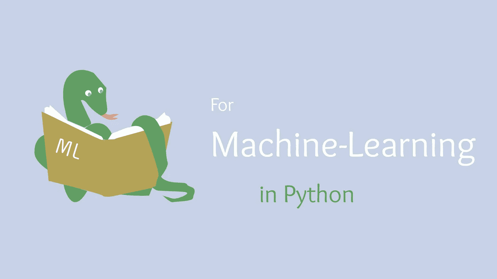

# 7 本开创性的 Python 机器学习书籍

> 原文：<https://towardsdatascience.com/7-ground-breaking-machine-learning-books-for-python-ea6db967e36c?source=collection_archive---------4----------------------->

## 我用 10 多本我最喜欢的书来主导 Python 中数据科学的机器学习部分。

(图片由作者提供)

# 介绍

让我们面对事实:

> 数据科学很难

首先，学习数据科学是极其费力的，而且肯定会非常困难。对于那些很少或没有经验或知识的人来说尤其如此。数据科学尤其困难，因为它需要在许多专业领域都能找到的特定技能子集。虽然这些技能通常是分开的，可能只被一个学科或另一个学科使用，但数据科学家必须将所有这些技能结合成一个。

数据科学家不仅要精通编程，还要精通统计和业务。光是统计和商业就足以让你毛骨悚然，更不用说整个编程了。除了进行基本编程的能力之外，还有编写算法的能力。虽然数据科学家利用一般应用科学的规则并试图证明假设，但数据科学家还需要以自动化的方式应用这些统计数据，以提供实时结果来解决问题。这是一个大多数数据科学家都熟悉的话题，它被称为机器学习。

机器学习是数据科学家与普通科学家的区别。也就是说，这个领域的扩展使得数据科学对于许多程序员或有抱负的数据科学家来说更加难以接近。机器学习非常像数据科学，非常困难。幸运的是，随着 Python 编程语言现在主导了行业，编写起来并不那么困难，同时还拥有不可估量的资源，机器学习比以往任何时候都更容易掌握。尝试机器学习的一个很好的资源当然是信息书籍。考虑到这一点，我想我应该展示一些我最喜欢的书籍，这些书籍帮助我更好地理解 Python 中的机器学习，它们当然值得一读！

# №1:使用 Scikit-Learn、Keras 和 TensorFlow 进行机器学习:构建智能系统的概念、工具和技术

> 作者:奥雷连·盖伦

> 难度:中等

尽管这本书的名字可能很拗口，但之所以名字这么长，可能是因为书中实际上有多少内容。这本书最伟大的地方在于，它将带你从简单的 Python 程序员到专业的机器学习工程师，这一切都在一个 850 页的包中。

这本书以介绍机器学习开始。它讲述了重要的概念和技术，如回归和分析，这些概念和技术将延续到整个机器学习世界，无论您使用什么语言、方法或模型。我认为这本书里的一些基础知识也很棒。关于我正在使用的一些工具，有很多事情我希望我能够知道，这些工具在本书中得到了很好的介绍。

真正让这本书成为你脑海中图书馆的宝贵资产的是行业标准的工具，甚至每个版本都会更新。对于数据科学来说，保持市场领先非常重要，了解 Tensorflow、Sklearn 和 Keras 等工具将使找工作变得更加容易。

> 总体评分:8/10
> 
> "这本书提供了一些至今仍在使用的 Pythonic 生态系统的很好的教程."

# №2:Python 机器学习简介:数据科学家指南

> 由[安德里亚斯·c·穆勒](https://www.google.com/search?hl=en&sxsrf=ALeKk02mxMjk-mmcO-sBOs01h7Wz7dP1IA:1611097024872&q=inauthor:%22Andreas+C.+M%C3%BCller%22&tbm=bks)、[萨拉·圭多](https://www.google.com/search?hl=en&sxsrf=ALeKk02mxMjk-mmcO-sBOs01h7Wz7dP1IA:1611097024872&q=inauthor:%22Sarah+Guido%22&tbm=bks)

> 难度:初学者友好型

奥赖利的另一本书，*用 Python 介绍机器学习*在教授机器学习的方法上做了很多正确的事情。虽然这本书可能不像这个列表中的其他一些书那样深入，并且主要涉及简单的黑盒模型，但从教育的角度来看，安德烈亚斯对建模的解释真正使这本书变得有趣和有价值。

虽然这可能不是回顾或扩展机器学习知识的最佳书籍，但它肯定符合以非常用户友好的方式教授基础知识的要求。此外，我认为本书中给出的关于建模和处理数据科学的细节非常有价值，对于任何有抱负的数据科学家来说，肯定是一个很好的起点。

如果我不得不推荐阅读这本书的任何部分，我想突出第 1-3 章。这些是我认为本书最有价值的概念和方法论的地方。第一章描述了大多数机器学习场景中使用的基本概念。这将继续深入到第二章和第三章，在这两章中，这些思想被应用，模型被使用。这些章节的另一个伟大之处是它解释了使用某些建模策略的好处，我认为这对于初学者来说很重要。当你明白什么样的输入对于特定的模型是最优的时，理解你的模型的准确性就容易多了。

> 总体评分:8/10
> 
> "这本书为新手提供了很好的基础知识！"

# №3:用 Python 进行深度学习

> 由[迈克·克雷布斯](https://www.google.com/search?hl=en&sxsrf=ALeKk03uF0-xglklx4GzncnbQb32dBCGZg:1611098005329&q=inauthor:%22Mike+Krebbs%22&tbm=bks)

> 难度:高级

在本书中，Mike Krebbs，一位出色的作者和数据科学家，带我们踏上了一段充满灵感的旅程，通过 Python 进入深度学习的世界。这些信息不仅非常有价值，而且关于 Krebbs 写作风格的一些东西使它更有趣。

关于书籍、阅读和学习的一些东西可能会变得单调，但 Krebbs 在本书中的写作风格的伟大之处在于，他似乎真的很兴奋地展示代码的可能性，而不仅仅是演示它并解释它为什么工作。对我来说，这意味着很多，我经常发现像这样的信息书籍很难完全阅读，通常最终会将它们作为“现场手册”

这本书不仅读起来很有趣，而且它确实使用一种非常动觉的策略教授了许多机器学习的基本概念和高级概念。当谈到编程时，边做边学当然是我选择的方法，所以对我来说，这当然是 Krebbs 的伟大选择。这本书唯一显著的缺点是它的价格和零售可用性。这本书很难找到，而且通常售价远高于你通常在类似书籍中找到的价格。花费大约 50 美元，这当然是一项投资，可能值得，也可能不值得，这取决于你的经验和你个人的需求。

> 总体评分:7/10
> 
> “尽管这本书对于深度学习来说肯定很棒，但它的价格确实让它从我的推荐名单中消失了，因为有太多更便宜或免费的资源了。话虽如此，这本书的价格并非完全没有根据，但确实降低了评级——特别是考虑到这本书缺乏对概念的全面概述。”

# №4:100 页的机器学习书籍

> 安德烈·布尔科夫

> 难度:中等

我记得不久前在亚马逊上看到了这本书，我觉得作者的名字有些不对劲，听起来很熟悉。然后我意识到我之前在网上看到过安德烈的名字，他做的很多研究工作和我做的相似——我很高兴看到这一点。此外，我觉得我们有过一次谈话，我不记得了，但很可能是愉快的。话虽如此，我还是非常兴奋地推广我同事的书。此外，它是自行出版的，这可能意味着所有的收入都将归他所有，他可能很难做广告，所以我将继续感谢任何因这篇文章而查阅他的书的人。

我认为这本书不可思议的是，安德烈能够在这么小的一本书里浓缩这么多东西。明确一点，这不是一本关于 Python 的书；但是机器学习。回想这本书里的所有信息，真的很难理解所有这些有价值的信息是如何被浓缩到这么少的几页里的。

这本书将深入研究机器学习模型及其工作原理。这很好，因为无论你何时从事数据科学，它都能让你对你所从事的工作有一个坚实的理解。更酷的是，安德烈并没有回避数学，但也没有用方程式淹没你。这本书总的来说很容易阅读，写作风格非常直接。这本书只有 100 页，一个很大的好处是它可以作为一个非常快速有效的查找手册，几乎可以查找任何关于机器学习的信息。

> 总体评分:9/10
> 
> “虽然这本书很短，只有 100 页，但它是一部精彩的读物。不知何故，作者把可能需要几年时间和实践一起发展的研究和信息浓缩成一本可以读、重读、再重读的书。相比很多类似的书，我觉得这里最关键的区别在于，这是一本读者的书。大多数书籍都非常庞大，应该慢慢阅读，或者在编程时用作参考，但这本书将带领读者经历一次他们可以在一次阅读中享受的旅程。”

# №5:机器学习工程

> 由[安德烈·布尔科夫](https://www.google.com/search?hl=en&sxsrf=ALeKk03zmIXrA8N-wHULEBDR2ADh1SmZ6g:1611098752619&q=Andriy+Burkov&stick=H4sIAAAAAAAAAONgVuLVT9c3NEyzNMoyKigoXsTK65iXUpRZqeBUWpSdXwYAugbF9yEAAAA&sa=X&ved=2ahUKEwjehtHGkqnuAhXiYN8KHbI1DJMQmxMoADANegQIFBAC)

> 难度:高级

安德烈·布尔科夫的另一本巨著是《机器学习工程》。尽管书名很简单，但对我来说，这本书甚至比同一作者之前的作品更有价值。这本书的伟大之处在于，它比它的前身更全面，并且从商业角度更深入地研究了机器学习。

最棒的是，从商业角度来看，机器学习正是公司在寻找机器学习工程师。这本书不仅会让你熟悉机器学习，还会让你在现实世界中尽可能有效地利用这些模型。

> “如果你打算利用机器学习来解决大规模的商业问题，我很高兴你能拿到这本书。”
> 
> ——凯西·科济尔科夫，谷歌首席决策科学家

对我来说，作为一名数据科学家，最重要的事情是对人工智能在现实世界中的构成有一个坚实的理解。理解模型实际上是如何使用和部署的，以及如何围绕机器学习对系统进行编程，对于数据科学家来说是一项非常有价值的资产，最近的版本(2020 年)无疑是让你接触这些概念的一个很好的方式。

> 总体评分:8/10
> 
> “尽管我很喜欢这本书，但它肯定不是这类书的完美范例。然而，当谈到在现实世界中看到和使用机器学习和人工智能的实现，以及理解如何大规模地构建东西时，这个领域没有太多竞争，这本书是一个很好的选择！”

# №6:绝对初学者的机器学习:简明英语介绍

> 奥利弗·西奥博尔德

> 难度:初学者

机器学习是那些一旦跨过某个门槛就可能变得更容易的话题之一。也就是说，入门可能会非常困难。幸运的是，奥利弗·西奥博尔德的这本书将带一个绝对的 Pythonic 新手，让他们熟悉数据科学家日常使用的许多机器学习概念。

话虽如此，我对这本书的一个抱怨是，它的内容确实有点过于面向机器学习。将“绝对初学者”和“机器学习”这两个术语结合起来的问题是，机器学习需要学习很多东西。如果不知道如何操作数据、处理统计数据和特征，以及为机器学习模型做典型的预处理，那么知道如何使用模型就没有什么意义。

也就是说，虽然这本书可能错过了一些基本概念，让一些人感到有点困惑，但它确实对 Python 中的机器学习进行了非常初学者友好的审视，我认为大多数开发人员都会喜欢。

> 总体评分:6/10
> 
> “尽管我很喜欢这本书，但我不能说它没有问题。这本书的重点本身没有太多意义，因为一个绝对的初学者可能不应该直接进入像机器学习这样的高级概念。问题是，这本书在建立地基之前先建了建筑的第三层。也就是说，随着经验的增加，我当然认为这是可以挽回的，总的来说，这本书肯定不可怕，而且仍然在我的名单上，因为它对那个应用程序非常有用。”

# №7:面向傻瓜的机器学习

> 由约翰·保罗·穆勒，[卢卡·马萨隆](https://www.google.com/search?hl=en&sxsrf=ALeKk039EnjsiY7NLOY-Hb4egtuJmkRMTQ:1611100763441&q=inauthor:%22Luca+Massaron%22&tbm=bks)

> 难度:初学者

我相信我们以前都读过一本“给傻瓜看的”书。例如，当我的热水器坏了，我去拿起一本“傻瓜水管工”的书。虽然我不一定宽恕对待科学计算就像你对待热水器一样，但我认为这本书绝对精彩。

这本书首先概述了当今空间中的机器学习。我认为这很重要，因为如果读者还没有完全投入进去，它真的可以告诉读者更多关于他们将要进入的内容。围绕这本书所教授的内容提供更多关于世界的信息当然是一件非常酷的事情，我认为这本书做得很好。

然后，这本书采取了一步一步的方法，这是我喜欢的——事情的节奏非常慢，有足够的时间来接受和理解一切。此外，本书中的一些解释真的让人感觉作者知道他们在做什么，这意味着概念得到了很好的解释，从未被掩盖。

总的来说，我会说这绝对是初学者今天学习数据科学的最佳书籍，如果他们完全是新的，并希望参与其中。

> 总体评分:9/10
> 
> “这本书是迷人的，因为它是全面的，老实说，没有什么需要的。如果你是一名初学者，我认为没有比这更好的介绍 Pythonic 机器学习的方式了。”

# 结论

所有这些书都很棒，我认为可以从每本书中提取许多有价值的信息。这个书单的好处在于，某些书可能比其他书更有价值。对于绝对的初学者来说，我会说“傻瓜”书绝对是学习 Python 机器学习的最佳选择。另一方面，*机器学习工程*对于那些有机器学习经验的人来说可能是最有价值的书，但可能想更深入地了解高级建模概念。如果你想看看我去年列出的一些我最喜欢的 DS 书籍，你可以看看我当时写的文章:

 [## 面向终身学习者的 5 本伟大的数据科学书籍

### 在这次疫情期间，我对那些对机器学习感兴趣的人的阅读建议。

towardsdatascience.com](/5-great-data-science-books-for-lifelong-learners-3a6405a7f890) 

不管怎样，这里有适合每个人的东西。我认为教育是让你的大脑在这个充满挑战的时代保持忙碌的一种奇妙的方式，也可以帮助你在这个世界上做出真正的改变。请原谅我情绪激动—

我做数据科学是因为我想有所作为。数据科学是一个很好的领域，因为你可以通过很多方式来帮助地球。以新冠肺炎为例——所有这些算法和可视化让我们能够追踪病毒，统计生物信息学研究加速了安全有效疫苗的开发。

我进入这个领域是为了有所作为，感谢大家给我这个平台让我有所作为。我的本意是教育，做的更多，我有梦想；不是为了我，而是为了这个世界。我很高兴你读了(也许喜欢)我的文章。这对我很重要，真的。不断学习，保持聪明，努力有所作为！